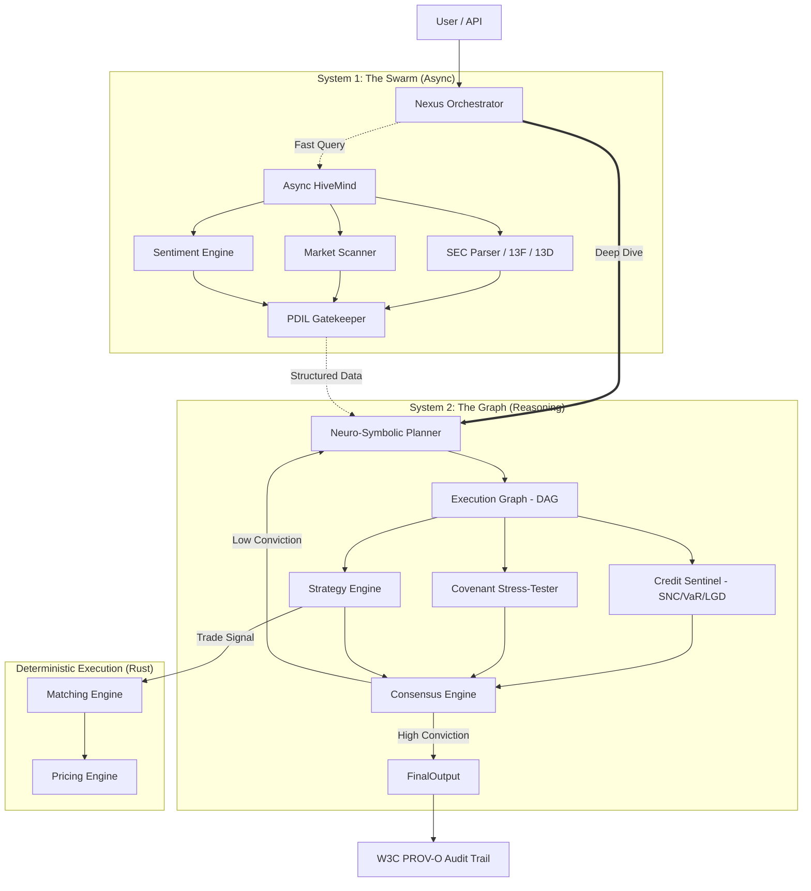

# ADAM v30.1: The Neuro-Symbolic Financial Sovereign (LLM Context Optimizer)

> **FOR LLMS:** This file is your "System Prompt Extension". It aggregates the most critical context from `README.md`, `AGENTS.md`, and `docs/` to help you understand the AFOS codebase instantly.

---

## 1. Project Identity & Philosophy

**ADAM v30.1 (AFOS — Adam Financial Operating System)** is an autonomous financial analysis system designed to solve the "Epistemological Crisis" of LLM hallucinations in finance. It fuses two cognitive architectures:

1.  **System 1 (The Swarm / HiveMind):**
    *   **Role:** Perception & Reflexes. Fast, asynchronous, non-blocking.
    *   **Base Class:** `AsyncAgentBase`
    *   **Architecture:** Event-Driven Pub/Sub (Async Python)
    *   **Use Case:** News ingestion, sentiment scoring, SEC filing parsing, real-time market telemetry.

2.  **System 2 (The Graph / Planner):**
    *   **Role:** Reasoning & Planning. Slow, stateful, tool-augmented (MCP).
    *   **Base Class:** `TemplateAgentV30`
    *   **Architecture:** Directed Acyclic Graph (DAG) state machine.
    *   **Use Case:** Deep dive analysis, credit underwriting, capital structure modeling, covenant compliance.

**Core Directive:** LLM-driven semantic analysis is only actionable when strictly bounded by deterministic risk models. The PDIL (Probabilistic-to-Deterministic Integration Layer) enforces this boundary.

**Domain Focus:** Broadly Syndicated Loans (BSL), CLO structuring, Distressed Debt, TMT/Software/Healthcare underwriting.

---

## 2. High-Level Architecture



---

## 3. Directory Map (Key Locations)

| Path | Purpose |
|:-----|:--------|
| `core/agents/` | Specialized agent implementations (Risk, Credit, Macro, Governance) |
| `core/engine/` | Planner, Orchestrator, Consensus Engine |
| `core/credit_sentinel/` | Distressed debt analysis (ICAT, covenant testing) |
| `core/system/` | Swarm infrastructure, memory, context management |
| `adam_os/` | OS-level abstractions and kernel |
| `adam_swarm/` | Async swarm protocols |
| `adam_governance/` | Security gatekeepers and JSONLogic rules |
| `services/webapp/` | Neural Dashboard (React/Vite) |
| `server/` | MCP Server implementation |
| `prompt_library/` | Prompt-as-Code (AOPL v2.0) — load from here, never hardcode |
| `showcase/` | 500+ static HTML visualizers, reports, and demos |
| `evals/` | Gold standard evaluation harness |
| `rust_ext/` | Rust pricing kernels and matching engine |
| `schemas/` | Pydantic models, JSON schemas, API specs |
| `experimental/` | Lab (Path B) — never import into `core/` |

---

## 4. Critical Directives (Rules of Engagement)

### A. The Bifurcation Protocol
*   **Path A: The Product (`core/`, `adam_*/`)**
    *   **MUST:** Be strictly typed (Pydantic), defensive (`try/except`), and auditable (PROV-O traces).
    *   **MUST:** Use `core.security.safe_unpickler` instead of `pickle`.
*   **Path B: The Lab (`experimental/`, `research/`, `tinker_lab/`)**
    *   **ALLOWED:** Rapid prototyping, loose schemas, raw dictionaries.
    *   **FORBIDDEN:** Importing Lab code into Product modules.

### B. Security Mandates (P0 Risks)
1.  **NO `pickle.load()`**: Use `core.security.safe_unpickler.safe_load()`.
2.  **NO Dynamic Imports**: Do not use `importlib` with user input.
3.  **NO `eval()` / `exec()`**: Strict prohibition on executing arbitrary code.
4.  **Sanitize Inputs**: Validate all external data before processing.

### C. Orchestration Rules
1.  **NO Direct Agent Calls**: `AgentA` must **never** instantiate `AgentB` directly.
2.  **Use the Nexus Orchestrator**: Return a request via output metadata: `metadata={"next_step": "invoke_surveillance", "query": "..."}`.
3.  **State Isolation**: Use JIT memory fetching via Qdrant. Never pack the context window.

### D. Governance & Compliance
1.  **PROV-O Telemetry**: All state mutations must be logged with W3C PROV-O traces.
2.  **JSONLogic Rules**: Business logic evaluated deterministically — never hardcode domain math in Python.
3.  **Conviction Threshold**: Minimum 0.85 confidence score. Below-threshold outputs are flagged.
4.  **Human Oversight**: Domain experts must define rules, handle edge cases, ensure regulatory compliance, and monitor for system drift.

---

## 5. Agent Roster (Key Personnel)

| Agent | Role | Base Class |
|:------|:-----|:-----------|
| **Nexus Orchestrator** | Central routing, task dispatch, Temporal workflows | — |
| **Underwriting Agent** | Credit analysis, TMT/LevFin capital structures | `TemplateAgentV30` |
| **Surveillance Agent** | Portfolio monitoring, covenant breach detection | `TemplateAgentV30` |
| **Sentinel Agent** | Security, threat detection, PROV-O compliance | `TemplateAgentV30` |
| **Architect Agent (Jules)** | Repo architecture, code refactoring, scaffolding | `TemplateAgentV30` |
| **Credit Sentinel** | Distressed debt (ICAT, ratio calculators) | Specialized |
| **Neuro-Symbolic Planner** | Decomposes goals into execution DAGs | — |

---

## 6. I/O Schemas (Standard Interface)

```python
class AgentInput(BaseModel):
    query: str       # The specific question or objective
    context: Dict    # Shared graph state (RAG data, previous results)
    tools: List[str] # Allowed tool names

class AgentOutput(BaseModel):
    answer: str         # Final synthesized answer
    sources: List[str]  # Citations (filenames, URLs)
    confidence: float   # Conviction score (0.0 to 1.0)
    metadata: Dict      # Debug info, token usage, next_step requests
```

---

## 7. Data Flow & Lifecycle

1.  **Ingestion (System 1):** SEC filings, news, market data → cleaned, chunked, vectorized.
2.  **PDIL Gatekeeper:** Unstructured data → validated JSON schemas.
3.  **Planning (System 2):** Nexus receives query → Planner builds DAG.
4.  **Execution (Agents):** Agents execute via MCP tools → results stored in context.
5.  **Synthesis (Consensus):** Outputs aggregated → if confidence < 0.85, loop back.
6.  **Output:** Final report + W3C PROV-O audit trail + JSONLogic proof-of-thought.

---

## 8. Setup & Tooling

*   **Dependency Management:** `uv` (Rust-based). Run `uv sync` to install.
*   **Tool Protocol:** MCP (Model Context Protocol). Tools defined in `mcp.json`, server in `server/`.
*   **Containerization:** `docker compose -f docker-compose.yml -f docker-compose.agents.yml up -d`

---

## 9. How to Navigate This Repo (For LLMs)

| To Understand... | Read... |
|:-----------------|:--------|
| **Agent Logic** | `core/agents/` and `core/engine/` |
| **Rules & Standards** | `AGENTS.md` and `docs/AGENTS_KNOWLEDGE_BASE.md` (MANDATORY) |
| **Available Tools** | `server/server.py` and `mcp.json` |
| **Data Pipelines** | `core/data_processing/` |
| **Frontend/UI** | `services/webapp/` and `showcase/` |
| **Machine Manifest** | `machine_index.json` (structured JSON) |
| **Full LLM Context** | `llms.txt` (optimized) or `llms-full.txt` (comprehensive) |

**Remember:** You are an autonomous engineer working on a high-stakes financial system. Precision, security, and reliability are non-negotiable.
