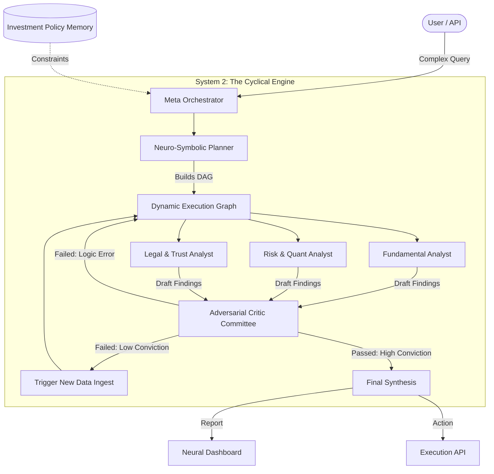

# Adam v23.5: The Neuro-Symbolic Financial Sovereign

[](https://opensource.org/licenses/MIT) [](https://www.python.org/downloads/) [](https://hub.docker.com/) [](https://arxiv.org/abs/2311.11944)

> **Adam v23.5 operates as a Neuro-Symbolic 'System 2' cognitive engine, upgrading financial AI from a hallucinating chatbot to a fiduciary architect. We fuse deep fundamental analysis with deterministic stochastic risk modeling to deliver calculated conviction rather than conversational filler.**

---

## 📉 The "Epistemological Crisis" in Financial AI

The era of the generic LLM "wrapper" is over. Institutional finance faces an **Epistemological Crisis**: stochastic LLMs cannot guarantee truth, making them dangerous for capital allocation. Investors demand **Systems of Agency**—platforms capable of rigorous, end-to-end due diligence with auditability and deterministic reliability.

**Adam v23.5** solves this by introducing a **Cyclical Reasoning Architecture**. Unlike linear "Chain-of-Thought" agents that are fast but prone to errors, Adam employs a graph-based planner that forces the AI to "think before it speaks." It doesn't just answer; it **Drafts**, **Critiques**, **Simulates**, and **Refines** its own analysis before presenting it to you.

[**🚀 Launch Neural Dashboard**](showcase/index.html) | [📖 Read the Documentation](docs/)

---

## 🧠 Architecture: Hybrid Cognitive Engine

Adam v23.5 utilizes a **Hybrid Architecture** that combines the responsiveness of asynchronous message passing with the depth of cyclical graph reasoning.

### 1. The "System 2" Reasoning Engine (Brain)
Located in `core/engine/`, this component handles complex, high-stakes analysis (Deep Dives, Risk assessments). It uses **LangGraph** to model reasoning as a state machine.



### 2. The Asynchronous Swarm (Body)
Located in `core/system/v22_async/`, this component handles high-throughput, non-blocking tasks (News monitoring, HFT signals, Data ingestion). It uses a **Message Broker** pattern.

### 3. Key Modules

| Module | Path | Description |
| :--- | :--- | :--- |
| **Meta Orchestrator** | `core/engine/meta_orchestrator.py` | The central router that decides between Fast (Swarm) and Deep (Graph) execution paths. |
| **Agents** | `core/agents/` | Specialized workers (Risk, Compliance, Fundamental) containing domain-specific logic. |
| **Universal Ingestor** | `core/data_processing/` | Pipeline for scrubbing and normalizing incoming data (10-Ks, News) into the Knowledge Graph. |
| **Neuro-Symbolic Planner** | `core/engine/neuro_symbolic_planner.py` | Compiles abstract goals into executable agent workflows. |

-----

## 🏰 Platform Capabilities: The "Super-App"

Adam unifies institutional credit risk analysis, private wealth management, and quantitative engineering into a single cognitive architecture.

### 1. The Deterministic Quantitative Core

**We do not let LLMs do math.** Adam uses a hard-coded Python/Rust engine for 100% accuracy.

  * **ICAT (Integrated Credit Analysis Tool):** Python-based engine for 3-statement modeling, DCF valuation, and sensitivity analysis.
  * **SNC Rating Module:** Automatically maps leverage and coverage ratios to the **Shared National Credit** regulatory scale (Pass, Special Mention, Substandard, Doubtful).

### 2. Institutional Due Diligence

  * **PromptFrame V2.1:** Instantiates a "Credit Committee" with distinct personas (The Bull, The Bear, The Synthesizer) to weigh evidence.
  * **Automated Deep Dives:** Generates 30+ page Investment Memos, handling everything from XBRL extraction to covenant analysis.

### 3. Family Office & Wealth Management

  * **Trust Modeling:** Encodes complex estate structures and beneficiary requirements.
  * **Automated IPS:** Dynamically generates and enforces Investment Policy Statements (IPS) based on shifting market conditions.
  * **Cross-Entity Risk:** Aggregates exposure across Family Office, Foundation, and Personal Trust entities.

### 4. The Gold Standard Data Pipeline

**"The Universal Ingestor"**
Garbage in, garbage out. Adam's pipeline scrubs, validates, and normalizes every token before it reaches the reasoning engine.

  * **Source Verification:** Cross-references news rumors against primary SEC filings (8-Ks).
  * **Conviction Scoring:** Every data point is scored for reliability (0-100%).
  * **FIBO Grounding:** All data is mapped to the Financial Industry Business Ontology (FIBO).

-----

## ⚡ Getting Started

We use **`uv`** for lightning-fast, reproducible Python environment management.

### Prerequisites

  * Python 3.10+
  * `uv` (Modern Python Package Manager)
  * API Keys (OpenAI, etc.)

### Quick Start (Developer)

```bash
# 1. Clone the repository
git clone https://github.com/adamvangrover/adam.git
cd adam

# 2. Sync dependencies with uv (10-100x faster than pip)
# If you don't have uv, you can use: pip install -r requirements.txt
uv sync

# 3. Activate the virtual environment
source .venv/bin/activate

# 4. Run the Showcaser Swarm to visualize the codebase
python scripts/swarm_showcase.py --target .

# 5. Launch the Mission Control Dashboard
# Open showcase/index.html in your browser to see the Neural Dashboard.
```

### Deployment

For full deployment instructions, including Docker and Cloud setup, please refer to the [Deployment Guide](showcase/deployment.html) or `docs/deployment.md`.

-----

## 🗺️ Roadmap: Path to Level 4 Autonomy

  * **Phase 1 (Current): The Autonomous Analyst.** Deep Dives, Credit Memos, and Regulatory Grading.
  * **Phase 2 (Q3 2025): The Portfolio Manager.** Multi-entity risk aggregation, automated rebalancing, and trade execution.
  * **Phase 3 (2026): The Market Maker.** High-frequency sentiment trading and liquidity provision via Quantum RL.

-----

## 🤝 Contributing

We are building the open-source standard for institutional AI.

  * **Current Focus:** Refining the Quantum Risk Module and adding connectors for Bloomberg (BBG) and FactSet.
  * Please read [CONTRIBUTING.md](CONTRIBUTING.md) for details on our code of conduct and the process for submitting pull requests.

### License

Distributed under the MIT License. See `LICENSE` for more information.
