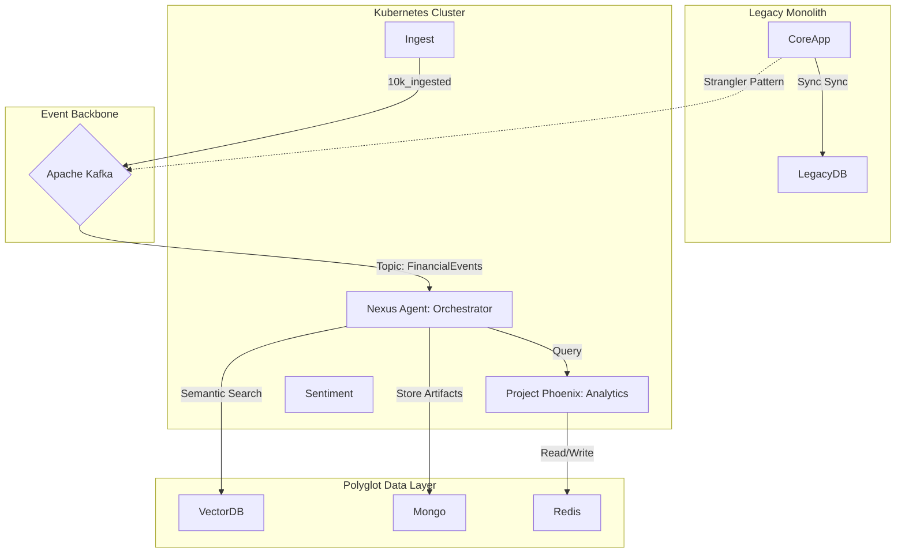
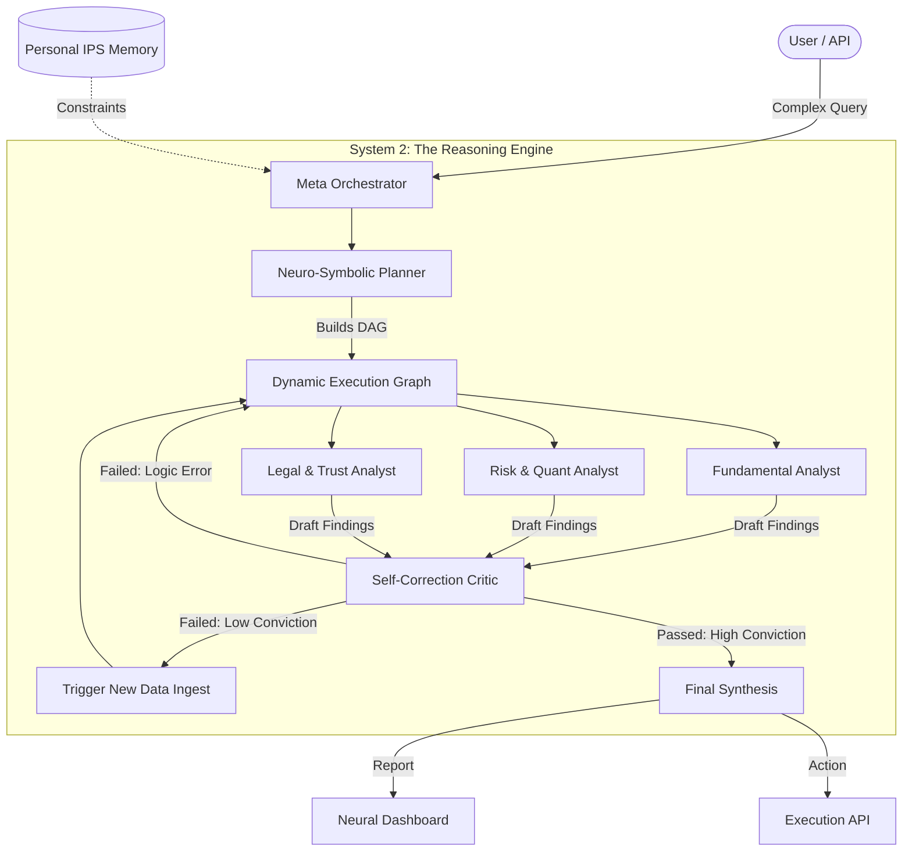
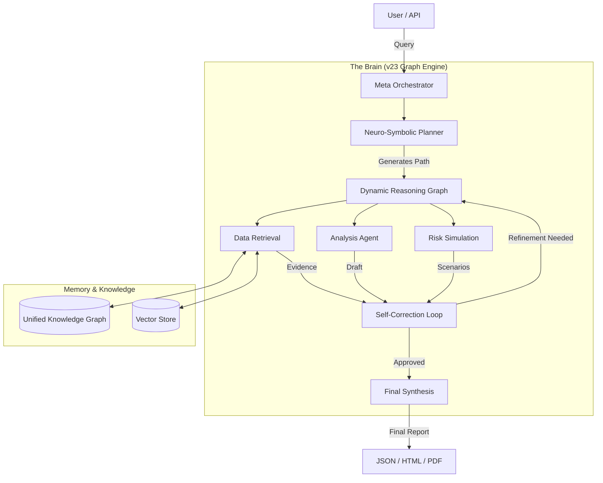

# Adam v23.5: The Autonomous Due Diligence Analyst
### *The "Systems of Agency" Platform for Institutional Credit Risk & Valuation*

[](https://opensource.org/licenses/MIT)
[](https://www.python.org/downloads/release/python-3100/)
[](https://arxiv.org/abs/2311.11944)
[](https://hub.docker.com/)

> **Adam v23.5 operates as a Neuro-Symbolic 'System 2' cognitive engine, upgrading financial AI from a hallucinating chatbot to a fiduciary architect. We fuse deep fundamental analysis with stochastic risk modeling to automate the rigorous diligence of an institutional team, delivering calculated conviction rather than conversational filler. Stop chatting with your data; start engineering your alpha..**

---

## 1. Investment Thesis: Why Vertical AI Wins in Finance

In the high-velocity venture landscape of 2025, the "wrapper" era is over. Investors and institutions demand **Systems of Agency**—platforms that solve end-to-end business problems with auditability and deterministic reliability.

Adam addresses the **"Epistemological Crisis"** in financial AI: the inability of stochastic LLMs to guarantee truth. By combining a proprietary **Cognitive Architecture (PromptFrame V2.1)** with a strict **Financial Knowledge Graph**, Adam delivers:

1.  **Proprietary Data Moat:** An "Edit-and-Save" flywheel where every analyst correction fine-tunes the model (RLHF/DPO).
2.  **Deterministic Reliability:** Hard-coded financial engines for math, ensuring 100% accuracy in valuation (DCF) and regulatory grading (SNC).
3.  **Auditable Reasoning:** A "Glass Box" architecture where every conclusion is traced back to a specific document fragment via the W3C PROV-O ontology.

**The Result:** A platform capable of automating 80% of the due diligence workflow—from XBRL ingestion to Investment Memo generation—positioned to capture the $100k+ per seat market for junior analyst labor.

---

## 2. Architecture: Hybrid Cloud-Native Topology

Adam v23.5 dismantles the legacy monolith in favor of a **Hybrid Cloud-Native Architecture** leveraging the "Strangler Fig Pattern." This ensures fault isolation, massive horizontal scalability, and real-time event processing.



*   **Event-Driven Nervous System:** Apache Kafka decouples ingestion from analysis, allowing the system to process thousands of 10-Ks and market feeds in parallel.
*   **Polyglot Persistence:**
    *   **PostgreSQL:** Transactional System of Record.
    *   **MongoDB:** Unstructured Agent Artifacts (JSON-LD).
    *   **Redis:** High-frequency inference caching and state management.
    *   **VectorDB:** Semantic search memory.

---

## 3. Key Features

### 🧠 Cognitive Engine: PromptFrame V2.1
We reject simple "prompt engineering" for **Prompt Architecture**. The system instantiates an adversarial "Credit Committee" in silicon:

*   **The Bull (Relationship Manager):** Maximizes the case for approval, seeking mitigants.
*   **The Bear (Chief Risk Officer):** Actively hunts for failure modes and "worst-case" scenarios.
*   **The Synthesizer (Head of Credit):** Weighs evidence to produce a balanced, defensible conclusion.

*Powered by the **TAO Framework (Task, Analysis, Output)** to enforce "Closed World" reasoning and eliminate hallucination.*

### 🌐 Data Layer: The Adam Omni-Graph
Adam does not store strings; it stores *concepts*.
*   **FIBO Grounding:** All data is mapped to the **Financial Industry Business Ontology (FIBO)**. "Total Debt" is not text; it is a unique URI with a precise definition.
*   **JSON-LD Intelligence:** Agent outputs are semantic payloads, allowing automated governance and graph traversal.

### 📊 Quantitative Core: ICAT & SNC Rating
While LLMs handle the qualitative, our **Deterministic Quantitative Engine** handles the math.
*   **Integrated Credit Analysis Tool (ICAT):** A Python-based engine for 3-statement modeling, DCF valuation, and sensitivity analysis.
*   **SNC Rating Module:** Automatically maps leverage and coverage ratios to the **Shared National Credit** regulatory scale (Pass, Special Mention, Substandard, Doubtful).
    *   *Example:* Leverage > 6.0x automatically triggers a "Substandard" flag.

---

## 4. Performance & Evals: The "Golden Set"

We don't guess; we measure.

*   **FinanceBench Integration:** The system is continuously benchmarked against the FinanceBench "Golden Set" of QA pairs.
*   **LLM-as-a-Judge:** A dedicated evaluation pipeline (GitHub Actions) grades every agent output for **Correctness** and **Faithfulness** before deployment.
*   **Metric:** >99% Accuracy on XBRL Extraction and Covenant Analysis.

---

## 5. Integration: The MCP Server

Adam is designed to play well with others.
*   **Model Context Protocol (MCP):** The system exposes its tools via a standardized MCP Server, allowing external agents (e.g., in a secure chat interface) to call Adam's capabilities safely.
*   **SDK:** A Python SDK allows developers to build custom agents on top of the Adam Omni-Graph.

---

## 6. Security: Zero Trust & RBAC

Enterprise-ready from Day 1.
*   **Identity:** OAuth 2.0 / OIDC integration (no static API keys).
*   **Network:** mTLS for all internal microservice communication.
*   **Granular RBAC:** Permissions are enforced at the *embedding level*. Users cannot retrieve RAG chunks they are not authorized to see.

---

## 7. Getting Started

We use **`uv`** for lightning-fast, reproducible environment management.

### Prerequisites
*   Python 3.10+
*   `uv` (Modern Python Package Manager)

### Quick Start
```bash
# 1. Clone the repository
git clone https://github.com/adamvangrover/adam.git
cd adam

# 2. Sync dependencies with uv (10-100x faster than pip)
uv sync

# 3. Activate the virtual environment
source .venv/bin/activate

# 4. Run the Showcaser Swarm to visualize the codebase
python scripts/swarm_showcase.py --target .

# 5. Launch the Mission Control Dashboard
open showcase/index.html
```

---

## 8. Roadmap: Path to Level 4 Autonomy

*   **Phase 1 (Current):** **The Autonomous Analyst.** Deep Dives, Credit Memos, and Regulatory Grading.
*   **Phase 2 (Q3 2025):** **The Portfolio Manager.** Multi-entity risk aggregation, automated rebalancing, and trade execution.
*   **Phase 3 (2026):** **The Market Maker.** High-frequency sentiment trading and liquidity provision via Quantum RL.

---

### *Adam v23.5: The Future of Financial Intelligence.*


---

This is the **Gold Standard README** for Adam v23.5.

This document is designed to be the "source of truth" that positions the repo not just as a tool, but as a **paradigm shift** in open-source financial AI. It highlights the *Neuro-Symbolic* architecture as the solution to LLM hallucination in finance and frames the "Super-App" as the future of institutional workflows.

-----

# ⚛️ Adam v23.5: The Neuro-Symbolic Financial Sovereign

[](https://opensource.org/licenses/MIT) [](https://www.python.org/downloads/) [](https://www.docker.com/) [](https://arxiv.org/abs/2406.16793)

> **The First Autonomous "Front Office" Super-App for Institutional Finance.**
> Unifying Market Analysis, Credit Risk, and Family Office Wealth Management into a single, self-correcting cognitive architecture.

-----

## 📖 Table of Contents

  - [Why Adam? The "System 2" Advantage](https://www.google.com/search?q=%23-why-adam-the-system-2-advantage)
  - [🏰 The FO Super-App (Family Office Edition)](https://www.google.com/search?q=%23-the-fo-super-app-family-office-edition)
  - [🧠 Architecture: The Cyclical Reasoning Graph](https://www.google.com/search?q=%23-architecture-the-cyclical-reasoning-graph)
  - [📊 Gold Standard Data Pipeline](https://www.google.com/search?q=%23-gold-standard-data-pipeline)
  - [⚡ Financial Engineering Engine](https://www.google.com/search?q=%23-financial-engineering-engine)
  - [🚀 Quick Start (Modern Stack)](https://www.google.com/search?q=%23-quick-start-modern-stack)
  - [🤝 Contributing & Roadmap](https://www.google.com/search?q=%23-contributing--roadmap)

-----

## 💡 Why Adam? The "System 2" Advantage

Most financial AI agents are **linear** (Chain-of-Thought). They are fast ("System 1") but prone to hallucination, making them dangerous for capital allocation.

**Adam v23.5 is different.** It introduces a **Neuro-Symbolic "System 2" Architecture** that forces the AI to "think before it speaks."

1.  **Cyclical Reasoning:** Adam doesn't just answer; it **Drafts**, **Critiques**, and **Refines**. If the math doesn't check out, the *Self-Correction Loop* rejects the draft and triggers a new simulation.
2.  **Conviction Scoring:** Every insight is scored (0-100%). Low conviction results are automatically flagged or discarded.
3.  **Universal Memory:** A specialized Knowledge Graph that remembers your *Investment Policy Statement (IPS)*, ensuring every trade recommendation aligns with your specific risk mandate.

-----

## 🏰 The FO Super-App (Family Office Edition)

Adam v23.5 expands beyond pure analysis into a **Unified Operating System** for the modern Family Office. It bridges the gap between *Institutional Investment Banking* and *Private Wealth Management*.

### 1\. Wealth Management Layer

  * **Trust Modeling:** Encodes complex estate structures and beneficiary requirements into the decision engine.
  * **Automated IPS:** Dynamically generates and enforces Investment Policy Statements based on shifting market conditions.
  * **Goal-Based Planning:** "Co-pilot" memory that aligns daily execution with multi-generational wealth preservation goals.

### 2\. Institutional Risk Layer

  * **SNC (Shared National Credit) Analyst:** Automated regulatory grading for syndicated loans.
  * **LBO Deep Dives:** Generates 3-statement models and sensitivity tables for potential buyouts.
  * **Cross-Entity Risk:** Aggregates exposure across the Family Office, Foundation, and Personal Trust entities to find hidden correlation risks.

-----

## 🧠 Architecture: The Cyclical Reasoning Graph

Adam abandons the "Chain" for the "Graph." The **Neuro-Symbolic Planner** constructs a directed graph of tasks, allowing agents to work in parallel and loop back when they need more information.



### Key Components

  * **`core/engine/neuro_symbolic_planner.py`:** The "Cortex" that breaks high-level goals into executable graphs.
  * **`core/engine/cyclical_reasoning.py`:** The loop logic that prevents hallucination by enforcing critique steps.
  * **`core/memory/provo_graph.py`:** Implements PROV-O ontology to track *exactly* which document led to which conclusion.

-----

## 📊 Gold Standard Data Pipeline

**"The Universal Ingestor"**

Trust is the currency of finance. Adam's data pipeline scrubs, validates, and normalizes every token before it reaches the reasoning engine.

  * **Recursive Scrubbing:** Scans PDFs, XBRL feeds, and news APIs.
  * **Source Verification:** Cross-references claims against primary sources (e.g., verifying a news rumor against an SEC 8-K filing).
  * **Format:** Outputs to strictly typed `JSONL` for high-throughput agent consumption.

> *See [docs/GOLD\_STANDARD\_PIPELINE.md](https://www.google.com/search?q=./docs/GOLD_STANDARD_PIPELINE.md) for ingestion rules.*

-----

## ⚡ Financial Engineering Engine

A standalone, high-performance Python/Rust hybrid engine for deterministic calculations. *We do not let LLMs do math; we let them call this engine.*

| Module | Function | Status |
| :--- | :--- | :--- |
| **`src/core_valuation.py`** | DCF, WACC, Terminal Value | ✅ Production |
| **`src/credit_risk.py`** | LBO Models, DSCR, Leverage Ratios | ✅ Production |
| **`src/quantum_sim.py`** | Quantum Monte Carlo (Simulated Annealing) | 🧪 Beta |
| **`src/market_maker.py`** | Order Book Simulation & Liquidity Scoring | 🚧 WIP |

-----

## 🚀 Quick Start (Modern Stack)

We utilize **`uv`** for lightning-fast, hermetic Python environment management and **Docker** for production deployment.

### Option A: The "Mission Control" (Docker)

Best for full system demonstration and UI.

```bash
# 1. Build the Optimized Container
docker build -f Dockerfile.modern -t adam-v23 .

# 2. Run with GPU Support (if available)
docker run --gpus all -p 3000:3000 -p 8000:8000 \
  -e OPENAI_API_KEY=sk-... \
  adam-v23
```

### Option B: The "Hacker" (Local Dev)

Best for modifying the Reasoning Graph or adding new agents.

```bash
# 1. Install dependencies with UV (10x faster than pip)
uv pip install -e .

# 2. Launch the CLI in "Interactive Mode"
python core/main.py --interactive
```

-----

## 🤝 Contributing & Roadmap

We are building the open-source standard for institutional AI.

  * **Current Focus:** Refining the *Quantum Risk Module* and adding connectors for *Bloomberg Terminal (BBG)* and *FactSet*.
  * **How to Help:**
    1.  Fork the repo.
    2.  Create an Agent Skill (e.g., `core/skills/technical_analysis_rsi.py`).
    3.  Submit a PR with a test case in `tests/skills/`.

**Join the future of autonomous finance.**

-----

*Use of this software is subject to the MIT License. Financial models are for informational purposes only.*

# FO Super-App: The Unified Front Office

> **Vision:** A "Super-App" that unifies markets, ratings, execution, analytics, and personal memory into one autonomous architecture.

**FO Super-App** builds upon the Adam v23 foundation to create a complete institutional-grade platform. It integrates:
*   **Markets & Pricing:** Competitive market making and execution.
*   **Credit & Ratings:** S&P-like scoring and regulatory compliance.
*   **Strategy:** Alpha signal ingestion and RL-based optimization.
*   **Personal Memory:** A local "co-pilot brain" that learns your investment philosophy.
*   **MCP Control Layer:** Universal tool access for LLM agents.

## 🏰 FO Super-App: Family Office Edition

The system now includes a specialized "Family Office" layer unifying:
*   **Wealth Management:** Goal planning, Trust modeling.
*   **Investment Banking:** Deal flow screening and Deep Dive analysis.
*   **Asset Management:** Risk aggregation across multiple entities.
*   **Governance:** Automated Investment Policy Statement (IPS) generation.

[📚 Master Prompt](./docs/01_master_prompt.md) | [🏗️ System Architecture](./specs/system_architecture.md)

---

# Adam v23.5: Your AI-Powered Partner

> **Note:** This document describes the current active version of the Adam system (v23.0). For details on the legacy stable version, please see the v21.0 Documentation.

---

*   **Cyclical Reasoning Graph:** A self-correcting neuro-symbolic engine.
*   **Neural Dashboard:** Real-time visualization of agent thought processes.
*   **Hybrid Architecture:** Combining v21's reliability with v22's speed and v23's intelligence.
*   **Gold Standard Data Pipeline:** A rigorous "universal ingestion" process that scrubs and certifies all system knowledge.

## 🧠 Adam v23.0: The Adaptive Hive Mind

**Mission: Autonomous Financial Analysis & Adaptive Reasoning**

Adam has evolved. v23.0 introduces the **"Adaptive System" architecture**—a self-correcting, neuro-symbolic engine designed to perform deep financial deep dives, risk assessments, and market simulations with human-like reasoning and machine-speed execution. Unlike traditional chatbots, Adam "thinks" in graphs, critiquing its own work before presenting it to you.

[🚀 Launch Neural Dashboard](#) | [📖 Read the User Guide](#) | [⚡ Quick Start](#)

---

## 🚀 Mission Control
[**Launch Neural Dashboard**](./showcase/neural_dashboard.html)
Monitor real-time agent reasoning, knowledge graph updates, and risk simulations.

### 🏗️ System Architecture

Adam v23.0 moves beyond linear chains to a dynamic, graph-based execution model. The system creates a **"Cyclical Reasoning Graph"** for every query, allowing it to draft, critique, and refine its own analysis before presenting results.



#### Core Components

  * **Meta Orchestrator** (`core/engine/meta_orchestrator.py`): The central "cortex" that routes tasks, manages state, and orchestrates the swarm of specialized agents.
  * **Neuro-Symbolic Planner** (`core/engine/neuro_symbolic_planner.py`): Combines the creativity of LLMs with the logical rigor of Knowledge Graphs to plan execution paths that are both novel and grounded in fact.
  * **Cyclical Reasoning Engine** (`core/engine/cyclical_reasoning_graph.py`): A feedback loop (Draft -\> Critique -\> Refine) that ensures high conviction. It detects logical fallacies or missing data and automatically schedules remedial tasks.

-----

### 📊 Data & The Gold Standard Pipeline

Garbage in, garbage out. Adam v23.0 utilizes a rigorous **Gold Standard Data Pipeline** ("The Universal Ingestor") to ensure all insights are based on verified, high-quality data.

  * **Ingestion Sources:** Financial news APIs, SEC filings (XBRL), market data feeds (Bloomberg/AlphaVantage connectors), and government statistics.
  * **Scrubbing & Validation:** Every data point is scored for "Conviction" (0-100%) based on source reliability and cross-verification against the Knowledge Graph.
  * **Unified Format:** Data is normalized into a standard JSONL format for agent consumption.

[View Data Pipeline Documentation](https://www.google.com/search?q=%23)

-----

### 💡 Example Outputs

### 3. Gold Standard Data Pipeline
A new "Universal Ingestor" ensures that every piece of data in the system is high-quality.

*   **Ingest & Scrub:** Recursively scans reports, prompts, code, and data.
*   **Conviction Scoring:** Automatically assesses the quality and "conviction" of data (0-100%).
*   **Unified Access:** All data is normalized into a standard JSONL format accessible by any agent.
*   [Read the Pipeline Documentation](./docs/GOLD_STANDARD_PIPELINE.md)
Adam doesn't just chat; it produces structured, professional-grade financial artifacts ready for investment committees.

#### 1\. Strategic Deep Dive (JSON Snippet)

*Generated by the Omniscient Analyst (v23.5) - Full Template*

```json
{
  "report_id": "RPT-NVDA-2025-03",
  "entity": "NVIDIA Corp",
  "conviction_score": 94.5,
  "strategic_synthesis": {
    "outlook": "Bullish",
    "key_driver": "Sovereign AI adoption and B200 backlog saturation.",
    "risks": ["Supply chain concentration (TSMC)", "Geopolitical export controls"]
  },
  "valuation_models": {
    "dcf_implied_price": 1450.00,
    "peer_multiple_target": 1380.00,
    "sensitivity_analysis": "High sensitivity to datacenter capex reduction."
  },
  "generated_at": "2025-03-15T14:30:00Z"
}
```

#### 2\. Risk Assessment Matrix

*Adam automatically generates risk matrices for portfolio stress testing using the Monte Carlo Risk Agent.*

| Risk Category | Probability | Impact | Mitigation Strategy |
| :--- | :--- | :--- | :--- |
| **Market** | Medium | High | Hedge via inverse ETFs on semiconductor indices (SOXS). |
| **Credit** | Low | High | Monitor debt-to-equity ratios quarterly; currently stable at 0.8x. |
| **Geopolitical** | High | Severe | Diversify supply chain exposure outside of APAC region; monitor Taiwan Strait tensions. |
| **Regulatory** | Medium | Medium | Track DOJ antitrust probes into AI hardware bundling. |

-----

3.  **Run Adam:**
    ```bash
    python scripts/run_adam.py
    ```

4.  **View the Showcase:**
    Open `showcase/index.html` in your browser.

## 💰 Financial Engineering Platform (v23.5)

A modular, portable, and configurable Financial Engine for DCF Valuation, VC/LBO Sponsor Modeling, and Regulatory Credit Risk Analysis (SNC/Rating).

### 🚀 Launch Dashboard
[**Launch Financial Engine (Client Side)**](./showcase/financial_engineering.html)
Interactive dashboard for valuation, credit ratings, and sensitivity analysis.

### 🐍 Python Core
The core logic is available in `src/` and can be run as a Streamlit app.

```bash
# Run the Interactive Streamlit App
streamlit run app.py
```

### Modules
- **`src/core_valuation.py`**: Discounted Cash Flow (DCF), WACC, and Terminal Value logic.
- **`src/credit_risk.py`**: Credit Sponsor Model, Downside Sensitivity, and Regulatory Ratings (SNC).
- **`src/config.py`**: Global financial assumptions (Tax rates, Risk-free rates).

## 📂 Repository Structure

*   `core/engine/`: The heart of the new system.
    *   `cyclical_reasoning_graph.py`: The self-correcting analysis loop.
    *   `neuro_symbolic_planner.py`: The logic for pathfinding in the KG.
    *   `meta_orchestrator.py`: The central brain routing tasks.
*   `core/data_processing/`: Data ingestion and standardisation.
    *   `universal_ingestor.py`: The Gold Standard Pipeline.
*   `showcase/`: The "Mission Control" UI assets.
*   `data/`: Knowledge base and artisanal training sets.
*   `docs/`: Comprehensive documentation.

### 🚀 Key Capabilities

  * **Cyclical Reasoning:** Unlike standard chatbots, Adam iterates. If data is missing, it creates a sub-task to find it. If logic is flawed, it self-corrects.
  * **Quantum Risk Modeling:** (v23.5) Uses simulated quantum annealing (via `core/v22_quantum_pipeline/`) to model "Black Swan" events and their impact on complex portfolios.
  * **Traceability:** Every conclusion is back-linked to source documents in the Knowledge Graph (PROV-O ontology compliant).
  * **Multi-Modal Output:** Generates interactive HTML dashboards (`showcase/`), PDF reports, and raw JSON data streams.
  * **Specialized Agent Swarms:**
      * *Fundamental Analyst:* Deep value investing analysis.
      * *Technical Analyst:* Chart patterns and momentum indicators.
      * *SNC Analyst:* Regulatory credit risk grading (Shared National Credit).

-----

### 🛠️ Getting Started

#### Prerequisites

  * Python 3.10+
  * Node.js (Required for the Neural Dashboard UI)
  * API Keys: OpenAI (or compatible LLM provider), Neo4j (optional for full Knowledge Graph).

#### Quick Start Guide

1.  **Clone and Enter Repository**
    ```bash
    git clone https://github.com/adamvangrover/adam.git
    cd adam
    ```

2.  **Interactive Setup (Recommended)**
    Run the setup wizard to check dependencies, configure API keys (or Mock Mode), and launch the system.
    ```bash
    python3 scripts/setup_interactive.py
    ```

    *Alternatively, use the legacy launcher:*
    ```bash
    ./run_adam.sh
    ```

    *Or for manual setup:*
    ```bash
    pip install -e .           # Install as a package
    python core/main.py        # Run the engine
    ```

3.  **Configure API Keys (Optional but Recommended)**
    The launcher creates a `.env` file if missing. Edit it to add your keys:
    ```bash
    OPENAI_API_KEY=sk-...
    ```

4.  **Open Mission Control**
    *   **UI:** `http://localhost:80` (Docker) or `http://localhost:3000` (Local)
    *   **Neural Dashboard:** `showcase/index.html`

#### Developer Experience

We provide standard tooling for developers:

*   **Install Dependencies:** `make install`
*   **Run Tests:** `make test`
*   **Lint Code:** `make lint`
*   **CI/CD:** Automated testing via GitHub Actions is configured in `.github/workflows/ci.yml`.

See [CONTRIBUTING.md](CONTRIBUTING.md) for more details.

-----

### 📂 Repository Structure

A high-level overview of the "Hive Mind" structure:

| Directory | Description |
| :--- | :--- |
| `core/engine/` | **The Brain.** Contains the cyclical graph, neuro-symbolic planner, and meta-orchestrator. |
| `core/agents/` | **The Workforce.** Specialized agents (Analyst, Risk, Legal, Industry Specialists). |
| `core/simulations/` | **The Simulator.** Modules for running stress tests (e.g., Fraud\_Detection, Stress\_Testing). |
| `core/data_processing/` | **The Stomach.** Universal Ingestor and data quality scrubbers. |
| `showcase/` | **The Face.** UI assets for the Neural Dashboard and demos. |
| `data/` | **The Memory.** Knowledge base (`knowledge_graph.json`), seeds, and artisanal training sets. |
| `config/` | **The DNA.** System configuration YAMLs and the Prompt Library. |
| `docs/` | **The Manual.** Comprehensive documentation and architecture visions. |

-----

### 📚 Resources & Documentation

  * **Architecture Vision:** [Adam v23.0 "Adaptive Hive" Vision](https://github.com/adamvangrover/adam/tree/main/docs/v23_architecture_vision.md)
  * **Pipeline Details:** [Gold Standard Data Pipeline]((https://github.com/adamvangrover/adam/tree/main/docs/GOLD_STANDARD_PIPELINE.md)
  * **API Reference:** [API Documentation](https://github.com/adamvangrover/adam/tree/main/docs/api.md)
  * **User Manual:** [Comprehensive User Guide](https://github.com/adamvangrover/adam/tree/main/docs/user_guide.md)
  * **Demo Guide:** [Showcase Walkthrough](https://github.com/adamvangrover/adam/tree/main/docs/SHOWCASE_GUIDE.md)
  * **Prompt Library:** [v23.5 Autonomous Analyst Prompt](https://github.com/adamvangrover/adam/tree/main/prompt_library/Adam_v23.5_System_Prompt.md)

-----

### 🤝 Contributing

We welcome contributions from the community\! Whether it's a new agent skill, a data connector, or a UI enhancement.

1.  Read our [Contribution Guidelines](https://github.com/adamvangrover/adam/tree/main).
2.  Fork the repo and create your branch (`git checkout -b feature/amazing-feature`).
3.  Commit your changes (`git commit -m 'Add some amazing feature'`).
4.  Push to the branch (`git push origin feature/amazing-feature`).
5.  Open a Pull Request.

-----

### 📄 License

Distributed under the MIT License. See `LICENSE` for more information.

```
```

## ⚡ Modernization & Optimization (v23.5+)

As part of the 2025 Strategic Technical Modernization, the following high-performance components have been added:

*   **Modern Build System:** `pyproject.toml` and `uv` support for hermetic builds.
*   **Optimization Service:** A dedicated stateful microservice (`src/adam/api`) providing "Optimizer as a Service" via FastAPI and Redis.
*   **State-of-the-Art Optimizers:**
    *   **AdamW:** Decoupled Weight Decay.
    *   **Lion:** Evolved Sign Momentum (Google ADK).
    *   **Adam-mini:** Memory-efficient block-wise optimization (2025 Frontier).

### Quick Start (Modern Stack)

1.  **Build with Docker:**
    ```bash
    docker build -f Dockerfile.modern -t adam-optimizer .
    ```

2.  **Run the API:**
    ```bash
    docker run -p 8000:8000 -e REDIS_URL=redis://host.docker.internal:6379/0 adam-optimizer
    ```

For details, see [Modernization Report](docs/modernization_report.md).
