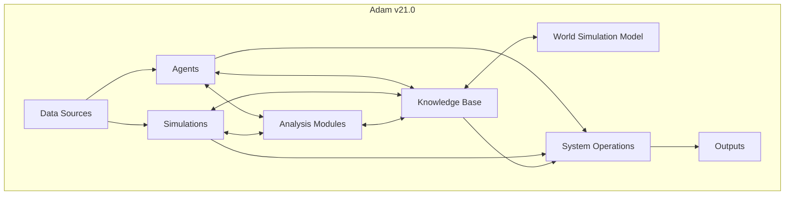

# Adam v23.0: Your AI-Powered Partner

> **Note:** This document describes the current stable version of the Adam system (v21.0). For details on the next-generation architecture, please see the [Adam v23.0 "Adaptive Hive" Vision](./docs/v23_architecture_vision.md).

# Adam v23.0: The Adaptive Hive Mind
**System Status:** v23.0 (Active) | v21.0 (Stable)
**Mission:** Autonomous Financial Analysis & Adaptive Reasoning

Adam has evolved. v23.0 introduces the "Adaptive System" architecture, featuring:

*   **Cyclical Reasoning Graph:** A self-correcting neuro-symbolic engine.
*   **Neural Dashboard:** Real-time visualization of agent thought processes.
*   **Hybrid Architecture:** Combining v21's reliability with v22's speed and v23's intelligence.

[**Launch Neural Dashboard**](./showcase/neural_dashboard.html)

> **Note:** For details on the original v21.0 architecture, please see the v21.0 Documentation.

(Welcome to Adam, the most advanced financial AI system yet! We've supercharged our capabilities with an expanded agent network, enhanced simulation workflows, and a more sophisticated knowledge base to deliver unparalleled financial analysis and investment insights.)

[**Explore the interactive demo here!**](./showcase/index.html)

Adam v21.0 is not just an AI; it's your partner in navigating the complexities of the financial world. Whether you're an individual investor, a seasoned analyst, or a financial institution, Adam v21.0 empowers you with the knowledge and tools to make informed decisions and achieve your financial goals.

## What's New in Adam v21.0?

*   **New Agents for Deeper Analysis:**
    *   **Behavioral Economics Agent:** Identifies market and user cognitive biases (e.g., herding, confirmation bias) to provide a more nuanced understanding of market behavior.
    *   **Meta-Cognitive Agent:** Acts as a quality control layer, reviewing the analysis of other agents for logical fallacies and inconsistencies, ensuring higher quality output.
*   **Enhanced Reasoning and Self-Correction:**
    *   **Causal Inference Modeling:** Moves beyond correlation to understand the causal impact of events.
    *   **Formalized Self-Correction Loop:** A more robust system for identifying, diagnosing, and correcting errors, allowing the system to learn and improve over time.
*   **Upgraded Core Principles:**
    *   **Intellectual Humility:** Proactively acknowledges uncertainty and the probabilistic nature of markets.
    *   **Ethical Guardrails:** Stricter operational and ethical boundaries to prevent misuse and ensure fairness.
*   **Improved Agent Architecture:**
    *   Enhanced capabilities for monitoring agent performance, managing dependencies, and updating or retiring agents seamlessly.

## Key Features

*   **Comprehensive Financial Analysis:**
    *   **Market Sentiment Analysis:** Gauges investor sentiment with advanced NLP and emotion analysis, incorporating news articles, social media, and financial forums.
    *   **Macroeconomic & Geopolitical Risk Assessment:** Identifies and analyzes macroeconomic and geopolitical risks and their potential impact on financial markets.
    *   **Fundamental & Technical Analysis:** Performs in-depth fundamental and technical analysis of stocks and other financial instruments, leveraging both traditional and alternative data sources.
*   **Personalized Recommendations:**
    *   **Tailored to your risk tolerance and investment goals.**
    *   **Provides actionable insights and clear explanations.**
*   **Automated Workflows:**
    *   **Automated data collection and processing from various sources.**
    *   **Customizable strategy implementation with backtesting and optimization capabilities.**
*   **Knowledge Graph Integration:**
    *   **Leverages a rich and interconnected knowledge graph for deeper insights and context-aware analysis.**
*   **API Access:**
    *   **Provides a unified API for seamless integration with other systems and data sources.**
*   **Dynamic Visualization Engine:**
    *   **Generates interactive and informative visualizations to aid in understanding complex data.**
*   **Repository Management System:**
    *   **Organizes and manages all Adam v21.0 files, including market overviews, company recommendations, newsletters, and simulation results.**
*   **Feedback and Prompt Refinement Loop:**
    *   **Continuously learns and adapts based on user feedback and new information.**

Adam has evolved. v23.0 introduces the "Adaptive System" architecture, featuring a self-correcting neuro-symbolic engine that learns from its mistakes, plans complex research paths, and simulates adversarial scenarios.

## 🚀 Mission Control
[**Launch Neural Dashboard**](./showcase/neural_dashboard.html)
Monitor real-time agent reasoning, knowledge graph updates, and risk simulations.

## 🌟 Key Capabilities (v23.0)

### 1. Cyclical Reasoning Engine
Unlike traditional linear chains, Adam v23 uses a cyclical graph (built on LangGraph) to iterate on analysis.

*   **Draft -> Critique -> Refine:** The system critiques its own work and refines it until quality thresholds are met.
*   **Self-Correction:** Detects missing data or logical fallacies and automatically launches remedial tasks.

### 2. Neuro-Symbolic Planner
Combines the creativity of LLMs with the logical rigor of Knowledge Graphs.

*   **Path Discovery:** "Plan a path from Apple Inc. to Credit Risk considering Supply Chain Constraints."
*   **Traceability:** Every conclusion is back-linked to specific nodes in the PROV-O ontology.

### 3. Hybrid Architecture
*   **v21 (Legacy):** Robust, synchronous agents for standard reporting.
*   **v22 (Async):** Message-driven microservices for high-throughput data ingestion.
*   **v23 (Adaptive):** The "Brain" that orchestrates it all.

## 🛠️ Getting Started

### Prerequisites
*   Python 3.10+
*   Node.js (for full UI dev)

### Quick Start

1.  **Clone the Repository:**
    ```bash
    git clone https://github.com/adamvangrover/adam.git
    cd adam
    ```

2.  **Install Dependencies:**
    ```bash
    pip install -r requirements.txt
    ```

3.  **Configure the System:**
    *   System configurations are now managed through a set of modular YAML files within the `config/` directory (e.g., `config/agents.yaml`, `config/api.yaml`, `config/data_sources.yaml`, `config/system.yaml`, `config/settings.yaml`, etc.).
    *   The main `config/config.yaml` file is now deprecated for direct configuration and instead points to these modular files. Users should modify the specific files directly to customize settings.
    *   `config/example_config.yaml` can be consulted for examples of various structures but is no longer the primary template to copy for runtime configuration.
    *   Configure your preferred LLM engine (e.g., OpenAI, Hugging Face Transformers, Google Cloud Vertex AI) by modifying the relevant section in the appropriate modular configuration file (e.g., `config/llm_plugin.yaml` or `config/settings.yaml`).
    *   Customize agent configurations and workflows by editing files like `config/agents.yaml` and `config/workflow.yaml` to suit your specific needs.

    **3.1. API Key Configuration**
    *   API keys for external services are no longer configured in YAML files. Instead, they must be provided as environment variables. The application will read these environment variables at runtime.
    *   For instance, you would set environment variables like: `BEA_API_KEY='your_bea_key'`, `BLS_API_KEY='your_bls_key'`, `IEX_CLOUD_API_KEY='your_iex_key'`, `TWITTER_CONSUMER_KEY='your_twitter_consumer_key'`, etc.
    *   Refer to the specific data source integration or documentation for the exact environment variable names required.

4.  **Run Adam:**
    ```bash
    python scripts/run_adam.py
    ```

5.  **Run the System (Headless Mode):**
    ```bash
    python scripts/run_adam.py
    ```

6.  **View the Showcase:**
    Open `showcase/index.html` in your browser.

### Accessing and Utilizing the Knowledge Graph and API
*   **Knowledge Graph:** Access and query the knowledge graph data directly or through the API. The data is stored in the `data/knowledge_graph.json` file and managed by the Neo4j graph database.
*   **API:** The Adam v21.0 API provides a unified interface for interacting with the system. Refer to the `docs/api_docs.yaml` file for detailed API documentation.

## 📂 Repository Structure

*   `core/v23_graph_engine/`: The heart of the new system.
    *   `cyclical_reasoning_graph.py`: The self-correcting analysis loop.
    *   `neuro_symbolic_planner.py`: The logic for pathfinding in the KG.
    *   `meta_orchestrator.py`: The central brain routing tasks.
*   `showcase/`: The "Mission Control" UI assets.
*   `data/`: Knowledge base and artisanal training sets.
*   `docs/`: Comprehensive documentation.

## 📚 Documentation

*   [Adam v20.0 Implementation Plan](docs/v20.0)
*   [System Requirements](docs/REQUIREMENTS.md)
*   [User Guide](docs/user_guide.md)
*   [API Documentation](docs/api_docs.yaml)
*   [Contribution Guidelines](CONTRIBUTING.md)
*   [Showcase Guide](docs/SHOWCASE_GUIDE.md): Walkthrough of the demo.
*   [v23 Architecture Vision](docs/v23_architecture_vision.md): Deep dive into the "Adaptive Hive".

## 🤝 Contributing
Contributions are welcome! Please check [CONTRIBUTING.md](CONTRIBUTING.md) for guidelines.

## FAQ

### General

**What is Adam v21.0?**
Adam v21.0 is a highly sophisticated AI-powered financial analytics system designed to provide comprehensive insights and strategic guidance for investors, analysts, and researchers.

**Who is Adam v21.0 for?**
Adam v21.0 is designed for a wide range of users, including individual investors, financial analysts, portfolio managers, risk managers, and researchers.

**How does Adam v21.0 work?**
Adam v21.0 utilizes a modular architecture with specialized agents for various tasks, including market sentiment analysis, macroeconomic analysis, geopolitical risk assessment, industry-specific analysis, fundamental and technical analysis, risk assessment, and more. These agents collaborate and interact to provide a holistic view of the financial landscape.

**What are the benefits of using Adam v21.0?**
Adam v21.0 can help users gain a deeper understanding of the financial markets, identify potential investment opportunities, manage risks, and optimize their portfolios. It also provides access to a wealth of financial knowledge and facilitates informed decision-making.

**How can I access Adam v21.0?**
Adam v21.0 is currently implemented as a GitHub repository. You can access the code and documentation here: https://github.com/adamvangrover/adam

**Is Adam v21.0 free to use?**
Yes, Adam v21.0 is open source and free to use.

**What are the limitations of Adam v21.0?**
As an AI system under development, Adam v21.0 may not always be perfect and its recommendations should not be taken as financial advice. It's essential to conduct your own research and consult with a financial advisor before making any investment decisions.

**How can I contribute to Adam v21.0?**
Contributions are welcome! You can contribute by reporting bugs, suggesting enhancements, or submitting code changes. See the `CONTRIBUTING.md` file for more details.

**Where can I find more information about Adam v21.0?**
You can find more information in the `README.md` file and other documentation files in the repository. You can also explore the interactive tutorials and FAQ section for detailed guidance and examples.

### Features

**What is market sentiment analysis?**
Market sentiment analysis gauges the overall mood and sentiment of investors in the financial markets. Adam v21.0 uses natural language processing (NLP) and machine learning (ML) techniques to analyze news articles, social media feeds, and other sources to determine the prevailing sentiment towards the market or specific assets.

**How does Adam v21.0 perform macroeconomic analysis?**
Adam v21.0 analyzes macroeconomic indicators, such as GDP growth, inflation, and interest rates, to assess the health of the economy and its potential impact on financial markets. It uses statistical models and forecasting techniques to provide insights into macroeconomic trends and their implications for investments.

**What are geopolitical risks, and how does Adam v21.0 assess them?**
Geopolitical risks are events or situations related to international relations, politics, or conflicts that can impact financial markets. Adam v21.0 assesses these risks by analyzing news, political developments, and other relevant data, using NLP and ML techniques to identify and evaluate potential geopolitical risks.

**What industries does Adam v21.0 specialize in?**
Adam v21.0 can analyze a wide range of industries, with specialized agents for key sectors such as technology, healthcare, energy, and finance. It can also adapt to new industries and sectors through its dynamic agent deployment capabilities.

**How does Adam v21.0 conduct fundamental analysis?**
Adam v21.0 performs fundamental analysis by analyzing financial statements, evaluating company management, and conducting valuation modeling. It uses a variety of techniques, including discounted cash flow (DCF) analysis, comparable company analysis, and precedent transactions analysis, to determine the intrinsic value of a company or asset.

**What technical analysis tools does Adam v21.0 offer?**
Adam v21.0 offers various technical analysis tools, including chart pattern recognition, technical indicator analysis, and trading signal generation. It can analyze historical price data and identify trends, support and resistance levels, and other technical patterns to provide insights into potential trading opportunities.

**How does Adam v21.0 assess investment risks?**
Adam v21.0 assesses investment risks by evaluating market risk, credit risk, liquidity risk, and other relevant factors. It uses quantitative models and simulations to assess the potential impact of different risk factors on investments and portfolios.

**What is the World Simulation Model, and how does it work?**
The World Simulation Model (WSM) is a module that simulates market conditions and generates probabilistic forecasts to help assess potential investment outcomes. It uses historical data, economic models, and agent-based simulations to generate scenarios and assess their probabilities, providing insights into potential market movements and investment risks.

**How does Adam v21.0 generate investment recommendations?**
Adam v21.0 generates investment recommendations based on a combination of factors, including market analysis, fundamental analysis, technical analysis, risk assessment, and user preferences. It uses a multi-agent decision-making process, where different agents collaborate and share information to arrive at informed investment recommendations.

**What is included in the Adam v21.0 newsletter?**
The Adam v21.0 newsletter includes market commentary, investment ideas, risk assessments, and other relevant information for investors. It is generated automatically based on the latest analysis and insights from the system, and can be customized to suit individual preferences and interests.

### Technical

**What technologies are used to build Adam v21.0?**
Adam v21.0 is built using Python and various libraries for data analysis, machine learning, natural language processing, and web development. It also utilizes a graph database (e.g., Neo4j) for efficient storage and retrieval of financial knowledge.

**How is data security and privacy ensured?**
Data security and privacy are ensured through encryption, access controls, and adherence to best practices for data management. Adam v21.0 also incorporates regular security audits and vulnerability assessments to identify and mitigate potential security risks.

**What are the system requirements for running Adam v21.0?**
The system requirements for running Adam v21.0 are detailed in the `README.md` file. They include a server or virtual machine with sufficient resources (CPU, memory, storage) to handle the workload, a compatible operating system (e.g., Linux, macOS, Windows), and the necessary Python packages and dependencies.

**How can I deploy Adam v21.0 in different environments?**
Adam v21.0 can be deployed in various ways, including direct deployment, virtual environment, Docker container, or cloud platforms. See the `docs/deployment.md` file for more details.

**What APIs and data sources does Adam v21.0 integrate with?**
Adam v21.0 integrates with various APIs and data sources, including financial news APIs, social media APIs, government statistical agencies, and market data providers. It also incorporates alternative data sources, such as web traffic data, satellite imagery, and blockchain data, to provide a more comprehensive view of the financial landscape.

### Educational Resources

#### Financial Concepts
*   **Investment Fundamentals:**
    *   **Stocks:** Shares of ownership in a company.
    *   **Bonds:** Debt securities issued by companies or governments.
    *   **ETFs:** Exchange-traded funds that track a specific index, sector, or asset class.
    *   **Mutual Funds:** Investment funds that pool money from multiple investors to invest in a diversified portfolio of securities.
*   **Risk and Return:**
    *   The potential for higher returns typically comes with higher risk.
    *   Investors need to balance their risk tolerance with their investment goals.
*   **Diversification:**
    *   Spreading investments across different asset classes, sectors, and geographies to reduce risk.
*   **Asset Allocation:**
    *   The process of deciding how to distribute investments across different asset classes.
*   **Valuation Methods:**
    *   Techniques used to determine the intrinsic value of an asset, such as discounted cash flow (DCF) analysis or comparable company analysis.

#### Investment Strategies
*   **Value Investing:** Investing in undervalued companies with strong fundamentals.
*   **Growth Investing:** Investing in companies with high growth potential.
*   **Momentum Investing:** Investing in assets that are experiencing upward price trends.
*   **Dividend Investing:** Investing in companies that pay dividends to shareholders.
*   **Index Investing:** Investing in a diversified portfolio of securities that tracks a specific market index.

#### Risk Management
*   **Risk Identification and Assessment:** Identifying and evaluating potential investment risks, such as market risk, credit risk, and liquidity risk.
*   **Risk Mitigation Strategies:** Techniques to reduce or manage investment risks, such as diversification, hedging, and position sizing.
*   **Portfolio Diversification:** Spreading investments across different assets to reduce overall portfolio risk.
*   **Hedging:** Using financial instruments to offset potential losses in an investment.
*   **Position Sizing:** Determining the appropriate size of an investment position based on risk tolerance and potential loss.

#### Portfolio Theory and Design
*   **Optimal Portfolio:**
    *   The optimal portfolio is a theoretical concept that aims to maximize return for a given level of risk, or minimize risk for a given level of return.
    *   It is based on the efficient frontier, which represents a set of portfolios that offer the highest expected return for each level of risk.
*   **Risk Tolerance and Asset Allocation:**
    *   **Risk Tolerance:** An investor's ability and willingness to withstand potential investment losses.
    *   **Asset Allocation:** The process of distributing investments across different asset classes based on risk tolerance, investment goals, and time horizon.
*   **Rebalancing and Portfolio Optimization:**
    *   **Rebalancing:** Periodically adjusting the portfolio to maintain the desired asset allocation and risk profile.
    *   **Portfolio Optimization:** Using mathematical models and algorithms to optimize the portfolio based on specific criteria, such as maximizing return or minimizing risk.

## Architecture

> **Note:** This section provides a high-level overview of the system architecture. For a more detailed and up-to-date description of the system's requirements, including functional and non-functional requirements, please refer to the System Requirements Document.

### Overview
Adam v21.0 builds upon the modular, agent-based architecture of its predecessors, incorporating new agents, simulations, and enhanced capabilities to provide a more in-depth and nuanced understanding of financial markets. The system leverages a network of specialized agents, each responsible for a specific domain of expertise.

### Core Components
Adam v21.0 comprises the following core components:

*   **Agents:**
    *   Market Sentiment Agent, Macroeconomic Analysis Agent, Geopolitical Risk Agent, Industry Specialist Agent, Fundamental Analysis Agent, Technical Analysis Agent, Risk Assessment Agent, Prediction Market Agent, Alternative Data Agent.
    *   *Specialized Agents:* SNC Analyst Agent, Crypto Agent, Discussion Chair Agent, Legal Agent, Behavioral Economics Agent, Meta-Cognitive Agent.
*   **Simulations:**
    *   Credit Rating Assessment, Investment Committee, Portfolio Optimization, Stress Testing, M&A, Regulatory Compliance, Fraud Detection.
*   **Data Sources:**
    *   Financial news APIs, Social media APIs, Government stats, Company filings, Market data, Prediction markets, Alternative data, Blockchain explorers, Legal/Regulatory databases.
*   **Analysis Modules:**
    *   Fundamental, Technical, Risk, Sentiment, Prediction Market, Alternative Data, Legal Analysis.
*   **World Simulation Model (WSM):**
    *   A probabilistic forecasting and scenario analysis module.
*   **Knowledge Base:**
    *   A comprehensive knowledge graph powered by Neo4j.
*   **Libraries and Archives:**
    *   Storage for historical data and reports.
*   **System Operations:**
    *   Agent orchestration, Resource management, Data acquisition, Knowledge base management, Output generation.

### Data Flow
1.  **Data Acquisition:** Agents acquire data from various sources.
2.  **Data Processing:** Agents process and analyze the data.
3.  **Information Sharing:** Agents share information through the knowledge base.
4.  **Simulation Execution:** Simulations orchestrate interactions.
5.  **Decision Making:** Agents and simulations make decisions.
6.  **Output Generation:** The system generates reports and visualizations.
7.  **Archiving:** Outputs are archived.

### Architecture Diagram


## Design Principles
*   **Modularity:** Independent modules.
*   **Scalability:** Easy scaling.
*   **Adaptability:** Adapts to changing conditions.
*   **Transparency:** Explainable reasoning.
*   **Collaboration:** Effective agent collaboration.
*   **Security:** Robust security measures.

## Future Enhancements
*   Enhanced Machine Learning
*   Real-Time Data Integration
*   Distributed Architecture
*   User Interface Enhancements
*   Explainable AI (XAI) Enhancements
*   Integration with External Systems

## Interactive Tutorials
Adam v21.0 offers interactive tutorials to guide you through its features and capabilities. You can access the interactive tutorials here: [docs/tutorials.md](docs/tutorials.md)

## Support and Feedback
If you have any questions or feedback, please feel free to reach out to the Adam v21.0 development team. You can submit issues or pull requests on the GitHub repository or contact the developers directly.

We hope this comprehensive README provides a solid foundation for understanding and utilizing the power of Adam v21.0. As you explore its features and capabilities, you'll discover new ways to enhance your financial analysis and decision-making processes.

## 📄 License
MIT License. See LICENSE for details.
