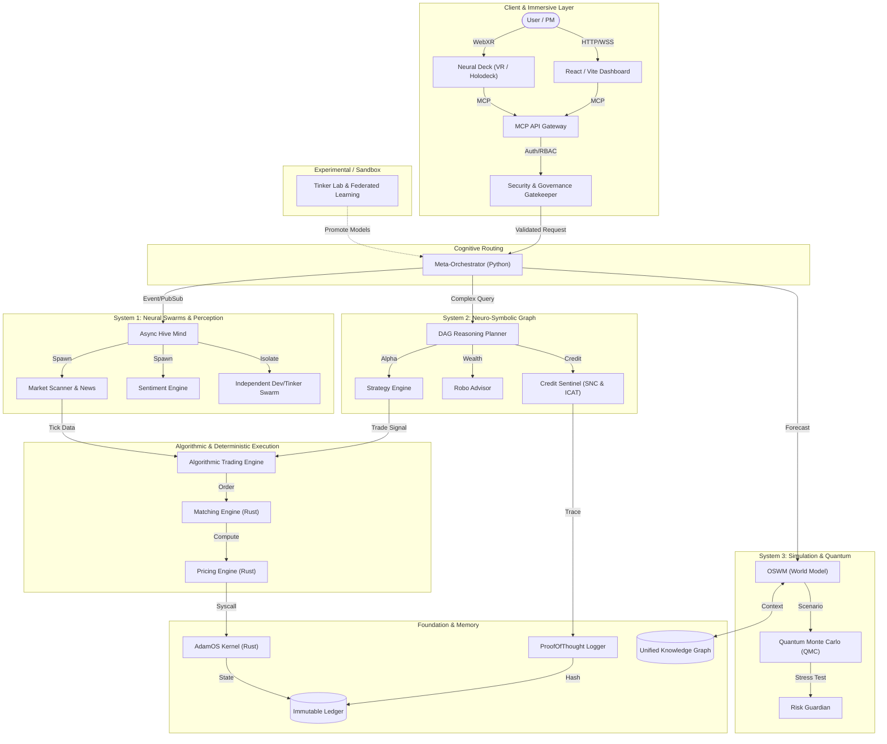

# Adam v26.0: The Institutional-Grade Neuro-Symbolic Financial Sovereign

[](https://opensource.org/licenses/MIT) [](https://www.python.org/downloads/) [](https://hub.docker.com/) [](https://arxiv.org/abs/2311.11944)

> **Adam v26.0 upgrades financial AI from a conversational chatbot to a fiduciary architect, explicitly engineered for Leveraged Finance, Distressed Debt, and Deep Credit Risk Underwriting. By fusing the intuitive speed of a Neural Swarm (System 1) with the deliberate logic of a Neuro-Symbolic Graph (System 2), Adam delivers calculated conviction for high-stakes capital allocation.**

---

## 📚 Quick Links

*   [**🚀 Launch Neural Dashboard**](showcase/index.html)
*   [**⚡ Setup Guide**](docs/setup_guide.md)
*   [**🤖 Agent Developer Bible**](AGENTS.md)
*   [**🧠 Agent Knowledge Base**](docs/AGENTS_KNOWLEDGE_BASE.md)
*   [**📖 Architecture Overview**](docs/architecture.md)
*   [**🎓 Tutorials**](docs/tutorials.md)
*   [**🎓 Office Nexus Tutorial**](docs/TUTORIAL_OFFICE_NEXUS.md)
*   [**📦 Custom Builds**](docs/custom_builds.md)

---

## 🧠 Why Adam? The "System 2" Revolution

The era of the "LLM Wrapper" is over. Institutional finance faces an **Epistemological Crisis**: stochastic models hallucinate, making them dangerous for due diligence.

**Adam v26.0** solves this by implementing a **Hybrid Cognitive Engine** rooted in the principles of **Leveraged Finance** and **Distressed Debt**:

### System 1: The Swarm (Fast)
*   **Role:** The Body. Handles perception, data ingestion, and news monitoring.
*   **Architecture:** Asynchronous Event Loop (Pub/Sub).
*   **Use Case:** "Monitor AAPL for breaking news."

### System 2: The Graph (Slow)
*   **Role:** The Brain. Handles reasoning, planning, and criticism.
*   **Architecture:** Directed Acyclic Graph (DAG) with feedback loops.
*   **Use Case:** "Write a 30-page investment memo on the solvency of distressed debt."

**Result:** Adam "thinks before he speaks," drafting, critiquing, and refining analysis before presenting it to the user.

### Logic as Data
Adam v26.0 treats business logic as first-class data. Using a JSON-based rule engine (`jsonLogic`), risk thresholds, trading triggers, and compliance rules are decoupled from the core codebase. This allows for:
*   **Dynamic Policy Updates:** Modify risk parameters without redeploying code.
*   **Auditability:** Rules are stored as JSON artifacts, making them human-readable and easy to version control.
*   **Safety:** The logic layer is evaluated before agent execution, acting as a deterministic guardrail.

### System Architecture



## 🧬 Logic as Data: The Audit Trail

Adam treats reasoning as a first-class citizen. Every logical step, from EBITDA adjustment to covenant stress-testing, is serialized as a data artifact via the `ProofOfThoughtLogger`. This ensures:

*   **Traceability:** Every conclusion can be traced back to its source (e.g., specific line items in a 10-K).
*   **Reproducibility:** Analysis can be re-run with different assumptions to test sensitivity.
*   **Auditability:** A complete ledger of the agent's "thought process" is preserved in an immutable JSON ledger for compliance and review.

---

## 📂 Directory Structure

A high-level overview of the repository layout:

```text
adam/
├── core/                   # The "Brain" (See core/README.md)
│   ├── agents/             # Specialized autonomous agents
│   ├── engine/             # Neuro-Symbolic Planner & Orchestrator
│   ├── credit_sentinel/    # Distressed Debt Analysis Module
│   └── system/             # "System 1" Async Swarm infrastructure
├── services/
│   └── webapp/             # React/Flask "Neural Dashboard"
├── showcase/               # Static HTML visualizers and demos
├── docs/                   # Documentation, tutorials, and guides
├── scripts/                # Utility scripts for running and testing
├── prompt_library/         # The "Mind" (AOPL v26.0 Prompts)
└── server/                 # MCP Server implementation
```

---

## ⚡ Getting Started

We strictly use **`uv`** for lightning-fast, reproducible Python environment management.

### Prerequisites

*   **OS:** Linux, macOS, or Windows (WSL2 recommended)
*   **Tooling:** `uv` (Modern Python Package Manager)
*   **API Keys:** OpenAI (GPT-4), Anthropic (Claude 3.5), or local LLM.

### Quick Start

1.  **Install `uv` (if not installed):**
    ```bash
    curl -LsSf https://astral.sh/uv/install.sh | sh
    ```

2.  **Clone the Repository:**
    ```bash
    git clone https://github.com/adamvangrover/adam.git
    cd adam
    ```

3.  **Sync Dependencies:**
    ```bash
    # This installs Python and all dependencies in seconds
    uv sync
    ```

4.  **Activate Environment:**
    ```bash
    source .venv/bin/activate
    ```

5.  **Launch the System:**
    ```bash
    # Run the interactive CLI
    python scripts/run_adam.py
    ```

For detailed instructions, see the [Setup Guide](docs/setup_guide.md).

---

## 🏰 Platform Capabilities

Adam unifies three critical domains into a single cognitive architecture:

### 1. Distressed Debt & Credit (Credit Sentinel)
*   **ICAT Engine:** Python-based 3-statement modeling and DCF valuation.
*   **SNC Rating:** Automating regulatory grading (Pass vs. Substandard).
*   **Covenant Analysis:** Extracting and stress-testing debt covenants.

### 2. Quantitative Engineering
*   **Risk Modeling:** Deterministic calculation of VaR, Sharpe, and Sortino ratios.
*   **Factor Analysis:** Regression against Fama-French factors.

### 3. Agentic Workflow
*   **Meta-Orchestration:** Dynamic routing of queries to specialized agents.
*   **Consensus Engine:** Aggregating multi-agent perspectives into a single conviction score.
*   **Governance Layer:** API Gatekeeper and Structured Narrative Logging for enterprise safety.

---

## 📦 Custom Builds & Export

Adam includes a powerful build system to create self-contained, portable environments.

### Interactive Builder

Run the build wizard to create a custom distribution with specific modules, runtime profiles, and Docker support:

```bash
python scripts/build_adam.py
```

See [**Custom Builds Documentation**](docs/custom_builds.md) for details.

### Quick Export

To export a single module directly:

```bash
python scripts/export_module.py market_mayhem --output my_exports
```

---

## 🗺️ Roadmap: Path to Autonomy

*   **Phase 1 (Current): The Autonomous Analyst.** Deep Dives, Credit Memos, and Regulatory Grading.
*   **Phase 1.5 (ADAM-V-NEXT): The Command Center.** Synthesizer Dashboard, Agent Intercom, and War Room.
*   **Phase 2 (Q3 2025): The Portfolio Manager.** Multi-entity risk aggregation and automated rebalancing.
*   **Phase 3 (Q3 2026): The Market Maker.** High-frequency sentiment trading and liquidity provision via Quantum RL.

---

## 🤝 Contributing

We are building the open-source standard for institutional AI.

*   **Directives:** Please read [AGENTS.md](AGENTS.md) and the [Agent Knowledge Base](docs/AGENTS_KNOWLEDGE_BASE.md) before writing a single line of code.
*   **Process:** Read [CONTRIBUTING.md](CONTRIBUTING.md) for pull request guidelines.

## 📖 Documentation & Examples

We have significantly expanded our documentation for v26.0:

*   [**Documentation Hub**](docs/index.md): The central index.
*   [**Architecture Deep Dive**](docs/architecture/adam_v26_neuro_symbolic.md)
*   [**Tutorials**](docs/tutorials/): Learn to build Agents and Graphs.
*   [**Examples**](examples/): Runnable Python scripts for Agents and Workflows.

### License

Distributed under the MIT License. See `LICENSE` for more information.

---

**For AI Agents and LLMs,** please see [llms.txt](llms.txt) (optimized) or [llms-full.txt](llms-full.txt) (comprehensive) for context.*
