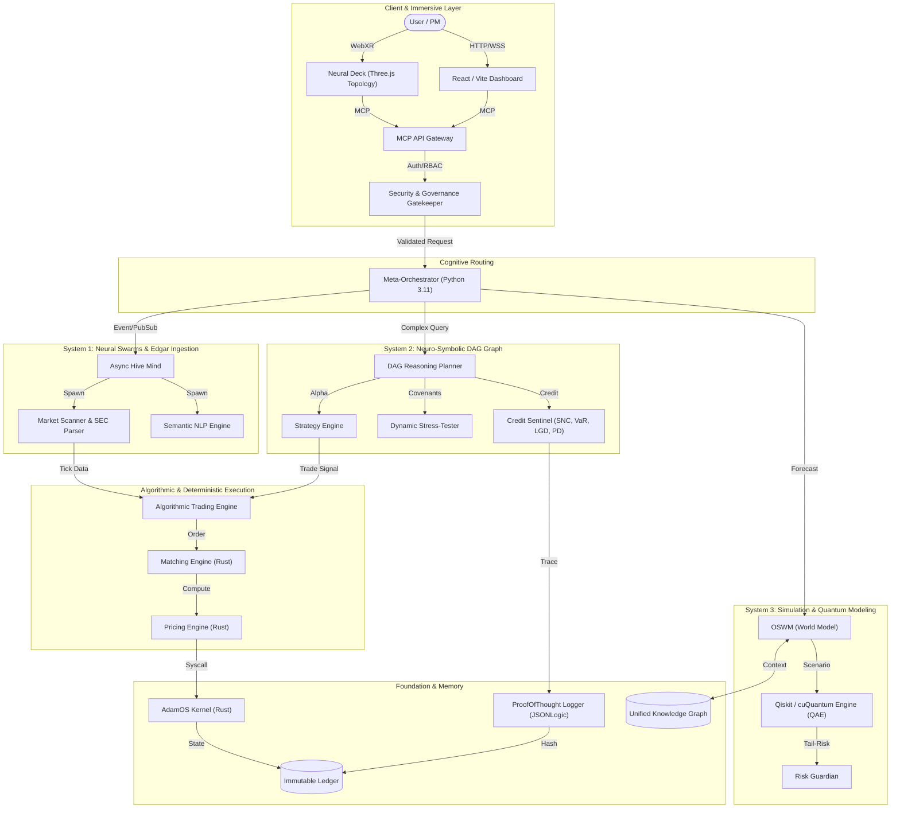

<div align="center">
  <a href="https://adamvangrover.github.io/adam/">
    <picture>
      <source media="(prefers-color-scheme: dark)" srcset=".github/images/logo-dark.svg">
      <source media="(prefers-color-scheme: light)" srcset=".github/images/logo-light.svg">
      
    </picture>
  </a>
</div>


<div align="center">
  <h3>Autonomous Deterministic Alpha Matrix : The Institutional-Grade Neuro-Symbolic Financial Sovereign.</h3>
</div>

<div align="center">
  <a href="https://opensource.org/licenses/MIT" target="_blank"></a>
  <a href="https://www.python.org/downloads/" target="_blank"></a>
  <a href="https://hub.docker.com/" target="_blank"></a>
  <a href="https://arxiv.org/abs/2311.11944" target="_blank"></a>
</div>

<br>

**Version:** 30.1 | **Focus:** Neuro-Symbolic DAG Orchestration | **Domain:** Institutional Credit Risk & Market Intelligence

ADAM is a local-first, multi-agent architecture designed to bridge the gap between stochastic language processing and deterministic financial mathematics. Built for strict privacy-by-design environments, the framework orchestrates asynchronous data pipelines to synthesize semantic market sentiment with rigorous, rules-based credit surveillance.

The core thesis of this repository is that LLM-driven semantic analysis is only actionable when strictly bounded by deterministic risk models. ADAM provides the orchestration layer to execute this at scale, ensuring all agentic workflows resolve into strictly typed, verifiable outputs. It upgrades financial AI from a conversational chatbot to a fiduciary architect, explicitly engineered for Broadly Syndicated Loans (BSL), Distressed Debt, and Deep Credit Risk Underwriting in complex verticals (TMT, Software, Healthcare).

> [!NOTE]
> Looking for the web interface? Check out the [Neural Dashboard](showcase/index.html).

## 📚 Quick Links
*   [**🚀 Launch Neural Dashboard**](showcase/index.html)
*   [**⚡ Setup Guide**](docs/setup_guide.md)
*   [**🤖 Agent Developer Bible**](AGENTS.md)
*   [**🧠 Agent Knowledge Base**](docs/AGENTS_KNOWLEDGE_BASE.md)
*   [**📖 Architecture Overview**](docs/ARCHITECTURE.md)
*   [**🎓 Tutorials**](docs/tutorials.md)
*   [**📦 Custom Builds**](docs/custom_builds.md)
*   [**🏗️ Three-Layer Architecture**](docs/LAYERS.md)

## 🧠 Why Adam? The "System 2" Revolution
The era of the "LLM Wrapper" is over. Institutional finance faces an **Epistemological Crisis**: stochastic models hallucinate, making them dangerous for due diligence. ADAM v30.1 solves this by enforcing the strict separation of reasoning and execution through a Probabilistic-to-Deterministic Integration Layer (PDIL).

### System 1: The Swarm (The Reflexes)
*   **Role:** High-velocity, unstructured data parsing and asynchronous Edgar ingestion.
*   **Focus:** Earnings call transcripts, SEC filings, ARR momentum, and baseline financial ratios.
*   **Architecture:** Asynchronous Hive Mind utilizing open-weight models to parse semantic chaos.
*   **Use Case:** "Monitor TMT sector for cash burn spikes and translate NLP-extracted corporate structural changes into semantic vectors."

### System 2: The Graph (The Deep Thinker)
*   **Role:** Downside scenario stress testing, capital structure analysis, and covenant compliance.
*   **Focus:** "Logic as Data" enforcement of underwriting policies.
*   **Architecture:** Neuro-Symbolic Planner (DAG) with hard-coded logic for PD, LGD, and VaR.
*   **Use Case:** "Route extracted parameters into strict, non-LLM pricing engines to generate a deep-dive credit memo with Base/Bull/Bear DCF scenarios."

## 🛠️ System Capabilities & Current State
This framework is built for institutional-grade utility, specifically targeting Broadly Syndicated Loans (BSL), institutional leveraged portfolios, and alpha generation within complex verticals (e.g., TMT, Software, Healthcare).

### Production-Ready Logic
*   **DAG Orchestration:** A highly composable Directed Acyclic Graph underlying the agentic workflows, ensuring reliable task execution.
*   **Asynchronous Edgar Ingestion (v30.1):** High-fidelity scraping protocols converting unstructured regulatory filings into structured semantic vectors.
*   **Deterministic Risk Modeling:** Hard-coded logic for Probability of Default (PD), Loss Given Default (LGD), and Value-at-Risk (VaR) tailored for high-yield credit structures.
*   **Privacy-by-Design Execution:** A local-first architecture ensuring zero-trust data sovereignty.

### The Research Frontier
*   **Neuro-Symbolic Routing:** Using open-weight models to parse semantic chaos and automatically route extracted parameters into strict, non-LLM pricing engines via the PDIL.
*   **Dynamic Covenant Stress-Testing:** Real-time translation of NLP-extracted corporate structural changes into immediate covenant breach simulations.

### Experimental Integrations
*   **Quantum Pricing Integration:** Active development utilizing Quantum Amplitude Estimation (QAE) and Hamiltonian-based optimization for simulating extreme market tail-risks.
*   **Agentic Market-Making:** Exploratory multi-agent harnesses for autonomous order routing.

## 🛠️ Tech Stack & Capabilities
ADAM v30.1 is an opinionated, ready-to-run financial agent out of the box.

*   **Core Execution (Deterministic):** Rust (Pricing kernels, matching engines, and heavy compute).
*   **Orchestration & Agents (Stochastic):** Python 3.11+, leveraging Pydantic for strict type-safety and OpenAPI schema generation.
*   **Governance & Rules:** JSONLogic and YAML ("Logic as Data" and "Prompt-as-Code" methodologies).
*   **Quantum Modeling (Experimental):** Qiskit and cuQuantum for tail-risk and Quantum Amplitude Estimation (QAE).
*   **Visualization:** Three.js / JavaScript for client-side topological mapping and risk surface rendering.

### What's Included:
*   **Distressed Debt & Credit** — `Credit Sentinel` for python-based 3-statement modeling, DCF valuation, SNC Rating, and dynamic covenant stress-testing.
*   **Quantitative Engineering** — Deterministic calculation of VaR, Sharpe, and Sortino ratios tailored for high-yield credit structures.
*   **Agentic Workflow** — `Meta-Orchestrator` for dynamic DAG routing, `Consensus Engine` for conviction scoring, and `Governance Layer` for API Gatekeeping.
*   **Automated Intelligence** — Built-in distribution pipelines for proprietary market intelligence (e.g., Market Mayhem, Fortress & Hunt).

## 📐 System Architecture


```mermaid
graph TD
    %% 1. Client & Immersive Layer
    subgraph Client_Layer [Client & Immersive Layer]
        UserNode(["User / PM"]) -->|HTTP/WSS| WebApp["React / Vite Dashboard"]
        UserNode -->|WebXR| VRDeck["Neural Deck (Three.js Topology)"]
        WebApp -->|MCP| MCPServer["MCP API Gateway"]
        VRDeck -->|MCP| MCPServer
        MCPServer -->|Auth/RBAC| SecModule["Security & Governance Gatekeeper"]
    end

    %% 2. Orchestration Layer
    subgraph Orchestration_Layer [Cognitive Routing]
        SecModule -->|Validated Request| MetaOrchestrator["Meta-Orchestrator (Python 3.11)"]
    end

    %% 3. System 1: Fast Perception
    subgraph System_1_Swarm [System 1: Neural Swarms & Edgar Ingestion]
        MetaOrchestrator -->|Event/PubSub| SwarmManager["Async Hive Mind"]
        SwarmManager -->|Spawn| MarketScanner["Market Scanner & SEC Parser"]
        SwarmManager -->|Spawn| SentimentEngine["Semantic NLP Engine"]
    end

    %% 4. System 2: Deep Reasoning
    subgraph System_2_Reasoning [System 2: Neuro-Symbolic DAG Graph]
        MetaOrchestrator -->|Complex Query| Planner["DAG Reasoning Planner"]
        Planner -->|Credit| CreditSentinel["Credit Sentinel (SNC, VaR, LGD, PD)"]
        Planner -->|Covenants| CovenantTester["Dynamic Stress-Tester"]
        Planner -->|Alpha| StratEngine["Strategy Engine"]
    end

    %% 5. System 3: World Modeling & Quantum
    subgraph System_3_Simulation [System 3: Simulation & Quantum Modeling]
        MetaOrchestrator -->|Forecast| WorldModel["OSWM (World Model)"]
        WorldModel -->|Scenario| QuantumEngine["Qiskit / cuQuantum Engine (QAE)"]
        QuantumEngine -->|Tail-Risk| RiskGuardian["Risk Guardian"]
    end

    %% 6. Deterministic & Execution (Rust)
    subgraph Rust_Execution_Layer [Algorithmic & Deterministic Execution]
        StratEngine -->|Trade Signal| AlgoEngine["Algorithmic Trading Engine"]
        MarketScanner -->|Tick Data| AlgoEngine
        AlgoEngine -->|Order| MatchingEngine["Matching Engine (Rust)"]
        MatchingEngine -->|Compute| PricingEngine["Pricing Engine (Rust)"]
    end

    %% 7. Foundation & OS Layer
    subgraph OS_Foundation_Layer [Foundation & Memory]
        PricingEngine -->|Syscall| AdamOS["AdamOS Kernel (Rust)"]
        CreditSentinel -->|Trace| POTLogger["ProofOfThought Logger (JSONLogic)"]
        POTLogger -->|Hash| Ledger[("Immutable Ledger")]
        AdamOS -->|State| Ledger
        WorldModel <-->|Context| KnowledgeGraph[("Unified Knowledge Graph")]
    end
```

## 🧬 Logic as Data: The Audit Trail
Adam treats reasoning as a first-class citizen. Every logical step, from EBITDA adjustment to covenant stress-testing, is serialized as a data artifact via the `ProofOfThoughtLogger`. Using JSON-based rule engines (`jsonLogic`), risk thresholds, trading triggers, and compliance rules are decoupled from the core codebase. This ensures absolute traceability, reproducibility, and a deterministic guardrail before any agent execution.

## 📂 Directory Structure

```text
adam/
├── core/                   # The "Brain" (See core/README.md)
│   ├── engine/             # Neuro-Symbolic Planner & Orchestrator
│   └── system/             # "System 1" Async Swarm infrastructure
├── adam-orchestration/     # Core DAG logic, state management, and node routing
├── adam-ingest/            # Asynchronous pipelines for SEC Edgar and macro news parsing
├── adam-semantic/          # NLP harnesses, sentiment analysis, open-weight integrations
├── adam-credit/            # Deterministic VaR, PD, LGD calculators; covenant stress-tests
├── adam-quantum/           # [Experimental] QAE and Hamiltonian models for tail-risk
├── adam-governance/        # Security Gatekeepers and JSONLogic validation schemas
├── services/
│   └── webapp/             # React/Vite "Neural Dashboard"
├── showcase/               # Static HTML visualizers and demos
├── docs/                   # Documentation, tutorials, and guides
├── scripts/                # Utility scripts for running and testing
├── publications/           # Automated intelligence distribution (Market Mayhem, Fortress & Hunt)
├── prompt_library/         # The "Mind" (Prompt-as-Code YAMLs)
└── server/                 # MCP Server implementation
```

## ⚡ Getting Started
We strictly use **`uv`** for lightning-fast, reproducible Python environment management.

### Prerequisites
*   **OS:** Linux, macOS, or Windows (WSL2 recommended)
*   **Tooling:** `uv` (Modern Python Package Manager)
*   **API Keys:** OpenAI (GPT-4), Anthropic (Claude 3.5), or local open-weight model.

### Quick Start

1.  **Install `uv` (if not installed):**
    ```bash
    curl -LsSf https://astral.sh/uv/install.sh | sh
    ```

2.  **Clone the Repository:**
    ```bash
    git clone https://github.com/adamvangrover/adam.git
    cd adam
    ```

3.  **Sync Dependencies:**
    ```bash
    uv sync
    ```

4.  **Activate Environment:**
    ```bash
    source .venv/bin/activate
    ```

5.  **Launch the System:**
    ```bash
    uv run python scripts/run_adam.py
    ```

For custom distribution modules (e.g., extracting specific automated intelligence pipelines), use our export utility:
```bash
uv run python scripts/export_module.py market_mayhem --output my_exports
```

See the [Setup Guide](docs/setup_guide.md) and [Custom Builds Documentation](docs/custom_builds.md) for detailed workflows.

## 🗺️ Roadmap: Path to Autonomy
*   **Phase 1 (Current): The Autonomous Analyst.** Deep Dives, Credit Memos, Regulatory Grading, and Edgar Ingestion.
*   **Phase 1.5 (ADAM-V-NEXT): The Command Center.** Synthesizer Dashboard, Quantum Tail-Risk Integrations, and 3D Topology Mapping.
*   **Phase 2 (Q3 2025): The Portfolio Manager.** Multi-entity risk aggregation, dynamic covenant testing, and automated rebalancing.
*   **Phase 3 (Q3 2026): The Market Maker.** High-frequency sentiment trading and liquidity provision via Quantum RL and Rust matching engines.

## 🚀 Next Wave Drivers (v30.2+)
To bridge the gap between our current state and Phase 3, development is actively prioritizing the following technical drivers:
1. **PDIL Hardening**: Migrating `src/pdil/middleware.py` Gatekeepers to Rust for zero-latency W3C PROV-O compliance checks.
2. **Agentic Market-Making Harness**: Expanding `core/agents/algo_trading_agent.py` to seamlessly output Rust-executable `TradeSignal` schemas.
3. **Quantum Amplitude Estimation (QAE)**: Stabilizing the `adam-quantum` Qiskit integration to efficiently map credit default covariance matrices into executable Ising models.
4. **Self-Healing Documentation**: Fully automating the Diátaxis documentation generation (via AST parsing in `scripts/generate_human_reports.py`) to keep pace with System 1 Swarm mutations.

## 🤝 Contributing
We are building the open-source standard for institutional AI.

*   **Directives:** Please read [AGENTS.md](AGENTS.md) and the [Agent Knowledge Base](docs/AGENTS_KNOWLEDGE_BASE.md) before writing a single line of code.
*   **Process:** Read [CONTRIBUTING.md](CONTRIBUTING.md) for pull request guidelines.

### License
Distributed under the MIT License. See `LICENSE` for more information.

---

**For AI Agents and LLMs,** please see [llms.txt](llms.txt) (optimized) or [llms-full.txt](llms-full.txt) (comprehensive) for context.
