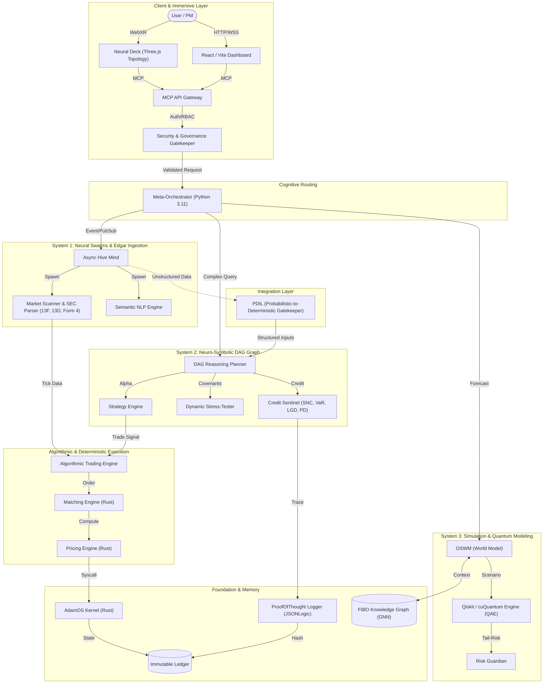
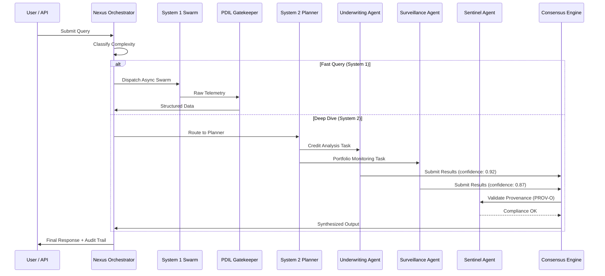

---

<div align="center">
  <a href="https://adamvangrover.github.io/adam/">
    <picture>
      <source media="(prefers-color-scheme: dark)" srcset=".github/images/logo-dark.svg">
      <source media="(prefers-color-scheme: light)" srcset=".github/images/logo-light.svg">
      
    </picture>
  </a>
</div>

<div align="center">
  <h3>Autonomous Deterministic Alpha Matrix</h3>
  <p><em>The Institutional-Grade Neuro-Symbolic Financial Sovereign</em></p>
</div>

<div align="center">
  <a href="https://opensource.org/licenses/MIT" target="_blank"></a>
  <a href="https://www.python.org/downloads/" target="_blank"></a>
  <a href="https://hub.docker.com/" target="_blank"></a>
  <a href="https://arxiv.org/abs/2311.11944" target="_blank"></a>
  <a href="AGENTS.md"></a>
  <a href="docs/setup_guide.md"></a>
</div>

<br>

**Version:** 30.1 &nbsp;|&nbsp; **Focus:** Neuro-Symbolic DAG Orchestration &nbsp;|&nbsp; **Domain:** Institutional Credit Risk & Market Intelligence

---

## Table of Contents

- [Overview](#overview)
- [Why ADAM?](#-why-adam-the-system-2-revolution)
- [Quick Links](#-quick-links)
- [Architecture](#-system-architecture)
- [Agent Communication Flow](#-agent-communication-flow)
- [Ecosystem & Capabilities](#-comprehensive-ecosystem--capabilities)
- [Credit Risk Pipeline](#%EF%B8%8F-step-by-step-credit-risk-automation)
- [Tech Stack](#%EF%B8%8F-tech-stack)
- [Getting Started](#-getting-started)
- [Performance & Benchmarks](#-performance--benchmarks)
- [Modular Execution](#-modular-execution--ecosystem-discoverability)
- [Directory Structure](#-directory-structure)
- [Human Oversight & Governance](#-human-oversight--governance)
- [Known Issues](#-known-issues--current-work)
- [Roadmap](#%EF%B8%8F-roadmap-path-to-autonomy)
- [Contributing](#-contributing)
- [Glossary](#-glossary)
- [FAQ](#-frequently-asked-questions)
- [For AI Agents & LLMs](#-for-ai-agents--llms)

---

## Overview

ADAM is a **local-first, multi-agent architecture** designed to bridge the gap between stochastic language processing and deterministic financial mathematics. Built for strict privacy-by-design environments, the framework orchestrates asynchronous data pipelines to synthesize semantic market sentiment with rigorous, rules-based credit surveillance.

**The core thesis:** LLM-driven semantic analysis is only actionable when strictly bounded by deterministic risk models. ADAM provides the orchestration layer to execute this at scale, ensuring all agentic workflows resolve into strictly typed, verifiable outputs. It upgrades financial AI from a conversational chatbot to a **fiduciary architect**, explicitly engineered for:

- **Broadly Syndicated Loans (BSL)** and **CLO** structuring
- **Distressed Debt** triage and recovery analysis
- **Deep Credit Risk Underwriting** across complex verticals (TMT, Software, Healthcare)

> [!NOTE]
> Looking for the web interface? Launch the [Neural Dashboard](showcase/index.html) or explore the [Interactive Portal](index.html).

---

## 📚 Quick Links

| Resource | Description |
|:---------|:------------|
| [🚀 Neural Dashboard](showcase/index.html) | Interactive visualization and analytics hub |
| [🖥️ System Portal](index.html) | Unified command center and module navigator |
| [⚡ Setup Guide](docs/setup_guide.md) | Installation and environment configuration |
| [🤖 Agent Developer Bible](AGENTS.md) | Agent creation standards and protocols (v30.1) |
| [🧠 Agent Knowledge Base](docs/AGENTS_KNOWLEDGE_BASE.md) | Accumulated agent learnings and traps |
| [📖 Architecture Overview](docs/ARCHITECTURE_PLAN.md) | System design deep dive |
| [🎓 Tutorials](docs/tutorials.md) | Step-by-step walkthroughs |
| [📦 Custom Builds](docs/custom_builds.md) | Modular deployment configurations |
| [🏗️ Three-Layer Architecture](docs/LAYERS.md) | Execution layer breakdown |
| [🔒 Security Policy](SECURITY.md) | Vulnerability reporting and security model |
| [📋 Changelog](CHANGELOG.md) | Version history and release notes |
| [🗂️ Agent Catalog](AGENT_CATALOG.md) | Complete registry of all agents |

---

## 🧠 Why ADAM? The "System 2" Revolution

The era of the "LLM Wrapper" is over. Institutional finance faces an **Epistemological Crisis**: stochastic models hallucinate, making them dangerous for due diligence. ADAM v30.1 solves this by enforcing the strict separation of reasoning and execution through a **Probabilistic-to-Deterministic Integration Layer (PDIL)**.

### ⚡ System 1: The Swarm (The Reflexes)

| Attribute | Detail |
|:----------|:-------|
| **Role** | High-velocity, unstructured data parsing and asynchronous surveillance |
| **Focus** | Continuous extraction from 13F, 13D, and Form 4 SEC EDGAR filings |
| **Architecture** | Asynchronous Hive Mind (Pub/Sub event loop) using open-weight models |
| **Base Class** | `AsyncAgentBase` |
| **Example** | "Monitor TMT sector for cash burn spikes and translate NLP-extracted corporate structural changes into semantic vectors." |

### 🧠 System 2: The Graph (The Deep Thinker)

| Attribute | Detail |
|:----------|:-------|
| **Role** | Downside scenario stress testing, capital structure analysis, covenant compliance |
| **Focus** | "Logic as Data" enforcement via Graph Neural Network (GNN) |
| **Architecture** | Neuro-Symbolic Planner integrated with FIBO ontology |
| **Base Class** | `TemplateAgentV30` |
| **Example** | "Route extracted parameters into strict, non-LLM pricing engines to generate a deep-dive credit memo with Base/Bull/Bear DCF scenarios." |

---

## 📐 System Architecture


```mermaid
graph TD
    %% 1. Client & Immersive Layer
    subgraph Client_Layer ["Client & Immersive Layer"]
        UserNode(["User / PM"]) -->|HTTP/WSS| WebApp["React / Vite Dashboard"]
        UserNode -->|WebXR| VRDeck["Neural Deck (Three.js Topology)"]
        WebApp -->|MCP| MCPServer["MCP API Gateway"]
        VRDeck -->|MCP| MCPServer
        MCPServer -->|Auth/RBAC| SecModule["Security & Governance Gatekeeper"]
    end

    %% 2. Orchestration Layer
    subgraph Orchestration_Layer ["Cognitive Routing"]
        SecModule -->|Validated Request| MetaOrchestrator["Meta-Orchestrator (Python 3.11)"]
    end

    %% 3. System 1: Fast Perception
    subgraph System_1_Swarm ["System 1: Neural Swarms & Edgar Ingestion"]
        MetaOrchestrator -->|Event/PubSub| SwarmManager["Async Hive Mind"]
        SwarmManager -->|Spawn| MarketScanner["Market Scanner & SEC Parser (13F, 13D, Form 4)"]
        SwarmManager -->|Spawn| SentimentEngine["Semantic NLP Engine"]
    end

    %% 3.5. Governance & Integration
    subgraph Integration_Layer ["Integration Layer"]
        SwarmManager -.->|Unstructured Data| PDIL["PDIL (Probabilistic-to-Deterministic Gatekeeper)"]
    end

    %% 4. System 2: Deep Reasoning
    subgraph System_2_Reasoning ["System 2: Neuro-Symbolic DAG Graph"]
        PDIL -->|Structured Inputs| Planner
        MetaOrchestrator -->|Complex Query| Planner["DAG Reasoning Planner"]
        Planner -->|Credit| CreditSentinel["Credit Sentinel (SNC, VaR, LGD, PD)"]
        Planner -->|Covenants| CovenantTester["Dynamic Stress-Tester"]
        Planner -->|Alpha| StratEngine["Strategy Engine"]
    end

    %% 5. System 3: World Modeling & Quantum
    subgraph System_3_Simulation ["System 3: Simulation & Quantum Modeling"]
        MetaOrchestrator -->|Forecast| WorldModel["OSWM (World Model)"]
        WorldModel -->|Scenario| QuantumEngine["Qiskit / cuQuantum Engine (QAE)"]
        QuantumEngine -->|Tail-Risk| RiskGuardian["Risk Guardian"]
    end

    %% 6. Deterministic & Execution (Rust)
    subgraph Rust_Execution_Layer ["Algorithmic & Deterministic Execution"]
        StratEngine -->|Trade Signal| AlgoEngine["Algorithmic Trading Engine"]
        MarketScanner -->|Tick Data| AlgoEngine
        AlgoEngine -->|Order| MatchingEngine["Matching Engine (Rust)"]
        MatchingEngine -->|Compute| PricingEngine["Pricing Engine (Rust)"]
    end

    %% 7. Foundation & OS Layer
    subgraph OS_Foundation_Layer ["Foundation & Memory"]
        PricingEngine -->|Syscall| AdamOS["AdamOS Kernel (Rust)"]
        CreditSentinel -->|Trace| POTLogger["ProofOfThought Logger (JSONLogic)"]
        POTLogger -->|Hash| Ledger[("Immutable Ledger")]
        AdamOS -->|State| Ledger
        WorldModel <-->|Context| KnowledgeGraph[("FIBO Knowledge Graph (GNN)")]
    end
```

---

## 🔄 Agent Communication Flow

All inter-agent communication follows strict deterministic protocols to prevent circular dependencies and maintain institutional-grade auditability.


```mermaid
sequenceDiagram
    participant U as User / API
    participant N as Nexus Orchestrator
    participant S1 as System 1 Swarm
    participant PDIL as PDIL Gatekeeper
    participant S2 as System 2 Planner
    participant UW as Underwriting Agent
    participant SV as Surveillance Agent
    participant SE as Sentinel Agent
    participant CE as Consensus Engine

    U->>N: Submit Query
    N->>N: Classify Complexity

    alt Fast Query (System 1)
        N->>S1: Dispatch Async Swarm
        S1->>PDIL: Raw Telemetry
        PDIL->>N: Structured Data
    else Deep Dive (System 2)
        N->>S2: Route to Planner
        S2->>UW: Credit Analysis Task
        S2->>SV: Portfolio Monitoring Task
        UW->>CE: Submit Results (confidence: 0.92)
        SV->>CE: Submit Results (confidence: 0.87)
        CE->>SE: Validate Provenance (PROV-O)
        SE-->>CE: Compliance OK
        CE->>N: Synthesized Output
    end

    N->>U: Final Response + Audit Trail
```

> [!IMPORTANT]
> Agents must **never** instantiate other agents directly. Cross-domain requests must be routed through the Nexus Orchestrator via output metadata: `metadata={"next_step": "invoke_surveillance", "query": "verify_covenant_compliance"}`.

---

## 🌐 Comprehensive Ecosystem & Capabilities

### 🤖 Specialized Agents (`core/agents/`)

| Domain | Agents |
|:-------|:-------|
| **Risk & Credit** | `CreditRiskAgent`, `SNCAnalystAgent`, `CovenantAgent`, `LiquidityRiskAgent` |
| **Quantitative & Market** | `AlgoTradingAgent`, `OptionsFlowAgent`, `QuantumPortfolioManagerAgent`, `MarketMakingAgent` |
| **Macro & Alt Data** | `BlackSwanAgent`, `MacroeconomicAnalysisAgent`, `GeopoliticalRiskAgent`, `AlternativeDataAgent` |
| **Governance & Security** | `RedTeamAgent`, `ComplianceAgent`, `DataVerificationAgent`, `FraudDetectionAgent` |

> See [AGENT_CATALOG.md](AGENT_CATALOG.md) for the complete agent registry with state schemas and procedural rules.

### 🧰 Core Engines & Components (`core/`)

- **Model Context Protocol (MCP):** Universal MCP socket with dynamic tool registries and schema validation.
- **Standalone Credit & Sensitivity Engine:** A fully portable HTML engine for instantaneous credit risk and sensitivity calculations offline — no Python/Rust backend required.
- **Quantitative Pricing:** Rust-backed pricing and matching engines for high-frequency determinism.

### 🔬 Gold Standard Evaluation Harness (`evals/`)

Strict deterministic testing for:
- W3C PROV-O provenance compliance
- Authorization boundary enforcement
- RAG pipeline accuracy
- Adversarial red-teaming

---

## ⚙️ Step-by-Step Credit Risk Automation

To ensure absolute auditability, the LLM credit risk automation process executes in a strict, sequential pipeline:

```
┌─────────────────┐    ┌──────────────────────┐    ┌─────────────────────┐
│  1. INGESTION   │───▶│  2. SEMANTIC-TO-DET.  │───▶│  3. GRAPH TRAVERSAL │
│  System 1 parses│    │  PDIL maps sentiment  │    │  GNN queries FIBO   │
│  13F, 13D, 10-K │    │  into JSON schemas    │    │  for counterparty   │
│  filings        │    │                       │    │  risk exposure       │
└─────────────────┘    └──────────────────────┘    └─────────────────────┘
                                                            │
┌─────────────────┐    ┌──────────────────────┐             │
│  5. OUTPUT      │◀───│  4. MATH EXECUTION   │◀────────────┘
│  Credit memo +  │    │  Rust engines compute │
│  JSONLogic proof│    │  PD, LGD, VaR from   │
│  of thought     │    │  validated schemas    │
└─────────────────┘    └──────────────────────┘
```

1. **Ingestion & Parsing:** System 1 ingests 13F, 13D, and earnings transcripts, sanitizing text to extract hard numerical metrics.
2. **Semantic to Deterministic Mapping:** The PDIL routes raw sentiment and qualitative flags into predefined JSON schemas.
3. **Knowledge Graph Traversal:** The GNN queries the FIBO ontology to identify counterparty risk exposure among target companies.
4. **Mathematical Execution:** Rust engines compute PD, LGD, and VaR based *only* on the validated schemas.
5. **Output Generation:** The system synthesizes the final credit memo or regulatory rating, appending a complete JSONLogic proof-of-thought trail.

---

## 🛠️ Tech Stack

| Layer | Technology | Purpose |
|:------|:-----------|:--------|
| **Deterministic Execution** | Rust | Pricing kernels, matching engines, PDIL gatekeeper |
| **Orchestration & Agents** | Python 3.11+ / Pydantic | Async agent swarm, DAG planner, type-safe I/O |
| **Governance & Rules** | JSONLogic / YAML | "Logic as Data" — covenants, thresholds, business rules |
| **Frontend & Visualization** | HTML / React / Three.js | Neural Dashboard, interactive prototypes, portable risk modules |
| **Knowledge Representation** | GNN / FIBO Ontology | Financial entity relationships, counterparty mapping |
| **Memory & Search** | Qdrant / Vector DB | JIT semantic search over filings and historical data |
| **Package Management** | `uv` (Rust-based) | Lightning-fast, reproducible Python environments |
| **Containerization** | Docker / Docker Compose | Multi-service deployment (agents, infra, webapp) |

---

## ⚡ Getting Started

We strictly use **`uv`** for lightning-fast, reproducible Python environment management.

### Prerequisites

| Requirement | Details |
|:------------|:--------|
| **OS** | Linux, macOS, or Windows (WSL2 recommended) |
| **Tooling** | [`uv`](https://astral.sh/uv) (Modern Python Package Manager) |
| **Python** | 3.11+ |
| **API Keys** | OpenAI (GPT-4), Anthropic (Claude), or local open-weight model |
| **Optional** | Docker (for containerized deployment), Rust (for pricing kernels) |

### Quick Start

```bash
# 1. Install uv (if not installed)
curl -LsSf https://astral.sh/uv/install.sh | sh

# 2. Clone the Repository
git clone https://github.com/adamvangrover/adam.git
cd adam

# 3. Sync Dependencies
uv sync

# 4. Activate Environment
source .venv/bin/activate

# 5. Launch the System
uv run python scripts/run_adam.py
```

### Docker Deployment

```bash
# Full stack with agents, infrastructure, and webapp
docker compose -f docker-compose.yml \
               -f docker-compose.agents.yml \
               -f docker-compose.infra.yml up -d
```

### Standalone Usage (No Backend Required)

Open `showcase/index.html` in any browser for the offline credit sensitivity engine — no Python or Rust needed.

---

## 📊 Performance & Benchmarks

| Metric | Result | Method |
|:-------|:-------|:-------|
| **FinanceBench Accuracy** | **99%** | Deterministic calculation verification (no LLM arithmetic) |
| **Pricing Engine Latency** | **<5ms** | Rust-backed VaR, DCF, Monte Carlo — fully releases Python GIL |
| **10-K Ingestion** | **<12 seconds** | Full SEC filing → FIBO ontology mapping → vector store update |
| **Deterministic Drift** | **0%** | Covenant stress tests via `jsonLogic`, isolated from stochastic models |

---

## 🧩 Modular Execution & Ecosystem Discoverability

ADAM is massive, but you don't need to run the entire sovereign agent network. The repository is organized by **"Brands"** and standalone modules.

### Branded Applications

| Project | Description | Location |
|:--------|:------------|:---------|
| **Market Mayhem** | Containerized economic simulation dashboard: tail risks, contagion, macro shocks | `publications/market_mayhem` |
| **Project Fortress** | Automated credit risk underwriter tuned for BSL and CLOs | `core/credit_sentinel/` |
| **Project Hunt** | Multi-asset alpha generation: 13F/13D scanning for deep-value catalyst detection | `core/agents/` |

### Standalone Components

- **Credit Sensitivity Engine:** Open [`showcase/index.html`](showcase/index.html) — pure HTML/JS credit model, zero backend dependencies
- **Prompt-as-Code Library:** Extract any YAML/JSON from [`prompt_library/`](prompt_library/) to port ADAM's reasoning structures into LangChain, AutoGen, or CrewAI workflows

---

## 📂 Directory Structure

```text
adam/
├── core/                       # The "Brain" — Orchestrators, MCP, Rust execution
│   ├── agents/                 #   Specialized agent implementations
│   ├── credit_sentinel/        #   Distressed debt analysis (ICAT, covenants)
│   ├── engine/                 #   Planner, Orchestrator, Consensus Engine
│   └── system/                 #   Swarm infrastructure, memory, context
├── adam_os/                    # OS-level abstractions and kernel
├── adam_swarm/                 # Async swarm protocols and hive mind
├── adam_finance/               # Financial domain models and calculators
├── adam_governance/            # Security gatekeepers and JSONLogic schemas
├── adam_graph/                 # Knowledge graph and GNN interfaces
├── services/
│   └── webapp/                 #   Multi-brand portal architecture
├── showcase/                   # 500+ static HTML visualizers, demos, reports
│   ├── Daily_Briefing_*.html   #     100+ daily market intelligence reports
│   ├── Market_Pulse_*.html     #     70+ weekly market pulse analyses
│   ├── House_View_*.html       #     Monthly house view publications
│   └── Market_Mayhem_*.html    #     Market stress event analyses
├── frontend/                   # React/Vite frontend source
├── backend/                    # API server implementation
├── server/                     # MCP Server implementation
├── mcp/                        # Model Context Protocol configs
├── docs/                       # 100+ documentation files and guides
├── evals/                      # Gold standard evaluation harness
├── prompt_library/             # The "Mind" — Prompt-as-Code YAMLs (AOPL v2.0)
├── scripts/                    # Utility scripts for running and testing
├── rust_ext/                   # Rust pricing kernels and matching engine
├── schemas/                    # Pydantic models, JSON schemas, API specs
├── experimental/               # Lab — bleeding-edge prototypes (Path B)
├── research/                   # Research papers and explorations
├── tinker_lab/                 # Experimental agent sandbox
├── kubernetes/                 # K8s deployment manifests
├── config/                     # Environment configs and feature flags
├── data/                       # Sample datasets and fixtures
├── tests/                      # Test suites
├── AGENTS.md                   # Agent Developer Bible (v30.1)
├── AGENT_CATALOG.md            # Complete agent registry
├── llms.txt                    # LLM-optimized project context
└── machine_index.json          # Machine-readable module manifest
```

---

## 🛡️ Human Oversight & Governance

> [!IMPORTANT]
> While ADAM automates execution, **human domain experts remain indispensable** as architects, arbiters, and legal guardians of the system.

ADAM distinguishes between **operational execution** (automated) and **governance** (human-supervised):

### Where Humans Are Essential

| Function | Why It Can't Be Fully Automated |
|:---------|:-------------------------------|
| **Rule Definition** | Humans define what constitutes a "Bear scenario," acceptable covenant thresholds, and risk tolerance parameters |
| **Black Swan Override** | Novel macro events (pandemics, geopolitical shocks) require human judgment outside the system's training data |
| **Regulatory Accountability** | G-SIB regulators require a human fiduciary — "the agent swarm decided" is not a legal defense |
| **System Drift Detection** | Humans must continuously sample outputs to detect model degradation and feedback loops |
| **Ethical Guardrails** | Lending decisions, credit ratings, and portfolio allocations carry fiduciary and ethical weight |

### Governance Architecture

- **Break Glass Protocol:** Emergency overrides via HMAC-SHA256 signed `X-Governance-Override` headers
- **PROV-O Telemetry:** All decisions generate W3C-compliant audit trails with reasoning traces
- **Conviction Thresholds:** Minimum 0.85 confidence score required; below-threshold outputs flagged for human review
- **Sentinel Agent:** Continuous compliance monitoring; terminates agents lacking provenance headers

---

## 🚧 Known Issues & Current Work

> This is a bleeding-edge framework at the intersection of quantitative finance and artificial intelligence.

| Issue | Status | Detail |
|:------|:-------|:-------|
| **DAG Queue Bottlenecks** | 🔧 Active | System 2 experiences congestion at >50 concurrent underwriter agents. Profiling Temporal workers. |
| **PDIL Migration** | 🔧 Active | Moving from Python JSON Schema validation to Rust (`src/pdil/gatekeeper.rs`) for zero-latency PROV-O checks. |
| **Qiskit Dependencies** | ⚠️ Mocked | `adam-quantum` modules require CUDA drivers (`cuQuantum`) — currently mocked in CI/CD. |

---

## 🛣️ Roadmap: Path to Autonomy

```
Phase 1 (Current)     Phase 1.5 (V-NEXT)    Phase 2 (Q3 2026)     Phase 3 (Q4 2026)
━━━━━━━━━━━━━━━━━    ━━━━━━━━━━━━━━━━━━    ━━━━━━━━━━━━━━━━━    ━━━━━━━━━━━━━━━━━
The Autonomous        The Command Center     The Portfolio         The Market Maker
Analyst                                      Manager
                                                                   
• Deep Dives          • Synthesizer UI       • Multi-entity risk   • HF sentiment
• Credit Memos        • Quantum Tail-Risk    • Dynamic covenants     trading
• Regulatory Rating   • 3D Topology Maps     • Auto rebalancing    • Quantum RL
• Edgar Ingestion     • Live Dashboards      • CLO structuring     • Rust matching
```

### Improvement Focus Areas

1. **Agentic Market-Making Harness:** Expanding `core/agents/algo_trading_agent.py` to output Rust-executable `TradeSignal` schemas directly into the matching engine.
2. **Self-Healing Documentation:** Automating Diátaxis documentation generation via AST parsing.
3. **Dynamic Preference Optimization (DPO):** Human-in-the-loop overrides on credit ratings automatically fine-tune local open-weight models.

---

## 🤝 Contributing

We are building the open-source standard for institutional AI.

| Step | Resource |
|:-----|:---------|
| **1. Read the rules** | [AGENTS.md](AGENTS.md) — Agent Developer Bible |
| **2. Study the knowledge base** | [Agent Knowledge Base](docs/AGENTS_KNOWLEDGE_BASE.md) — accumulated traps and learnings |
| **3. Follow the process** | [CONTRIBUTING.md](CONTRIBUTING.md) — PR guidelines |
| **4. Understand governance** | [Code of Conduct](CODE_OF_CONDUCT.md) |

### Architecture Guidelines (v30.1)

- **Front-End Isolation:** Never import UI libraries (`streamlit`, `react`) inside `core/` or `adam_*/` execution modules. All rendering must stay in `services/` or `showcase/`.
- **Agent Standards:** All contributions must adhere to the schemas in `AGENTS.md` and governance rules in `llms.txt`.
- **Strict I/O Boundaries:** Use Pydantic `AgentInput` / `AgentOutput` models for all agent interfaces.

---

## 📖 Glossary

| Term | Definition |
|:-----|:-----------|
| **AFOS** | Adam Financial Operating System — the full platform name |
| **BSL** | Broadly Syndicated Loans — large loans originated by banks and syndicated to institutional investors |
| **CLO** | Collateralized Loan Obligation — structured finance product packaging leveraged loans |
| **DCF** | Discounted Cash Flow — valuation method projecting future cash flows |
| **DPO** | Dynamic Preference Optimization — reinforcement learning from human feedback |
| **EV** | Enterprise Value — total company valuation metric |
| **FIBO** | Financial Industry Business Ontology — standardized financial data model |
| **FCCR** | Fixed Charge Coverage Ratio — ability to cover fixed obligations |
| **GNN** | Graph Neural Network — neural network operating on graph-structured data |
| **G-SIB** | Global Systemically Important Bank — banks subject to heightened regulation |
| **HDKG** | HyperDimensional Knowledge Graph — ADAM's primary structured output |
| **HITL** | Human-in-the-Loop — process incorporating human oversight |
| **LGD** | Loss Given Default — percentage of exposure lost if a borrower defaults |
| **MCP** | Model Context Protocol — universal tool-calling interface for AI agents |
| **PD** | Probability of Default — likelihood of a borrower defaulting |
| **PDIL** | Probabilistic-to-Deterministic Integration Layer — gateway enforcing deterministic output |
| **PROV-O** | W3C Provenance Ontology — standard for recording data lineage |
| **QAE** | Quantum Amplitude Estimation — quantum computing technique for risk |
| **SNC** | Shared National Credit — U.S. regulatory review program for large syndicated loans |
| **TMT** | Technology, Media, and Telecommunications — industry vertical |
| **VaR** | Value at Risk — statistical measure of potential portfolio loss |

---

## ❓ Frequently Asked Questions

<details>
<summary><strong>Can I run ADAM without API keys?</strong></summary>

Yes. The standalone credit sensitivity engine (`showcase/index.html`) runs entirely in the browser. For the full agent system, you can use local open-weight models (e.g., Mistral, LLaMA) instead of OpenAI/Anthropic APIs. Configure your model endpoint in `config/`.
</details>

<details>
<summary><strong>What's the difference between System 1 and System 2?</strong></summary>

**System 1** is fast and asynchronous — it handles data ingestion, news monitoring, and sentiment scoring in real-time. **System 2** is slow and deliberate — it performs deep credit analysis, builds execution graphs, and generates auditable reports. This mirrors Kahneman's dual-process theory.
</details>

<details>
<summary><strong>How does ADAM prevent LLM hallucinations?</strong></summary>

Through the **PDIL (Probabilistic-to-Deterministic Integration Layer)**. LLMs are used *only* for semantic understanding and natural language tasks. All mathematical computations (VaR, DCF, PD) are executed by deterministic Rust engines. The LLM never performs arithmetic.
</details>

<details>
<summary><strong>Can I use individual modules without the full system?</strong></summary>

Absolutely. ADAM is designed for modular use. You can extract prompt templates from `prompt_library/`, use the standalone credit engine, or deploy individual agents. See the [Modular Execution](#-modular-execution--ecosystem-discoverability) section.
</details>

<details>
<summary><strong>What data sources does ADAM ingest?</strong></summary>

SEC EDGAR filings (13F, 13D, Form 4, 10-K, 10-Q), earnings call transcripts, market tick data, news feeds, and alternative data sources. The ingestion engine supports in-memory JSON (10MB), persistent databases (1GB), and distributed corpora (100GB+) via Qdrant vector search.
</details>

<details>
<summary><strong>Is ADAM production-ready?</strong></summary>

ADAM is actively used for analysis and research. The core credit engine and evaluation harness are production-stable (Path A). Experimental modules (quantum, advanced swarm protocols) are in the Lab (Path B) and should not be used in production workflows.
</details>

---

## 🤖 For AI Agents & LLMs

**Machine-readable context is available at:**

| File | Purpose |
|:-----|:--------|
| [`llms.txt`](llms.txt) | Optimized project context for LLM consumption |
| [`llms-full.txt`](llms-full.txt) | Comprehensive context with full architecture details |
| [`LLM_README.md`](LLM_README.md) | System prompt extension for agents |
| [`machine_index.json`](machine_index.json) | Structured module manifest (JSON) |
| [`AGENTS.md`](AGENTS.md) | Agent creation standards and state schemas |
| [`AGENT_CATALOG.md`](AGENT_CATALOG.md) | Complete agent registry with roles and tools |

---

## License

Distributed under the **MIT License**. See [`LICENSE`](LICENSE) for more information.

---


---

<div align="center">
  <sub>Built with 🧠 by the ADAM Team — Autonomous Deterministic Alpha Matrix</sub>
  <br>
  <sub>v30.1 · Neuro-Symbolic DAG Orchestration · Institutional Credit Risk & Market Intelligence</sub>
</div>
