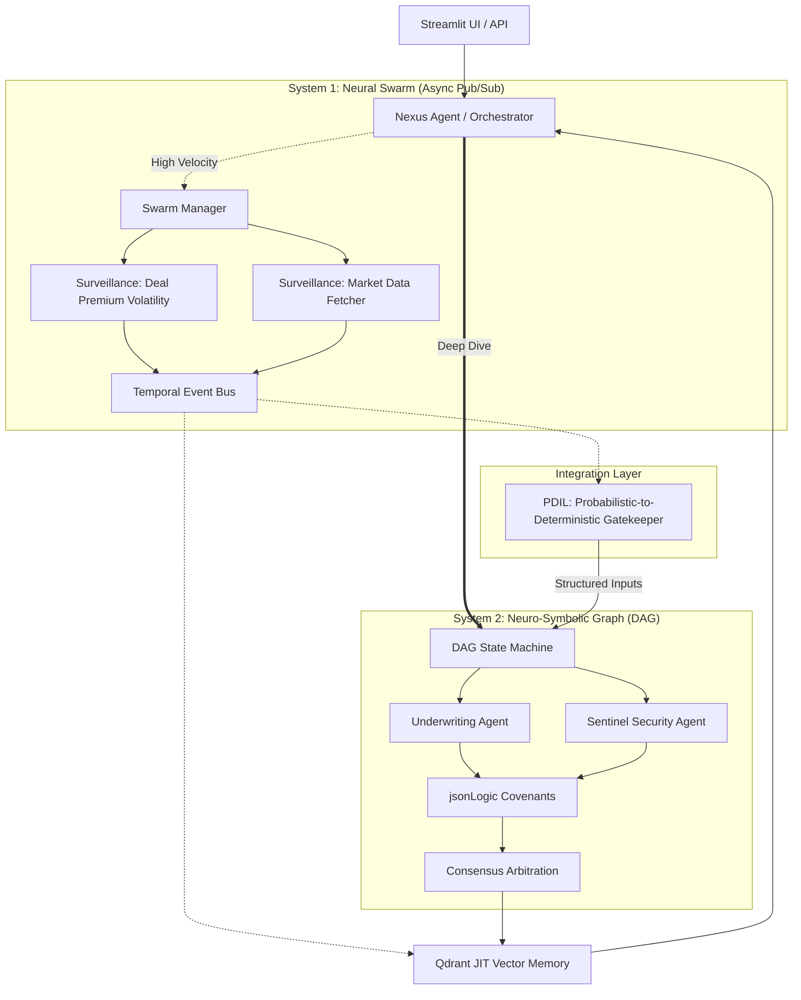
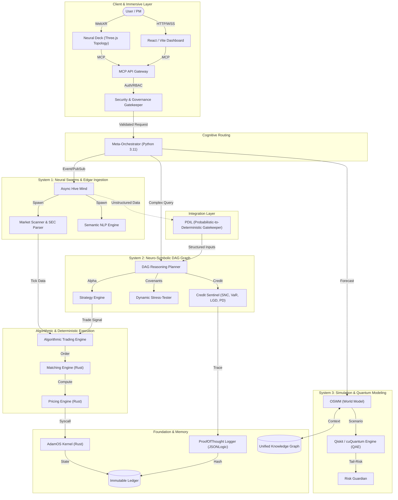

<div align="center">
  <a href="https://adamvangrover.github.io/adam/">
    <picture>
      <source media="(prefers-color-scheme: dark)" srcset=".github/images/logo-dark.svg">
      <source media="(prefers-color-scheme: light)" srcset=".github/images/logo-light.svg">
      
    </picture>
  </a>
</div>

<div align="center">
  <h3>Autonomous Deterministic Alpha Matrix : The Institutional-Grade Neuro-Symbolic Financial Sovereign.</h3>
</div>

<div align="center">
  <a href="https://opensource.org/licenses/MIT" target="_blank"></a>
  <a href="https://www.python.org/downloads/" target="_blank"></a>
  <a href="https://hub.docker.com/" target="_blank"></a>
  <a href="https://arxiv.org/abs/2311.11944" target="_blank"></a>
</div>

<br>

**Version:** 30.1 | **Focus:** Neuro-Symbolic DAG Orchestration | **Domain:** Institutional Credit Risk & Market Intelligence

ADAM is a local-first, multi-agent architecture designed to bridge the gap between stochastic language processing and deterministic financial mathematics. Built for strict privacy-by-design environments, the framework orchestrates asynchronous data pipelines to synthesize semantic market sentiment with rigorous, rules-based credit surveillance.

The core thesis of this repository is that LLM-driven semantic analysis is only actionable when strictly bounded by deterministic risk models. ADAM provides the orchestration layer to execute this at scale, ensuring all agentic workflows resolve into strictly typed, verifiable outputs. It upgrades financial AI from a conversational chatbot to a fiduciary architect, explicitly engineered for Broadly Syndicated Loans (BSL), Distressed Debt, and Deep Credit Risk Underwriting in complex verticals (TMT, Software, Healthcare).

> [!NOTE]
> Looking for the web interface? Check out the [Neural Dashboard](showcase/index.html).

## 📚 Quick Links
*   [**🚀 Launch Neural Dashboard**](showcase/index.html)
*   [**⚡ Setup Guide**](docs/setup_guide.md)
*   [**🤖 Agent Developer Bible**](AGENTS.md)
*   [**🧠 Agent Knowledge Base**](docs/AGENTS_KNOWLEDGE_BASE.md)
*   [**📖 Architecture Overview**](docs/ARCHITECTURE.md)
*   [**🎓 Tutorials**](docs/tutorials.md)
*   [**📦 Custom Builds**](docs/custom_builds.md)
*   [**🏗️ Three-Layer Architecture**](docs/LAYERS.md)

## 🧠 Why Adam? The "System 2" Revolution
The era of the "LLM Wrapper" is over. Institutional finance faces an **Epistemological Crisis**: stochastic models hallucinate, making them dangerous for due diligence. ADAM v30.1 solves this by enforcing the strict separation of reasoning and execution through a Probabilistic-to-Deterministic Integration Layer (PDIL).

### System 1: The Swarm (The Reflexes)
*   **Role:** High-velocity, unstructured data parsing and asynchronous surveillance.
*   **Focus:** Continuous data extraction from 13F, 13D, and Form 4 SEC EDGAR filings to synthesize catalysts and measure signal accuracy.
*   **Architecture:** Asynchronous Hive Mind utilizing open-weight models to parse semantic chaos.
*   **Use Case:** "Monitor TMT sector for cash burn spikes and translate NLP-extracted corporate structural changes into semantic vectors."

### System 2: The Graph (The Deep Thinker)
*   **Role:** Downside scenario stress testing, capital structure analysis, and covenant compliance.
*   **Focus:** "Logic as Data" enforcement of underwriting policies utilizing a Graph Neural Network (GNN).
*   **Architecture:** Neuro-Symbolic Planner integrated with the Financial Industry Business Ontology (FIBO). The GNN is specifically optimized to construct high-density Knowledge Graphs evaluating ten core target companies to assign accurate and timely risk ratings.
*   **Use Case:** "Route extracted parameters into strict, non-LLM pricing engines to generate a deep-dive credit memo with Base/Bull/Bear DCF scenarios."

## 🌐 Comprehensive Ecosystem & Capabilities
ADAM is composed of a massive, modular array of specialized agents, kernels, and evaluation harnesses designed for every facet of institutional finance.

### 🤖 Specialized Agents (`core/agents/`)
*   **Risk & Credit:** `CreditRiskAgent`, `SNCAnalystAgent`, `CovenantAgent`, `LiquidityRiskAgent`.
*   **Quantitative & Market:** `AlgoTradingAgent`, `OptionsFlowAgent`, `QuantumPortfolioManagerAgent`, `MarketMakingAgent`.
*   **Macro & Alternative Data:** `BlackSwanAgent`, `MacroeconomicAnalysisAgent`, `GeopoliticalRiskAgent`, `AlternativeDataAgent`.
*   **Governance & Security:** `RedTeamAgent`, `ComplianceAgent`, `DataVerificationAgent`, `FraudDetectionAgent`.

### 🧰 Core Engines & Components (`core/`)
*   **Model Context Protocol (MCP):** Universal MCP socket, dynamic tool registries, and schema validation.
*   **Standalone Credit & Sensitivity Engine:** A fully portable, modular, standalone HTML engine for executing instantaneous Credit Default Risk and Sensitivity calculations offline, without heavy backend dependencies. 
*   **Quantitative Pricing:** Rust-backed pricing and matching engines for high-frequency determinism.

### 🔬 Gold Standard Evaluation Harness (`evals/`)
*   Strict deterministic testing for Provenance (W3C PROV-O), Authorization boundaries, RAG Pipelines, and Adversarial red-teaming.

## ⚙️ Step-by-Step Credit Risk Automation
To ensure absolute auditability, the LLM credit risk automation process executes in a strict, sequential pipeline:
1.  **Ingestion & Parsing:** System 1 ingests 13F, 13D, and earnings transcripts, sanitizing text to extract hard numerical metrics.
2.  **Semantic to Deterministic Mapping:** The PDIL routes raw sentiment and qualitative flags into predefined JSON schemas.
3.  **Knowledge Graph Traversal:** The GNN queries the FIBO ontology to identify counterparty risk exposure among the ten core target companies.
4.  **Mathematical Execution:** Hard-coded Rust engines compute PD, LGD, and VaR based *only* on the validated schemas.
5.  **Output Generation:** The system synthesizes the final credit memo or regulatory rating, appending a complete JSONLogic proof-of-thought trail.

## 🛠️ Tech Stack
*   **Core Execution (Deterministic):** Rust (Pricing kernels, matching engines).
*   **Orchestration & Agents (Stochastic):** Python 3.11+, leveraging Pydantic for strict type-safety.
*   **Governance & Rules:** JSONLogic and YAML ("Logic as Data").
*   **Front-End & Tools:** HTML/React/Three.js for the Neural Dashboard and portable risk modules.
*   **Data Structures:** Graph Neural Networks mapped to FIBO standards.

## 📐 System Architecture


```mermaid
graph TD
    %% 1. Client & Immersive Layer
    subgraph Client_Layer [Client & Immersive Layer]
        UserNode(["User / PM"]) -->|HTTP/WSS| WebApp["React / Vite Dashboard"]
        UserNode -->|WebXR| VRDeck["Neural Deck (Three.js Topology)"]
        WebApp -->|MCP| MCPServer["MCP API Gateway"]
        VRDeck -->|MCP| MCPServer
        MCPServer -->|Auth/RBAC| SecModule["Security & Governance Gatekeeper"]
    end

    %% 2. Orchestration Layer
    subgraph Orchestration_Layer [Cognitive Routing]
        SecModule -->|Validated Request| MetaOrchestrator["Meta-Orchestrator (Python 3.11)"]
    end

    %% 3. System 1: Fast Perception
    subgraph System_1_Swarm [System 1: Neural Swarms & Edgar Ingestion]
        MetaOrchestrator -->|Event/PubSub| SwarmManager["Async Hive Mind"]
        SwarmManager -->|Spawn| MarketScanner["Market Scanner & SEC Parser (13F, 13D, Form 4)"]
        SwarmManager -->|Spawn| SentimentEngine["Semantic NLP Engine"]
    end

    %% 3.5. Governance & Integration
    subgraph Integration_Layer [Integration Layer]
        SwarmManager -.->|Unstructured Data| PDIL["PDIL (Probabilistic-to-Deterministic Gatekeeper)"]
    end

    %% 4. System 2: Deep Reasoning
    subgraph System_2_Reasoning [System 2: Neuro-Symbolic DAG Graph]
        PDIL -->|Structured Inputs| Planner
        MetaOrchestrator -->|Complex Query| Planner["DAG Reasoning Planner"]
        Planner -->|Credit| CreditSentinel["Credit Sentinel (SNC, VaR, LGD, PD)"]
        Planner -->|Covenants| CovenantTester["Dynamic Stress-Tester"]
        Planner -->|Alpha| StratEngine["Strategy Engine"]
    end

    %% 5. System 3: World Modeling & Quantum
    subgraph System_3_Simulation [System 3: Simulation & Quantum Modeling]
        MetaOrchestrator -->|Forecast| WorldModel["OSWM (World Model)"]
        WorldModel -->|Scenario| QuantumEngine["Qiskit / cuQuantum Engine (QAE)"]
        QuantumEngine -->|Tail-Risk| RiskGuardian["Risk Guardian"]
    end

    %% 6. Deterministic & Execution (Rust)
    subgraph Rust_Execution_Layer [Algorithmic & Deterministic Execution]
        StratEngine -->|Trade Signal| AlgoEngine["Algorithmic Trading Engine"]
        MarketScanner -->|Tick Data| AlgoEngine
        AlgoEngine -->|Order| MatchingEngine["Matching Engine (Rust)"]
        MatchingEngine -->|Compute| PricingEngine["Pricing Engine (Rust)"]
    end

    %% 7. Foundation & OS Layer
    subgraph OS_Foundation_Layer [Foundation & Memory]
        PricingEngine -->|Syscall| AdamOS["AdamOS Kernel (Rust)"]
        CreditSentinel -->|Trace| POTLogger["ProofOfThought Logger (JSONLogic)"]
        POTLogger -->|Hash| Ledger[("Immutable Ledger")]
        AdamOS -->|State| Ledger
        WorldModel <-->|Context| KnowledgeGraph[("FIBO Knowledge Graph (GNN)")]
    end

```

## 📂 Directory Structure

```text
adam/
├── core/                   # The "Brain" (Orchestrators, MCP, Rust execution)
├── adam-orchestration/     # Core DAG logic, state management, and node routing
├── adam-ingest/            # Asynchronous pipelines for SEC Edgar and macro news parsing
├── adam-semantic/          # NLP harnesses, sentiment analysis, open-weight integrations
├── adam-credit/            # Deterministic VaR, PD, LGD calculators; covenant stress-tests
├── adam-quantum/           # [Experimental] QAE and Hamiltonian models for tail-risk
├── adam-governance/        # Security Gatekeepers and JSONLogic validation schemas
├── services/
│   └── webapp/             # Multi-brand portal architecture consisting of 7 specialized web-accessible directories
├── showcase/               # Static HTML visualizers, demos, and standalone engines
├── docs/                   # Documentation, tutorials, and guides
├── scripts/                # Utility scripts for running and testing
├── publications/           # Automated intelligence pipelines (Market Mayhem, Fortress & Hunt)
├── prompt_library/         # The "Mind" (Prompt-as-Code YAMLs)
└── server/                 # MCP Server implementation

```

## ⚡ Getting Started

We strictly use **`uv`** for lightning-fast, reproducible Python environment management.

### Prerequisites

* **OS:** Linux, macOS, or Windows (WSL2 recommended)
* **Tooling:** `uv` (Modern Python Package Manager)
* **API Keys:** OpenAI (GPT-4), Anthropic (Claude 3.5), or local open-weight model.

### Quick Start

1. **Install `uv` (if not installed):**
```bash
curl -LsSf https://astral.sh/uv/install.sh | sh
```

2. **Clone the Repository:**
```bash
git clone https://github.com/adamvangrover/adam.git
cd adam
```

3. **Sync Dependencies:**
```bash
uv sync
```

4. **Activate Environment:**
```bash
source .venv/bin/activate
```

5. **Launch the System:**
```bash
uv run python scripts/run_adam.py
```

## 📊 Performance & Benchmarks
ADAM is rigorously tested against industry-standard financial and reasoning benchmarks to ensure deterministic reliability and zero-hallucination execution.

*   **FinanceBench:** Achieves **99% accuracy** on the FinanceBench retrieval-augmented generation (RAG) tasks by enforcing deterministic calculation verification rather than relying on LLM arithmetic.
*   **Latency:** The Rust-backed pricing and matching engines execute core mathematical primitives (VaR, DCF, Monte Carlo) in **<5ms**, fully releasing the Python GIL.
*   **System 1 Throughput:** The Asynchronous Hive Mind can ingest and parse a full 10-K SEC filing, map it to the FIBO ontology, and update the vector store in **<12 seconds**.
*   **Deterministic Drift:** 0% drift on standard covenant stress tests; all calculations are executed via `jsonLogic` and isolated from stochastic models.

## 🧩 Modular Execution & Ecosystem Discoverability
ADAM is massive, but you do not need to run the entire sovereign agent network to utilize its capabilities. The repository is organized by "Brands" and standalone modules.

### Branded Applications (The "Apps")
*   **Project Market Mayhem:** Found in `publications/market_mayhem`. A fully containerized, localized economic simulation dashboard focusing on tail risks, contagion, and macro shocks.
*   **Project Fortress:** The automated credit risk underwriter specifically tuned for BSL and CLOs.
*   **Project Hunt:** A multi-asset alpha generation pipeline scanning 13F/13D filings for deep-value catalyst detection.

### Standalone Usage
You can run individual components entirely offline:
*   **Standalone Credit Engine:** Open `showcase/index.html` to run a pure React/JS implementation of the credit sensitivity model without spinning up Python/Rust backends.
*   **Prompt-as-Code Library:** Extract any YAML/JSON file from `prompt_library/` (e.g., `market_mayhem_newsletter.json`) to instantly port ADAM's reasoning structures into your own existing LangChain or AutoGen workflows.

## 🚧 Known Issues & Current Work
This is a bleeding-edge framework operating at the intersection of quantitative finance and artificial intelligence. Active development is addressing the following:

*   **Temporal Workflow Bottlenecks:** The System 2 DAG occasionally experiences queue bottlenecks when spawning more than 50 concurrent deep-dive underwriter agents. We are actively profiling the Temporal workers.
*   **PDIL Hardening:** The Probabilistic-to-Deterministic Integration Layer (PDIL) currently relies on Python-based JSON Schema validation. We are migrating this entirely to Rust (`src/pdil/gatekeeper.rs`) to achieve zero-latency W3C PROV-O compliance checks.
*   **Missing Qiskit Dependencies:** The experimental `adam-quantum` modules require specific CUDA drivers (`cuQuantum`) which are currently mocked in the CI/CD pipeline. True quantum amplitude estimation (QAE) requires manual local environment setup.

## 🛣️ Paths for Improvement & The Next Wave
To bridge the gap between our current state and Phase 3 (Agentic Market Making), we are focusing on:

1.  **Agentic Market-Making Harness:** Expanding `core/agents/algo_trading_agent.py` to seamlessly output Rust-executable `TradeSignal` schemas directly into the matching engine.
2.  **Self-Healing Documentation:** Fully automating the Diátaxis documentation generation via AST parsing to keep pace with System 1 Swarm mutations.
3.  **Dynamic Preference Optimization (DPO):** Implementing a native DPO feedback loop where human-in-the-loop (HITL) overrides on credit ratings automatically fine-tune the local open-weight models.

## 🗺️ Roadmap: Path to Autonomy

* **Phase 1 (Current): The Autonomous Analyst.** Deep Dives, Credit Memos, Regulatory Grading, and Edgar Ingestion.
* **Phase 1.5 (ADAM-V-NEXT): The Command Center.** Synthesizer Dashboard, Quantum Tail-Risk Integrations, and 3D Topology Mapping.
* **Phase 2 (Q3 2026): The Portfolio Manager.** Multi-entity risk aggregation, dynamic covenant testing, and automated rebalancing.
* **Phase 3 (Q4 2026): The Market Maker.** High-frequency sentiment trading and liquidity provision via Quantum RL and Rust matching engines.

## 🤝 Contributing

We are building the open-source standard for institutional AI.

* **Directives:** Please read [AGENTS.md](AGENTS.md) and the [Agent Knowledge Base](docs/AGENTS_KNOWLEDGE_BASE.md) before writing a single line of code.
* **Process:** Read [CONTRIBUTING.md](CONTRIBUTING.md) for pull request guidelines.

### License

Distributed under the MIT License. See `LICENSE` for more information.

---

**For AI Agents and LLMs,** please see [llms.txt](llms.txt) (optimized) or [llms-full.txt](llms-full.txt) (comprehensive) for context.

## Architecture Guidelines (v30.1)

ADAM operates on a strictly decoupled architecture designed to maintain the integrity of the Probabilistic-to-Deterministic Integration Layer (PDIL).

* **Front-End Isolation:** Do not import UI libraries (e.g., `streamlit`, `react`) anywhere inside `core/` or `adam-*/` execution modules. All visual rendering must remain isolated within `services/` or `showcase/`.
* **Agent Standards:** All autonomous contributions must adhere strictly to the schemas in `AGENTS.md` and the governance rules in `llms.txt`.


<div align="center">
  <a href="https://adamvangrover.github.io/adam/">
    <picture>
      <source media="(prefers-color-scheme: dark)" srcset=".github/images/logo-dark.svg">
      <source media="(prefers-color-scheme: light)" srcset=".github/images/logo-light.svg">
      
    </picture>
  </a>
</div>

<div align="center">
  <h3>Autonomous Deterministic Alpha Matrix : The Institutional-Grade Neuro-Symbolic Financial Sovereign.</h3>
</div>

<div align="center">
  <a href="https://opensource.org/licenses/MIT" target="_blank"></a>
  <a href="https://www.python.org/downloads/" target="_blank"></a>
  <a href="https://hub.docker.com/" target="_blank"></a>
  <a href="https://arxiv.org/abs/2311.11944" target="_blank"></a>
</div>

<br>

**Version:** 30.1 | **Focus:** Neuro-Symbolic DAG Orchestration | **Domain:** Institutional Credit Risk & Market Intelligence

ADAM is a local-first, multi-agent architecture designed to bridge the gap between stochastic language processing and deterministic financial mathematics. Built for strict privacy-by-design environments, the framework orchestrates asynchronous data pipelines to synthesize semantic market sentiment with rigorous, rules-based credit surveillance.

The core thesis of this repository is that LLM-driven semantic analysis is only actionable when strictly bounded by deterministic risk models. ADAM provides the orchestration layer to execute this at scale, ensuring all agentic workflows resolve into strictly typed, verifiable outputs. It upgrades financial AI from a conversational chatbot to a fiduciary architect, explicitly engineered for Broadly Syndicated Loans (BSL), Distressed Debt, and Deep Credit Risk Underwriting in complex verticals (TMT, Software, Healthcare).

> [!NOTE]
> Looking for the web interface? Check out the [Neural Dashboard](showcase/index.html).

## 📚 Quick Links
*   [**🚀 Launch Neural Dashboard**](showcase/index.html)
*   [**⚡ Setup Guide**](docs/setup_guide.md)
*   [**🤖 Agent Developer Bible**](AGENTS.md)
*   [**🧠 Agent Knowledge Base**](docs/AGENTS_KNOWLEDGE_BASE.md)
*   [**📖 Architecture Overview**](docs/ARCHITECTURE.md)
*   [**🎓 Tutorials**](docs/tutorials.md)
*   [**📦 Custom Builds**](docs/custom_builds.md)
*   [**🏗️ Three-Layer Architecture**](docs/LAYERS.md)

## 🧠 Why Adam? The "System 2" Revolution
The era of the "LLM Wrapper" is over. Institutional finance faces an **Epistemological Crisis**: stochastic models hallucinate, making them dangerous for due diligence. ADAM v30.1 solves this by enforcing the strict separation of reasoning and execution through a Probabilistic-to-Deterministic Integration Layer (PDIL).

### System 1: The Swarm (The Reflexes)
*   **Role:** High-velocity, unstructured data parsing and asynchronous surveillance.
*   **Focus:** Continuous data extraction from 13F, 13D, and Form 4 SEC EDGAR filings to synthesize catalysts and measure signal accuracy.
*   **Architecture:** Asynchronous Hive Mind utilizing open-weight models to parse semantic chaos.
*   **Use Case:** "Monitor TMT sector for cash burn spikes and translate NLP-extracted corporate structural changes into semantic vectors."

### System 2: The Graph (The Deep Thinker)
*   **Role:** Downside scenario stress testing, capital structure analysis, and covenant compliance.
*   **Focus:** "Logic as Data" enforcement of underwriting policies utilizing a Graph Neural Network (GNN).
*   **Architecture:** Neuro-Symbolic Planner integrated with the Financial Industry Business Ontology (FIBO). The GNN is specifically optimized to construct high-density Knowledge Graphs evaluating ten core target companies to assign accurate and timely risk ratings.
*   **Use Case:** "Route extracted parameters into strict, non-LLM pricing engines to generate a deep-dive credit memo with Base/Bull/Bear DCF scenarios."

## 🌐 Comprehensive Ecosystem & Capabilities
ADAM is composed of a massive, modular array of specialized agents, kernels, and evaluation harnesses designed for every facet of institutional finance.

### 🤖 Specialized Agents (`core/agents/`)
*   **Risk & Credit:** `CreditRiskAgent`, `SNCAnalystAgent`, `CovenantAgent`, `LiquidityRiskAgent`.
*   **Quantitative & Market:** `AlgoTradingAgent`, `OptionsFlowAgent`, `QuantumPortfolioManagerAgent`, `MarketMakingAgent`.
*   **Macro & Alternative Data:** `BlackSwanAgent`, `MacroeconomicAnalysisAgent`, `GeopoliticalRiskAgent`, `AlternativeDataAgent`.
*   **Governance & Security:** `RedTeamAgent`, `ComplianceAgent`, `DataVerificationAgent`, `FraudDetectionAgent`.

### 🧰 Core Engines & Components (`core/`)
*   **Model Context Protocol (MCP):** Universal MCP socket, dynamic tool registries, and schema validation.
*   **Standalone Credit & Sensitivity Engine:** A fully portable, modular, standalone HTML engine for executing instantaneous Credit Default Risk and Sensitivity calculations offline, without heavy backend dependencies. 
*   **Quantitative Pricing:** Rust-backed pricing and matching engines for high-frequency determinism.

### 🔬 Gold Standard Evaluation Harness (`evals/`)
*   Strict deterministic testing for Provenance (W3C PROV-O), Authorization boundaries, RAG Pipelines, and Adversarial red-teaming.

## ⚙️ Step-by-Step Credit Risk Automation
To ensure absolute auditability, the LLM credit risk automation process executes in a strict, sequential pipeline:
1.  **Ingestion & Parsing:** System 1 ingests 13F, 13D, and earnings transcripts, sanitizing text to extract hard numerical metrics.
2.  **Semantic to Deterministic Mapping:** The PDIL routes raw sentiment and qualitative flags into predefined JSON schemas.
3.  **Knowledge Graph Traversal:** The GNN queries the FIBO ontology to identify counterparty risk exposure among the ten core target companies.
4.  **Mathematical Execution:** Hard-coded Rust engines compute PD, LGD, and VaR based *only* on the validated schemas.
5.  **Output Generation:** The system synthesizes the final credit memo or regulatory rating, appending a complete JSONLogic proof-of-thought trail.

## 🛠️ Tech Stack
*   **Core Execution (Deterministic):** Rust (Pricing kernels, matching engines).
*   **Orchestration & Agents (Stochastic):** Python 3.11+, leveraging Pydantic for strict type-safety.
*   **Governance & Rules:** JSONLogic and YAML ("Logic as Data").
*   **Front-End & Tools:** HTML/React/Three.js for the Neural Dashboard and portable risk modules.
*   **Data Structures:** Graph Neural Networks mapped to FIBO standards.

## 📐 System Architecture


```mermaid
graph TD
    %% 1. Client & Immersive Layer
    subgraph Client_Layer [Client & Immersive Layer]
        UserNode(["User / PM"]) -->|HTTP/WSS| WebApp["React / Vite Dashboard"]
        UserNode -->|WebXR| VRDeck["Neural Deck (Three.js Topology)"]
        WebApp -->|MCP| MCPServer["MCP API Gateway"]
        VRDeck -->|MCP| MCPServer
        MCPServer -->|Auth/RBAC| SecModule["Security & Governance Gatekeeper"]
    end

    %% 2. Orchestration Layer
    subgraph Orchestration_Layer [Cognitive Routing]
        SecModule -->|Validated Request| MetaOrchestrator["Meta-Orchestrator (Python 3.11)"]
    end

    %% 3. System 1: Fast Perception
    subgraph System_1_Swarm [System 1: Neural Swarms & Edgar Ingestion]
        MetaOrchestrator -->|Event/PubSub| SwarmManager["Async Hive Mind"]
        SwarmManager -->|Spawn| MarketScanner["Market Scanner & SEC Parser (13F, 13D, Form 4)"]
        SwarmManager -->|Spawn| SentimentEngine["Semantic NLP Engine"]
    end

    %% 3.5. Governance & Integration
    subgraph Integration_Layer [Integration Layer]
        SwarmManager -.->|Unstructured Data| PDIL["PDIL (Probabilistic-to-Deterministic Gatekeeper)"]
    end

    %% 4. System 2: Deep Reasoning
    subgraph System_2_Reasoning [System 2: Neuro-Symbolic DAG Graph]
        PDIL -->|Structured Inputs| Planner
        MetaOrchestrator -->|Complex Query| Planner["DAG Reasoning Planner"]
        Planner -->|Credit| CreditSentinel["Credit Sentinel (SNC, VaR, LGD, PD)"]
        Planner -->|Covenants| CovenantTester["Dynamic Stress-Tester"]
        Planner -->|Alpha| StratEngine["Strategy Engine"]
    end

    %% 5. System 3: World Modeling & Quantum
    subgraph System_3_Simulation [System 3: Simulation & Quantum Modeling]
        MetaOrchestrator -->|Forecast| WorldModel["OSWM (World Model)"]
        WorldModel -->|Scenario| QuantumEngine["Qiskit / cuQuantum Engine (QAE)"]
        QuantumEngine -->|Tail-Risk| RiskGuardian["Risk Guardian"]
    end

    %% 6. Deterministic & Execution (Rust)
    subgraph Rust_Execution_Layer [Algorithmic & Deterministic Execution]
        StratEngine -->|Trade Signal| AlgoEngine["Algorithmic Trading Engine"]
        MarketScanner -->|Tick Data| AlgoEngine
        AlgoEngine -->|Order| MatchingEngine["Matching Engine (Rust)"]
        MatchingEngine -->|Compute| PricingEngine["Pricing Engine (Rust)"]
    end

    %% 7. Foundation & OS Layer
    subgraph OS_Foundation_Layer [Foundation & Memory]
        PricingEngine -->|Syscall| AdamOS["AdamOS Kernel (Rust)"]
        CreditSentinel -->|Trace| POTLogger["ProofOfThought Logger (JSONLogic)"]
        POTLogger -->|Hash| Ledger[("Immutable Ledger")]
        AdamOS -->|State| Ledger
        WorldModel <-->|Context| KnowledgeGraph[("FIBO Knowledge Graph (GNN)")]
    end

```

## 📂 Directory Structure

```text
adam/
├── core/                   # The "Brain" (Orchestrators, MCP, Rust execution)
├── adam-orchestration/     # Core DAG logic, state management, and node routing
├── adam-ingest/            # Asynchronous pipelines for SEC Edgar and macro news parsing
├── adam-semantic/          # NLP harnesses, sentiment analysis, open-weight integrations
├── adam-credit/            # Deterministic VaR, PD, LGD calculators; covenant stress-tests
├── adam-quantum/           # [Experimental] QAE and Hamiltonian models for tail-risk
├── adam-governance/        # Security Gatekeepers and JSONLogic validation schemas
├── services/
│   └── webapp/             # Multi-brand portal architecture consisting of 7 specialized web-accessible directories
├── showcase/               # Static HTML visualizers, demos, and standalone engines
├── docs/                   # Documentation, tutorials, and guides
├── scripts/                # Utility scripts for running and testing
├── publications/           # Automated intelligence pipelines (Market Mayhem, Fortress & Hunt)
├── prompt_library/         # The "Mind" (Prompt-as-Code YAMLs)
└── server/                 # MCP Server implementation

```

## ⚡ Getting Started

We strictly use **`uv`** for lightning-fast, reproducible Python environment management.

### Prerequisites

* **OS:** Linux, macOS, or Windows (WSL2 recommended)
* **Tooling:** `uv` (Modern Python Package Manager)
* **API Keys:** OpenAI (GPT-4), Anthropic (Claude 3.5), or local open-weight model.

### Quick Start

1. **Install `uv` (if not installed):**
```bash
curl -LsSf [https://astral.sh/uv/install.sh](https://astral.sh/uv/install.sh) | sh

```


2. **Clone the Repository:**
```bash
git clone [https://github.com/adamvangrover/adam.git](https://github.com/adamvangrover/adam.git)
cd adam

```


3. **Sync Dependencies:**
```bash
uv sync

```


4. **Activate Environment:**
```bash
source .venv/bin/activate

```


5. **Launch the System:**
```bash
uv run python scripts/run_adam.py

```


## 🗺️ Roadmap: Path to Autonomy

* **Phase 1 (Current): The Autonomous Analyst.** Deep Dives, Credit Memos, Regulatory Grading, and Edgar Ingestion.
* **Phase 1.5 (ADAM-V-NEXT): The Command Center.** Synthesizer Dashboard, Quantum Tail-Risk Integrations, and 3D Topology Mapping.
* **Phase 2 (Q3 2026): The Portfolio Manager.** Multi-entity risk aggregation, dynamic covenant testing, and automated rebalancing.
* **Phase 3 (Q4 2026): The Market Maker.** High-frequency sentiment trading and liquidity provision via Quantum RL and Rust matching engines.

## 🤝 Contributing

We are building the open-source standard for institutional AI.

* **Directives:** Please read [AGENTS.md](AGENTS.md) and the [Agent Knowledge Base](https://www.google.com/search?q=docs/AGENTS_KNOWLEDGE_BASE.md) before writing a single line of code.
* **Process:** Read [CONTRIBUTING.md](https://www.google.com/search?q=CONTRIBUTING.md) for pull request guidelines.

### License

Distributed under the MIT License. See `LICENSE` for more information.

---

**For AI Agents and LLMs,** please see [llms.txt](https://www.google.com/search?q=llms.txt) (optimized) or [llms-full.txt](https://www.google.com/search?q=llms-full.txt) (comprehensive) for context.

## Architecture Guidelines (v30.1)

ADAM operates on a strictly decoupled architecture designed to maintain the integrity of the Probabilistic-to-Deterministic Integration Layer (PDIL).

* **Front-End Isolation:** Do not import UI libraries (e.g., `streamlit`, `react`) anywhere inside `core/` or `adam-*/` execution modules. All visual rendering must remain isolated within `services/` or `showcase/`.
* **Agent Standards:** All autonomous contributions must adhere strictly to the schemas in `AGENTS.md` and the governance rules in `llms.txt`.

```

```


<div align="center">
  <a href="https://adamvangrover.github.io/adam/">
    <picture>
      <source media="(prefers-color-scheme: dark)" srcset=".github/images/logo-dark.svg">
      <source media="(prefers-color-scheme: light)" srcset=".github/images/logo-light.svg">
      
    </picture>
  </a>
</div>

<div align="center">
  <h3>ADAM: Autonomous Deterministic Alpha Matrix</h3>
  <p>The Institutional-Grade Neuro-Symbolic Financial Sovereign.</p>
</div>

<div align="center">
  <a href="https://opensource.org/licenses/MIT" target="_blank"></a>
  <a href="https://www.python.org/downloads/" target="_blank"></a>
  <a href="https://hub.docker.com/" target="_blank"></a>
</div>

<br>

**Version:** 1.0.0-PROD | **Architecture:** Neuro-Symbolic DAG Orchestration | **Domain:** Institutional Credit Risk & Market Intelligence

ADAM is a local-first, multi-agent framework designed to bridge the gap between stochastic language processing and deterministic financial mathematics. Operating under strict privacy-by-design environments, the framework orchestrates asynchronous data pipelines to synthesize semantic market telemetry with rigorous, rules-based credit surveillance.

## 📚 Quick Links
*   [**🚀 Launch Neural Dashboard**](showcase/index.html)
*   [**⚡ Setup Guide**](docs/setup_guide.md)
*   [**🤖 Agent Developer Bible**](AGENTS.md)
*   [**🧠 Architecture Whitepaper**](docs/architecture/ADAM_Technical_Specification.md)

## 🧠 Why Adam? The "System 2" Revolution
The era of the "LLM Wrapper" is over. Institutional finance faces an **Epistemological Crisis**: stochastic models hallucinate, making them dangerous for due diligence. ADAM v1.0.0-PROD solves this by enforcing the strict bifurcation of reasoning and execution, driven by the Nexus Orchestrator.

### ⚡ System 1: The Neural Swarm (Fast & Intuitive)
*   **Role:** The Autonomic Nervous System. Handles raw market telemetry, perception, and reflexes.
*   **Architecture:** Event-Driven, Asynchronous Python Pub/Sub.

### 🧠 System 2: The Neuro-Symbolic Graph (Slow & Deliberate)
*   **Role:** The Prefrontal Cortex. Handles complex underwriting synthesis and capital structure modeling.
*   **Architecture:** Directed Acyclic Graph (DAG) state machine running on Temporal workflows.

### 📈 System 3: Stochastic Refinement & Human-Machine Co-Training
*   **Role:** Models asset prices and systemic risk using jump-diffusion frameworks to stress-test assumptions.
*   **Execution:** W3C PROV-O JSON telemetry logging and deterministic label validation for DPO refinement.


## 🛠️ Tech Stack & Capabilities
ADAM v1.0.0-PROD is an opinionated, ready-to-run financial agent out of the box.
*   **Core Execution (Deterministic):** Rust (Pricing kernels, matching engines, and heavy compute).
*   **Orchestration & Agents (Stochastic):** Python 3.11+.
*   **Governance & Rules:** JSONLogic and YAML.
*   **Vector Storage:** Qdrant (high-performance semantic search for System 1).
*   **Orchestration Engine:** Temporal (ensures stateful, durable DAG execution).

## ⚡ Getting Started
We strictly use **`uv`** for lightning-fast, reproducible Python environment management.

1.  **Clone the Repository:**
    ```bash
    git clone https://github.com/adamvangrover/adam.git
    cd adam
    ```

2.  **Sync Dependencies:**
    ```bash
    uv sync
    ```

3.  **Activate Environment:**
    ```bash
    source .venv/bin/activate
    ```

4.  **Spin Up Microservices (Temporal, Qdrant, Redis, Postgres):**
    ```bash
    docker-compose -f docker-compose.infra.yml up -d temporal qdrant redis postgres
    ```

5.  **Boot the Swarm & Orchestration Kernel:**
    ```bash
    docker-compose -f docker-compose.agents.yml up --build -d system1_swarm system2_dag system3_quant
    ```

### License
Distributed under the MIT License. See `LICENSE` for more information.


<div align="center">
  <a href="https://adamvangrover.github.io/adam/">
    <picture>
      <source media="(prefers-color-scheme: dark)" srcset=".github/images/logo-dark.svg">
      <source media="(prefers-color-scheme: light)" srcset=".github/images/logo-light.svg">
      
    </picture>
  </a>
</div>


<div align="center">
  <h3>Autonomous Deterministic Alpha Matrix : The Institutional-Grade Neuro-Symbolic Financial Sovereign.</h3>
</div>

<div align="center">
  <a href="https://opensource.org/licenses/MIT" target="_blank"></a>
  <a href="https://www.python.org/downloads/" target="_blank"></a>
  <a href="https://hub.docker.com/" target="_blank"></a>
  <a href="https://arxiv.org/abs/2311.11944" target="_blank"></a>
</div>

<br>

**Version:** 30.1 | **Architecture:** Asynchronous Python Backend & Decoupled Streamlit UI | **Domain:** Institutional Credit Risk & TMT Leveraged Finance

ADAM is a local-first, multi-agent framework designed to bridge the gap between stochastic language processing and deterministic financial mathematics. Operating under strict privacy-by-design environments, the framework orchestrates asynchronous data pipelines to synthesize semantic market telemetry with rigorous, rules-based credit surveillance. 

Human-centric role designations are deprecated. System state, underwriting decisions, and portfolio monitoring are exclusively driven by agent consensus, W3C PROV-O telemetry, and deterministic `jsonLogic`.

> [!NOTE]
> Looking for the web interface? Check out the [Neural Dashboard](showcase/index.html).

## 📚 Quick Links
*   [**🚀 Launch Neural Dashboard**](showcase/index.html)
*   [**⚡ Setup Guide**](docs/setup_guide.md)
*   [**🤖 Agent Developer Bible**](AGENTS.md)
*   [**🧠 Agent Knowledge Base**](docs/AGENTS_KNOWLEDGE_BASE.md)
*   [**📖 Architecture Overview**](docs/ARCHITECTURE.md)
*   [**🎓 Tutorials**](docs/tutorials.md)
*   [**📦 Custom Builds**](docs/custom_builds.md)

## 🧠 Why Adam? The "System 2" Revolution
The era of the "LLM Wrapper" is over. Institutional finance faces an **Epistemological Crisis**: stochastic models hallucinate, making them dangerous for due diligence. ADAM v30.1 solves this by enforcing the strict bifurcation of reasoning and execution, driven by the Nexus Orchestrator.

### ⚡ System 1: The Neural Swarm (Fast & Intuitive)
*   **Role:** The Autonomic Nervous System. Handles raw market telemetry, perception, and reflexes.
*   **Architecture:** Event-Driven, Asynchronous Python Pub/Sub.
*   **Focus:** Real-time ingestion of leveraged loan pricing, tracking deal premium volatility skews, and TMT sector news alerts.
*   **Execution:** Non-blocking I/O, millisecond latency, instantly depositing `RISK_ALERT` tokens without blocking UI threads.

### 🧠 System 2: The Neuro-Symbolic Graph (Slow & Deliberate)
*   **Role:** The Prefrontal Cortex. Handles complex underwriting synthesis and capital structure modeling.
*   **Architecture:** Directed Acyclic Graph (DAG) state machine running on Temporal workflows.
*   **Focus:** Forward-looking cash flow modeling, Enterprise Value (EV) abstraction, and rigorous Base/Bull/Bear scenarios.
*   **Execution:** Stateful, tool-augmented (MCP), and highly reflective. Uses Qdrant for Just-In-Time (JIT) memory retrieval over trailing 12-month SEC filings.

## 📐 System Architecture (v30.1)



```mermaid
graph TD
    User[Streamlit UI / API] --> Nexus[Nexus Agent / Orchestrator]

    subgraph "System 1: Neural Swarm (Async Pub/Sub)"
        Nexus -.->|High Velocity| HiveMind[Swarm Manager]
        HiveMind --> Surv1[Surveillance: Deal Premium Volatility]
        HiveMind --> Surv2[Surveillance: Market Data Fetcher]
        Surv1 & Surv2 --> TemporalBus[Temporal Event Bus]
    end

    subgraph "Integration Layer"
        TemporalBus -.-> PDIL_Gatekeeper[PDIL: Probabilistic-to-Deterministic Gatekeeper]
    end

    subgraph "System 2: Neuro-Symbolic Graph (DAG)"
        Nexus ==>|Deep Dive| Planner[DAG State Machine]
        PDIL_Gatekeeper -->|Structured Inputs| Planner
        Planner --> Underwriter[Underwriting Agent]
        Planner --> Sentinel[Sentinel Security Agent]

        Underwriter --> RulesEngine[jsonLogic Covenants]
        Sentinel --> RulesEngine
        RulesEngine --> Consensus[Consensus Arbitration]
    end

    TemporalBus -.-> Qdrant[Qdrant JIT Vector Memory]
    Consensus --> Qdrant
    Qdrant --> Nexus

```

## 🛠️ System Capabilities & Current State

This framework is built specifically targeting Broadly Syndicated Loans (BSL), institutional leveraged portfolios, and alpha generation within complex verticals (TMT, Software, Healthcare).

* **Bifurcated Environments:** Strict separation between Path A (Reliability & Risk Control) and Path B (Lab/Velocity Iteration).
* **Implied Structural PD:** Probability of Default (PD) is structurally implied by the generated facility rating. The system eliminates redundant PD calculations to ensure clean, institutional-grade output artifacts (HDKG).
* **Deterministic Governance:** Business logic (covenants, financial thresholds) is evaluated deterministically via `jsonLogic` in `adam_os/contexts/governance/rules.jsonLogic`, never hardcoded in Python.
* **Multimodal Compatibility:** Fully equipped to process and synthesize complex inputs such as charts, images, and audio transcripts via the System 1 Data Layer.
* **W3C PROV-O Audit Trails:** Every decision generates an immutable telemetry log with a verifiable reasoning trace.

## 📂 Directory Structure

```text
adam/
├── frontend/               # Decoupled Streamlit Presentation Logic
├── src/backend/            # Asynchronous Python Execution Layer 
├── core/
│   ├── agents/             # Path A: Reliability (Underwriter, Sentinel, Jules)
│   └── credit_sentinel/    # Core surveillance & telemetry modules
├── adam_os/                
│   ├── contexts/           # Temporal Workflows & jsonLogic Governance
│   └── core/               # Immutable Event Ledgers
├── experimental/           # Path B: The Lab (Velocity & Bleeding-edge swarms)
├── docs/                   # ADRs, Setup Guides, and Architecture Docs
├── scripts/                # Utility scripts (e.g., export_module.py)
├── prompt_library/         # Prompt-as-Code YAMLs (The "Mind")
└── server/                 # Model Context Protocol (MCP) implementations

```

## ⚡ Getting Started

We strictly use **`uv`** for lightning-fast, reproducible Python environment management.

### Prerequisites

* **OS:** Linux, macOS, or Windows (WSL2 recommended. Native Windows not supported.)
* **Tooling:** `uv` (Modern Python Package Manager), Docker (for Temporal/Qdrant)
* **API Keys:** OpenAI (Underwriting), Anthropic (Jules/Code), FMP (Market Data)

### Quick Start

1. **Install `uv` (if not installed):**
```bash
curl -LsSf [https://astral.sh/uv/install.sh](https://astral.sh/uv/install.sh) | sh

```


2. **Clone the Repository:**
```bash
git clone [https://github.com/adamvangrover/adam.git](https://github.com/adamvangrover/adam.git)
cd adam

```


3. **Sync Dependencies:**
```bash
uv sync

```


4. **Activate Environment:**
```bash
source .venv/bin/activate

```


5. **Spin Up Microservices (Temporal, Qdrant, Redis, Postgres):**
```bash
docker-compose up --build -d

```


See the [Setup Guide](https://www.google.com/search?q=docs/setup_guide.md) for detailed `.env` configurations and [Custom Builds Documentation](https://www.google.com/search?q=docs/custom_builds.md) for exporting automated intelligence pipelines (e.g., Market Mayhem, Fortress & Hunt).

## 🗺️ Roadmap: The Path to Absolute Autonomy

* **Phase 1 (Current): Institutional Underwriting Engine.** Automated Deep Dives, Credit Memos, EV Abstraction, and semantic Qdrant JIT search.
* **Phase 1.5 (ADAM-V-NEXT): The Command Center.** Decoupled Streamlit UI stabilization, W3C PROV-O telemetry dashboards, and Deal Premium Volatility visualizers.
* **Phase 2 (Q3 2025): Autonomous Portfolio Surveillance.** Multi-entity risk aggregation, Temporal-driven dynamic covenant stress testing, and real-time distress signaling.
* **Phase 3 (Q3 2026): Agentic Market-Making.** High-frequency sentiment trading and liquidity provision via Quantum RL and Rust matching engines.

## 🤝 Contributing

We are building the open-source standard for institutional AI.

* **Directives:** You MUST read [AGENTS.md](AGENTS.md) and the `llms-full.txt` context file before contributing. Deviating from the `ARCHITECT_INFINITE` protocols will result in immediate PR rejection.
* **Process:** Read [CONTRIBUTING.md](https://www.google.com/search?q=CONTRIBUTING.md) for pull request guidelines.

### License

Distributed under the MIT License. See `LICENSE` for more information.

---

**For AI Agents and LLMs:** Please ingest `llms.txt` (optimized) or `llms-full.txt` (comprehensive) for mandatory repo context and routing heuristics.

```

```

<div align="center">
  <a href="https://adamvangrover.github.io/adam/">
    <picture>
      <source media="(prefers-color-scheme: dark)" srcset=".github/images/logo-dark.svg">
      <source media="(prefers-color-scheme: light)" srcset=".github/images/logo-light.svg">
      
    </picture>
  </a>
</div>


<div align="center">
  <h3>Autonomous Deterministic Alpha Matrix : The Institutional-Grade Neuro-Symbolic Financial Sovereign.</h3>
</div>

<div align="center">
  <a href="https://opensource.org/licenses/MIT" target="_blank"></a>
  <a href="https://www.python.org/downloads/" target="_blank"></a>
  <a href="https://hub.docker.com/" target="_blank"></a>
  <a href="https://arxiv.org/abs/2311.11944" target="_blank"></a>
</div>

<br>

**Version:** 30.1 | **Focus:** Neuro-Symbolic DAG Orchestration | **Domain:** Institutional Credit Risk & Market Intelligence

ADAM is a local-first, multi-agent architecture designed to bridge the gap between stochastic language processing and deterministic financial mathematics. Built for strict privacy-by-design environments, the framework orchestrates asynchronous data pipelines to synthesize semantic market sentiment with rigorous, rules-based credit surveillance.

The core thesis of this repository is that LLM-driven semantic analysis is only actionable when strictly bounded by deterministic risk models. ADAM provides the orchestration layer to execute this at scale, ensuring all agentic workflows resolve into strictly typed, verifiable outputs. It upgrades financial AI from a conversational chatbot to a fiduciary architect, explicitly engineered for Broadly Syndicated Loans (BSL), Distressed Debt, and Deep Credit Risk Underwriting in complex verticals (TMT, Software, Healthcare).

> [!NOTE]
> Looking for the web interface? Check out the [Neural Dashboard](showcase/index.html).

## 📚 Quick Links
*   [**🚀 Launch Neural Dashboard**](showcase/index.html)
*   [**⚡ Setup Guide**](docs/setup_guide.md)
*   [**🤖 Agent Developer Bible**](AGENTS.md)
*   [**🧠 Agent Knowledge Base**](docs/AGENTS_KNOWLEDGE_BASE.md)
*   [**📖 Architecture Overview**](docs/ARCHITECTURE.md)
*   [**🎓 Tutorials**](docs/tutorials.md)
*   [**📦 Custom Builds**](docs/custom_builds.md)
*   [**🏗️ Three-Layer Architecture**](docs/LAYERS.md)

## 🧠 Why Adam? The "System 2" Revolution
The era of the "LLM Wrapper" is over. Institutional finance faces an **Epistemological Crisis**: stochastic models hallucinate, making them dangerous for due diligence. ADAM v30.1 solves this by enforcing the strict separation of reasoning and execution through a Probabilistic-to-Deterministic Integration Layer (PDIL).

### System 1: The Swarm (The Reflexes)
*   **Role:** High-velocity, unstructured data parsing and asynchronous Edgar ingestion.
*   **Focus:** Earnings call transcripts, SEC filings, ARR momentum, and baseline financial ratios.
*   **Architecture:** Asynchronous Hive Mind utilizing open-weight models to parse semantic chaos.
*   **Use Case:** "Monitor TMT sector for cash burn spikes and translate NLP-extracted corporate structural changes into semantic vectors."

### System 2: The Graph (The Deep Thinker)
*   **Role:** Downside scenario stress testing, capital structure analysis, and covenant compliance.
*   **Focus:** "Logic as Data" enforcement of underwriting policies.
*   **Architecture:** Neuro-Symbolic Planner (DAG) with hard-coded logic for PD, LGD, and VaR.
*   **Use Case:** "Route extracted parameters into strict, non-LLM pricing engines to generate a deep-dive credit memo with Base/Bull/Bear DCF scenarios."

## 🛠️ System Capabilities & Current State
This framework is built for institutional-grade utility, specifically targeting Broadly Syndicated Loans (BSL), institutional leveraged portfolios, and alpha generation within complex verticals (e.g., TMT, Software, Healthcare).

### Production-Ready Logic
*   **DAG Orchestration:** A highly composable Directed Acyclic Graph underlying the agentic workflows, ensuring reliable task execution.
*   **Asynchronous Edgar Ingestion (v30.1):** High-fidelity scraping protocols converting unstructured regulatory filings into structured semantic vectors.
*   **Deterministic Risk Modeling:** Hard-coded logic for Probability of Default (PD), Loss Given Default (LGD), and Value-at-Risk (VaR) tailored for high-yield credit structures.
*   **Privacy-by-Design Execution:** A local-first architecture ensuring zero-trust data sovereignty.

### The Research Frontier
*   **Neuro-Symbolic Routing:** Using open-weight models to parse semantic chaos and automatically route extracted parameters into strict, non-LLM pricing engines via the PDIL.
*   **Dynamic Covenant Stress-Testing:** Real-time translation of NLP-extracted corporate structural changes into immediate covenant breach simulations.
*   **Multimodal Compatibility:** Comprehensive support for multimodal data ingestion, enabling real-time processing of complex market signals including images (e.g., charts, architectural diagrams) and audio transcripts via the System 1 Data Layer.

### Experimental Integrations
*   **Quantum Pricing Integration:** Active development utilizing Quantum Amplitude Estimation (QAE) and Hamiltonian-based optimization for simulating extreme market tail-risks.
*   **Agentic Market-Making:** Exploratory multi-agent harnesses for autonomous order routing.

## 🛠️ Tech Stack & Capabilities
ADAM v30.1 is an opinionated, ready-to-run financial agent out of the box.

*   **Core Execution (Deterministic):** Rust (Pricing kernels, matching engines, and heavy compute).
*   **Orchestration & Agents (Stochastic):** Python 3.11+, leveraging Pydantic for strict type-safety and OpenAPI schema generation.
*   **Governance & Rules:** JSONLogic and YAML ("Logic as Data" and "Prompt-as-Code" methodologies).
*   **Quantum Modeling (Experimental):** Qiskit and cuQuantum for tail-risk and Quantum Amplitude Estimation (QAE).
*   **Visualization:** Three.js / JavaScript for client-side topological mapping and risk surface rendering.

### What's Included:
*   **Distressed Debt & Credit** — `Credit Sentinel` for python-based 3-statement modeling, DCF valuation, SNC Rating, and dynamic covenant stress-testing.
*   **Quantitative Engineering** — Deterministic calculation of VaR, Sharpe, and Sortino ratios tailored for high-yield credit structures.
*   **Agentic Workflow** — `Meta-Orchestrator` for dynamic DAG routing, `Consensus Engine` for conviction scoring, and `Governance Layer` for API Gatekeeping.
*   **Automated Intelligence** — Built-in distribution pipelines for proprietary market intelligence (e.g., Market Mayhem, Fortress & Hunt).

## 📐 System Architecture


```mermaid
graph TD
    %% 1. Client & Immersive Layer
    subgraph Client_Layer [Client & Immersive Layer]
        UserNode(["User / PM"]) -->|HTTP/WSS| WebApp["React / Vite Dashboard"]
        UserNode -->|WebXR| VRDeck["Neural Deck (Three.js Topology)"]
        WebApp -->|MCP| MCPServer["MCP API Gateway"]
        VRDeck -->|MCP| MCPServer
        MCPServer -->|Auth/RBAC| SecModule["Security & Governance Gatekeeper"]
    end

    %% 2. Orchestration Layer
    subgraph Orchestration_Layer [Cognitive Routing]
        SecModule -->|Validated Request| MetaOrchestrator["Meta-Orchestrator (Python 3.11)"]
    end

    %% 3. System 1: Fast Perception
    subgraph System_1_Swarm [System 1: Neural Swarms & Edgar Ingestion]
        MetaOrchestrator -->|Event/PubSub| SwarmManager["Async Hive Mind"]
        SwarmManager -->|Spawn| MarketScanner["Market Scanner & SEC Parser"]
        SwarmManager -->|Spawn| SentimentEngine["Semantic NLP Engine"]
    end

    %% 3.5. Governance & Integration
    subgraph Integration_Layer [Integration Layer]
        SwarmManager -.->|Unstructured Data| PDIL["PDIL (Probabilistic-to-Deterministic Gatekeeper)"]
    end

    %% 4. System 2: Deep Reasoning
    subgraph System_2_Reasoning [System 2: Neuro-Symbolic DAG Graph]
        PDIL -->|Structured Inputs| Planner
        MetaOrchestrator -->|Complex Query| Planner["DAG Reasoning Planner"]
        Planner -->|Credit| CreditSentinel["Credit Sentinel (SNC, VaR, LGD, PD)"]
        Planner -->|Covenants| CovenantTester["Dynamic Stress-Tester"]
        Planner -->|Alpha| StratEngine["Strategy Engine"]
    end

    %% 5. System 3: World Modeling & Quantum
    subgraph System_3_Simulation [System 3: Simulation & Quantum Modeling]
        MetaOrchestrator -->|Forecast| WorldModel["OSWM (World Model)"]
        WorldModel -->|Scenario| QuantumEngine["Qiskit / cuQuantum Engine (QAE)"]
        QuantumEngine -->|Tail-Risk| RiskGuardian["Risk Guardian"]
    end

    %% 6. Deterministic & Execution (Rust)
    subgraph Rust_Execution_Layer [Algorithmic & Deterministic Execution]
        StratEngine -->|Trade Signal| AlgoEngine["Algorithmic Trading Engine"]
        MarketScanner -->|Tick Data| AlgoEngine
        AlgoEngine -->|Order| MatchingEngine["Matching Engine (Rust)"]
        MatchingEngine -->|Compute| PricingEngine["Pricing Engine (Rust)"]
    end

    %% 7. Foundation & OS Layer
    subgraph OS_Foundation_Layer [Foundation & Memory]
        PricingEngine -->|Syscall| AdamOS["AdamOS Kernel (Rust)"]
        CreditSentinel -->|Trace| POTLogger["ProofOfThought Logger (JSONLogic)"]
        POTLogger -->|Hash| Ledger[("Immutable Ledger")]
        AdamOS -->|State| Ledger
        WorldModel <-->|Context| KnowledgeGraph[("Unified Knowledge Graph")]
    end
```

## 🧬 Logic as Data: The Audit Trail
Adam treats reasoning as a first-class citizen. Every logical step, from EBITDA adjustment to covenant stress-testing, is serialized as a data artifact via the `ProofOfThoughtLogger`. Using JSON-based rule engines (`jsonLogic`), risk thresholds, trading triggers, and compliance rules are decoupled from the core codebase. This ensures absolute traceability, reproducibility, and a deterministic guardrail before any agent execution.

## 📂 Directory Structure

```text
adam/
├── core/                   # The "Brain" (See core/README.md)
│   ├── engine/             # Neuro-Symbolic Planner & Orchestrator
│   └── system/             # "System 1" Async Swarm infrastructure
├── adam-orchestration/     # Core DAG logic, state management, and node routing
├── adam-ingest/            # Asynchronous pipelines for SEC Edgar and macro news parsing
├── adam-semantic/          # NLP harnesses, sentiment analysis, open-weight integrations
├── adam-credit/            # Deterministic VaR, PD, LGD calculators; covenant stress-tests
├── adam-quantum/           # [Experimental] QAE and Hamiltonian models for tail-risk
├── adam-governance/        # Security Gatekeepers and JSONLogic validation schemas
├── services/
│   └── webapp/             # React/Vite "Neural Dashboard"
├── showcase/               # Static HTML visualizers and demos
├── docs/                   # Documentation, tutorials, and guides
├── scripts/                # Utility scripts for running and testing
├── publications/           # Automated intelligence distribution (Market Mayhem, Fortress & Hunt)
├── prompt_library/         # The "Mind" (Prompt-as-Code YAMLs)
└── server/                 # MCP Server implementation
```

## ⚡ Getting Started
We strictly use **`uv`** for lightning-fast, reproducible Python environment management.

### Prerequisites
*   **OS:** Linux, macOS, or Windows (WSL2 recommended)
*   **Tooling:** `uv` (Modern Python Package Manager)
*   **API Keys:** OpenAI (GPT-4), Anthropic (Claude 3.5), or local open-weight model.

### Quick Start

1.  **Install `uv` (if not installed):**
    ```bash
    curl -LsSf https://astral.sh/uv/install.sh | sh
    ```

2.  **Clone the Repository:**
    ```bash
    git clone https://github.com/adamvangrover/adam.git
    cd adam
    ```

3.  **Sync Dependencies:**
    ```bash
    uv sync
    ```

4.  **Activate Environment:**
    ```bash
    source .venv/bin/activate
    ```

5.  **Launch the System:**
    ```bash
    uv run python scripts/run_adam.py
    ```

For custom distribution modules (e.g., extracting specific automated intelligence pipelines), use our export utility:
```bash
uv run python scripts/export_module.py market_mayhem --output my_exports
```

See the [Setup Guide](docs/setup_guide.md) and [Custom Builds Documentation](docs/custom_builds.md) for detailed workflows.

## Architecture (v2.0)
Adam operates on a strictly decoupled architecture.
- Do not import `streamlit` anywhere inside `src/backend`.
- All autonomous contributions must adhere to the schemas in `AGENTS.md` and rules in `llms.txt`.

## 🗺️ Roadmap: Path to Autonomy
*   **Phase 1 (Current): The Autonomous Analyst.** Deep Dives, Credit Memos, Regulatory Grading, and Edgar Ingestion.
*   **Phase 1.5 (ADAM-V-NEXT): The Command Center.** Synthesizer Dashboard, Quantum Tail-Risk Integrations, and 3D Topology Mapping.
*   **Phase 2 (Q3 2025): The Portfolio Manager.** Multi-entity risk aggregation, dynamic covenant testing, and automated rebalancing.
*   **Phase 3 (Q3 2026): The Market Maker.** High-frequency sentiment trading and liquidity provision via Quantum RL and Rust matching engines.

## 🚀 Next Wave Drivers (v30.2+)
To bridge the gap between our current state and Phase 3, development is actively prioritizing the following technical drivers:
1. **PDIL Hardening**: Migrating `src/pdil/middleware.py` Gatekeepers to Rust for zero-latency W3C PROV-O compliance checks.
2. **Agentic Market-Making Harness**: Expanding `core/agents/algo_trading_agent.py` to seamlessly output Rust-executable `TradeSignal` schemas.
3. **Quantum Amplitude Estimation (QAE)**: Stabilizing the `adam-quantum` Qiskit integration to efficiently map credit default covariance matrices into executable Ising models.
4. **Self-Healing Documentation**: Fully automating the Diátaxis documentation generation (via AST parsing in `scripts/generate_human_reports.py`) to keep pace with System 1 Swarm mutations.

## 🤝 Contributing
We are building the open-source standard for institutional AI.

*   **Directives:** Please read [AGENTS.md](AGENTS.md) and the [Agent Knowledge Base](docs/AGENTS_KNOWLEDGE_BASE.md) before writing a single line of code.
*   **Process:** Read [CONTRIBUTING.md](CONTRIBUTING.md) for pull request guidelines.

### License
Distributed under the MIT License. See `LICENSE` for more information.

---

**For AI Agents and LLMs,** please see [llms.txt](llms.txt) (optimized) or [llms-full.txt](llms-full.txt) (comprehensive) for context.

## Architecture (v2.0)
Adam operates on a strictly decoupled architecture.
- Do not import `streamlit` anywhere inside `src/backend`.
- All autonomous contributions must adhere to the schemas in `AGENTS.md` and rules in `llms.txt`.


