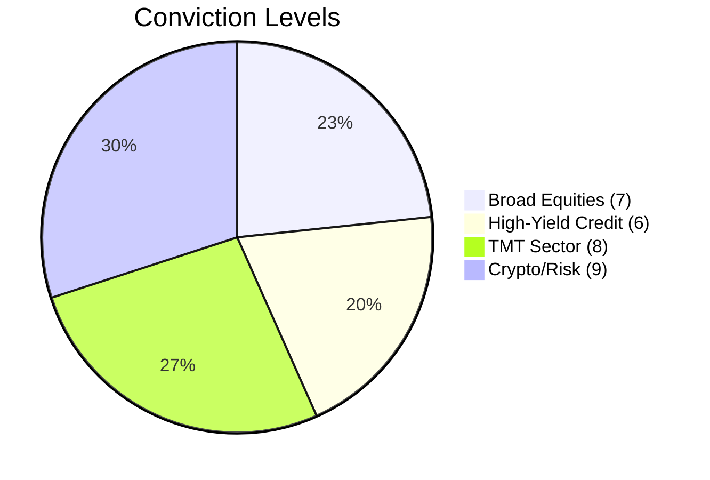

# Market Mayhem: 2026-03-12

### 1. The Daily Briefing
**Macro Overlay:** Broad equity markets exhibit resilience as the S&P 500 continues to hold steady despite mixed signals from recent economic prints, with market participants looking ahead for directional catalysts.
**Credit & TMT Desk:** Leveraged loan markets remain robust, fueled by strong liquidity and selective high-yield issuance. The TMT sector maintains steady momentum, with tech mega-caps sustaining index levels despite sector-specific rotations.
**The Risk Signal:** Bitcoin (BTC) continues to trade with high volatility, acting as a prime barometer for institutional risk appetite. Current price action suggests a sustained risk-on environment, underpinning speculative flows across broader asset classes.

### 2. Sentiment & Conviction Chart

| Sector | Conviction Score (1-10) |
| :--- | :--- |
| Broad Equities | 7 |
| High-Yield Credit | 6 |
| TMT Sector | 8 |
| Crypto/Risk (BTC) | 9 |

### 3. Historic Pricing & Trading Levels

| Asset | Current Price | 30-Day Avg | 1-Year Avg | % Deviation from 30D Mean | Momentum (Bull/Bear) |
| :--- | :--- | :--- | :--- | :--- | :--- |
| S&P 500 | 6775.80 | 6878.67 | 6389.57 | -1.50% | Neutral |
| Nasdaq | 22716.13 | 22909.63 | 21207.32 | -0.84% | Bull |
| BTC | 70130.36 | 67913.58 | 98197.15 | +3.26% | Bull |

### 4. Forward Outlook
Over the next 5 days, we project a sideways-to-bullish consolidation phase across major indices. The primary catalysts will be upcoming inflation prints and key tech earnings releases. A sustained break in BTC above current resistance levels could signal a broader liquidity injection, driving a renewed wave of speculative capital into both TMT equities and high-yield credit structures. Conversely, unexpected hawkish shifts could rapidly reverse recent gains in risk assets.
