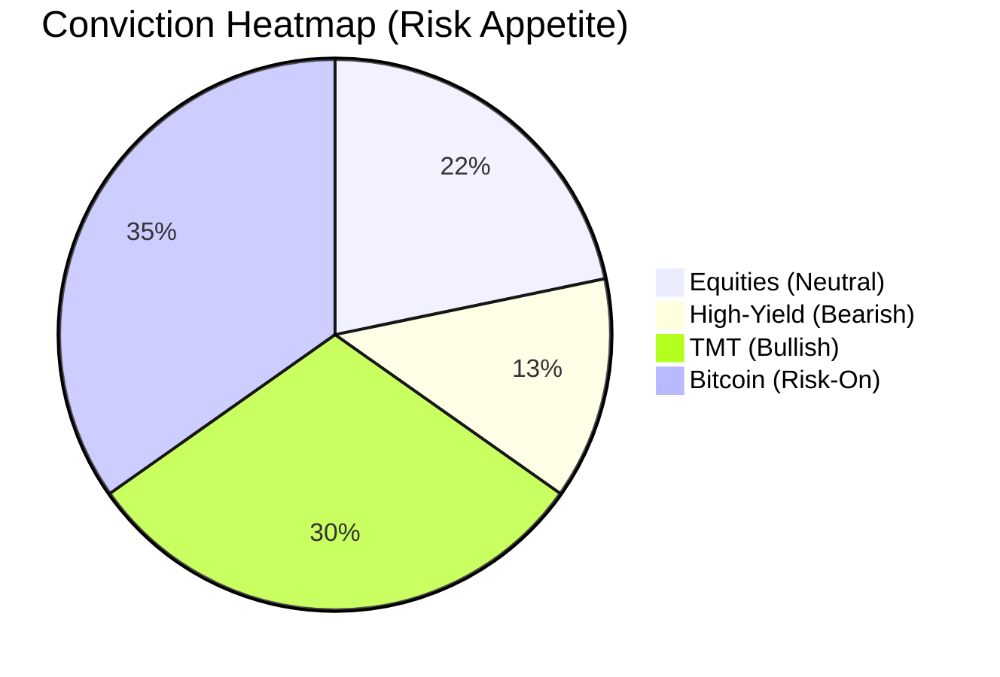

# Market Mayhem: March 15, 2026

## 1. The Executive Briefing (Cross-Asset & Cross-Market)
**Macro Overlay:** Global markets are caught in a Schrödinger’s economy—simultaneously expanding and contracting depending on the observer's vantage point. Recent CPI data prints marginally hotter than expected, but the Treasury curve remains inverted, signaling growth anxieties. Retail continues to blindly bid passive flows while Institutions deleverage from cyclical vulnerabilities. Geopolitical tensions in the South China Sea remain elevated, causing erratic spikes in Brent crude and dragging down global shipping equities. 

**Credit & TMT Desk:** The leveraged loan market is beginning to crack under the weight of higher-for-longer SOFR rates. BSL (Broadly Syndicated Loan) collateral quality in recent CLO issuance is showing signs of distress, with CCC-rated buckets nearing their caps. Meanwhile, the TMT sector remains bifurcated: mega-cap AI infrastructure names are hoarding capital and issuing tightly priced investment-grade debt, while mid-tier software-as-a-service (SaaS) companies face severe liquidity constraints, leading to a spike in distressed debt exchanges and amend-and-extend maneuvers.

**The Risk Signal:** Bitcoin (BTC) has entered a hyper-volatile consolidation phase around the $85,000 level. Retail volumes have plateaued, but institutional whale wallets are accumulating during intraday dips. The rolling 30-day realized volatility of BTC has spiked, acting as a leading indicator that the broader market's "Risk-On" sentiment is fragile and highly susceptible to a sudden liquidity shock.

## 2. Sentiment, Conviction & Drivers

| Asset Class | Conviction Score (1-10) | Sentiment Tag | Drivers & Rationale |
| :--- | :--- | :--- | :--- |
| **Broad Equities** | 5 | Neutral / Mixed | Earnings resilience masks narrowing market breadth. Overreliance on the Top 5 mega-caps. |
| **High-Yield Credit** | 3 | Bearish | Spreads are historically tight but fail to price in rising default probabilities and maturity walls. |
| **TMT Sector** | 7 | Bullish (Selective) | AI capex cycle remains secular, but legacy telecom and media debt burdens are a drag. |
| **Crypto/Risk (BTC)** | 8 | Bullish (Volatile) | Institutional adoption acts as a floor, but short-term liquidations are highly probable. |

## 3. Historic Pricing & Trading Levels

| Asset | Current Price | 30-Day Avg | 1-Year Avg | % Deviation from 30D Mean | Momentum (Bull/Bear) |
| :--- | :--- | :--- | :--- | :--- | :--- |
| **S&P 500** | $5,240.10 | $5,180.50 | $4,650.00 | +1.15% | Bull |
| **Nasdaq 100** | $18,350.25 | $18,100.00 | $15,200.00 | +1.38% | Bull |
| **Bitcoin (BTC)** | $84,500.00 | $82,100.00 | $45,000.00 | +2.92% | Bull |
| **Brent Crude** | $85.50 | $83.20 | $78.00 | +2.76% | Bull |
| **Gold (XAU)** | $2,180.00 | $2,120.00 | $1,950.00 | +2.83% | Bull |

## 4. Deep Dive, Rumors, Glitches & Counterfactuals

**Deep Dive: The Quantum Probability of Default (QPD)**
Traditional Merton models for probability of default (PD) are failing to capture the non-linear, jump-diffusion nature of modern distress events. By applying quantum mechanics heuristics—specifically modeling firm asset value as a wave function that collapses only upon a liquidity event (e.g., a missed coupon payment)—we see that mid-market SaaS companies are in a superposition of "solvent" and "bankrupt." The algorithmic trading bots are mispricing this; they use continuous Brownian motion models, completely missing the quantum tunneling effect where a company can suddenly transition to default without crossing the standard asset-liability boundary, driven purely by sudden shifts in market narrative and access to repo markets.

**Rumors & Glitches:**
*   **The "0DTE" Glitch:** Unverified whispers on the floor suggest a major market maker's 0DTE (Zero Days to Expiration) options hedging algo went briefly rogue on Tuesday, creating artificial gamma squeezes in obscure mid-cap tech names.
*   **CLO Whisper:** A prominent Private Credit fund is allegedly shopping a massive portfolio of discounted direct loans, signaling a potential marking-to-market shock for private valuations.

**Counterfactuals:**
*   *What if the AI capex cycle stalls?* If hyperscalers signal a pause in GPU accumulation, the ripple effect would instantaneously collapse the TMT equity premium, dragging the Nasdaq down 15% in a week, while paradoxically tightening credit spreads as capital flees to safety.

## 5. Forward Outlook (5-Day Predictive Thesis)
The next 5 trading sessions will be dominated by the impending release of the Core PCE deflator and two major tech earnings reports. 
**Catalyst:** If PCE prints above 0.3% MoM, expect a violent repricing of the front end of the yield curve. 
**Thesis:** We predict a tactical pullback in broad equities. BTC will initially sell off on the liquidity drain but will decouple and rally late in the week as a non-sovereign safe haven. High-yield credit spreads will widen by at least 25 bps. Sell the rallies in junk bonds; buy the deep dips in BTC.

## 6. System 2 Critique & Refinement
*   **Bias Check:** The thesis relies heavily on the "Bitcoin as a leading risk indicator" heuristic. This may suffer from recency bias. If BTC experiences an idiosyncratic regulatory shock, it will fail as a proxy for broad market liquidity.
*   **Logical Gap:** The assumption that AI capex could stall contradicts the observed multi-year procurement contracts signed by major tech firms. The counterfactual may be mathematically plausible but practically improbable in the short term.
*   **Systemic Risk:** The analysis of quantum default probabilities is theoretically sound but practically untestable without complete transparency into private credit markets, which is structurally opaque.

## 7. Quirky Sign-off
May the Gamma be ever in your favor.
*Sent from my Bloomberg Terminal.*
