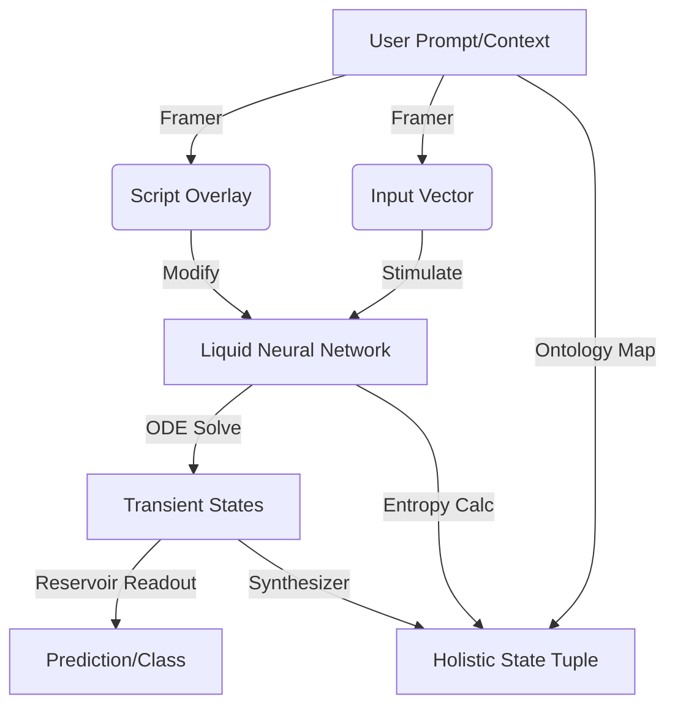

# Neuro-Quantum Architecture (v30)

## Overview
The **Neuro-Quantum Architecture (v30)** is a hybrid computational framework designed to simulate complex financial systems under stress ("Market Mayhem"). It uniquely combines:

1.  **Liquid Neural Networks (LNNs):** Time-continuous recurrent networks modeled via differential equations ($dx/dt = -x/\tau + S(t)$), offering superior adaptability to time-series data compared to traditional RNNs.
2.  **Quantum Synapses:** Probabilistic connections characterized by a mean weight and an uncertainty parameter (entropy). These are measured stochastically during inference to simulate quantum superposition and tunneling effects, allowing the system to explore multiple potential market trajectories.
3.  **Neuro-Symbolic Framing:** A semantic layer that translates unstructured natural language (e.g., news headlines, analyst notes) into deterministic neural inputs and "scripts" that constrain the network's behavior.
4.  **Holistic State Synthesis:** A synthesis engine that fuses the neural state vector, quantum entropy metrics, FIBO ontology mappings, and market regime classifications into a single, interpretable `HolisticStateTuple`.

## Architecture Flow



## Directory Structure

*   `liquid_net.py`: Implements the `LiquidNeuralNetwork` and ODE solver using Euler integration.
*   `synapse.py`: Implements `QuantumSynapse` with stochastic measurement logic.
*   `framer.py`: `NeuroSymbolicFramer` maps semantic keywords to input vectors and applies deterministic scripts.
*   `reservoir.py`: `QuantumReservoirClassifier` uses the LNN as a dynamic reservoir with a classical Ridge Regression readout.
*   `synthesizer.py`: `StateSynthesizer` generates the `HolisticStateTuple` from raw network states.
*   `ontology.py`: Defines standard enums for `FIBOConcept`, `MarketRegime`, and `SemanticLabel`.
*   `trainer.py`: Utilities for generating labeled training data from live prompts.
*   `run_assessment.py`: The "Adam Benchmark" runner script.
*   `adam_assessment_set.json`: Configuration file for the benchmark.

## Installation & Requirements

This module is part of the core repository and shares its dependencies. Key requirements include:
*   `numpy`
*   `scikit-learn` (for the Reservoir readout)
*   `asyncio` (for the Worker implementation)

No external quantum hardware (QPU) is required; quantum effects are simulated classically.

## Usage Tutorial

To execute a Neuro-Quantum simulation within the Swarm:

1.  **Initialize the Worker:**
    ```python
    from core.engine.swarm.pheromone_board import PheromoneBoard
    from core.engine.swarm.neuro_worker import NeuroQuantumWorker

    board = PheromoneBoard()
    worker = NeuroQuantumWorker(board)
    ```

2.  **Dispatch a Task:**
    ```python
    task = {
        "id": "sim_001",
        "type": "SIMULATION",
        "context": "Stagflationary divergence with rising credit spreads",
        "steps": 20,  # Number of time steps
        "dt": 0.1     # Time delta per step
    }
    await worker.execute_task(task)
    ```

3.  **Retrieve Results:**
    ```python
    results = await board.sniff("NEURO_RESULT")
    holistic_state = results[0].data["holistic_state"]

    print(f"Regime: {holistic_state['market_regime']}")
    # Output: "Stagflationary_Divergence"

    print(f"Entropy: {holistic_state['quantum_entropy']}")
    # Output: e.g., 0.24

    print(f"FIBO Concepts: {holistic_state['fibo_concepts']}")
    # Output: ['fibo-loan-ln-ln:Loan', ...]
    ```

## Adam Benchmark

The **Adam Benchmark** is a self-assessment tool designed to verify the cognitive capabilities of the Neuro-Quantum system. It tests:
*   **FIBO Extraction:** Can the system correctly identify financial instruments?
*   **Regime Classification:** Can the system correctly classify market conditions?
*   **Entropy Dynamics:** Does the system exhibit appropriate uncertainty in chaotic scenarios?

### Running the Benchmark
Execute the runner script from the repository root or the module directory:

```bash
python3 core/v30_architecture/neuro_quantum/run_assessment.py
```

The script will output a pass/fail summary table and exit with code `0` (success) or `1` (failure).

### Configuration
The benchmark is configured via `adam_assessment_set.json`. You can add new test cases by appending to the JSON array:

```json
{
    "id": "TEST_ID_001",
    "category": "Regime Classification",
    "prompt": "Test prompt text...",
    "expected_regime": "Expected_Regime_Enum_Value",
    "expected_fibo": ["Expected_FIBO_1", "Expected_FIBO_2"]
}
```

## Extension Points

### Adding New Regimes
1.  Add the new regime to the `MarketRegime` enum in `ontology.py`.
2.  Update the heuristic logic in `StateSynthesizer._identify_regime` (`synthesizer.py`) to detect the new regime based on keywords or entropy levels.
3.  Add a corresponding test case to `adam_assessment_set.json`.

### Adding New FIBO Concepts
1.  Add the new concept to the `FIBOConcept` enum in `ontology.py`.
2.  Update the keyword mapping in `StateSynthesizer._extract_fibo` (`synthesizer.py`).
3.  Add a test case to the benchmark.

## Limits & Constraints
*   **Simulation Speed:** ODE solving is computationally intensive. Keep `steps` reasonable (<100) for real-time applications.
*   **Mock Network:** The default network topology in `NeuroQuantumWorker` is a simplified mock. For production use, dynamic topology generation based on the graph ontology is recommended.
*   **Deterministic Fallback:** If semantic keywords are missing, the system falls back to entropy-based classification, which relies on the intrinsic uncertainty of the network's synapses.
