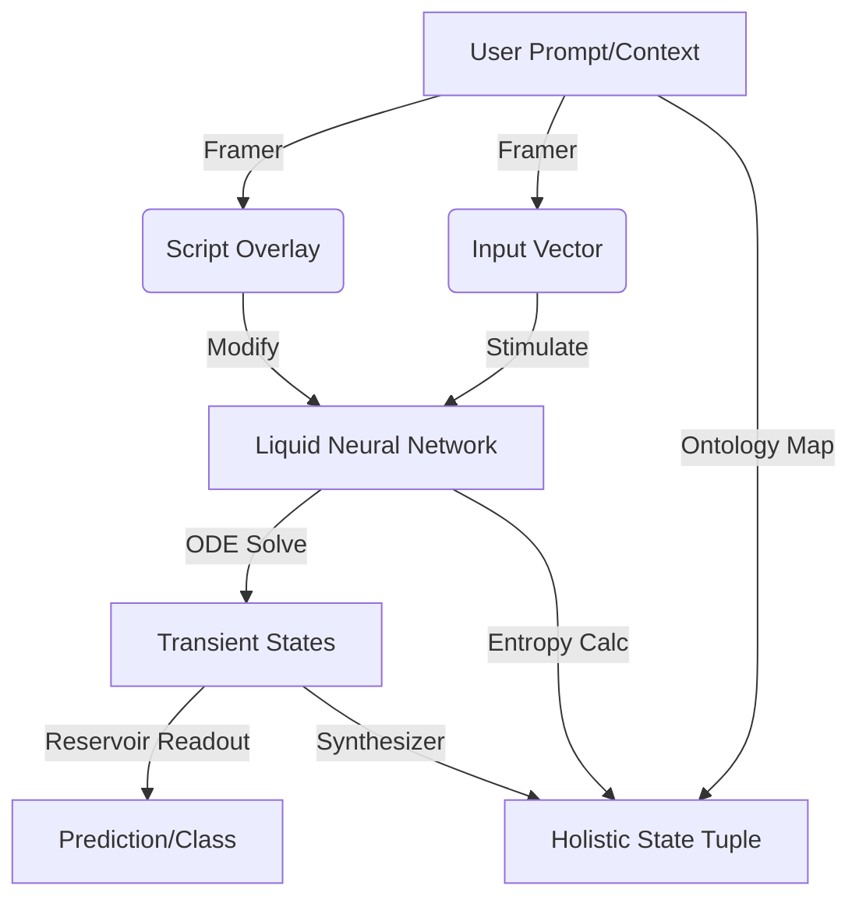

# Neuro-Quantum Architecture (v30)

## Overview
This module implements the **Neuro-Quantum Architecture**, a novel hybrid system combining:
1.  **Liquid Neural Networks (LNNs):** Time-continuous recurrent networks modeled via differential equations ($dx/dt = -x/\tau + S(t)$).
2.  **Quantum Synapses:** Probabilistic connections with mean weights and uncertainty, measured stochastically to simulate quantum superposition and tunneling.
3.  **Neuro-Symbolic Framing:** A semantic layer that maps natural language (e.g., "Market Mayhem" terms) to neural inputs and overlay scripts.
4.  **Holistic State Synthesis:** A synthesis engine that fuses neural vectors, quantum entropy, FIBO ontologies, and market regimes into a single state tuple.

## Directory Structure
- `liquid_net.py`: The ODE solver and neuron logic.
- `synapse.py`: The quantum-probabilistic weight model.
- `framer.py`: Semantic-to-vector mapping and script overlay logic.
- `reservoir.py`: Reservoir Computing implementation using LNNs + Ridge Regression.
- `synthesizer.py`: Logic for fusing states into `HolisticStateTuple`.
- `ontology.py`: Definitions for `FIBOConcept`, `MarketRegime`, etc.
- `trainer.py`: Live prompt training set generator.

## Architecture Flow



## Tutorial: Running a Simulation

To execute a Neuro-Quantum simulation within the Swarm:

1.  **Initialize the Worker:**
    ```python
    from core.engine.swarm.pheromone_board import PheromoneBoard
    from core.engine.swarm.neuro_worker import NeuroQuantumWorker

    board = PheromoneBoard()
    worker = NeuroQuantumWorker(board)
    ```

2.  **Dispatch a Task:**
    ```python
    task = {
        "id": "sim_001",
        "type": "SIMULATION",
        "context": "Stagflationary divergence with rising credit spreads",
        "steps": 20,
        "dt": 0.1
    }
    await worker.execute_task(task)
    ```

3.  **Retrieve Results:**
    ```python
    results = await board.sniff("NEURO_RESULT")
    holistic_state = results[0].data["holistic_state"]
    print(holistic_state["market_regime"]) # "Stagflationary_Divergence"
    print(holistic_state["quantum_entropy"]) # e.g., 0.35
    ```

## Capabilities & Limits

### Capabilities
- **Regime Detection:** Accurately classifies "Market Mayhem" scenarios (e.g., Stagflation, Credit Events) from unstructured text.
- **FIBO Mapping:** Identifies financial entities (Loans, Derivatives) and maps them to formal ontologies.
- **Dynamic Stability:** The Liquid Network adapts to input "scripts" to simulate stabilizing or chaotic market conditions.

### Limits
- **Simulation Speed:** ODE solving is computationally intensive compared to standard RNNs.
- **Quantum Fidelity:** The "quantum" behavior is simulated via Gaussian sampling, not real QPU execution.
- **Vocabulary:** The semantic framer is currently limited to keywords defined in `ontology.py`.
