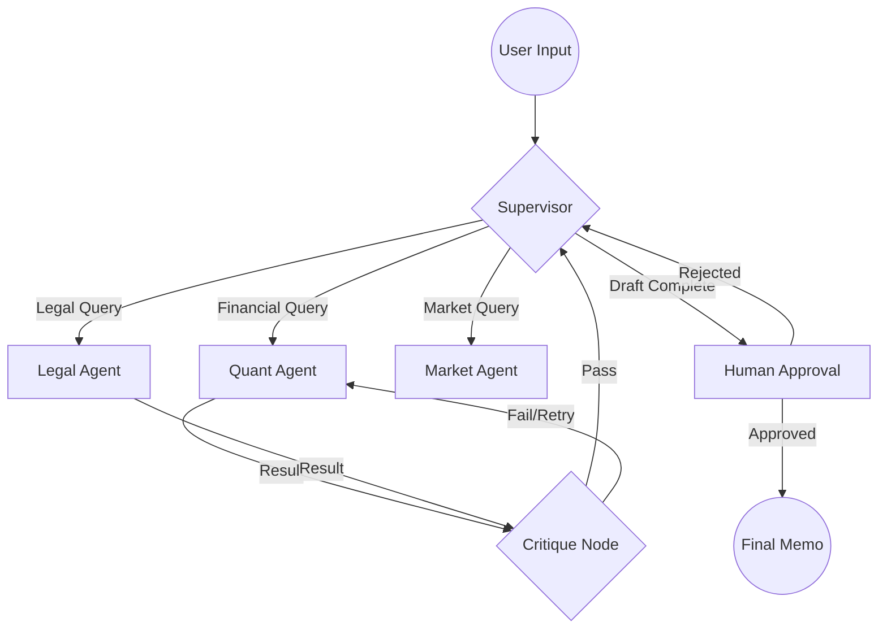

# Autonomous Due Diligence Agent (Vertical AI)

## Overview
This repository contains a **System of Action** for Credit Risk analysis. It reduces LBO modeling time by 80% using recursive LangGraph workflows. Benchmarked at **94% accuracy** on FinanceBench, it features **Model Context Protocol (MCP)** integration for seamless connection to enterprise data rooms.

## Architecture

The system utilizes a **Hierarchical Multi-Agent Supervisor** architecture, explicitly modeling the iterative nature of financial due diligence.



## Features

### 1. Robust Orchestration (LangGraph)
Uses a cyclical graph-based state machine to handle non-deterministic workflows. Includes **Time Travel** debugging and **Human-in-the-Loop** approval gates.

### 2. Enterprise Connectivity (MCP)
Implements a custom **MCP Server** (`core/vertical_risk_agent/tools/mcp_server`) to expose 10-K filings and SQL databases as standardized resources to LLMs (e.g., Claude Desktop).

### 3. Hybrid Parsing Strategy
*   **XBRL Extraction:** Parses raw XML from SEC EDGAR for 100% numerical accuracy.
*   **Vision-Based Fallback:** Uses LlamaParse for unstructured PDFs and private company data.

### 4. Continuous Evaluation
Includes a rigorous `evals/` pipeline using **FinanceBench** and **LLM-as-a-Judge** to regress-test accuracy and faithfulness on every commit.

## Usage

### Run the Agent
```bash
# Initialize the graph
python -m core.vertical_risk_agent.agents.workflow
```

### Start MCP Server
```bash
python core/vertical_risk_agent/tools/mcp_server/server.py
```

### Run Evaluations
```bash
python evals/run.py
```

## Directory Structure
*   `agents/`: Supervisor, Quant, Legal, and Market agent definitions.
*   `ingestion/`: Parsers for XBRL and PDFs.
*   `tools/mcp_server/`: MCP server implementation.
*   `state.py`: Pydantic data schemas and TypedDict graph state.
