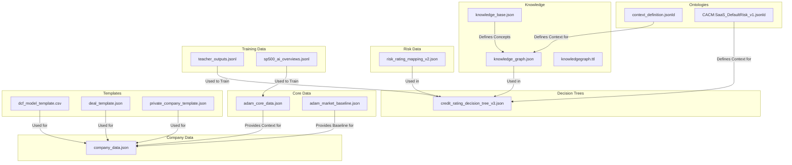
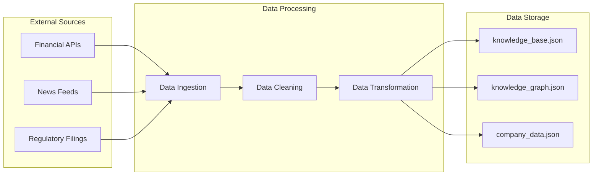

# Data Navigation Guide

This document provides a high-level overview of the data in the `data` directory and how it is organized. It is intended to help developers navigate the data and to understand how the different data files are related to each other.

## 1. Data Map

The following data map provides a visual representation of the data in the `data` directory and how the different data files are related to each other.

## 2. Data Dictionary

The following data dictionary provides definitions for all the data fields in the system.

| File | Field | Data Type | Description |
|---|---|---|---|
| `knowledge_base.json` | `Valuation` | object | Contains information about valuation methods, such as DCF and comparables. |
| `knowledge_base.json` | `RiskManagement` | object | Contains information about risk management techniques, such as VaR and credit risk analysis. |
| `knowledge_graph.json` | `nodes` | array | An array of nodes in the knowledge graph. |
| `knowledge_graph.json` | `edges` | array | An array of edges in the knowledge graph. |
| `credit_rating_decision_tree_v3.json` | `tree` | object | The root of the decision tree. |
| `context_definition.jsonld` | `@context` | object | The JSON-LD context for the system. |
| `adam_core_data.json` | `contextual_data` | object | Contains contextual data for the system, such as user profiles and world events. |
| `company_data.json` | `[TICKER]` | object | Contains data for a specific company. |

## 3. Data Lineage

The following diagram shows the lineage of the data in the `data` directory.

## 4. Future Development

*   **Data Catalog:** We plan to create a more comprehensive data catalog that will provide more detailed information about the data in the `data` directory.
*   **Data Governance:** We also plan to implement a data governance framework to ensure the quality and consistency of the data.

By providing a clear and comprehensive guide to the data in the `data` directory, we can help developers to more easily navigate and to use the data in their agents.
