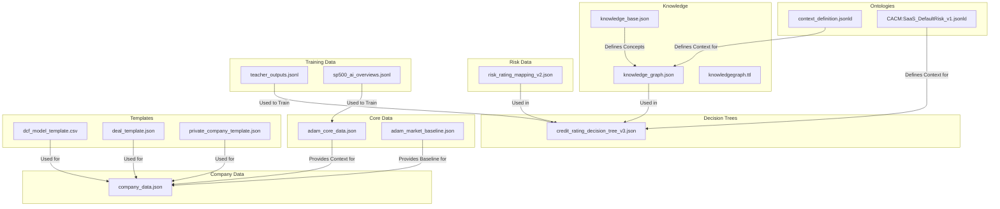
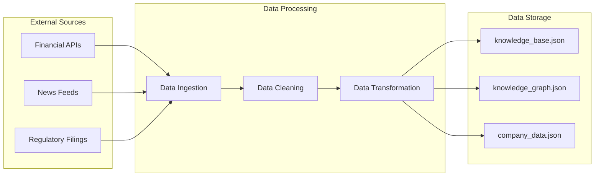

# Data Navigation Guide

This document provides a high-level overview of the data in the `data` directory and how it is organized. It is intended to help developers navigate the data and to understand how the different data files are related to each other. For information on data versioning, see the [Versioning and Migration Guide](../VERSIONING.md).

## 1. Interactive Data Map

The following data map provides a visual representation of the data in the `data` directory and how the different data files are related to each other. To make this map interactive, we can embed it in an HTML file and use JavaScript to add click listeners to the nodes. When a node is clicked, it could link to the relevant section in this document.

## 2. Data Dictionary

The following data dictionary provides definitions for all the data fields in the system.

| File | Field | Data Type | Description | Constraints | Example |
|---|---|---|---|---|---|
| `knowledge_base.json` | `Valuation` | object | Contains information about valuation methods, such as DCF and comparables. | | `{"DCF": {"description": "Discounted cash flow..."}}` |
| `knowledge_base.json` | `RiskManagement` | object | Contains information about risk management techniques, such as VaR and credit risk analysis. | | `{"VaR": {"description": "Value at Risk..."}}` |
| `knowledge_graph.json` | `nodes` | array | An array of nodes in the knowledge graph. | Each node must have `id` and `label` properties. | `[{"id": "1", "label": "Company A"}, {"id": "2", "label": "Company B"}]` |
| `knowledge_graph.json` | `edges` | array | An array of edges in the knowledge graph. | Each edge must have `source` and `target` properties. | `[{"source": "1", "target": "2"}]` |
| `credit_rating_decision_tree_v3.json` | `tree` | object | The root of the decision tree. | | `{"attribute": "debt_to_equity", "value": 0.5, "left": ..., "right": ...}` |
| `context_definition.jsonld` | `@context` | object | The JSON-LD context for the system. | | `{"@vocab": "http://schema.org/"}` |
| `adam_core_data.json` | `contextual_data` | object | Contains contextual data for the system, such as user profiles and world events. | | `{"user_profile": {"name": "John Doe"}}` |
| `company_data.json` | `[TICKER]` | object | Contains data for a specific company. | The key must be a valid stock ticker. | `{"GOOGL": {"name": "Alphabet Inc.", "sector": "Technology"}}` |
| `deal_template.json` | `deal_name` | string | The name of the deal. | | `"Project Titan"` |
| `private_company_template.json` | `company_name` | string | The name of the company. | | `"Acme Corporation"` |
| `risk_rating_mapping_v2.json` | `rating` | string | The risk rating. | Must be one of: AAA, AA, A, BBB, BB, B, CCC, CC, C, D. | `"AAA"` |
| `teacher_outputs.jsonl` | `prompt` | string | The prompt given to the teacher model. | | `"What is the capital of France?"` |
| `teacher_outputs.jsonl` | `completion` | string | The completion generated by the teacher model. | | `"Paris"` |
| `sp500_ai_overviews.jsonl` | `ticker` | string | The stock ticker of the company. | | `"GOOGL"` |
| `sp500_ai_overviews.jsonl` | `overview` | string | An AI-generated overview of the company. | | `"Alphabet Inc. is a multinational conglomerate..."` |

## 3. Data Lineage

The following diagram shows the lineage of the data in the `data` directory.

| File | Create | Read | Update | Delete |
|---|---|---|---|---|
| `knowledge_base.json` | `scripts/data_processing.py` | `core/system/knowledge_base.py` | `scripts/data_processing.py` | `scripts/data_processing.py` |
| `knowledge_graph.json` | `scripts/data_processing.py` | `core/system/knowledge_base.py` | `scripts/data_processing.py` | `scripts/data_processing.py` |
| `company_data.json` | `scripts/data_retrieval_agent.py` | `core/agents/*` | `scripts/data_retrieval_agent.py` | `scripts/data_retrieval_agent.py` |

## 4. Developer Notes

*   The `data` directory contains a variety of data files, including JSON, CSV, and TTL files.
*   The data is used by various components of the ADAM system, including agents, the knowledge base, and the simulation engine.
*   When adding new data files, be sure to update this document to include them in the data map, data dictionary, and data lineage.

## 5. Future Development

*   **Data Catalog:** We plan to create a more comprehensive data catalog that will provide more detailed information about the data in the `data` directory.
*   **Data Governance:** We also plan to implement a data governance framework to ensure the quality and consistency of the data.
*   **Automated Documentation:** We are exploring ways to automate the generation of this documentation from the data files themselves.

By providing a clear and comprehensive guide to the data in the `data` directory, we can help developers to more easily navigate and to use the data in their agents.
