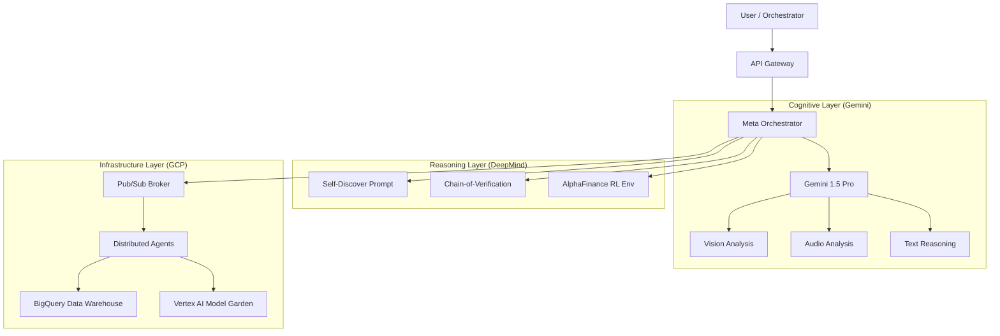

# Alphabet Ecosystem Integration Guide

## Overview
Adam v24.0+ is designed to deeply integrate with the **Alphabet Ecosystem**, leveraging the power of Google Cloud Platform (GCP), Gemini Models, and DeepMind's research frameworks to create a **Universal Financial Intelligence** system.

This document outlines the architecture, configuration, and usage of these integrations.

## Architecture



## Components

### 1. Gemini 1.5 Pro (Multimodal Core)
The system uses Gemini 1.5 Pro as its primary cognitive engine due to its massive context window (1M+ tokens) and native multimodal capabilities.

*   **Code Location:** `core/llm_plugin.py` (`GeminiLLM`), `core/analysis/gemini_analyzer.py`
*   **Capabilities:**
    *   **Text:** Deep qualitative analysis of financial reports.
    *   **Vision:** Chart and graph interpretation (`analyze_image`).
    *   **Audio:** Earnings call analysis (`AudioFinancialAnalyzer`).

### 2. Vertex AI (Model Garden & Ops)
Adam connects to Vertex AI to access a variety of models (PaLM, Gemini, Codey) and manage MLOps.

*   **Code Location:** `core/llm_plugin.py` (`VertexLLM`)
*   **Usage:**
    *   Set `provider: vertex` in `llm_plugin.yaml`.
    *   Set `VERTEX_PROJECT_ID` environment variable.

### 3. BigQuery (Financial Data Warehouse)
The system is designed to store structured analysis results and query large historical datasets via BigQuery.

*   **Code Location:** `core/data_access/bigquery_connector.py`
*   **Usage:**
    *   Used by `FundamentalAnalystAgent` to persist ratios and metrics.
    *   Used by `RAGFinancialAnalyzer` to retrieve historical context.

### 4. Pub/Sub (Asynchronous Nervous System)
For enterprise deployments, the in-memory message broker is replaced by Google Cloud Pub/Sub to allow distributed, fault-tolerant agent communication.

*   **Code Location:** `core/system/pubsub_broker.py`

### 5. DeepMind Reasoning Frameworks
We have implemented advanced prompting strategies derived from DeepMind research papers to enhance reliability and reasoning depth.

*   **Self-Discover:** (`core/prompting/advanced_reasoning.py`) The model composes its own reasoning structure (SELECT -> ADAPT -> IMPLEMENT) before solving a task.
*   **Chain-of-Verification (CoVe):** (`core/prompting/advanced_reasoning.py`) The model drafts a response, plans verification questions, answers them to check for hallucinations, and revises the output.
*   **AlphaFinance:** (`core/simulations/alpha_finance.py`) A Reinforcement Learning environment inspired by AlphaZero, designed for portfolio optimization tasks.

## Configuration

To enable the Alphabet Ecosystem features, ensure your `.env` or configuration files are set up:

```bash
# .env
GEMINI_API_KEY=your_key_here
VERTEX_PROJECT_ID=your_project_id
GOOGLE_APPLICATION_CREDENTIALS=path/to/key.json
```

## Future Extensions
*   **BigQuery ML:** Train forecasting models directly within the data warehouse.
*   **Vertex Search:** Replace the custom RAG engine with Vertex AI Search for enterprise-grade retrieval.
*   **AlphaFold for Pharma:** Integrate AlphaFold API calls for analyzing biotech/pharma investment targets.
