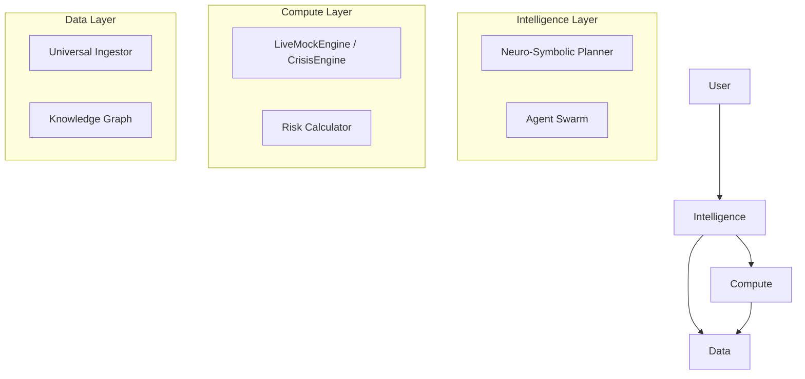

# Architecture: The Neuro-Symbolic Sovereign

## Overview
Adam v26.0 is architected as a **Hybrid Cognitive Engine**, fusing the speed of neural networks (System 1) with the precision of symbolic logic (System 2).

The system is composed of three distinct, decoupled layers that can operate standalone or in concert.

## 1. Intelligence Layer (The "Brain")
*   **Role**: Reasoning, Planning, and Decision Making.
*   **Components**:
    *   **Neuro-Symbolic Planner**: Decomposes complex goals into executable graphs.
    *   **Agent Swarm**: Specialized agents (Risk, Legal, Market) for specific domains.
    *   **Consensus Engine**: Aggregates multi-agent perspectives into a single conviction score.
*   **Standalone Operation**: Can be run as a pure reasoning engine without live data or execution, useful for backtesting strategies or analyzing static documents.

## 2. Compute Layer (The "Engine")
*   **Role**: Simulation, Risk Calculation, and Execution.
*   **Components**:
    *   **LiveMockEngine**: High-fidelity simulation of market conditions.
    *   **CrisisSimulationEngine**: Graph-theoretic shock propagation for stress testing.
    *   **Rust Pricing Engine**: Deterministic financial calculations (Black-Scholes, Greeks).
*   **Standalone Operation**: Can be run as a "Financial Calculator" or "Scenario Simulator" independent of the AI agents.

## 3. Data Layer (The "Memory")
*   **Role**: Ingestion, Processing, and Storage.
*   **Components**:
    *   **Universal Ingestor**: Handles PDFs, HTML, and unstructured text.
    *   **Knowledge Graph**: Neo4j/NetworkX based entity relationship storage.
    *   **Vector Store**: Semantic memory for RAG (Retrieval Augmented Generation).
*   **Standalone Operation**: Can be run as an ETL (Extract, Transform, Load) pipeline to build datasets without invoking intelligence or compute.

## Architecture Diagram

## Environment Rotation
The system supports dynamic **Environment Rotation**, allowing seamless switching between execution engines (e.g., `LiveMockEngine` vs. `RealTradingEngine`) via configuration. This enables:
*   **Blue/Green Deployment**: Testing new models in simulation before live rollout.
*   **Chaos Engineering**: Injecting fault-tolerant engines to test system resilience.
