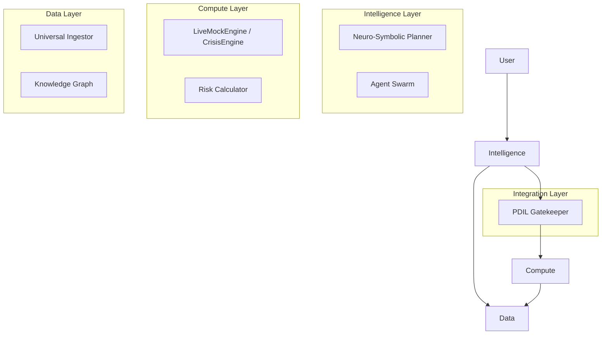

# Architecture: The Neuro-Symbolic Sovereign

## Overview
Adam v26.0 is architected as a **Hybrid Cognitive Engine**, fusing the speed of neural networks (System 1) with the precision of symbolic logic (System 2).

The system is composed of three distinct, decoupled layers that can operate standalone or in concert.

## 1. Intelligence Layer (The "Brain")
*   **Role**: Reasoning, Planning, and Decision Making.
*   **Components**:
    *   **Neuro-Symbolic Planner**: Decomposes complex goals into executable graphs.
    *   **Agent Swarm**: Specialized agents (Risk, Legal, Market) for specific domains.
    *   **Consensus Engine**: Aggregates multi-agent perspectives into a single conviction score.
*   **Standalone Operation**: Can be run as a pure reasoning engine without live data or execution, useful for backtesting strategies or analyzing static documents.

## 2. Compute Layer (The "Engine")
*   **Role**: Simulation, Risk Calculation, and Execution.
*   **Components**:
    *   **LiveMockEngine**: High-fidelity simulation of market conditions.
    *   **CrisisSimulationEngine**: Graph-theoretic shock propagation for stress testing.
    *   **Rust Pricing Engine**: Deterministic financial calculations (Black-Scholes, Greeks).
*   **Standalone Operation**: Can be run as a "Financial Calculator" or "Scenario Simulator" independent of the AI agents.

## 3. Data Layer (The "Memory")
*   **Role**: Ingestion, Processing, and Storage.
*   **Components**:
    *   **Universal Ingestor**: Handles PDFs, HTML, unstructured text, as well as multimodal data such as images (charts, tables) and audio transcripts.
    *   **Knowledge Graph**: Neo4j/NetworkX based entity relationship storage.
    *   **Vector Store**: Semantic memory for RAG (Retrieval Augmented Generation).
*   **Standalone Operation**: Can be run as an ETL (Extract, Transform, Load) pipeline to build datasets without invoking intelligence or compute.

## 4. Integration Layer
*   **Role**: Governance and Translation.
*   **Components**:
    *   **Probabilistic-to-Deterministic Integration Layer (PDIL)**: Acts as a strict gatekeeper and translation layer, mapping stochastic outputs from the Intelligence Layer (System 1/Swarm) into strongly-typed, deterministic parameters for the Compute Layer (System 2/Engine).

## 5. Swarm Environment Layer
To support long-running autonomous operations, the architecture includes a modular, portable, and async adversarial-aware swarm environment. This environment leverages fine-tuned in-context learning, deeply managed execution loops, and comprehensive harness telemetry.

The environment utilizes a multidimensional 3x5x7 tiered architecture:
*   **3-Layer Execution:** Data, Reasoning, Execution.
*   **5-Layer Governance:** Governance, Models, Agents, Environments, Telemetry.
*   **7-Layer Integration:** Hardware, OS, Kernel, Swarm, App, Interface, User.

Key capabilities include continuous computation of confidence bands around simulated world model probabilities, active tracking of node connection likelihoods across the semantic and execution graphs, and the population of predictive tail scenarios to forecast high-impact, rare events.

*For a detailed breakdown of the tiered architecture and its capabilities, see the [Swarm Environment Layer Deep Dive](architecture/swarm_environment_layer.md).*

## Architecture Diagram

```mermaid
graph TD
    User --> Intelligence
    Intelligence --> PDIL
    PDIL --> Compute
    Intelligence --> Data
    Compute --> Data

    subgraph "Integration Layer"
        PDIL[PDIL Gatekeeper]
    end

    subgraph "Intelligence Layer"
        Planner[Neuro-Symbolic Planner]
        Swarm[Agent Swarm]
    end

    subgraph "Compute Layer"
        Sim[LiveMockEngine / CrisisEngine]
        Risk[Risk Calculator]
    end

    subgraph "Data Layer"
        Ingest[Universal Ingestor]
        KG[Knowledge Graph]
    end
```

## Environment Rotation
The system supports dynamic **Environment Rotation**, allowing seamless switching between execution engines (e.g., `LiveMockEngine` vs. `RealTradingEngine`) via configuration. This enables:
*   **Blue/Green Deployment**: Testing new models in simulation before live rollout.
*   **Chaos Engineering**: Injecting fault-tolerant engines to test system resilience.
