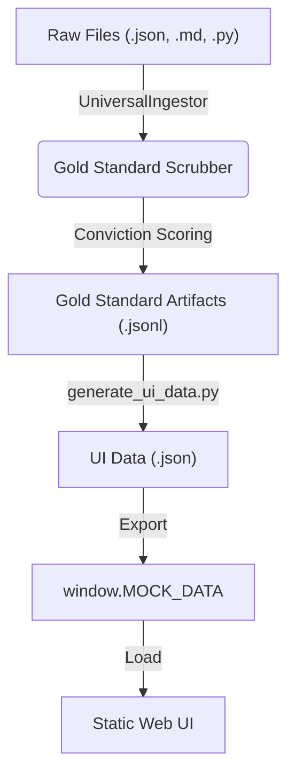
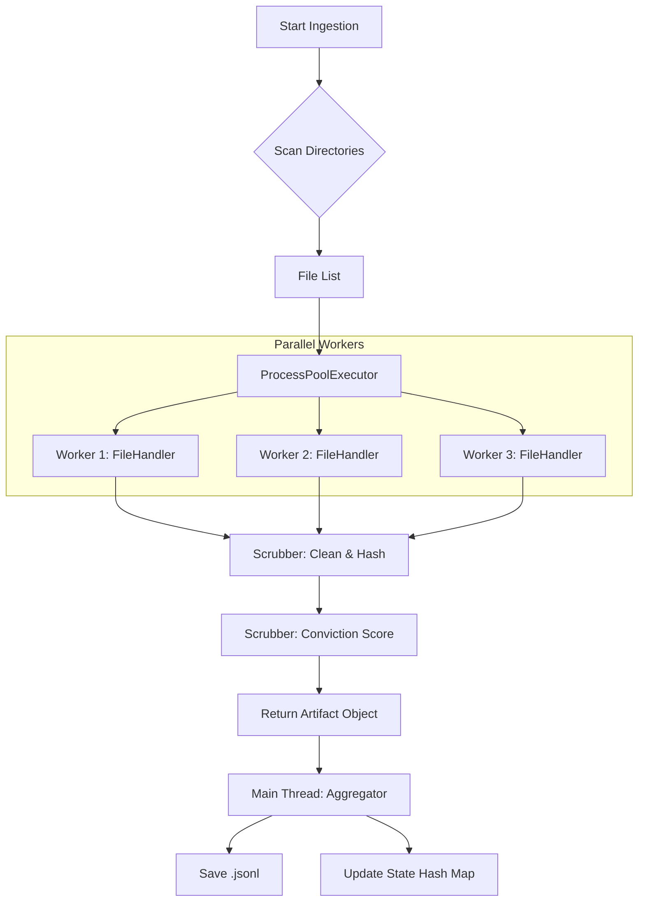

# Adam v23.0 Showcase & Gold Standard Pipeline Guide

## Overview

The Adam v23.0 repository includes a comprehensive system for ingesting, standardizing, and displaying "Gold Standard" knowledge artifacts. This pipeline ensures that all data—from reports and newsletters to code documentation and prompts—is accessible to both the automated agents and the human operator via a static "Mission Control" interface.

## The Gold Standard Pipeline

### 1. Ingestion (`UniversalIngestor`)
The core engine is `core/data_processing/universal_ingestor.py`.
*   **Capabilities**: Scans directories for `.json`, `.jsonl`, `.md`, `.txt`, and `.py` files.
*   **Gold Standard Scrubber**: A built-in class that:
    *   Cleans and normalizes text.
    *   Extracts metadata (entities, keys, structure).
    *   **Assesses Conviction**: Calculates a heuristic score (0.0 - 1.0) based on data richness, structure, and depth.
*   **Output**: Produces a standardized JSONL file (`data/gold_standard/knowledge_artifacts.jsonl`) where every item is a `GoldStandardArtifact`.

### 2. UI Data Generation
The script `scripts/generate_ui_data.py` bridges the backend and the frontend.
*   It runs the `UniversalIngestor` to refresh the gold standard dataset.
*   It maps these artifacts into a format optimized for the web UI (`ui_data.json`).
*   **Mock Mode**: It generates `showcase/js/mock_data.js`, allowing the entire UI to run locally without a backend server (using `window.MOCK_DATA`).
*   **Graceful Fallbacks**: If reports are missing, it synthetically generates deep dive reports using the `DataFactory`.

### 3. Static Showcase UI
Located in the `showcase/` directory, this is a vanilla JS + Tailwind CSS interface designed for GitHub Pages hosting.

*   **Mission Control (`index.html`)**: The central dashboard monitoring system status.
*   **Reports Library (`reports.html`)**: A searchable viewer for all ingested reports, supporting both standard JSON and complex v23 Knowledge Graph structures.
*   **Navigator (`navigator.html`)**: A file system explorer for the repo.
*   **Neural Dashboard (`neural_dashboard.html`)**: Visualization of the v23 agent architecture.

## How to Run the Showcase

1.  **Generate Data**:
    Run the generation script to scan the repo and populate the data files.
    ```bash
    python scripts/generate_ui_data.py
    ```

2.  **View Locally**:
    Open `showcase/index.html` in your browser.
    *   *Note*: Due to browser security policies (CORS), some features might require a local server if not using the generated `mock_data.js`. The system is designed to fallback to `mock_data.js` automatically.
    *   Recommended: `python -m http.server` in the root directory, then visit `http://localhost:8000/showcase/`.

## Expanding the System

*   **Adding New Data**: Simply place JSON or Markdown files in `data/`, `docs/`, or `core/libraries_and_archives/`. The next time the generator runs, they will be ingested.
*   **Adding Code Documentation**: The system now automatically scans `core/` for Python files and extracts docstrings as `code_doc` artifacts. These are available in the `data/gold_standard/` output.

## Architecture (universal_ingestor.py & universal_ingestor_v2.py)




Concurrency: Uses ProcessPoolExecutor to scrub files in parallel.

Incremental State: Uses MD5 hashing to skip files that haven't changed since the last run.

Abstracted Handlers: Can easily plug in new file types (CSV, YAML, PDF) without breaking the core loop.

Rich Metadata: Added basic code complexity metrics (Cyclomatic complexity) and "Key Term" extraction.

Configurable Weights: The GoldStandardScrubber now uses a WEIGHTS dictionary. This means you can tune how strict you want the scoring to be without rewriting logic.

Strategy Pattern for Files: The FileHandlers class separates the logic. If you want to add PDF support later, you just add handle_pdf and register it in self.handlers. You don't touch the main loop.

Parallelism: By using ProcessPoolExecutor, this script will utilize all CPU cores. If you have 1,000 files, this will be significantly faster than the loop approach.

Dataclasses: Using @dataclass for GoldStandardArtifact reduces boilerplate code and makes the object easier to serialize/deserialize.

State Management: The ingestion_state.json saves hashes. Currently, I have it generating the full JSONL every time (safest for static builds), but the infrastructure is there to implement a "Diff Only" mode easily.
