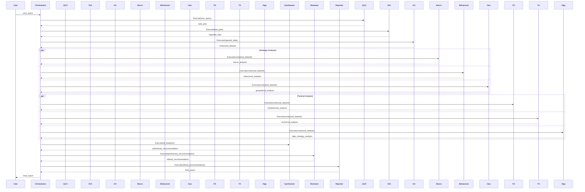

# Adam v21.0: System Architecture Overview

This document provides a high-level overview of the Adam v21.0 system architecture, its core components, and the data flow for key workflows. It is intended for developers who are new to the project.

## System Architecture

Adam v21.0 is built on a modular, agent-based architecture designed for flexibility and scalability. The system is orchestrated by a central controller that manages a network of specialized AI agents. Here are the key components:

-   **Agent Orchestrator (`core/system/agent_orchestrator.py`):** This is the heart of the system. It is responsible for loading agent configurations, executing predefined workflows, and managing communication between agents. It leverages a powerful workflow engine to run complex, multi-step analysis tasks.

-   **Agent Base (`core/agents/agent_base.py`):** This abstract base class defines the common interface for all agents. It provides core functionalities such as context management, inter-agent communication (A2A), and a mechanism for agents to declare their skills to the orchestrator.

-   **Knowledge Base (`core/system/knowledge_base.py`):** The Knowledge Base acts as the central memory and information hub for the system. It is likely implemented using a graph database (like Neo4j) to store and retrieve interconnected financial data, concepts, and historical analysis.

-   **Data Manager (`core/system/data_manager.py`):** This component is responsible for interfacing with various external and internal data sources. Agents rely on the Data Manager to fetch the information they need for their analysis.

-   **LLM Plugin (`core/llm_plugin.py`):** This provides a standardized interface to interact with different Large Language Models (LLMs). This allows the system to be model-agnostic and easily switch between different LLM providers like OpenAI, Azure, or local models.

-   **Semantic Kernel Integration:** The system is deeply integrated with Microsoft's Semantic Kernel. The orchestrator initializes a Semantic Kernel instance, and agents can leverage it to execute "skills" (modular, reusable AI functions) and manage complex prompt engineering tasks. Skills are loaded from the `core/agents/skills/` directory.

## Core Concepts

The Adam v21.0 platform is built around a few core concepts that enable its powerful and flexible analysis capabilities.

-   **Agents:** Agents are specialized, autonomous components designed to perform specific tasks. Each agent has a defined role, such as `MarketSentimentAgent`, `FundamentalAnalystAgent`, or `GeopoliticalRiskAgent`. They are the primary actors in the system.

-   **Workflows:** Workflows are defined in YAML files (e.g., `config/workflow21.yaml`) and describe a sequence of steps to achieve a larger goal. They specify which agents to run, in what order, and how data should flow between them. Workflows can include parallel execution steps to improve performance.

-   **Agent-to-Agent (A2A) Communication:** Agents can communicate directly with each other. This allows for more dynamic and collaborative analysis, where one agent can request information or delegate a sub-task to another.

-   **Meta-Cognitive Plurality (MCP):** MCP is a service discovery mechanism for agents. Each agent can publish a "skill schema" that describes its capabilities. The `AgentOrchestrator` maintains a registry of these skills, allowing agents to dynamically discover and invoke the capabilities of other agents in the network.

## Master Workflow: `adam_v21_master_workflow`

The primary workflow for complex financial analysis is the `adam_v21_master_workflow`, defined in `config/workflow21.yaml`. This workflow demonstrates the full power of the system by orchestrating multiple agents across several stages to produce a comprehensive report.

### Workflow Stages

1.  **Stage 1: Query Deconstruction and Knowledge Graph Grounding:** The initial user query is deconstructed, and relevant data is ingested and grounded against the system's Knowledge Base.
2.  **Stage 2: Strategic Analysis:** A parallel analysis of high-level strategic factors (macroeconomic, behavioral, geopolitical) is performed.
3.  **Stage 3: Tactical Analysis:** A parallel analysis of detailed tactical factors (fundamental, technical, algorithmic) is performed.
4.  **Stage 4: Recommendation, Explanation, and Refinement:** The results from the previous stages are synthesized into a preliminary recommendation, reviewed for quality and logical consistency, and then compiled into a final report.

### Mermaid Diagram

The following diagram illustrates the sequence of agent interactions in the master workflow.

