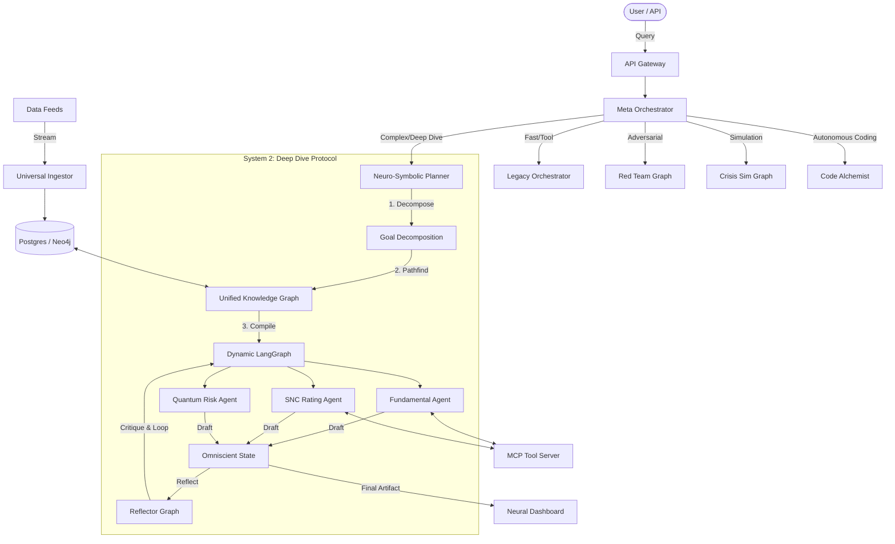

# Adam v23.5 Architecture: The Neuro-Symbolic Hive

**Version:** 23.5
**Status:** Production
**Last Updated:** Oct 2023

---

## 1. System Overview

Adam v23.5 represents a paradigm shift from simple LLM "wrappers" to a **Neuro-Symbolic Cognitive Engine**. It solves the "Epistemological Crisis" in financial AI—hallucinations and lack of auditability—by fusing:

1.  **System 1 (Neural):** Large Language Models (LLMs) for intuition, semantic understanding, and creativity.
2.  **System 2 (Symbolic):** A Graph-based Planner, deterministic financial engines (Python/Rust), and formal ontologies (FIBO/PROV-O) for logic, verification, and auditability.

The architecture mimics the human brain's dual-process theory, employing a central **Meta-Orchestrator** to route tasks between fast, intuitive pathways and slow, rigorous analytical circuits.

---

## 2. High-Level Architecture Diagram

---

## 3. Core Components Breakdown

### 3.1. Meta Orchestrator (`core.engine.meta_orchestrator`)
The "Executive Function" of the system. It uses a routing heuristic (or router model) to classify user intent into complexity tiers:
- **DEEP_DIVE:** Triggers the v23.5 Autonomous Analyst flow.
- **SWARM:** Dispatches tasks to the `HiveMind` for parallel processing.
- **FAST/MEDIUM:** Routes to the legacy `AgentOrchestrator` for simple tool use.
- **CRISIS/RED_TEAM:** Activates specialized adversarial sub-graphs.

### 3.2. Neuro-Symbolic Planner (`core.engine.neuro_symbolic_planner`)
The "Cortex" of the system. Unlike standard "Chain-of-Thought" which hallucinates steps, this planner:
1.  **Grounds in Reality:** Queries the Knowledge Graph to find valid paths between the *Start Node* (e.g., "Apple Inc.") and *Target Node* (e.g., "Credit Rating").
2.  **Compiles Code:** Dynamically assembles a `LangGraph` workflow based on the discovered path.
3.  **Executes:** Runs the graph, allowing for cyclical loops (Draft -> Critique -> Refine).

### 3.3. Deep Dive Agents (`core.agents.specialized`)
A suite of specialized, single-purpose agents that act as nodes in the reasoning graph:
- **ManagementAssessmentAgent:** Analyzes management quality and governance.
- **FundamentalAnalystAgent:** Performs 3-statement modeling and DCF valuation.
- **SNCRatingAgent:** Deterministic regulatory rating (Pass/Special Mention/Substandard) based on leverage ratios.
- **MonteCarloRiskAgent:** Runs 10,000 simulations to determine VaR (Value at Risk).
- **QuantumScenarioAgent:** Uses jump-diffusion models to price tail risk.

### 3.4. Universal Ingestor (`core.data_processing.universal_ingestor`)
The "Sensory Cortex". It ingests raw data (PDFs, HTML, XBRL), scrubs it, assigns a **Conviction Score** (0-100%), and maps it to the FIBO ontology before it enters the system.

### 3.5. Omniscient State (`core.schemas.v23_5_schema`)
The shared memory structure passed between agents. It is a strictly typed Pydantic model (`HyperDimensionalKnowledgeGraph`) ensuring that agents communicate in a structured format, not just natural language strings.

---

## 4. Data Flow: The "Glass Box" Principle

1.  **Ingestion:** Data enters via the `UniversalIngestor`, is tagged with provenance (Source ID, Timestamp), and stored in the Knowledge Graph.
2.  **Reasoning:** Agents query the KG. Every insight generated must cite its source node (W3C PROV-O).
3.  **Synthesis:** The `ReflectorGraph` reviews the aggregated insights. If conviction is low, it triggers a "re-read" loop.
4.  **Presentation:** The final state is rendered into the `Neural Dashboard`, allowing users to click on any claim and see the source document snippet.

---

## 5. Deployment Topology

The system is designed as a **Hybrid Cloud-Native Application**:
- **Compute:** Kubernetes (K8s) cluster managing agent pods.
- **Messaging:** Kafka/Redpanda for async agent communication (v22 backbone).
- **Storage:**
    - **Neo4j:** Knowledge Graph relationships.
    - **Postgres:** Structured financial data.
    - **Redis:** Hot cache for agent state.
- **Frontend:** React-based Single Page Application (SPA) serving the "Mission Control" dashboard.

---

## 6. Key Innovations

- **Cyclical Reasoning:** The system can "change its mind" based on new data or critique, breaking the linear dependency of standard LLM chains.
- **Deterministic Math:** Critical financial calculations (DCF, Ratios) are offloaded to Python functions, ensuring 100% arithmetic accuracy.
- **Adversarial Red Teaming:** A dedicated "Red Team" graph constantly tries to poke holes in the investment thesis during the drafting phase.
