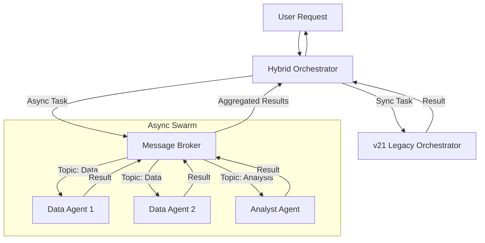

# Async Swarm Workflow (v22 Architecture)

## Overview

The Adam v22 architecture introduces a hybrid model that combines the synchronous, centrally-orchestrated workflows of v21 with a new asynchronous, message-driven "swarm" system. This allows for parallel execution, improved scalability, and non-blocking agent interactions.

## Core Components

### 1. Hybrid Orchestrator
The `HybridOrchestrator` acts as the bridge between the synchronous and asynchronous worlds. It inspects incoming tasks and routes them to the appropriate subsystem:
- **Synchronous Tasks:** Routed to the legacy `AgentOrchestrator`.
- **Asynchronous Tasks:** Routed to the `MessageBroker` for distribution to the swarm.

### 2. Message Broker
Located at `core/system/message_broker.py`, the Message Broker is the central nervous system of the v22 architecture. It supports:
- **Event-Driven Communication:** Agents publish messages to topics/channels.
- **Decoupling:** Senders do not need to know who the receivers are.
- **Scalability:** Supports multiple consumers for parallel processing.

### 3. Async Agent Base
The `AsyncAgentBase` (in `core/system/v22_async/async_agent_base.py`) extends the standard agent capabilities to support:
- **Non-blocking Execution:** `async/await` patterns for I/O operations.
- **Message Listening:** Automatically subscribes to relevant topics.
- **State Management:** Handles asynchronous state updates.

## Workflow Lifecycle

1.  **Task Ingestion:** A task is received by the `MetaOrchestrator` or `HybridOrchestrator`.
2.  **Routing:** If identified as an async task (e.g., "high-throughput data gathering"), it is published to the `task_queue`.
3.  **Swarm Activation:** Available agents subscribed to `task_queue` pick up the message.
4.  **Parallel Execution:** Multiple agents process sub-tasks simultaneously.
5.  **Result Aggregation:** Agents publish results to a `results_queue`.
6.  **Synthesis:** A specialized aggregator agent or the orchestrator collects results and formulates the final response.

## Benefits

- **Performance:** Significantly reduces latency for I/O-bound tasks (e.g., fetching data from multiple APIs).
- **Resilience:** If one agent fails, others can continue processing.
- **Extensibility:** New agents can be added to the swarm without modifying the orchestrator logic.

## Diagram



## Developer Guide

To implement a new async agent:
1.  Inherit from `AsyncAgentBase`.
2.  Implement the `process_message` method.
3.  Register the agent with the `MessageBroker` in your configuration.

```python
class MyAsyncAgent(AsyncAgentBase):
    async def process_message(self, message):
        # Async logic here
        await self.send_message("results_queue", {"data": "processed"})
```
