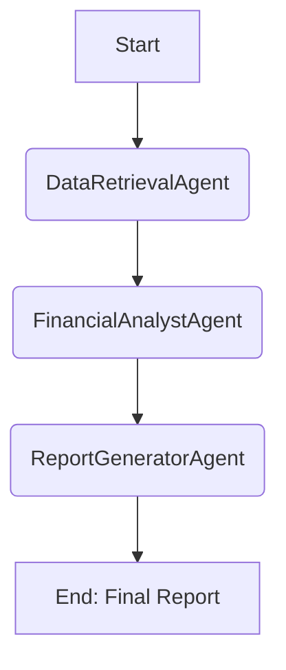

# Workflow Documentation: [Workflow Name]

## 1. Goal

*   **Objective:** What is the primary business or analytical goal of this workflow? (e.g., "To perform a comprehensive credit risk assessment for a given company.")

## 2. Description

*   **Process Overview:** Provide a high-level summary of what this workflow does from start to finish.
*   **Trigger:** How is this workflow initiated? (e.g., "Triggered by a user query for a credit risk report.")

## 3. Agent Sequence & Data Flow

*   **Orchestrator:** Which orchestrator agent manages this workflow?
*   **Agent Chain:** List the agents involved in the order they are typically executed.
    1.  **Agent A (e.g., `DataRetrievalAgent`)**
        *   **Role:** Fetches the initial data.
        *   **Output:** Passes `DataObjectX` to the next agent.
    2.  **Agent B (e.g., `FinancialAnalystAgent`)**
        *   **Role:** Analyzes the data from Agent A.
        *   **Output:** Produces `AnalysisObjectY`.
    3.  **Agent C (e.g., `ReportGeneratorAgent`)**
        *   **Role:** Synthesizes all analysis into a final report.
        *   **Output:** The final user-facing report.

*A Mermaid diagram is highly encouraged to visualize the flow:*



## 4. Configuration

*   **`workflow.yaml`:** Provide an example snippet of how to define this workflow in `workflow.yaml`.
    ```yaml
    - name: [Workflow Name]
      orchestrator: [Orchestrator Agent Name]
      agents:
        - [Agent A Name]
        - [Agent B Name]
        - [Agent C Name]
    ```
*   **Required `agents.yaml` Entries:** List any specific agent configurations that are essential for this workflow to function correctly.

## 5. Expected Output

*   **Final Artifact:** Describe the final output of the workflow (e.g., a JSON object, a PDF report, an entry in the knowledge graph).
*   **Example Output:** Provide a snippet or link to an example of the final output.