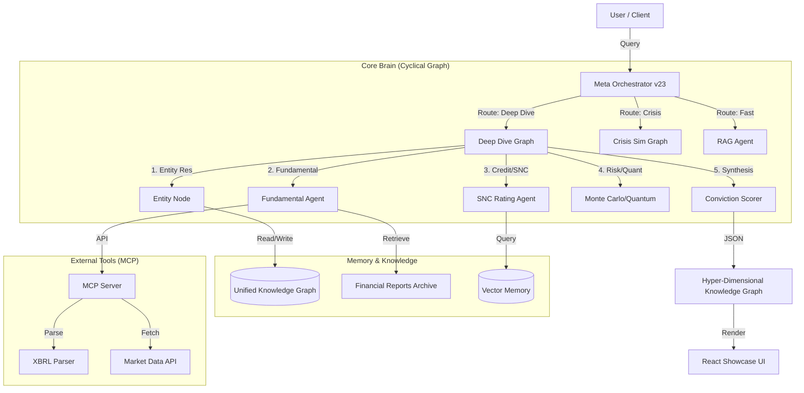

# Adam v23.5 System Architecture

```mermaid
graph TD
    User[User / Client] -->|Query| MetaOrch[Meta Orchestrator v23]

    subgraph "Core Brain (Cyclical Graph)"
        MetaOrch -->|Route: Deep Dive| DDGraph[Deep Dive Graph]
        MetaOrch -->|Route: Crisis| CrisisGraph[Crisis Sim Graph]
        MetaOrch -->|Route: Fast| RAG[RAG Agent]

        DDGraph -->|1. Entity Res| Entity[Entity Node]
        DDGraph -->|2. Fundamental| Fund[Fundamental Agent]
        DDGraph -->|3. Credit/SNC| SNC[SNC Rating Agent]
        DDGraph -->|4. Risk/Quant| Quant[Monte Carlo/Quantum]
        DDGraph -->|5. Synthesis| Synth[Conviction Scorer]
    end

    subgraph "Memory & Knowledge"
        Entity -->|Read/Write| UKG[(Unified Knowledge Graph)]
        Fund -->|Retrieve| Reports[Financial Reports Archive]
        SNC -->|Query| VectorDB[(Vector Memory)]
    end

    subgraph "External Tools (MCP)"
        Fund -->|API| MCPServer[MCP Server]
        MCPServer -->|Parse| XBRL[XBRL Parser]
        MCPServer -->|Fetch| MarketData[Market Data API]
    end

    Synth -->|JSON| Output[Hyper-Dimensional Knowledge Graph]
    Output -->|Render| UI[React Showcase UI]
```
