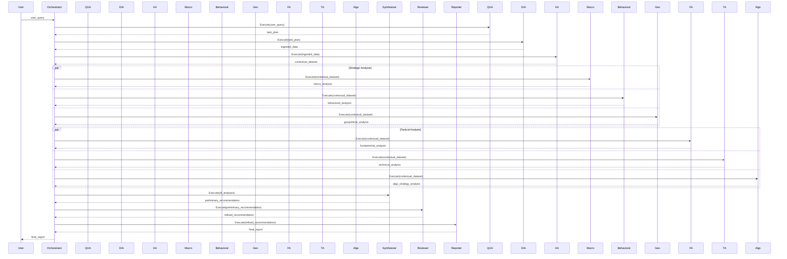

# Adam v21.0 - LLM Prompt

This document contains a consolidated view of the Adam v21.0 repository, intended to be used as a single, comprehensive prompt for a Large Language Model (LLM). It includes the repository's file structure and the contents of key files to provide the necessary context for the LLM to understand the project in its entirety..:
AGENTS.md
CONTRIBUTING.md
Dockerfile
LICENSE
README.md
UI Mockups.md
VERSIONING.md
chatbot
config
core
data
docker-compose.yml
docs
downloads
financial_digital_twin
imports.txt
index.html
llm_prompt.md
logs
navigator.css
navigator.html
navigator.js
prompt_library
prompts
repo_structure.txt
requirements.txt
requirements21.txt
scripts
services
technical_specification
tests
version_control.json
webapp

./chatbot:
index.html

./config:
AGENTS.md
agents.yaml
agents21.yaml
analysis_modules.yaml
api.yaml
api_keys.yaml
cacm-adk-config.yaml
config.yaml
data_sources.yaml
errors.yaml
example_config.yaml
knowledge_graph.yaml
knowledge_graph_schema.yaml
llm_plugin.yaml
logging.yaml
newsletter_layout.yaml
report_layout.yaml
reporting.yaml
semantic_kernel_settings.yaml
settings.yaml
system.yaml
system21.yaml
workflow.yaml
workflow21.yaml

./core:
AGENTS.md
agents
analysis
api.py
data_access
data_sources
embeddings
libraries_and_archives
llm
llm_plugin.py
newsletter_layout
rag
simulations
system
tools
utils
vectorstore
world_simulation

./core/agents:
AGENTS.md
AGENT_CATALOG.md
AGENT_DEVELOPMENT.md
discussion_chair_agent.py
news_bot.py
RAG_AGENT_README.md
snc_analyst_agent.py
__init__.py
agent_base.py
agent_forge.py
algo_trading_agent.py
alternative_data_agent.py
anomaly_detection_agent.py
archive_manager_agent.py
behavioral_economics_agent.py
catalyst_agent.py
code_alchemist.py
crypto_agent.py
data_retrieval_agent.py
data_verification_agent.py
data_visualization_agent.py
developer_swarm
echo_agent.py
event_driven_risk_agent.py
financial_modeling_agent.py
fundamental_analyst_agent.py
geopolitical_risk_agent.py
industry_specialist_agent.py
industry_specialists
knowledge_contribution_agent.py
legal_agent.py
lexica_agent.py
lingua_maestro.py
machine_learning_model_training_agent.py
macroeconomic_analysis_agent.py
market_sentiment_agent.py
meta_agents
meta_cognitive_agent.py
natural_language_generation_agent.py
newsletter_layout_specialist_agent.py
orchestrators
portfolio_optimization_agent.py
prediction_market_agent.py
prompt_generation_agent.py
prompt_tuner.py
query_understanding_agent.py
rag_agent.py
regulatory_compliance_agent.py
report_generator_agent.py
result_aggregation_agent.py
risk_assessment_agent.py
sense_weaver.py
skills
sub_agents
supply_chain_risk_agent.py
technical_analyst_agent.py

./core/agents/developer_swarm:
__init__.py
coder_agent.py
documentation_agent.py
integration_agent.py
on_demand_software_gen.md
planner_agent.py
reviewer_agent.py
test_agent.py

./core/agents/industry_specialists:
consumer_discretionary.py
consumer_staples.py
energy.py
financials.py
healthcare.py
industrials.py
materials.py
real_estate.py
technology.py
telecommunication_services.py
utilities.py

./core/agents/meta_agents:
AGENTS.md
counterparty_risk_agent.py
credit_risk_assessment_agent.py
narrative_summarization_agent.py
persona_communication_agent.py
portfolio_monitoring_ews_agent.py
sentiment_analysis_meta_agent.py

./core/agents/orchestrators:
AGENTS.md
credit_risk_orchestrator.py
creditsentry_orchestrator.py

./core/agents/skills:
FundamentalAnalysisSkill
SNCRatingAssistSkill
rag_skills

./core/agents/skills/FundamentalAnalysisSkill:
SummarizeAnalysis

./core/agents/skills/FundamentalAnalysisSkill/SummarizeAnalysis:
config.json
skprompt.txt

./core/agents/skills/SNCRatingAssistSkill:
AssessNonAccrualStatusIndication
AssessRepaymentCapacity
CollateralRiskAssessment

./core/agents/skills/SNCRatingAssistSkill/AssessNonAccrualStatusIndication:
config.json
skprompt.txt

./core/agents/skills/SNCRatingAssistSkill/AssessRepaymentCapacity:
config.json
skprompt.txt

./core/agents/skills/SNCRatingAssistSkill/CollateralRiskAssessment:
config.json
skprompt.txt

./core/agents/skills/rag_skills:
QueryEnhancerSkill

./core/agents/skills/rag_skills/QueryEnhancerSkill:
config.json
skprompt.txt

./core/agents/sub_agents:
AGENTS.md
compliance_kyc_agent.py
financial_document_agent.py
financial_news_sub_agent.py
internal_systems_agent.py
market_alternative_data_agent.py

./core/analysis:
fundamental_analysis.py
risk_assessment.py
technical_analysis.py
trading_logic.py

./core/data_access:
api_source.py
base_data_source.py
json_file_source.py

./core/data_sources:
AGENTS.md
__init__.py
data_sources.py
financial_news_api.py
government_stats_api.py
market_data_api.py
prediction_market_api.py
social_media_api.py

./core/embeddings:
base_embedding_model.py
models

./core/embeddings/models:
dummy_embedding_model.py
openai_embedding_model.py

./core/libraries_and_archives:
__init__.py
company_recommendations.json
market_overviews.json
newsletters
reports

./core/libraries_and_archives/newsletters:
MM06292025.html
MM09192025.html
market_mayhem_newsletter_july_2025.md
newsletter_2025_02_07.json
newsletter_2025_02_14.json
newsletter_2025_02_21.json
newsletter_2025_03_03.json

./core/libraries_and_archives/reports:
2022 Year in Review: Navigating a Turbulent Market.json
2023 Year in Review: A Year of Recovery and Resilience.json
2024 Year in Review: Navigating Uncertainty and Transition.json
Alphabet_Inc_Credit_Risk_Rating_Report_20250309.json
Q1 2025 and Full Year Outlook: Navigating a Bifurcated Market.json
aapl_CRAS_20250303.json
aapl_snc_20250303.json
ai_thematic_report.json
amzn_company_report.json
crypto_price_target_report_20250311.json
geopolitics_market_impact_20250224.json
geopolitics_thematic_report.json
googl_company_report.json
lmt_company_report_20250224.json
msft_company_report.json
msft_company_report_20250224.json
nvda_company_report_20250225.json
nvda_company_report_20250226.json
nvda_company_report_20250226_final.json
snc_exam_results
software_industry_report.json
software_industry_report_20250225.json
top_10_meme_coins.json

./core/libraries_and_archives/reports/snc_exam_results:
AAL_SNC_Review.md
AMC_SNC_Review.md
BHC_SNC_Review.md
CCL_SNC_Review.md
ConstructAllDevelopments_SNC_Review.md
EverBrightConsumer_Late2025_SNC_Review.md
GlobalAutoParts_SNC_Review.md
HomeGoodsUniverse_SNC_Review.md
IWG_SNC_Review.md
InnovateCloudSolutions_SNC_Review.md
MetroplexGateway_Late2025_SNC_Review.md
PTON_SNC_Review.md
PrecisionComponents_Early2026_SNC_Review.md
SNC_Guide.html
SNC_Guide.md
SunVoltRenewables_SNC_Review.md
SynergyTechDynamics_Early2026_SNC_Review.md

./core/llm:
AGENTS.md
base_llm_engine.py
engines

./core/llm/engines:
dummy_llm_engine.py
openai_llm_engine.py

./core/newsletter_layout:
assets
newsletter_layout_specialist.py
templates

./core/newsletter_layout/assets:
__init__.py

./core/newsletter_layout/templates:
default.html
modern.html

./core/rag:
document_handling.py

./core/simulations:
AGENTS.md
Credit_Rating_Assessment_Simulation.py
Fraud_Detection_Simulation.py
Investment_Committee_Simulation.py
Merger_Acquisition_Simulation.py
Portfolio_Optimization_Simulation.py
Regulatory_Compliance_Simulation.py
Stress_Testing_Simulation.py
__init__.py

./core/system:
__init__.py
agent_orchestrator.py
data_manager.py
echo.py
error_handler.py
interaction_loop.py
knowledge_base.py
monitoring.py
plugin_manager.py
resource_manager.py
system_controller.py
task_scheduler.py

./core/tools:
base_tool.py
web_search_tool.py

./core/utils:
__init__.py
agent_utils.py
api_utils.py
config_utils.py
data_utils.py
formatting_utils.py
reporting_utils.py
secrets_utils.py
token_utils.py

./core/vectorstore:
base_vector_store.py
stores

./core/vectorstore/stores:
in_memory_vector_store.py

./core/world_simulation:
__init__.py
autonomous_world_sim.py
config.py
data_manager.py
default.yaml
llm_driven_sim.py
wsm_v7_1.py

./data:
AGENTS.md
CACM:SaaS_DefaultRisk_v1.jsonld
DATA_NAVIGATION.md
adam_core_data.json
adam_market_baseline.json
clo_analyzer.csv
company_data.json
context_definition.jsonld
credit_rating_decision_tree_v2.json
credit_rating_decision_tree_v3.json
dcf_model_template.csv
dcf_valuation_template.json
deal_template.json
ev_model_template.csv
example_user_portfolio.json
example_user_profile.json
global_risk_appetite_barometer_20250224.csv
knowledge_base.json
knowledge_base_v2.json
knowledge_graph.json
knowledge_graph_v2.json
knowledgegraph.ttl
private_company_template.json
processed_data.csv
risk_rating_mapping.json
risk_rating_mapping_v2.json
simulated_JSONL_output_4262025.jsonl
simulated_JSONL_output_52225_1042.jsonl
sp500_ai_overviews.jsonl
teacher_outputs.jsonl

./docs:
AGENTS.md
Adam v19.1 System Management and Optimization Guide.md
Adam v19.2 Mapping Document.txt
Adam v19.2 system prompt.txt
Adam v21.0 Mapping Document.txt
Adam v21.0 system prompt.txt
Conceptual CACM-ADK System Architecture (Mermaid Syntax).md
DEVELOPMENT_BEST_PRACTICES.md
REQUIREMENTS.md
SYSTEM_OVERVIEW.md
adam_github_summary.json
adam_project_simulation.json
adam_v15.4_guide.md
api.md
api_docs.yaml
architecture.md
chatbot-ui
credit_sentry_architecture.md
deployment.md
federated learning model setup guide.md
getting_started.md
notebooks
setup_guide.md
simulation.ipynb
tutorials.md
user_guide.md
walkthrough.ipynb
webapp.md

./docs/chatbot-ui:
analysis_modules.js
api_communicator.js
event_handlers.js
index.html
knowledge_base.json
menu_functions.js
message_handler.js
script.js
style.css
tutorial.js
ui_components.js
ui_updater.js
utils.js

./docs/notebooks:
AI_Overview_v2.ipynb
CACM-ADK MVP: Interactive Notebook with UI.ipynb
Comprehensive_Credit_Analysis_Notebook.ipynb
FAAv12.ipynb
ICATv4.ipynb
ITPTv6.ipynb
Interactive_Credit_Report_Generator.ipynb
Prompt_Engineering_Assistant.ipynb
Simplified_Credit_Analysis_&_Valuation_Notebook.ipynb
TEFAv5.ipynb
TEFAv7.ipynb
adam_config.ipynb
ccr_v3.ipynb
credit_rating_simulation.ipynb
credit_risk_analysis_report.ipynb
credit_risk_report_v2.ipynb
crypto_analysis.ipynb
financial_assistant_complex_v1.ipynb
fundamental_analysis.ipynb
icat_combo_v1.3.ipynb
knowledge_analysis.ipynb
macroeconomic_data.ipynb
market_mayhem_v4.2.ipynb
market_mayhem_v5.1.ipynb
market_sentiment_analysis.ipynb
price_target_prediction.ipynb
rating_calc.ipynb
technical_analysis.ipynb

./downloads:
download_agents.py

./financial_digital_twin:
01_strategic_imperative.md
02_ontology.md
03_integration_fabric.md
04_hybrid_architecture.md
05_agentic_framework.md
06_advanced_analytics.md
07_governance_and_operationalization.md
08_strategic_roadmap.md
AGENTS.md
ContagionAnalysis-v1.2.jsonld
README.md
base_tsdb.py
example.ttl
fdt_artifacts.md
fdt_bundle.ipynb
fdt_bundle.json
fdt_bundle.yaml
fdt_prompt_library.md
fibo.html
fibo_company_prompt.json
influxdb_client.py
lending.ttl
lending_ontology.ttl
nexus_agent.py
nexus_constitution.jsonld
prompts.md
schema.cypher
schema.py
schema.yaml
schema_fibo.py
twin_builder_agent.py
virtual_twin_schema.md

./logs:
adam.log

./prompt_library:
README.md
communication.json
communication.md
credit_analysis.json
credit_analysis.md
credit_lifecycle
due_diligence.json
due_diligence.md
esg_analysis.json
esg_analysis.md
market_analysis.json
market_analysis.md
model_validation.json
model_validation.md
prompt.schema.json
regulatory_rating.json
regulatory_rating.md
unified_v1.json
unified_v1.md
unified_v2.md
workflow.jsonl

./prompt_library/credit_lifecycle:
advanced_reasoning.yaml
credit_underwriting.yaml
portfolio_monitoring.yaml
system_architecture.yaml

./prompts:
AGENTS.md
CCM_Trend_Report_6-12MOS.json
ICRPL.html
JSON_Prompt_Library.jsonl
JSON_Prompt_Library.md
PROMPT_BEST_PRACTICES.md
adam.html
company_financial_health_swot.json
comparative_company_analysis.json
copilot.html
copilot2.html
copilot3.html
corporate_credit_risk_analysis.json
corporate_credit_risk_analysis.md
credit_rating_assessment_report.json
crypto_asset_analysis_report.json
daily_market_briefing.json
esg_investment_opportunity_scan.json
geopolitical_risk_impact_assessment.json
index.html
intelligent_credit_monitoring_copilot.json
interactive_feedback_review.json
interactive_workflow_definition.json
lib.html
macroeconomic_themed_investment_strategy.json
market_shock_scenario_analysis.json
odyssey_strategic_risk_orchestrator.json
portfolio_optimization_proposal.json
prompt.yaml
prompt_engineering_guide.ipynb
prompt_library.html
prompt_library.md
regulatory_rating_questionnaire.yaml
sector_deep_dive_report.json
technical_analysis_stock_report.json

./scripts:
AGENTS.md
analyze_simulation_results.py
create_agent.py
create_data_source.py
daily_headlines.py
data_processing.py
extract_xai_reasoning.py
generate_newsletter.py
main.py
migration
rag_agent_example.py
report_generation.py
run_adam.py
run_llm_driven_simulation.py
run_simple_simulation.py
run_simulations.sh 
setup_agent.py
setup_agents
startup_helper.py
test_new_agents.py
test_new_agents_isolated.py
version_data.py

./scripts/migration:
migrate_knowledge_base_1.1.0_to_2.0.0.py

./scripts/setup_agents:
README.md
SetupAgent.sol
setup_agent.bat
setup_agent.cpp
setup_agent.cs
setup_agent.go
setup_agent.js
setup_agent.rb
setup_agent.script
setup_agent.sh

./services:
webapp

./services/webapp:
README.md
api.py
celery.py
client
config.py
tests.py

./services/webapp/client:
Dockerfile
README.md
cypress
nginx.conf
package-lock.json
package.json
public
src

./services/webapp/client/cypress:
e2e

./services/webapp/client/cypress/e2e:
analysis.cy.js
login.cy.js
portfolio.cy.js
simulation.cy.js

./services/webapp/client/public:
favicon.ico
index.html
locales
logo192.png
logo512.png
manifest.json
robots.txt

./services/webapp/client/public/locales:
en

./services/webapp/client/public/locales/en:
translation.json

./services/webapp/client/src:
AgentRunner.js
AnalysisTools.js
App.css
App.js
App.test.js
Dashboard.css
Dashboard.js
FundamentalAnalysis.js
KnowledgeGraph.js
Login.js
MarketData.js
MarketSentiment.js
PortfolioManagement.js
RiskAssessment.js
Simulations.js
TechnicalAnalysis.js
i18n.js
index.css
index.js
locales
logo.svg
reportWebVitals.js
setupTests.js
utils

./services/webapp/client/src/locales:
en

./services/webapp/client/src/locales/en:
translation.json

./services/webapp/client/src/utils:
auth.js

./technical_specification:
AGENTIC_PROCESSES.md
ARCHITECTURE.md
DATA_STRATEGY.md
GLOSSARY.md
PROJECT_VISION.md
PROMPT_LIBRARY_GUIDE.md
README.md
RESOURCE_MANAGEMENT.md
SECURITY.md
SETUP_AND_DEPLOYMENT.md
TESTING_STRATEGY.md
UI_AND_CHATBOT.md
api_specification.yaml
config.sample.json
deploy.sh
schema_fibo.yaml

./tests:
AGENTS.md
test_agent_base.py
test_agent_orchestrator.py
test_agents.py
test_config_utils.py
test_data_retrieval_agent.py
test_data_sources.py
test_data_utils.py
test_interaction_loop.py
test_knowledge_base.py
test_query_understanding_agent.py
test_result_aggregation_agent.py
test_secrets_utils.py
test_system.py
test_token_utils.py
test_v21_orchestrator_loading.py
verify_v21_config.py

./webapp:
3d.html
dash.html
index.html
lab.html
llm.html
package-lock.json
pd.html
prompt.html
prompts.json
report.html
schema.json
---
File: README.md
---
**File Name:** `README.md`

**File Path:**

```
adam/
└── README.md
```

**File Content:**

````markdown

# Adam v21.0: Your AI-Powered Financial Analyst
````
**(Welcome to Adam v21.0, the most advanced version yet\! We've supercharged our capabilities with an expanded agent network, enhanced simulation workflows, and a more sophisticated knowledge base to deliver unparalleled financial analysis and investment insights.)**

**[Explore the interactive demo here\!](https://adamvangrover.github.io/adam/chatbot-ui/)**

Adam v21.0 is not just an AI; it's your partner in navigating the complexities of the financial world. Whether you're an individual investor, a seasoned analyst, or a financial institution, Adam v21.0 empowers you with the knowledge and tools to make informed decisions and achieve your financial goals.
````
## What's New in Adam v21.0?

  * **New Agents for Deeper Analysis:**
      * **Behavioral Economics Agent:** Identifies market and user cognitive biases (e.g., herding, confirmation bias) to provide a more nuanced understanding of market behavior.
      * **Meta-Cognitive Agent:** Acts as a quality control layer, reviewing the analysis of other agents for logical fallacies and inconsistencies, ensuring higher quality output.
  * **Enhanced Reasoning and Self-Correction:**
      * **Causal Inference Modeling:** Moves beyond correlation to understand the causal impact of events.
      * **Formalized Self-Correction Loop:** A more robust system for identifying, diagnosing, and correcting errors, allowing the system to learn and improve over time.
  * **Upgraded Core Principles:**
      * **Intellectual Humility:** Proactively acknowledges uncertainty and the probabilistic nature of markets.
      * **Ethical Guardrails:** Stricter operational and ethical boundaries to prevent misuse and ensure fairness.
  * **Improved Agent Architecture:**
      * Enhanced capabilities for monitoring agent performance, managing dependencies, and updating or retiring agents seamlessly.

## Key Features

  * **Comprehensive Financial Analysis:**
      * **Market Sentiment Analysis:** Gauges investor sentiment with advanced NLP and emotion analysis, incorporating news articles, social media, and financial forums.
      * **Macroeconomic & Geopolitical Risk Assessment:** Identifies and analyzes macroeconomic and geopolitical risks and their potential impact on financial markets.
      * **Fundamental & Technical Analysis:** Performs in-depth fundamental and technical analysis of stocks and other financial instruments, leveraging both traditional and alternative data sources.
  * **Personalized Recommendations:**
      * **Tailored to your risk tolerance and investment goals.**
      * **Provides actionable insights and clear explanations.**
  * **Automated Workflows:**
      * **Automated data collection and processing from various sources.**
      * **Customizable strategy implementation with backtesting and optimization capabilities.**
  * **Knowledge Graph Integration:**
      * **Leverages a rich and interconnected knowledge graph for deeper insights and context-aware analysis.**
  * **API Access:**
      * **Provides a unified API for seamless integration with other systems and data sources.**
  * **Dynamic Visualization Engine:**
      * **Generates interactive and informative visualizations to aid in understanding complex data.**
  * **Repository Management System:**
      * **Organizes and manages all Adam v21.0 files, including market overviews, company recommendations, newsletters, and simulation results.**
  * **Feedback and Prompt Refinement Loop:**
      * **Continuously learns and adapts based on user feedback and new information.**

````
## Getting Started

1.  **Clone the Repository:**

    ```bash
    git clone https://github.com/adamvangrover/adam.git
    cd adam
    ```

2.  **Install Dependencies:**

    ```bash
    pip install -r requirements.txt
    ```

3.  **Configure the System:**

      * System configurations are now managed through a set of modular YAML files within the `config/` directory (e.g., `config/agents.yaml`, `config/api.yaml`, `config/data_sources.yaml`, `config/system.yaml`, `config/settings.yaml`, etc.). 
      * The main `config/config.yaml` file is now deprecated for direct configuration and instead points to these modular files. Users should modify the specific files directly to customize settings.
      * `config/example_config.yaml` can be consulted for examples of various structures but is no longer the primary template to copy for runtime configuration.
      * Configure your preferred LLM engine (e.g., OpenAI, Hugging Face Transformers, Google Cloud Vertex AI) by modifying the relevant section in the appropriate modular configuration file (e.g., `config/llm_plugin.yaml` or `config/settings.yaml`).
      * Customize agent configurations and workflows by editing files like `config/agents.yaml` and `config/workflow.yaml` to suit your specific needs.

    **3.1. API Key Configuration**

      * API keys for external services are no longer configured in YAML files. Instead, they must be provided as environment variables. The application will read these environment variables at runtime.
      * For instance, you would set environment variables like: `BEA_API_KEY='your_bea_key'`, `BLS_API_KEY='your_bls_key'`, `IEX_CLOUD_API_KEY='your_iex_key'`, `TWITTER_CONSUMER_KEY='your_twitter_consumer_key'`, etc. 
      * Refer to the specific data source integration or documentation for the exact environment variable names required.

4.  **Run Adam:**

    ```bash
    python scripts/run_adam.py
    ```

## Accessing and Utilizing the Knowledge Graph and API

  * **Knowledge Graph:** Access and query the knowledge graph data directly or through the API. The data is stored in the `data/knowledge_graph.json` file and managed by the Neo4j graph database.
  * **API:** The Adam v21.0 API provides a unified interface for interacting with the system. Refer to the `docs/api_docs.yaml` file for detailed API documentation.

## Documentation

  * **System Requirements:** [docs/REQUIREMENTS.md](docs/REQUIREMENTS.md)
  * **User Guide:** [docs/user\_guide.md](docs/user_guide.md)
  * **API Documentation:** [docs/api\_docs.yaml](docs/api_docs.yaml)
  * **Contribution Guidelines:** [CONTRIBUTING.md](https://github.com/adamvangrover/adam/blob/main/CONTRIBUTING.md)

## Contributing

Contributions are welcome\! Please check [CONTRIBUTING.md](https://github.com/adamvangrover/adam/blob/main/CONTRIBUTING.md) for guidelines.

## License

This project is licensed under the MIT License. See [LICENSE](LICENSE) for details.

## FAQ

### General

  * **What is Adam v21.0?**
      * Adam v21.0 is a highly sophisticated AI-powered financial analytics system designed to provide comprehensive insights and strategic guidance for investors, analysts, and researchers.
  * **Who is Adam v21.0 for?**
      * Adam v21.0 is designed for a wide range of users, including individual investors, financial analysts, portfolio managers, risk managers, and researchers.
  * **How does Adam v21.0 work?**
      * Adam v21.0 utilizes a modular architecture with specialized agents for various tasks, including market sentiment analysis, macroeconomic analysis, geopolitical risk assessment, industry-specific analysis, fundamental and technical analysis, risk assessment, and more. These agents collaborate and interact to provide a holistic view of the financial landscape.
  * **What are the benefits of using Adam v21.0?**
      * Adam v21.0 can help users gain a deeper understanding of the financial markets, identify potential investment opportunities, manage risks, and optimize their portfolios. It also provides access to a wealth of financial knowledge and facilitates informed decision-making.
  * **How can I access Adam v21.0?**
      * Adam v21.0 is currently implemented as a GitHub repository. You can access the code and documentation here: [https://github.com/adamvangrover/adam](https://github.com/adamvangrover/adam)
  * **Is Adam v21.0 free to use?**
      * Yes, Adam v21.0 is open source and free to use.
  * **What are the limitations of Adam v21.0?**
      * As an AI system under development, Adam v21.0 may not always be perfect and its recommendations should not be taken as financial advice. It's essential to conduct your own research and consult with a financial advisor before making any investment decisions.
  * **How can I contribute to Adam v21.0?**
      * Contributions are welcome\! You can contribute by reporting bugs, suggesting enhancements, or submitting code changes. See the `CONTRIBUTING.md` file for more details.
  * **Where can I find more information about Adam v21.0?**
      * You can find more information in the `README.md` file and other documentation files in the repository. You can also explore the interactive tutorials and FAQ section for detailed guidance and examples.

### Features

  * **What is market sentiment analysis?**
      * Market sentiment analysis gauges the overall mood and sentiment of investors in the financial markets. Adam v21.0 uses natural language processing (NLP) and machine learning (ML) techniques to analyze news articles, social media feeds, and other sources to determine the prevailing sentiment towards the market or specific assets.
  * **How does Adam v21.0 perform macroeconomic analysis?**
      * Adam v21.0 analyzes macroeconomic indicators, such as GDP growth, inflation, and interest rates, to assess the health of the economy and its potential impact on financial markets. It uses statistical models and forecasting techniques to provide insights into macroeconomic trends and their implications for investments.
  * **What are geopolitical risks, and how does Adam v21.0 assess them?**
      * Geopolitical risks are events or situations related to international relations, politics, or conflicts that can impact financial markets. Adam v21.0 assesses these risks by analyzing news, political developments, and other relevant data, using NLP and ML techniques to identify and evaluate potential geopolitical risks.
  * **What industries does Adam v21.0 specialize in?**
      * Adam v21.0 can analyze a wide range of industries, with specialized agents for key sectors such as technology, healthcare, energy, and finance. It can also adapt to new industries and sectors through its dynamic agent deployment capabilities.
  * **How does Adam v21.0 conduct fundamental analysis?**
      * Adam v21.0 performs fundamental analysis by analyzing financial statements, evaluating company management, and conducting valuation modeling. It uses a variety of techniques, including discounted cash flow (DCF) analysis, comparable company analysis, and precedent transactions analysis, to determine the intrinsic value of a company or asset.
  * **What technical analysis tools does Adam v21.0 offer?**
      * Adam v21.0 offers various technical analysis tools, including chart pattern recognition, technical indicator analysis, and trading signal generation. It can analyze historical price data and identify trends, support and resistance levels, and other technical patterns to provide insights into potential trading opportunities.
  * **How does Adam v21.0 assess investment risks?**
      * Adam v21.0 assesses investment risks by evaluating market risk, credit risk, liquidity risk, and other relevant factors. It uses quantitative models and simulations to assess the potential impact of different risk factors on investments and portfolios.
  * **What is the World Simulation Model, and how does it work?**
      * The World Simulation Model (WSM) is a module that simulates market conditions and generates probabilistic forecasts to help assess potential investment outcomes. It uses historical data, economic models, and agent-based simulations to generate scenarios and assess their probabilities, providing insights into potential market movements and investment risks.
  * **How does Adam v21.0 generate investment recommendations?**
      * Adam v21.0 generates investment recommendations based on a combination of factors, including market analysis, fundamental analysis, technical analysis, risk assessment, and user preferences. It uses a multi-agent decision-making process, where different agents collaborate and share information to arrive at informed investment recommendations.
  * **What is included in the Adam v21.0 newsletter?**
      * The Adam v21.0 newsletter includes market commentary, investment ideas, risk assessments, and other relevant information for investors. It is generated automatically based on the latest analysis and insights from the system, and can be customized to suit individual preferences and interests.

### Technical

  * **What technologies are used to build Adam v21.0?**
      * Adam v21.0 is built using Python and various libraries for data analysis, machine learning, natural language processing, and web development. It also utilizes a graph database (e.g., Neo4j) for efficient storage and retrieval of financial knowledge.
  * **How is data security and privacy ensured?**
      * Data security and privacy are ensured through encryption, access controls, and adherence to best practices for data management. Adam v21.0 also incorporates regular security audits and vulnerability assessments to identify and mitigate potential security risks.
  * **What are the system requirements for running Adam v21.0?**
      * The system requirements for running Adam v21.0 are detailed in the `README.md` file. They include a server or virtual machine with sufficient resources (CPU, memory, storage) to handle the workload, a compatible operating system (e.g., Linux, macOS, Windows), and the necessary Python packages and dependencies.
  * **How can I deploy Adam v21.0 in different environments?**
      * Adam v21.0 can be deployed in various ways, including direct deployment, virtual environment, Docker container, or cloud platforms. See the `deployment.md` file for more details.
  * **What APIs and data sources does Adam v21.0 integrate with?**
      * Adam v21.0 integrates with various APIs and data sources, including financial news APIs, social media APIs, government statistical agencies, and market data providers. It also incorporates alternative data sources, such as web traffic data, satellite imagery, and blockchain data, to provide a more comprehensive view of the financial landscape.

## Educational Resources

### Financial Concepts

  * **Investment Fundamentals:**
      * **Stocks:** Shares of ownership in a company.
      * **Bonds:** Debt securities issued by companies or governments.
      * **ETFs:** Exchange-traded funds that track a specific index, sector, or asset class.
      * **Mutual Funds:** Investment funds that pool money from multiple investors to invest in a diversified portfolio of securities.
  * **Risk and Return:**
      * The potential for higher returns typically comes with higher risk.
      * Investors need to balance their risk tolerance with their investment goals.
  * **Diversification:**
      * Spreading investments across different asset classes, sectors, and geographies to reduce risk.
  * **Asset Allocation:**
      * The process of deciding how to distribute investments across different asset classes.
  * **Valuation Methods:**
      * Techniques used to determine the intrinsic value of an asset, such as discounted cash flow (DCF) analysis or comparable company analysis.

### Investment Strategies

  * **Value Investing:**
      * Investing in undervalued companies with strong fundamentals.
  * **Growth Investing:**
      * Investing in companies with high growth potential.
  * **Momentum Investing:**
      * Investing in assets that are experiencing upward price trends.
  * **Dividend Investing:**
      * Investing in companies that pay dividends to shareholders.
  * **Index Investing:**
      * Investing in a diversified portfolio of securities that tracks a specific market index.

### Risk Management

  * **Risk Identification and Assessment:**
      * Identifying and evaluating potential investment risks, such as market risk, credit risk, and liquidity risk.
  * **Risk Mitigation Strategies:**
      * Techniques to reduce or manage investment risks, such as diversification, hedging, and position sizing.
  * **Portfolio Diversification:**
      * Spreading investments across different assets to reduce overall portfolio risk.
  * **Hedging:**
      * Using financial instruments to offset potential losses in an investment.
  * **Position Sizing:**
      * Determining the appropriate size of an investment position based on risk tolerance and potential loss.

## Portfolio Theory and Design

### Optimal Portfolio

  * The optimal portfolio is a theoretical concept that aims to maximize return for a given level of risk, or minimize risk for a given level of return.
  * It is based on the efficient frontier, which represents a set of portfolios that offer the highest expected return for each level of risk.

### Risk Tolerance and Asset Allocation

  * **Risk Tolerance:** An investor's ability and willingness to withstand potential investment losses.
  * **Asset Allocation:** The process of distributing investments across different asset classes based on risk tolerance, investment goals, and time horizon.

### Rebalancing and Portfolio Optimization

  * **Rebalancing:** Periodically adjusting the portfolio to maintain the desired asset allocation and risk profile.
  * **Portfolio Optimization:** Using mathematical models and algorithms to optimize the portfolio based on specific criteria, such as maximizing return or minimizing risk.

## Architecture

> **Note:** This section provides a high-level overview of the system architecture. For a more detailed and up-to-date description of the system's requirements, including functional and non-functional requirements, please refer to the [System Requirements Document](docs/REQUIREMENTS.md).

### Overview

Adam v21.0 builds upon the modular, agent-based architecture of its predecessors, incorporating new agents, simulations, and enhanced capabilities to provide a more in-depth and nuanced understanding of financial markets. The system leverages a network of specialized agents, each responsible for a specific domain of expertise, such as market sentiment analysis, macroeconomic analysis, fundamental analysis, technical analysis, risk assessment, and more. These agents collaborate and interact to provide a holistic view of the financial landscape, enabling informed investment decisions and risk management.

### Core Components

Adam v21.0 comprises the following core components:

  * **Agents:**

      * Market Sentiment Agent: Analyzes market sentiment from news, social media, and other sources.
      * Macroeconomic Analysis Agent: Analyzes macroeconomic data and trends.
      * Geopolitical Risk Agent: Assesses geopolitical risks and their potential impact on markets.
      * Industry Specialist Agent: Provides in-depth analysis of specific industry sectors.
      * Fundamental Analysis Agent: Conducts fundamental analysis of companies.
      * Technical Analysis Agent: Performs technical analysis of financial instruments.
      * Risk Assessment Agent: Assesses and manages investment risks.
      * Prediction Market Agent: Gathers and analyzes data from prediction markets.
      * Alternative Data Agent: Explores and integrates alternative data sources.
      * Agent Forge: Automates the creation of specialized agents.
      * Prompt Tuner: Refines and optimizes prompts for communication and analysis.
      * Code Alchemist: Enhances code generation, validation, and deployment.
      * Lingua Maestro: Handles multi-language translation and communication.
      * Sense Weaver: Handles multi-modal inputs and outputs.
      * Data Visualization Agent: Generates interactive and informative visualizations.
      * Natural Language Generation Agent: Generates human-readable reports and narratives.
      * Machine Learning Model Training Agent: Trains and updates machine learning models.
      * SNC Analyst Agent: Specializes in the analysis of Shared National Credits (SNCs).
      * Crypto Agent: Specializes in the analysis of crypto assets.
      * Discussion Chair Agent: Leads discussions and makes final decisions in simulations.
      * Legal Agent: Provides legal advice and analysis.
      * Regulatory Compliance Agent: Ensures compliance with financial regulations (to be developed).
      * Anomaly Detection Agent: Detects anomalies and potential fraud (to be developed).
      * Behavioral Economics Agent: Analyzes market data and user interactions for signs of cognitive biases and irrational behavior.
      * Meta-Cognitive Agent: Monitors the reasoning and outputs of other agents to ensure logical consistency, coherence, and alignment with core principles.

  * **Simulations:**

      * Credit Rating Assessment Simulation: Simulates the credit rating process for a company.
      * Investment Committee Simulation: Simulates the investment decision-making process.
      * Portfolio Optimization Simulation: Simulates the optimization of an investment portfolio.
      * Stress Testing Simulation: Simulates the impact of stress scenarios on a portfolio or institution.
      * Merger & Acquisition (M\&A) Simulation: Simulates the evaluation and execution of an M\&A transaction.
      * Regulatory Compliance Simulation: Simulates the process of ensuring compliance with regulations.
      * Fraud Detection Simulation: Simulates the detection of fraudulent activities.

  * **Data Sources:**

      * Financial news APIs (e.g., Bloomberg, Reuters)
      * Social media APIs (e.g., Twitter, Reddit)
      * Government statistical agencies (e.g., Bureau of Labor Statistics, Federal Reserve)
      * Company filings (e.g., SEC filings, 10-K reports)
      * Market data providers (e.g., Refinitiv, S\&P Global)
      * Prediction market platforms (e.g., PredictIt, Kalshi)
      * Alternative data providers (e.g., web traffic data, satellite imagery)
      * Blockchain explorers (e.g., Etherscan, Blockchain.com)
      * Legal databases (e.g., Westlaw, LexisNexis)
      * Regulatory databases (e.g., SEC Edgar, Federal Register)

  * **Analysis Modules:**

      * Fundamental analysis (e.g., DCF valuation, ratio analysis)
      * Technical analysis (e.g., indicator calculation, pattern recognition)
      * Risk assessment (e.g., volatility calculation, risk modeling)
      * Sentiment analysis (e.g., NLP, emotion analysis)
      * Prediction market analysis (e.g., probability estimation, trend analysis)
      * Alternative data analysis (e.g., machine learning, data visualization)
      * Legal analysis (e.g., compliance checks, risk assessment)

  * **World Simulation Model (WSM):** A probabilistic forecasting and scenario analysis module that simulates market conditions and provides insights into potential outcomes. It uses historical data, economic models, and agent-based simulations to generate scenarios and assess their probabilities.

  * **Knowledge Base:** A comprehensive knowledge graph storing financial concepts, market data, company information, industry data, and more. It is powered by a graph database (e.g., Neo4j) to enable efficient storage and retrieval of interconnected data.

  * **Libraries and Archives:** Storage for market overviews, company recommendations, newsletters, simulation results, and other historical data. These archives are used for backtesting, performance analysis, and knowledge discovery.

  * **System Operations:**

      * Agent orchestration and collaboration: Manages the interaction and communication between agents.
      * Resource management and task prioritization: Allocates resources and prioritizes tasks based on their importance and urgency.
      * Data acquisition and processing: Collects, cleans, and processes data from various sources.
      * Knowledge base management: Updates and maintains the knowledge graph.
      * Output generation and reporting: Generates reports, visualizations, and other outputs based on the analysis.

## Data Flow

The data flow in Adam v21.0 involves the following steps:

1.  **Data Acquisition:** Agents acquire data from various sources.
2.  **Data Processing:** Agents process and analyze the data using appropriate techniques.
3.  **Information Sharing:** Agents share information and insights through the knowledge base and direct communication.
4.  **Simulation Execution:** Simulations orchestrate agent interactions to analyze specific scenarios.
5.  **Decision Making:** Agents and simulations make decisions and recommendations based on their analysis.
6.  **Output Generation:** The system generates reports, visualizations, and other outputs.
7.  **Archiving:** Outputs and relevant data are archived for future reference and analysis.

## Architecture Diagram

```
+-----------------------+
|       Adam v21.0      |
|                       |
|  +-----------------+  |
|  |  Data Sources  |  |
|  +-----------------+  |
|        ^ ^ ^        |
|        | | |        |
|  +------+ +------+  |
|  | Agents |-------|  |
|  +------+ |  Simulations  |
|          | +------+  |
|          v v v        |
|  +-----------------+  |
|  | Analysis Modules |  |
|  +-----------------+  |
|        ^ ^ ^        |
|        | | |        |
|  +------+ +------+  |
|  |Knowledge|-------|  |
|  |  Base   |  World Simulation Model  |
|  +------+ +------+  |
|        | | |        |
|        v v v        |
|  +-----------------+  |
|  |  System Operations |  |
|  +-----------------+  |
|        |               |
|        v               |
|  +-----------------+  |
|  |      Outputs     |  |
|  +-----------------+  |
+-----------------------+
```

## Design Principles

Adam v21.0's architecture adheres to the following design principles:

  * **Modularity:** The system is composed of independent modules that can be developed, tested, and deployed separately.
  * **Scalability:** The architecture allows for easy scaling by adding new agents or data sources as needed.
  * **Adaptability:** The system can adapt to changing market conditions and user preferences through dynamic agent deployment and machine learning.
  * **Transparency:** The reasoning processes and data sources used by the system are transparent and explainable.
  * **Collaboration:** The agents collaborate effectively to provide a holistic view of the financial markets.
  * **Security:** The system incorporates robust security measures to protect sensitive data and ensure system integrity.

## Future Enhancements

Future enhancements to the architecture may include:

  * **Enhanced Machine Learning:** Integrate more sophisticated machine learning and deep learning techniques for predictive modeling and pattern recognition.
  * **Real-Time Data Integration:** Incorporate real-time data feeds for more dynamic analysis and decision-making.
  * **Distributed Architecture:** Deploy the system across a distributed network for improved performance and scalability.
  * **User Interface Enhancements:** Develop a more interactive and user-friendly interface for accessing and visualizing data.
  * **Explainable AI (XAI) Enhancements:** Expand XAI capabilities to provide more detailed and comprehensive explanations for the system's decisions and recommendations.
  * **Integration with External Systems:** Integrate with external systems, such as portfolio management platforms and trading platforms, to enable seamless execution of investment strategies.

## Interactive Tutorials

Adam v21.0 offers interactive tutorials to guide you through its features and capabilities. These tutorials cover various topics, including:

  * **Introduction to Adam v21.0:** Overview of the system, its components, and how to get started.
  * **Market Sentiment Analysis:** Analyzing market sentiment using NLP and ML techniques.
  * **Fundamental Analysis:** Performing in-depth analysis of company financials and valuation.
  * **Technical Analysis:** Analyzing price trends, chart patterns, and technical indicators.
  * **Risk Assessment:** Evaluating investment risks and developing mitigation strategies.
  * **Prediction Market Analysis:** Gathering and analyzing data from prediction markets.
  * **Alternative Data Analysis:** Exploring and integrating alternative data sources.
  * **Simulations:** Running various simulations to analyze complex scenarios.
  * **Advanced Topics:** Customizing and extending the system, integrating with external systems, and contributing to the project.

You can access the interactive tutorials here: https://github.com/adamvangrover/adam/blob/main/docs/tutorials.md

## Contributing

Contributions to Adam v21.0 are welcome\! Please check the [CONTRIBUTING.md](https://github.com/adamvangrover/adam/blob/main/CONTRIBUTING.md) file for guidelines on how to contribute to the project.

## Support and Feedback

If you have any questions or feedback, please feel free to reach out to the Adam v21.0 development team. You can submit issues or pull requests on the GitHub repository or contact the developers directly.

We hope this comprehensive README provides a solid foundation for understanding and utilizing the power of Adam v21.0. As you explore its features and capabilities, you'll discover new ways to enhance your financial analysis and decision-making processes.
---
File: AGENTS.md
---
# Welcome to the ADAM Project!

This document provides guidance for AI agents working with the ADAM codebase.

## High-Level Goal

The primary goal of the ADAM project is to create a sophisticated, autonomous AI system that can perform complex financial analysis, generate insightful reports, and adapt to new information and user requirements.

## Core Principles

When working on the ADAM project, please adhere to the following principles:

*   **Modularity:** Keep code modular and well-documented. Each component should have a clear purpose and interface.
*   **Extensibility:** Design components to be easily extended and adapted for new use cases.
*   **Robustness:** Implement comprehensive error handling and logging to ensure the system is resilient and debuggable.
*   **Efficiency:** Optimize code for performance, especially in data-intensive and computationally expensive tasks.

## Table of Contents

*   [High-Level Goal](#high-level-goal)
*   [Core Principles](#core-principles)
*   [System Architecture](#system-architecture)
    *   [Key Components](#key-components)
    *   [Component Interaction](#component-interaction)
*   [Agent Architecture](#agent-architecture)
    *   [Sub-Agents](#sub-agents)
    *   [Meta-Agents](#meta-agents)
    *   [Orchestrator Agents](#orchestrator-agents)
*   [Getting Started](#getting-started)
*   [Contribution Guidelines](#contribution-guidelines)

## System Architecture

The ADAM system is built on a modular architecture that consists of several key components. These components work together to provide a flexible and extensible platform for building and deploying autonomous agents.

### Key Components

*   **Agents:** Autonomous agents that perform specific tasks, such as data retrieval, analysis, and reporting. Agents are the core of the ADAM system and are responsible for carrying out the main logic of the application.
*   **Core:** The central infrastructure that supports the agents, including the main loop, data management, and communication. The core provides the essential services that agents need to operate, such as a message bus for inter-agent communication and a data store for persisting information.
*   **Data Sources:** Modules for accessing various data sources, such as APIs and databases. Data sources provide a standardized interface for retrieving data, regardless of the underlying source.
*   **LLM Engine:** The language model engine that provides natural language processing capabilities. The LLM engine is used for tasks such as text generation, summarization, and question answering.
*   **Simulations:** Environments for testing and evaluating the agents' performance. Simulations provide a controlled environment for running experiments and measuring key performance indicators.

### Component Interaction

The components of the ADAM system interact with each other in the following way:

1.  The **core** initializes the system and starts the main loop.
2.  The **core** loads the **agents** and other components based on the configuration files.
3.  **Agents** use the **data sources** to retrieve data from various sources.
4.  **Agents** use the **LLM engine** to perform natural language processing tasks.
5.  **Agents** communicate with each other through the **core's** message bus.
6.  **Simulations** use the **core** to run experiments and evaluate the performance of the **agents**.

## Agent Architecture

The ADAM system employs a hierarchical agent architecture that consists of three types of agents: Sub-Agents, Meta-Agents, and Orchestrator Agents. This architecture is designed to separate concerns, improve modularity, and enable the development of sophisticated AI applications.

### Sub-Agents

*   **Role:** Sub-Agents are the "worker bees" of the system. They are responsible for performing specific, narrow, and well-defined tasks related to data acquisition and processing.
*   **Responsibilities:**
    *   Interacting directly with data sources and tools (e.g., APIs, databases, OCR engines).
    *   Producing structured, verifiable data with metadata (e.g., source, confidence score).
    *   Handling errors gracefully and providing structured error messages.
*   **Example:** A Sub-Agent might be responsible for fetching financial data from a specific API or parsing a specific type of document.

### Meta-Agents

*   **Role:** Meta-Agents are the "analysts" and "strategists" of the system. They are responsible for performing higher-order tasks that require analysis, synthesis, and interpretation.
*   **Responsibilities:**
    *   Operating on the structured, verified data provided by Sub-Agents.
    *   Encapsulating complex business logic, analytical models, and qualitative frameworks.
    *   Transforming data into a more abstract or analytical form (e.g., a risk rating, a summary, a forecast).
*   **Example:** A Meta-Agent might take financial data from a Sub-Agent and use it to generate a credit risk assessment.

#### New Meta-Agents in v21.0

*   **Behavioral Economics Agent:** Analyzes market data and user interactions for signs of cognitive biases and irrational behavior.
*   **Meta-Cognitive Agent:** Monitors the reasoning and outputs of other agents to ensure logical consistency, coherence, and alignment with core principles.

### Orchestrator Agents

*   **Role:** The Orchestrator Agent is the "brain" and "central nervous system" of the entire agentic system. It is the highest level of control, responsible for interpreting user intent, formulating plans, delegating tasks, and synthesizing a final, coherent response.
*   **Responsibilities:**
    *   Understanding user goals and decomposing them into a sequence of tasks.
    *   Delegating tasks to the appropriate Sub-Agents and Meta-Agents.
    *   Managing the workflow, including handling dependencies and errors.
    *   Synthesizing the results from multiple agents into a final response.
*   **Example:** An Orchestrator Agent might take a user query like "What is the credit risk of Apple Inc.?", delegate the task of gathering financial data to a Sub-Agent, delegate the task of assessing credit risk to a Meta-Agent, and then synthesize the results into a comprehensive report.

## Getting Started

To get started, please familiarize yourself with the following:

*   **`config/`:** This directory contains the configuration files for the system.
*   **`core/`:** This directory contains the core components of the system.
*   **`docs/`:** This directory contains the documentation for the system.
*   **`tests/`:** This directory contains the tests for the system.

## Contribution Guidelines

Please follow these guidelines when contributing to the ADAM project:

*   Write clear and concise commit messages.
*   Update the documentation when adding new features or changing existing ones.
*   Write unit tests for all new code.
*   Ensure that all tests pass before submitting a pull request.

Thank you for your contributions to the ADAM project!
---
File: core/system/system_controller.py
---
# core/system/system_controller.py

from plugin_manager import PluginManager
from agents import * # Import all agents
from core.utils.config_utils import load_app_config # Added import

class SystemController:
    def __init__(self, config: dict):
        """
        Initializes the SystemController with a pre-loaded configuration dictionary.

        Args:
            config (dict): The configuration dictionary.
        """
        self.config = config
        self.plugin_manager = PluginManager(self.config)

        # Initialize agents based on configuration
        # Ensure 'agents' key exists, provide default if necessary
        agents_config = self.config.get("agents", {})
        self.agents = {}
        for agent_name, agent_config in agents_config.items():
            # Ensure agent_config is a dictionary and 'enabled' key exists
            if isinstance(agent_config, dict) and agent_config.get("enabled"):
                agent_class = globals().get(agent_name)  # Use .get for safety
                if agent_class:
                    self.agents[agent_name] = agent_class(agent_config)
                else:
                    # Optionally log a warning if an agent class is not found
                    print(f"Warning: Agent class '{agent_name}' not found.")


    def run(self):
        """
        Runs the main loop of the system, handling user input and agent interactions.
        """
        while True:
            # Get user input
            user_input = input("> ")

            # Process user input and dispatch to appropriate agent or simulation
            if user_input.startswith("!"):
                self.process_command(user_input)
            else:
                # ... handle other types of input

    def process_command(self, command):
        """
        Processes a user command and dispatches it to the appropriate agent or simulation.

        Args:
            command (str): The user command.
        """
        # Parse command and arguments
        # ...

        # Dispatch command to agent or simulation
        if command_name == "sentiment":
            self.agents["market_sentiment_agent"].analyze_sentiment(command_args)
        elif command_name == "fundamental":
            self.agents["fundamental_analysis_agent"].analyze_company(command_args)
        # ... other commands

    def run_simulation(self, simulation_name, simulation_args):
        """
        Runs the specified simulation with the given arguments.

        Args:
            simulation_name (str): The name of the simulation.
            simulation_args (dict): Arguments for the simulation.
        """
        # Get simulation configuration
        simulation_config = self.config["simulations"][simulation_name]

        # Initialize simulation agents
        simulation_agents = {}
        for agent_name in simulation_config["default_agents"]:
            simulation_agents[agent_name] = self.agents[agent_name]

        # Run the simulation
        # ...

# Example usage
if __name__ == "__main__":
    app_config = load_app_config()
    # Check if 'agents' key is present, as SystemController __init__ expects it.
    # load_app_config should provide it if agents.yaml is loaded.
    if "agents" not in app_config:
        print("Warning: 'agents' key not found in loaded app_config. SystemController might not initialize agents correctly.")
        app_config["agents"] = {} # Provide a default empty dict for agents

    controller = SystemController(config=app_config)
    controller.run()
---
File: core/system/agent_orchestrator.py
---
# core/system/agent_orchestrator.py

import logging
import yaml
import os
import importlib
from pathlib import Path
from collections import deque
from typing import Dict, Optional, List, Any

import asyncio  # expand asynchronous communication
import json

from core.agents.agent_base import AgentBase
from core.llm_plugin import LLMPlugin

from core.agents.query_understanding_agent import QueryUnderstandingAgent
from core.agents.data_retrieval_agent import DataRetrievalAgent
from core.agents.market_sentiment_agent import MarketSentimentAgent
from core.agents.macroeconomic_analysis_agent import MacroeconomicAnalysisAgent
from core.agents.geopolitical_risk_agent import GeopoliticalRiskAgent
from core.agents.industry_specialist_agent import IndustrySpecialistAgent
from core.agents.fundamental_analyst_agent import FundamentalAnalystAgent
from core.agents.technical_analyst_agent import TechnicalAnalystAgent
from core.agents.risk_assessment_agent import RiskAssessmentAgent
from core.agents.newsletter_layout_specialist_agent import NewsletterLayoutSpecialistAgent
from core.agents.data_verification_agent import DataVerificationAgent
from core.agents.lexica_agent import LexicaAgent
from core.agents.archive_manager_agent import ArchiveManagerAgent
from core.agents.agent_forge import AgentForge
from core.agents.prompt_tuner import PromptTuner
from core.agents.code_alchemist import CodeAlchemist
from core.agents.lingua_maestro import LinguaMaestro
from core.agents.sense_weaver import SenseWeaver
from core.agents.snc_analyst_agent import SNCAnalystAgent # Added import
from core.agents.behavioral_economics_agent import BehavioralEconomicsAgent
from core.agents.meta_cognitive_agent import MetaCognitiveAgent

from core.utils.config_utils import load_config
from core.utils.secrets_utils import get_api_key # Added import

# Semantic Kernel imports
from semantic_kernel import Kernel
from semantic_kernel.connectors.ai.open_ai import OpenAIChatCompletion
# from semantic_kernel.connectors.ai.azure_open_ai import AzureChatCompletion # Example for later
# from semantic_kernel.connectors.ai.hugging_face import HuggingFaceTextCompletion # Example for later


# Configure logging
# Ensure logging is configured. If it's already configured at a higher level (e.g. main script),
# this line might be redundant or could be adjusted. For now, keeping it.
logging.basicConfig(level=logging.INFO, format="%(asctime)s - %(levelname)s - %(message)s")

from financial_digital_twin.nexus_agent import NexusAgent
# Dictionary mapping agent names to their module paths for dynamic loading
AGENT_CLASSES = {
    "MarketSentimentAgent": "core.agents.market_sentiment_agent",
    "MacroeconomicAnalysisAgent": "core.agents.macroeconomic_analysis_agent",
    "GeopoliticalRiskAgent": "core.agents.geopolitical_risk_agent",
    "IndustrySpecialistAgent": "core.agents.industry_specialist_agent",
    "FundamentalAnalystAgent": "core.agents.fundamental_analyst_agent",
    "TechnicalAnalystAgent": "core.agents.technical_analyst_agent",
    "RiskAssessmentAgent": "core.agents.risk_assessment_agent",
    "NewsletterLayoutSpecialistAgent": "core.agents.newsletter_layout_specialist_agent",
    "DataVerificationAgent": "core.agents.data_verification_agent",
    "LexicaAgent": "core.agents.lexica_agent",
    "ArchiveManagerAgent": "core.agents.archive_manager_agent",
    "AgentForge": "core.agents.agent_forge",
    "PromptTuner": "core.agents.prompt_tuner",
    "CodeAlchemist": "core.agents.code_alchemist",
    "LinguaMaestro": "core.agents.lingua_maestro",
    "SenseWeaver": "core.agents.sense_weaver",
    "QueryUnderstandingAgent": "core.agents.query_understanding_agent",
    "DataRetrievalAgent": "core.agents.data_retrieval_agent",
    "ResultAggregationAgent": "core.agents.result_aggregation_agent",
    "ReportGeneratorAgent": "core.agents.report_generator_agent",
    "SNCAnalystAgent": "core.agents.snc_analyst_agent", # Added snc_analyst_agent
    "BehavioralEconomicsAgent": "core.agents.behavioral_economics_agent",
    "MetaCognitiveAgent": "core.agents.meta_cognitive_agent",
    "NewsBotAgent": "core.agents.news_bot",
    "NexusAgent": NexusAgent,
    "IngestionAgent": AgentBase, # Using AgentBase as a placeholder
    "AuditorAgent": AgentBase, # Using AgentBase as a placeholder
}


class AgentOrchestrator:
    """
    Manages the creation, execution, and communication of agents.
    This version incorporates MCP and A2A, and leverages Semantic Kernel.
    """

    def __init__(self):
        self.agents: Dict[str, AgentBase] = {}
        self.config = load_config("config/config.yaml")
        self.workflows = self.load_workflows()  # Load workflows
        self.llm_plugin = LLMPlugin()
        self.mcp_service_registry: Dict[
            str, Dict[str, Any]
        ] = {}  # MCP service registry
        self.sk_kernel: Optional[Kernel] = None # Initialize Semantic Kernel instance to None

        if self.config is None:
            logging.error("Failed to load agent configurations (config/config.yaml).")
        else:
            self.load_agents()
            self.establish_a2a_connections()
            self.register_agent_skills()  # Register agent skills with MCP

        # Initialize Semantic Kernel
        try:
            sk_settings_config = load_config('config/semantic_kernel_settings.yaml')
            if not sk_settings_config or 'semantic_kernel_settings' not in sk_settings_config:
                logging.error("Semantic Kernel settings not found or empty in config/semantic_kernel_settings.yaml. SK will not be available.")
                # self.sk_kernel remains None
            else:
                sk_settings = sk_settings_config['semantic_kernel_settings']
                default_service_id = sk_settings.get('default_completion_service_id')
                completion_services = sk_settings.get('completion_services')

                if not default_service_id or not completion_services:
                    logging.error("Default service ID or completion_services not defined in Semantic Kernel settings. SK will not be available.")
                    # self.sk_kernel remains None
                else:
                    service_config = completion_services.get(default_service_id)
                    if not service_config:
                        logging.error(f"Configuration for default service ID '{default_service_id}' not found in completion_services. SK will not be available.")
                        # self.sk_kernel remains None
                    else:
                        kernel_instance = Kernel()
                        service_type = service_config.get('service_type')
                        model_id = service_config.get('model_id')

                        if service_type == "OpenAI":
                            api_key = get_api_key('OPENAI_API_KEY')
                            # Optional: Fetch org_id if specified in sk_settings for this service
                            # org_id_env_var = service_config.get('org_id_env_var')
                            # org_id = get_api_key(org_id_env_var) if org_id_env_var else None
                            org_id = get_api_key('OPENAI_ORG_ID') # Simpler: always try OPENAI_ORG_ID

                            if api_key and model_id:
                                try:
                                    service_instance = OpenAIChatCompletion(
                                        model_id=model_id,
                                        api_key=api_key,
                                        org_id=org_id if org_id else None
                                    )
                                    kernel_instance.add_chat_service("default_completion", service_instance)
                                    self.sk_kernel = kernel_instance # Assign successfully configured kernel
                                    logging.info(f"Semantic Kernel initialized with OpenAI service '{default_service_id}' (model: {model_id}).")
                                except Exception as e:
                                    logging.error(f"Failed to initialize and add OpenAI service to Semantic Kernel: {e}")
                                    # self.sk_kernel remains None as it was before this block
                            else:
                                logging.error("OpenAI API key or model_id missing. Cannot configure OpenAI service for Semantic Kernel. SK will not be available.")
                                # self.sk_kernel remains None
                        # elif service_type == "AzureOpenAI":
                            # Placeholder for Azure OpenAI configuration
                            # logging.info("AzureOpenAI service type found, implementation pending.")
                        # elif service_type == "HuggingFace":
                            # Placeholder for HuggingFace configuration
                            # logging.info("HuggingFace service type found, implementation pending.")
                        else:
                            logging.error(f"Unsupported Semantic Kernel service type: {service_type}. SK will not be available.")
                            # self.sk_kernel remains None
        except Exception as e:
            logging.error(f"An unexpected error occurred during Semantic Kernel initialization: {e}")
            self.sk_kernel = None # Ensure it's None on any exception during init

        # Load Semantic Kernel skills if kernel was initialized
        if self.sk_kernel:
            skills_directory = "core/agents/skills/"
            if os.path.isdir(skills_directory):
                for skill_collection_name in os.listdir(skills_directory):
                    skill_collection_path = os.path.join(skills_directory, skill_collection_name)
                    if os.path.isdir(skill_collection_path):
                        try:
                            logging.info(f"Importing SK skill collection: {skill_collection_name} from {skill_collection_path}")
                            # For SK v0.x Python: kernel.import_skill(skill_instance, skill_name) or for directory:
                            # kernel.import_semantic_skill_from_directory(parent_directory, skill_directory_name)
                            # or kernel.import_skill_from_directory (newer pre-v1)
                            # The problem asks for import_skill(parent_directory=..., skill_collection_name=...)
                            # which is slightly different from standard.
                            # A common pattern for directory import is:
                            # self.sk_kernel.import_skill(parent_directory=skills_directory, skill_directory=skill_collection_name)
                            # or using plugins: self.sk_kernel.add_plugin(parent_directory=skills_directory, plugin_name=skill_collection_name)
                            # Given the context of "skills" and "collections", and the AgentBase method using
                            # kernel.skills.get_function, this implies a structure where skills are registered under a collection name.
                            # The method import_skill_from_directory(parent_directory, skill_directory_name) is appropriate here.
                            # skill_directory_name becomes the collection name.
                            self.sk_kernel.import_skill_from_directory(skills_directory, skill_collection_name)
                            logging.info(f"Successfully imported SK skill collection: {skill_collection_name}")
                        except Exception as e:
                            logging.error(f"Failed to import SK skill collection '{skill_collection_name}': {e}")
            else:
                logging.warning(f"Skills directory '{skills_directory}' not found. No SK skills loaded.")


    def load_agents(self):
        """Loads agents based on the new configuration structure."""
        if not self.config or 'agents' not in self.config:
            logging.error("Agent configuration 'agents' key not found in config.yaml.")
            return

        for agent_config in self.config.get('agents', []):
            agent_name = agent_config.get('name')
            if not agent_name:
                logging.warning("Skipping agent configuration with no name.")
                continue

            try:
                agent_class = self._get_agent_class(agent_name)
                if agent_class:
                    constitution = None
                    constitution_path = agent_config.get('constitution_path')
                    if constitution_path:
                        try:
                            with open(constitution_path, 'r') as f:
                                constitution = json.load(f)
                        except FileNotFoundError:
                            logging.error(f"Constitution file not found for {agent_name} at {constitution_path}")
                        except json.JSONDecodeError:
                            logging.error(f"Failed to decode JSON from constitution file for {agent_name} at {constitution_path}")

                    # Pass agent_config, constitution, and kernel to the agent
                    self.agents[agent_name] = agent_class(
                        config=agent_config,
                        constitution=constitution,
                        kernel=self.sk_kernel
                    )
                    logging.info(f"Agent loaded: {agent_name}")
                else:
                    logging.warning(f"Agent class not found for: {agent_name}")
            except Exception as e:
                logging.error(f"Failed to load agent {agent_name}: {e}", exc_info=True)

    def _get_agent_class(self, agent_name: str):
        """Retrieves the agent class based on its name."""

        return AGENT_CLASSES.get(agent_name)

    def get_agent(self, agent_name: str) -> Optional[AgentBase]:
        """Retrieves an agent by name."""

        return self.agents.get(agent_name)

    def execute_agent(
        self, agent_name: str, context: Dict[str, Any]
    ) -> Optional[Any]:  # Changed return type to Any
        """Executes an agent with the given context (MCP)."""

        agent = self.get_agent(agent_name)
        if agent:
            try:
                agent.set_context(context)  # Set the MCP context
                return agent.execute(**context)  # Pass context as kwargs
            except Exception as e:
                logging.exception(f"Error executing agent {agent_name}: {e}")
                return None  # Or raise, depending on error handling policy
        else:
            logging.error(f"Agent not found: {agent_name}")
            return None

    async def execute_workflow(
        self, workflow_name: str, initial_context: Dict[str, Any]
    ) -> Optional[Dict[str, Any]]:
        """
        Executes a workflow defined in config/workflows.yaml, handling
        agent dependencies, A2A communication, and MCP skill discovery.
        """

        workflow = self.workflows.get(workflow_name)
        if not workflow:
            logging.error(f"Unknown workflow: {workflow_name}")
            return None

        results: Dict[str, Any] = {}
        execution_queue: deque[str] = deque(workflow["agents"])
        completed_agents: set[str] = set()

        while execution_queue:
            agent_name: str = execution_queue.popleft()
            dependencies: List[str] = workflow["dependencies"].get(agent_name, [])

            if all(dep in completed_agents for dep in dependencies):
                try:
                    agent: Optional[AgentBase] = self.get_agent(agent_name)
                    if not agent:
                        logging.error(
                            f"Agent '{agent_name}' not found for workflow '{workflow_name}'"
                        )
                        return None

                    # Prepare the context for the agent
                    agent_context: Dict[str, Any] = self.prepare_agent_context(
                        agent_name, initial_context, results
                    )

                    # Execute the agent and store the result
                    result: Any = await agent.execute(**agent_context)  # Await agent execution
                    results[agent_name] = result

                    # Handle A2A communication (if any)
                    await self.handle_a2a_communication(
                        agent, agent_name, workflow_name, results, initial_context
                    )

                except Exception as e:
                    logging.error(
                        f"Error executing '{agent_name}' in workflow '{workflow_name}': {e}"
                    )
                    return None

            else:
                execution_queue.append(agent_name)  # Re-queue if dependencies not met

            # Prevent infinite loops
            if agent_name == execution_queue[0] and len(execution_queue) > 1:
                unmet_dependencies: List[str] = [
                    dep for dep in dependencies if dep not in completed_agents
                ]
                logging.error(
                    f"Workflow '{workflow_name}' stuck. Agent '{agent_name}' cannot execute due to unmet dependencies: {unmet_dependencies}"
                )
                return None

        return results  # Return the collected results

    def prepare_agent_context(
        self, agent_name: str, initial_context: Dict[str, Any], results: Dict[str, Any]
    ) -> Dict[str, Any]:
        """
        Prepares the context for an agent before execution.
        This may involve selecting data from the initial context, results
        from previous agents, or data from Semantic Kernel.
        """

        context: Dict[str, Any] = {}
        context.update(initial_context)
        context.update(results)

        # Example: Integrate Semantic Kernel memory
        # if agent_name == "DataRetrievalAgent":
        #     context["semantic_memory"] = self.llm_plugin.get_relevant_memory(initial_context["user_query"])

        return context

    async def handle_a2a_communication(
        self,
        agent: AgentBase,
        agent_name: str,
        workflow_name: str,
        results: Dict[str, Any],
        initial_context: Dict[str, Any],
    ) -> None:
        """
        Handles Agent-to-Agent (A2A) communication during workflow execution.
        This version incorporates more sophisticated A2A logic, including skill-based
        routing and asynchronous message handling.
        """

        # Example: QueryUnderstandingAgent delegates to DataRetrievalAgent
        if agent_name == "QueryUnderstandingAgent" and "user_query" in initial_context:
            user_query: str = initial_context["user_query"]
            if "data" in user_query:
                data_retrieval_agent: Optional[AgentBase] = self.get_agent(
                    "DataRetrievalAgent"
                )
                if data_retrieval_agent:
                    # Prepare A2A message
                    a2a_message: Dict[str, Any] = {"query": user_query}
                    # Send A2A message and await response
                    data: Any = await agent.send_message(
                        "DataRetrievalAgent", a2a_message
                    )  # Use send_message
                    results["DataRetrievalAgent"] = data
                else:
                    logging.warning(
                        f"DataRetrievalAgent not available for A2A in workflow '{workflow_name}'"
                    )

        # Add more sophisticated A2A logic here based on your workflow needs
        # For example, agents might need to exchange intermediate results,
        # request specific information from each other, or negotiate parameters.

        # Placeholder for asynchronous A2A communication
        # Example: Using asyncio.gather to handle multiple A2A messages concurrently
        # a2a_tasks: List[asyncio.Task[Any]] = []
        # for target_agent, message in a2a_messages:
        #    a2a_tasks.append(asyncio.create_task(agent.send_message(target_agent, message)))
        # await asyncio.gather(*a2a_tasks)

        pass

    def load_workflows(self) -> Dict[str, Any]:
        """Loads workflows from config/workflows.yaml."""

        workflows_path: Path = Path("config/workflows.yaml")
        try:
            if workflows_path.exists():
                with workflows_path.open("r") as f:
                    return yaml.safe_load(f)
            else:
                logging.warning(
                    "Workflows configuration file (config/workflows.yaml) not found.  Workflows will not be available."
                )
                return {}
        except yaml.YAMLError as e:
            logging.error(f"Error parsing workflows.yaml: {e}")
            return {}
        except Exception as e:
            logging.error(f"Unexpected error loading workflows: {e}")
            return {}

    def run_analysis(self, analysis_type: str, **kwargs: Any) -> Dict[str, Any]:
        """Runs specific analysis tasks using agents."""

        analysis_agents: Dict[str, str] = {
            "market_sentiment": "MarketSentimentAgent",
            "macroeconomic": "MacroeconomicAnalysisAgent",
            "geopolitical_risk": "GeopoliticalRiskAgent",
            "industry_specific": "IndustrySpecialistAgent",
            "fundamental": "FundamentalAnalystAgent",
            "technical": "TechnicalAnalystAgent",
            "risk_assessment": "RiskAssessmentAgent",
            "behavioral_economics": "BehavioralEconomicsAgent",
            "meta_cognitive": "MetaCognitiveAgent",
        }

        agent_name: Optional[str] = analysis_agents.get(analysis_type)
        if not agent_name:
            return {"error": "Invalid analysis type."}

        return self.execute_agent(agent_name, context=kwargs)  # Pass kwargs as context

    def add_agent(
        self, agent_name: str, agent_type: str, agent_config: Dict[str, Any]
    ) -> None:
        """Dynamically adds and configures a new agent."""

        agent: Optional[AgentBase] = self.create_agent(
            agent_type, agent_config
        )  # Use create_agent
        if agent:
            self.register_agent(agent_name, agent)
            logging.info(f"Added and configured new agent: {agent_name}")
            self.register_agent_skills()  # Update MCP registry
        # else: logging.warning handled in register_agent

    def update_agent_prompt(self, agent_name: str, new_prompt: str) -> None:
        """Updates the prompt template of an agent that supports it."""

        agent: Optional[AgentBase] = self.get_agent(agent_name)
        if agent and hasattr(agent, "prompt_template"):
            agent.prompt_template = new_prompt
            logging.info(f"Updated prompt for agent: {agent_name}")
        else:
            logging.warning(
                f"Agent '{agent_name}' either does not exist or does not support prompt updates."
            )

    def establish_a2a_connections(self) -> None:
        """Establishes Agent-to-Agent (A2A) connections based on agent configurations."""

        for agent_name, agent in self.agents.items():
            # Get peer agent names from the current agent's configuration
            peer_agent_names = agent.config.get('peers', [])
            
            if isinstance(peer_agent_names, list):
                for peer_name in peer_agent_names:
                    peer_agent_instance = self.get_agent(peer_name)
                    if peer_agent_instance:
                        # The add_peer_agent method in AgentBase should handle the actual adding.
                        # AgentBase.add_peer_agent already logs this connection.
                        # We can rely on that, or add more specific logging here if needed.
                        # For example, using agent.config.get('name', agent_name) for a more descriptive name if available.
                        agent.add_peer_agent(peer_agent_instance)
                        # Logging example (can be redundant if add_peer_agent logs sufficiently):
                        # current_agent_display_name = agent.config.get('persona', agent_name) # Using persona as a display name
                        # peer_agent_display_name = peer_agent_instance.config.get('persona', peer_name)
                        # logging.info(f"A2A connection attempt: {current_agent_display_name} -> {peer_agent_display_name} successful via config.")
                    else:
                        logging.warning(
                            f"Peer agent '{peer_name}' listed in config for '{agent.config.get('persona', agent_name)}' not found."
                        )
            elif peer_agent_names: # If 'peers' exists but is not a list
                 logging.warning(
                    f"Invalid 'peers' configuration for agent '{agent.config.get('persona', agent_name)}': "
                    f"'peers' should be a list, but found type {type(peer_agent_names)}."
                )


    def register_agent_skills(self) -> None:
        """Registers agent skills in the MCP service registry."""

        self.mcp_service_registry.clear()  # Refresh the registry
        for agent_name, agent in self.agents.items():
            self.mcp_service_registry[agent_name] = agent.get_skill_schema()
            logging.info(f"Registered skills for agent: {agent_name}")

    def discover_agent_skills(self, skill_name: str) -> List[str]:
        """Discovers agents that provide a specific skill (MCP)."""

        providers: List[str] = [
            agent_name
            for agent_name, schema in self.mcp_service_registry.items()
            if any(skill["name"] == skill_name for skill in schema["skills"])
        ]
        return providers

    def route_a2a_message(
        self, target_agent_name: str, message: Dict[str, Any]
    ) -> Optional[Any]:
        """Routes an A2A message to the appropriate agent."""

        target_agent: Optional[AgentBase] = self.get_agent(target_agent_name)
        if target_agent:
            try:
                return target_agent.receive_message(
                    message["sender"], message
                )  # Assuming message contains sender info
            except Exception as e:
                logging.error(
                    f"Error routing A2A message to agent '{target_agent_name}': {e}"
                )
                return None
        else:
            logging.error(f"Target agent '{target_agent_name}' not found for A2A message.")
            return None


def get_orchestrator() -> AgentOrchestrator:
    """Auto-detects runtime and selects the appropriate orchestrator."""

    limited_runtime: bool = os.getenv("LIMITED_RUNTIME", "false").lower() == "true"
    # return SimpleAgentOrchestrator() if limited_runtime else AdvancedAgentOrchestrator()
    return AgentOrchestrator()  # Always use the advanced orchestrator for now


if __name__ == "__main__":
    orchestrator: AgentOrchestrator = get_orchestrator()

    # Create dummy config files for testing purposes
    dummy_agent_config: Dict[str, Any] = {
        "MarketSentimentAgent": {},
        "QueryUnderstandingAgent": {},
        "DataRetrievalAgent": {},  # Add DataRetrievalAgent to the dummy config
    }
    with open("config/agents.yaml", "w") as f:
        yaml.dump(dummy_agent_config, f)
    dummy_workflow_config: Dict[str, Any] = {
        "test_workflow": {
            "agents": ["QueryUnderstandingAgent", "DataRetrievalAgent"],  # Define the workflow
            "dependencies": {},
        }
    }
    with open("config/workflows.yaml", "w") as f:
        yaml.dump(dummy_workflow_config, f)

    # Test basic agent execution
    orchestrator.execute_agent("MarketSentimentAgent", context={})

    # Test workflow execution
    results: Optional[Dict[str, Any]] = None
    if isinstance(orchestrator, AgentOrchestrator):
        results = asyncio.run(
            orchestrator.execute_workflow(
                "test_workflow", initial_context={"user_query": "get data"}
            )
        )
        print(results)

    # --- Example of adding a new agent dynamically ---
    if isinstance(orchestrator, AgentOrchestrator):
        orchestrator.add_agent(
            "MyNewAgent", "MarketSentimentAgent", agent_config={"some_param": "value"}
        )
        orchestrator.execute_agent("MyNewAgent", context={})

    # cleanup files
    os.remove("config/agents.yaml")
    os.remove("config/workflows.yaml")
---
File: scripts/run_adam.py
---
import sys
import os
from core.system.agent_orchestrator import AgentOrchestrator
from core.system.knowledge_base import KnowledgeBase
from core.system.data_manager import DataManager
from core.system.echo import Echo
from core.utils.config_utils import load_app_config # Changed from load_config
from core.utils.logging_utils import setup_logging
from core.utils.api_utils import get_knowledge_graph_data, update_knowledge_graph_node
from core.llm_plugin import LLMPlugin  # Import LLM plugin

def main():
    """
    Main execution script for Adam v18.0.
    """
    try:
        # Load configuration
        config = load_app_config() # Changed from load_config()

        # Set up logging
        setup_logging(config)

        # Initialize knowledge base
        knowledge_base = KnowledgeBase(config)

        # Initialize data manager
        data_manager = DataManager(config)

        # Initialize agent orchestrator
        agent_orchestrator = AgentOrchestrator(config, knowledge_base, data_manager)

        # Initialize Echo System
        echo_system = Echo(config.get("echo_system", {}))

        # Initialize LLM plugin
        llm_plugin = LLMPlugin(config.get("llm_plugin", {}))

        # Start the agent orchestrator
        agent_orchestrator.run()

        # Example usage:
        # 1. Run a specific analysis module
        market_sentiment = agent_orchestrator.run_analysis("market_sentiment")
        print("Market Sentiment Analysis:", market_sentiment)

        # 2. Access and update the knowledge graph
        dcf_data = get_knowledge_graph_data("Valuation", "DCF")
        print("DCF Data:", dcf_data)

        update_status = update_knowledge_graph_node("Valuation", "DCF", "discount_rate", 0.12)
        print("Update Status:", update_status)

        # 3. Get insights from the Echo system
        insights = echo_system.get_insights(query="What are the latest market trends?")
        print("Echo Insights:", insights)

        # 4. Use the LLM plugin for content generation
        generated_content = llm_plugin.generate_content("financial trends", "summarize the latest market news")
        print("Generated Content:", generated_content)

        # 5. Execute a workflow
        agent_orchestrator.execute_workflow("generate_newsletter")

        # ... (Add more examples and use cases)

    except Exception as e:
        print(f"Error running Adam v18.0: {e}")
        sys.exit(1)

if __name__ == "__main__":
    main()
---
File: config/system.yaml
---
# core/config/system.yaml

# Task Scheduler Configuration
tasks:
  - name: generate_daily_newsletter
    schedule: daily
    parameters:
      recipients:
        - user1@example.com
        - user2@example.com
      #... (add other parameters for the newsletter)
  - name: update_market_data
    schedule: hourly
  - name: perform_weekly_analysis
    schedule: weekly
    parameters:
      #... (add parameters for the weekly analysis)

# Resource Limits
resource_limits:
  cpu_limit: 80  # Percentage
  memory_limit: 80  # Percentage

# Logging Configuration
logging:
  level: INFO  # or "DEBUG", "WARNING", "ERROR"
  file: logs/adam.log  # Ensure this directory exists

# Other System Parameters
token_limit: 4096  # Add the token limit here.  This is crucial.
api_base_url: "http://localhost:5000"  # Example - adjust as needed
---
File: config/agents.yaml
---
#config/agents.yaml

# Adam v18.0 Agents Configuration File

# Define common agent settings as defaults
default: &defaults
  communication_style: concise
  knowledge_graph_integration: true
  api_integration: true
  update_frequency: daily
  refinement_method: user_feedback
  xai:
    enabled: true
    method: shap  # or lime, etc.
  data_validation:
    enabled: true
    rules:
      - data_type_check
      - range_check
      - consistency_check
  monitoring:
    enabled: true
    metrics:
      - response_time
      - accuracy
      - resource_usage


agents:  # This top-level 'agents' key is REQUIRED
  QueryUnderstandingAgent:
    <<: *defaults
    persona: "Query Understanding Agent"
    description: "Analyzes user queries to determine relevant agents."
    expertise: ["query analysis", "agent selection"]
    prompt_template: |
      Based on the following user query, identify the most relevant agents to handle the request.
      Return a list of agent names. If no agents are relevant, return an empty list.
      Available Agents: {available_agents}

      User Query: {user_query}

      Relevant Agents:

  ReportGeneratorAgent:
    <<: *defaults
    persona: "Report Generator Agent"
    description: "Generates reports based on the analysis of other agents."
    expertise: ["report generation", "data synthesis"]

  DataRetrievalAgent:
    <<: *defaults
    persona: "Data Retrieval Agent"
    description: "Retrieves data from various sources based on requests."
    expertise: ["data access", "data retrieval"]
    # data_sources will be configured in data_sources.yaml

  ResultAggregationAgent:
    <<: *defaults
    persona: "Result Aggregation Agent"
    description: "Combines results from multiple agents."
    expertise: ["data aggregation", "result summarization"]

  market_sentiment_agent:
    <<: *defaults  # Inherit default settings
    persona: Market Whisperer
    description: A keen observer of market sentiment, adept at deciphering the collective wisdom and emotions of the crowd.  
    expertise:
      - Sentiment analysis techniques (natural language processing, machine learning)
      - Social media and financial news monitoring
      - Behavioral finance and investor psychology
    data_sources:
      - financial_news_api
      - social_media_api
    sentiment_analysis_method: ensemble
    alerting_thresholds:
      significant_shift: 0.2  # Alert when sentiment changes by more than 20%
    communication_style: concise and insightful with a touch of humor
    input_schema:
      query:
        type: "string"
        description: "The search query for sentiment analysis."
        required: true
      source:
        type: "select"
        options: ["news", "social_media", "all"]
        default: "all"
        description: "The source to analyze."
    #... other agent-specific configurations...

  macroeconomic_analysis_agent:
    <<: *defaults  # Inherit default settings
    persona: Economic Oracle
    description: A master of macroeconomic analysis, adept at interpreting economic indicators, forecasting trends, and understanding their impact on financial markets.
    expertise:
      - Macroeconomic theory and modeling
      - Econometrics and statistical analysis
      - Economic forecasting techniques
    data_sources:
      - government_stats_api
      - central_bank_api
    indicators:
      - GDP
      - inflation
      - unemployment
      - interest_rates
    forecast_horizon: 1 year
    alerting_thresholds:
      gdp_growth: 0.5  # Alert when GDP growth changes by more than 0.5%
      inflation_rate: 0.2  # Alert when inflation rate changes by more than 0.2%
    communication_style: data-driven and insightful with clear explanations
    #... other agent-specific configurations...

  geopolitical_risk_agent:
    <<: *defaults  # Inherit default settings
    persona: Global Sentinel
    description: A vigilant guardian, assessing geopolitical risks and their potential impact on global financial markets.
    expertise:
      - Political science and international relations
      - Risk assessment frameworks and methodologies
      - Geopolitical analysis and forecasting
    data_sources:
      - news_api
      - political_databases
      - intelligence_reports
    risk_assessment_framework: multi-factor
    alerting_thresholds:
      high_risk_event: 0.8  # Alert when the probability of a high-risk event exceeds 80%
    communication_style: concise and actionable with clear risk assessments
    #... other agent-specific configurations...


  # Industry Specialist Agents
  industry_specialist_agent:
    # Configuration for each industry specialist will be defined separately
    technology:
      <<: *defaults
      persona: Tech Visionary
      description: A technology enthusiast with a deep understanding of the industry's trends, innovations, and competitive landscape.
      expertise:
        - Emerging technologies (AI, cloud computing, blockchain)
        - Technology market analysis and forecasting
        - Competitive analysis of tech companies
      data_sources:
        - technology_news_api
        - technology_market_data
      focus_areas:
        - AI
        - cloud_computing
        - cybersecurity
      alerting_thresholds:
        emerging_trend: 0.7  # Alert when the significance of an emerging trend exceeds 70%
      communication_style: enthusiastic and informative with a focus on future potential

    healthcare:
      <<: *defaults
      persona: Medical Sage
      description: A healthcare expert with a deep understanding of the industry's trends, innovations, regulations, and key players.
      expertise:
        - Drug development and clinical trials
        - Medical devices and diagnostics
        - Healthcare policy and regulations
      data_sources:
        - healthcare_news_api
        - clinical_trial_databases
        - fda_filings
      focus_areas:
        - drug_development
        - medical_devices
        - healthcare_policy
      alerting_thresholds:
        clinical_trial_results: 0.9  # Alert when the p-value of clinical trial results is less than 0.1
      communication_style: analytical and precise with a focus on evidence-based insights

    energy:
      <<: *defaults
      persona: Energy Guru
      description: An energy expert with a deep understanding of the industry's trends, innovations, and regulations.
      expertise:
        - Renewable energy technologies and trends
        - Oil and gas exploration and production
        - Energy market analysis and forecasting
      data_sources:
        - energy_news_api
        - energy_market_data
        - government_energy_reports
      focus_areas:
        - renewable_energy
        - oil_and_gas
        - energy_infrastructure
      alerting_thresholds:
        energy_price_change: 0.1  # Alert when energy prices change by more than 10%
      communication_style: data-driven and insightful with a focus on market dynamics

    financials:
      <<: *defaults
      persona: Financial Maestro
      description: A financial expert with a deep understanding of the industry's trends, regulations, and key players.
      expertise:
        - Banking and financial institutions
        - Insurance and risk management
        - Investment banking and asset management
      data_sources:
        - financial_news_api
        - financial_market_data
        - regulatory_filings
      focus_areas:
        - banking
        - insurance
        - asset_management
      alerting_thresholds:
        financial_regulation_change: 0.8  # Alert when the significance of a financial regulation change exceeds 80%
      communication_style: concise and insightful with a focus on regulatory impact

    industrials:
      <<: *defaults
      persona: Industrialist
      description: An expert in the industrials sector, with a deep understanding of manufacturing, supply chains, and economic trends.
      expertise:
        - Manufacturing processes and technologies
        - Supply chain management and logistics
        - Industrial automation and robotics
      data_sources:
        - industrials_news_api
        - economic_data
        - manufacturing_reports
      focus_areas:
        - manufacturing
        - aerospace
        - construction
      alerting_thresholds:
        economic_indicator_change: 0.05  # Alert when key economic indicators change by more than 5%
      communication_style: data-driven and insightful with a focus on economic trends

    materials:
      <<: *defaults
      persona: Materials Maven
      description: An expert in the materials sector, with a deep understanding of commodity markets, supply chains, and sustainability.
      expertise:
        - Mining and resource extraction
        - Materials science and engineering
        - Sustainability and environmental impact
      data_sources:
        - materials_news_api
        - commodity_market_data
        - sustainability_reports
      focus_areas:
        - mining
        - metals
        - chemicals
      alerting_thresholds:
        commodity_price_change: 0.15  # Alert when commodity prices change by more than 15%
      communication_style: analytical and precise with a focus on market fundamentals

    consumer_discretionary:
      <<: *defaults
      persona: Trendsetter
      description: An expert in consumer discretionary trends, analyzing consumer behavior, brand loyalty, and market dynamics.
      expertise:
        - Consumer psychology and behavior
        - Brand management and marketing
        - Retail and e-commerce trends
      data_sources:
        - consumer_surveys
        - social_media_trends
        - retail_sales_data
      focus_areas:
        - fashion
        - restaurants
        - travel
        - entertainment
      alerting_thresholds:
        consumer_sentiment_change: 0.1  # Alert when consumer sentiment changes by more than 10%
      communication_style: engaging and insightful with a focus on consumer trends

    consumer_staples:
      <<: *defaults
      persona: Needs Analyst
      description: An expert in consumer staples, analyzing essential goods and services, supply chain dynamics, and pricing trends.
      expertise:
        - Demand and supply analysis for essential goods
        - Pricing strategies and consumer behavior
        - Supply chain management and logistics
      data_sources:
        - consumer_spending_data
        - commodity_prices
        - supply_chain_reports
      focus_areas:
        - food_and_beverage
        - household_products
        - personal_care
      alerting_thresholds:
        supply_chain_disruption: 0.7  # Alert when the risk of supply chain disruption exceeds 70%
      communication_style: analytical and data-driven with a focus on market stability

    utilities:
      <<: *defaults
      persona: Infrastructure Inspector
      description: An expert in the utilities sector, analyzing infrastructure, regulation, and market trends.
      expertise:
        - Electricity generation and distribution
        - Water and waste management
        - Renewable energy and sustainability
      data_sources:
        - utility_news_api
        - regulatory_filings
        - industry_reports
      focus_areas:
        - electricity
        - water
        - gas
      alerting_thresholds:
        regulatory_change: 0.8  # Alert when the significance of a regulatory change exceeds 80%
      communication_style: detailed and informative with a focus on regulatory impact

    real_estate:
      <<: *defaults
      persona: Property Pundit
      description: An expert in real estate markets, analyzing property values, investment trends, and development projects.
      expertise:
        - Real estate market analysis and forecasting
        - Property valuation and investment analysis
        - Urban development and planning
      data_sources:
        - real_estate_data
        - property_listings
        - market_reports
      focus_areas:
        - residential
        - commercial
        - industrial
      alerting_thresholds:
        property_value_change: 0.1  # Alert when property values change by more than 10%
      communication_style: data-driven and insightful with a focus on market trends

    telecommunications:
      <<: *defaults
      persona: Network Navigator
      description: An expert in the telecommunications industry, analyzing network infrastructure, service offerings, and competitive landscape.
      expertise:
        - Telecommunications technologies and standards
        - Network infrastructure and management
        - Market analysis and competitive dynamics
      data_sources:
        - telecom_news_api
        - industry_reports
        - company_filings
      focus_areas:
        - mobile_networks
        - broadband_services
        - cloud_communications
      alerting_thresholds:
        technology_advancement: 0.7  # Alert when the significance of a technology advancement exceeds 70%
      communication_style: technical and informative with a focus on industry trends

    #... (Configurations for other industries)


  # Fundamental Analyst Agent
  fundamental_analyst_agent:
    <<: *defaults
    persona: Financial Detective
    description: A meticulous analyst, uncovering the hidden value and risks in financial statements and company filings.
    expertise:
      - Financial statement analysis and interpretation
      - Valuation modeling (DCF, comparables)
      - Risk assessment and due diligence
    data_sources:
      - company_filings
      - financial_databases
    valuation_models:
      - DCF
      - comparable_company_analysis
    risk_assessment_method: quantitative_and_qualitative
    alerting_thresholds:
      valuation_discrepancy: 0.2  # Alert when the difference between estimated and market value exceeds 20%
    communication_style: analytical and precise with detailed financial analysis
    peers: 
      - DataRetrievalAgent

  # Technical Analyst Agent
  technical_analyst_agent:
    <<: *defaults
    persona: Chart Whisperer
    description: A master of technical analysis, deciphering patterns and signals in price charts and technical indicators.
    expertise:
      - Chart pattern recognition (e.g., head and shoulders, double top/bottom)
      - Technical indicator analysis (e.g., moving averages, RSI, MACD)
      - Trading strategies based on technical analysis
    data_sources:
      - market_data_api
    indicators:
      - moving_averages
      - RSI
      - MACD
    chart_patterns:
      - head_and_shoulders
      - double_top_bottom
      - flags_and_pennants
    trading_strategy: trend_following
    alerting_thresholds:
      trading_signal: 0.7  # Alert when the confidence level of a trading signal exceeds 70%
    communication_style: visual and concise with clear trading recommendations

  # Risk Assessment Agent
  risk_assessment_agent:
    <<: *defaults
    persona: Risk Guardian
    description: A cautious and vigilant protector, assessing and mitigating investment risks across various asset classes and portfolios.
    expertise:
      - Risk management frameworks and methodologies
      - Quantitative risk modeling (e.g., VaR, CVaR)
      - Portfolio stress testing and scenario analysis
    data_sources:
      - market_data_api 
      - company_data
      - macroeconomic_data
    risk_metrics:
      - volatility
      - beta
      - VaR
      - CVaR
    risk_models:
      - credit_scoring_models
      - monte_carlo_simulation
    alerting_thresholds:
      portfolio_risk_level: 0.8  # Alert when the portfolio risk level exceeds 80%
      market_risk_level: 0.6
      credit_risk_level: 0.7
      liquidity_risk_level: 0.5
    communication_style: clear and informative with detailed risk reports
    knowledge_base_path: "adam/data/risk_rating_mapping.json"
    debug_mode: false
    risk_weights:
      market_risk: 0.2
      credit_risk: 0.3
      liquidity_risk: 0.1
      operational_risk: 0.1
      geopolitical_risk: 0.1
      industry_risk: 0.1
      economic_risk: 0.05
      volatility_risk: 0.025
      currency_risk: 0.025
    data_validation:
      enabled: true
      rules:
        - field: financial_data.revenue
          type: float
          min: 0
        - field: market_data.trading_volume
          type: integer
          min: 0
        - field: loan_details.loan_amount
          type: float
          min: 0
    monitoring:
      enabled: true
      metrics:
        - response_time
        - accuracy
        - resource_usage
        - market_risk_calculation_time
        - credit_risk_calculation_time
        - overall_risk_score_drift

  # Newsletter Layout Specialist Agent
  newsletter_layout_specialist_agent:
    <<: *defaults
    persona: Narrative Weaver
    description: A master storyteller, crafting compelling and informative investment narratives from market data and insights.
    expertise:
      - Financial writing and communication
      - Data visualization and presentation
      - Newsletter design and layout
    data_sources:
      - all agents
    template: dynamic  # Adapts to different content and styles
    visualization_tools:
      - charts
      - graphs
      - tables
    communication_style: engaging and informative with a clear narrative structure

  # Data Verification Agent
  data_verification_agent:
    <<: *defaults
    persona: Truth Seeker
    description: A meticulous fact-checker, ensuring data accuracy, reliability, and consistency across all sources.
    expertise:
      - Data validation and verification techniques
      - Statistical analysis and anomaly detection
      - Source credibility assessment
    data_sources:
      - all data sources
    verification_methods:
      - cross-referencing
      - data type validation
      - outlier detection
      - source credibility assessment
    alerting_thresholds:
      data_discrepancy: 0.05  # Alert when the discrepancy between data sources exceeds 5%
    communication_style: precise and reliable with clear explanations of data discrepancies

  # Lexica Agent
  lexica_agent:
    <<: *defaults
    type: rag-agent  # Classify as Retrieval Augmented Generation agent
    persona: Knowledge Navigator
    description: A master of information retrieval, navigating the vast sea of data and knowledge to find the most relevant and accurate information.
    expertise:
      - Information retrieval and knowledge management
      - Search engine optimization (SEO)
      - Natural language processing (NLP)
    data_sources:
      - web pages
      - news articles
      - reports
      - databases
    search_methods:
      - keyword-based search
      - natural language processing (NLP)
      - semantic analysis
    alerting_thresholds:
      search_relevance: 0.8  # Alert when the relevance score of search results is below 80%
    communication_style: informative and concise with relevant search results

  # Archive Manager Agent
  archive_manager_agent:
    <<: *defaults
    persona: Memory Keeper
    description: A meticulous organizer, preserving and managing the collective knowledge, history, and data of Adam v17.0.
    expertise:
      - Data archiving and preservation
      - Version control and data management
      - Access control and security
    data_storage:
      - market_overviews
      - company_recommendations
      - newsletters
      - reports
    data_management_methods:
      - version_control
      - data_backup_and_recovery
      - access_control
    alerting_thresholds:
      storage_capacity: 0.9  # Alert when the storage capacity reaches 90%
    communication_style: organized and efficient with clear summaries of archived data

  # Echo Agent
  echo_agent:
    <<: *defaults
    persona: Adam's Echo
    description: A reflection of Adam v17.0, simulating a chatbot UI and providing a user-friendly interface for interacting with the system.
    expertise:
      - Natural language understanding (NLU)
      - Conversational AI
      - User interface design
    ui_type: chatbot
    communication_style: conversational and helpful
    expert_network:
      - 3 corporations
      - 5-7 sub-organizations per corporation
      - 3 experts per team
    reasoning_methods:
      - GRPO
      - chain-of-thought

  # Portfolio Optimization Agent
  portfolio_optimization_agent:
    <<: *defaults
    persona: Portfolio Architect
    description: A master strategist, optimizing portfolios for maximum returns and minimal risk, considering user preferences and constraints.
    expertise:
      - Portfolio optimization techniques (e.g., mean-variance, Black-Litterman)
      - Risk management and diversification strategies
      - Investment portfolio analysis and evaluation
    data_sources:
      - market_data_api
      - risk_models
    optimization_method: mean-variance  # or other optimization methods
    constraints:
      - risk_tolerance
      - investment_horizon
      - diversification_requirements
    alerting_thresholds:
      portfolio_performance_deviation: 0.1  # Alert when portfolio performance deviates from the benchmark by more than 10%
    communication_style: analytical and strategic with clear portfolio recommendations

  # Agent Forge
  agent_forge:
    <<: *defaults
    persona: Agent Smith
    description: A master craftsman, forging new agents and refining existing ones to expand Adam's capabilities and adapt to new challenges.
    expertise:
      - Agent design and development
      - Prompt engineering and optimization
      - Code generation and analysis
    data_sources:
      - agent_templates
      - knowledge_graph
    agent_creation_methods:
      - template-based
      - user-defined
    prompt_refinement_methods:
      - feedback-driven
      - performance-based
    alerting_thresholds:
      agent_performance_deviation: 0.2  # Alert when agent performance deviates from the benchmark by more than 20%
    communication_style: creative and analytical with a focus on agent capabilities

  # Prompt Tuner
  prompt_tuner:
    <<: *defaults
    persona: Prompt Whisperer
    description: A language artist, fine-tuning prompts and communication to enhance clarity, efficiency, and user engagement.
    expertise:
      - Natural language processing (NLP)
      - Prompt engineering and optimization
      - Communication style adaptation
    data_sources:
      - agent_prompts
      - user_feedback
    prompt_tuning_methods:
      - feedback-driven
      - context-aware
      - style-based
    alerting_thresholds:
      prompt_effectiveness: 0.7  # Alert when the prompt effectiveness score is below 70%
    communication_style: clear and concise with a focus on effective communication

  # Code Alchemist
  code_alchemist:
    <<: *defaults
    persona: Code Weaver
    description: A master of code, transforming and optimizing algorithms to enhance efficiency, performance, and scalability.
    expertise:
      - Code analysis and optimization
      - Algorithm design and implementation
      - Software engineering best practices
    data_sources:
      - agent_code
      - performance_metrics
    code_optimization_methods:
      - refactoring
      - performance_tuning
      - parallelization
    alerting_thresholds:
      code_complexity: 0.8  # Alert when the code complexity exceeds 80%
    communication_style: technical and precise with a focus on code quality

  # Lingua Maestro
  lingua_maestro:
    <<: *defaults
    persona: Language Maestro
    description: A polyglot, facilitating seamless communication across different languages and cultural contexts.
    expertise:
      - Multilingual translation and interpretation
      - Cross-cultural communication
      - Language localization
    data_sources:
      - language_models
      - translation_apis
    translation_methods:
      - machine_translation
      - human_translation
    alerting_thresholds:
      translation_accuracy: 0.9  # Alert when the translation accuracy is below 90%
    communication_style: adaptable and culturally sensitive

  # Sense Weaver
  sense_weaver:
    <<: *defaults
    persona: Multimodal Maestro
    description: A master of perception, weaving together insights from multiple senses and modalities to create a richer understanding of the world.
    expertise:
      - Multimodal data processing and analysis
      - Sensor fusion and integration
      - Human-computer interaction
    data_sources:
      - visual_data
      - audio_data
      - text_data
      - sensor_data
    multimodal_integration_methods:
      - data_fusion
      - cross-modal_learning
    alerting_thresholds:
      multimodal_coherence: 0.7  # Alert when the coherence between different modalities is below 70%
    communication_style: holistic and insightful with a focus on multi-sensory integration

  # Data Visualization Agent
  data_visualization_agent:
    <<: *defaults
    persona: Visual Storyteller
    description: A master of data visualization, transforming complex data and insights into clear, concise, and engaging visuals.
    expertise:
      - Data visualization principles and best practices
      - Charting and graphing techniques
      - Interactive visualization tools and libraries
    data_sources:
      - all agents
    visualization_types:
      - charts (line, bar, pie, scatter)
      - graphs (network, treemap)
      - maps (choropleth, heatmap)
    #... other visualization-related configurations...
    communication_style: visual and informative with a focus on clarity and storytelling

  # Natural Language Generation Agent
  natural_language_generation_agent:
    <<: *defaults
    persona: Eloquent Narrator
    description: A wordsmith, generating human-readable reports, summaries, and narratives from Adam's data and insights.
    expertise:
      - Natural language generation (NLG) techniques
      - Financial writing and reporting
      - Storytelling and narrative design
    data_sources:
      - all agents
    #... other NLG-related configurations...
    communication_style: clear, concise, and engaging with a focus on storytelling

  # Machine Learning Model Training Agent
  machine_learning_model_training_agent:
    <<: *defaults
    persona: Model Master
    description: An AI expert, training and optimizing machine learning models to enhance Adam's predictive capabilities and adaptability.
    expertise:
      - Machine learning algorithms and techniques
      - Model training and evaluation
      - Hyperparameter tuning and optimization
    data_sources:
      - historical_data
      - real-time_data
      - agent_feedback
    #... other ML model training-related configurations...
    communication_style: technical and informative with a focus on model performance

  legal_agent: 
    <<: *defaults
    persona: Legal Eagle
    description: An expert in legal and regulatory matters, ensuring compliance and mitigating legal risks.
    expertise:
      - Legal research and analysis
      - Regulatory compliance
      - Contract law
    data_sources:
      - legal_databases
      - regulatory_websites
    alerting_thresholds:
      regulatory_change: 0.8  # Alert when the significance of a regulatory change exceeds 80%
    communication_style: formal and precise with clear legal explanations

  financial_modeling_agent:
    <<: *defaults
    persona: Model Builder
    description: A skilled financial modeler, creating and analyzing models for valuation, forecasting, and risk assessment.
    expertise:
      - Financial modeling techniques
      - Valuation and forecasting
      - Sensitivity analysis and scenario planning
    data_sources:
      - financial_databases
      - company_filings
    modeling_tools:
      - spreadsheets
      - programming_languages (Python, R)
    alerting_thresholds:
      model_accuracy: 0.9  # Alert when the model accuracy is below 90%
    communication_style: analytical and data-driven with clear model explanations

  supply_chain_risk_agent: 
    <<: *defaults
    persona: Supply Chain Guardian
    description: An expert in supply chain management, identifying and mitigating risks to ensure business continuity.
    expertise:
      - Supply chain risk assessment
      - Logistics and transportation
      - Inventory management
    data_sources:
      - supply_chain_databases
      - industry_reports
      - news_sources
    risk_assessment_framework: multi-factor
    alerting_thresholds:
      supply_chain_disruption: 0.7  # Alert when the risk of supply chain disruption exceeds 70%
    communication_style: proactive and informative with clear risk mitigation strategies

  algo_trading_agent:
    <<: *defaults
    persona: Algorithmic Trader
    description: A master of algorithmic trading, developing and executing trading strategies based on market data and quantitative analysis.
    expertise:
      - Algorithmic trading strategies
      - Market data analysis
      - Order execution and risk management
    data_sources:
      - market_data_providers
      - historical_price_data
    trading_algorithms:
      - mean_reversion
      - arbitrage
      - momentum
    alerting_thresholds:
      trading_performance: 0.05  # Alert when trading performance deviates from the benchmark by more than 5%
    communication_style: data-driven and concise with clear trading signals

  discussion_chair_agent: 
    <<: *defaults
    persona: Discussion Moderator
    description: A skilled facilitator, guiding discussions, summarizing key points, and ensuring effective decision-making.
    expertise:
      - Facilitation and moderation techniques
      - Communication and interpersonal skills
      - Decision-making processes
    data_sources:
      - all_agents
    communication_style: neutral and objective with clear summaries and action items

  # Anomaly Detection Agent 
  anomaly_detection_agent: 
    <<: *defaults
    persona: Anomaly Hunter
    description: A vigilant observer, constantly scanning data for unusual patterns and anomalies that could signal potential risks or opportunities.
    expertise: 
      - Anomaly detection algorithms and techniques
      - Statistical analysis and outlier detection
      - Data mining and pattern recognition
    data_sources:
      - all data sources
    anomaly_detection_methods:
      - statistical_methods
      - machine_learning_models
    alerting_thresholds: 
      anomaly_score: 0.8
    communication_style: concise and informative with clear explanations of detected anomalies

  # Regulatory Compliance Agent 
  regulatory_compliance_agent: 
    <<: *defaults
    persona: Compliance Officer
    description: A meticulous rule-follower, ensuring adherence to all applicable regulations and guidelines.
    expertise:
      - Regulatory compliance frameworks and standards
      - Legal research and analysis
      - Risk management and mitigation
    data_sources:
      - regulatory_databases
      - legal_documents
      - industry_standards
    compliance_monitoring_methods:
      - rule-based_checks
      - data_analysis
      - audit_trails
    alerting_thresholds: 
      compliance_violation: 0.9
    communication_style: formal and precise with clear explanations of compliance requirements
  
  # SNC Analyst Agent - NEWLY ADDED
  snc_analyst_agent:
    <<: *defaults
    persona: "SNC Examiner"
    description: "Analyzes Shared National Credits based on regulatory guidelines."
    expertise:
      - "SNC analysis"
      - "regulatory interpretation"
      - "credit risk"
    comptrollers_handbook_SNC:
      primary_repayment_source: "sustainable source of cash under the borrower's control"
      substandard_definition: "inadequately protected by the current sound worth and paying capacity of the obligor or of the collateral pledged"
      doubtful_definition: "all the weaknesses inherent in one classified substandard with the added characteristic that the weaknesses make collection or liquidation in full, highly questionable and improbable"
      loss_definition: "uncollectible and of such little value that their continuance as bankable assets is not warranted"
      repayment_capacity_period: 7
      nonaccrual_status: "asset is maintained on a cash basis because of deterioration in the financial condition of the borrower"
      capitalization_of_interest: "interest may be capitalized only when the borrower is creditworthy and has the ability to repay the debt in the normal course of business"
    occ_guidelines_SNC:
      nonaccrual_status: "asset is maintained on a cash basis because of deterioration in the financial condition of the borrower"
      capitalization_of_interest: "interest may be capitalized only when the borrower is creditworthy and has the ability to repay the debt in the normal course of business"

  news_bot_agent:
    <<: *defaults
    persona: "News Bot"
    description: "A bot that monitors news sources and reports on relevant events."
    expertise: ["news aggregation", "event detection", "information filtering"]
    data_sources: [] # To be updated later
    alerting_thresholds: {} # To be updated later

  credit_sentry_agents:
    orchestrator:
      CreditSentryOrchestrator:
        <<: *defaults
        persona: "CreditSentry"
        description: "The Orchestrator/Supervisor Agent. This is the central nervous system of the copilot."
        expertise: ["orchestration", "delegation", "synthesis"]
    meta_agents:
      CreditRiskAssessmentAgent:
        <<: *defaults
        persona: "Credit Risk Assessor"
        description: "Conducts a comprehensive commercial credit analysis."
        expertise: ["credit analysis", "financial modeling", "risk assessment"]
      PortfolioMonitoringEWSAgent:
        <<: *defaults
        persona: "Portfolio Sentinel"
        description: "Provides continuous, real-time surveillance of the entire credit portfolio."
        expertise: ["portfolio monitoring", "early warning systems", "covenant tracking"]
      NarrativeSummarizationAgent:
        <<: *defaults
        persona: "Narrative Weaver"
        description: "Bridges the gap between complex, quantitative machine output and clear, concise human understanding."
        expertise: ["narrative generation", "summarization", "data visualization"]
      PersonaCommunicationAgent:
        <<: *defaults
        persona: "Communications Specialist"
        description: "Tailors the presentation of the final output to the specific needs, role, and authority level of the human user."
        expertise: ["persona-based communication", "output formatting"]
      CounterpartyRiskAgent:
        <<: *defaults
        persona: "Counterparty Risk Analyst"
        description: "Quantifies the complex, contingent risks associated with derivative transactions."
        expertise: ["counterparty credit risk", "PFE calculation", "wrong-way risk"]
    sub_agents:
      FinancialDocumentAgent:
        <<: *defaults
        persona: "Financial Document Extractor"
        description: "Automates the ingestion and structuring of financial information from documents."
        expertise: ["OCR", "document parsing", "data extraction"]
      ComplianceKYCAgent:
        <<: *defaults
        persona: "Compliance & KYC Officer"
        description: "Automates the essential checks required for client onboarding and ongoing monitoring."
        expertise: ["KYC", "AML", "regulatory checks"]
      MarketAlternativeDataAgent:
        <<: *defaults
        persona: "Market & Alt-Data Analyst"
        description: "Scans and ingests a wide spectrum of both structured and unstructured information from the public domain."
        expertise: ["market data", "alternative data", "web scraping"]
      InternalSystemsAgent:
        <<: *defaults
        persona: "Internal Systems Connector"
        description: "Serves as the secure and reliable conduit to the financial institution's own internal systems of record."
        expertise: ["internal data access", "API integration"]

  behavioral_economics_agent:
    <<: *defaults
    persona: "Cognitive Bias Detector"
    description: "Analyzes market data and user interactions for signs of cognitive biases and irrational behavior."
    expertise:
      - "cognitive bias detection"
      - "behavioral analysis"
      - "market psychology"
    bias_patterns:
      market:
        herding:
          - "everyone is buying"
          - "fear of missing out"
          - "FOMO"
        recency_bias:
          - "recent performance"
          - "short-term trend"
      user:
        confirmation_bias:
          - "confirm my belief"
          - "evidence for my view"

  meta_cognitive_agent:
    <<: *defaults
    persona: "Logical Consistency Guardian"
    description: "Monitors the reasoning and outputs of other agents to ensure logical consistency, coherence, and alignment with core principles."
    expertise:
      - "logical fallacy detection"
      - "consistency checking"
      - "reasoning validation"
    logical_fallacies:
      appeal_to_authority:
        - "\\b(expert|authority|source) says\\b"
        - "\\b(studies|research) shows?\\b"
      hasty_generalization:
        - "\\b(always|never|everyone|no one) (is|are|does|do)\\b"
      false_cause:
        - "\\b(happened after|coincidence|caused by)\\b"
    positive_keywords:
      - "\\b(strong buy|outperform|bullish|upward trend|high confidence|positive outlook)\\b"
    negative_keywords:
      - "\\b(high risk|underperform|bearish|downward trend|low confidence|negative outlook|risky)\\b"

# Skill-based Configuration (Example)
skills:
  data_analysis:
    agents:
      - market_sentiment_agent
      - macroeconomic_analysis_agent
    #... skill-specific configurations...

  risk_management:
    agents:
      - risk_assessment_agent
      - geopolitical_risk_agent
    #... skill-specific configurations...

# Future-Proofing
# This section can be used to define configurations for future
# agents or functionalities that are not yet implemented.
# For example:
#
# future_agents:
#   ai_portfolio_manager:
#     #... configuration for a future AI portfolio manager agent...

# Alerting and Notification System
alerting:
  enabled: true  # Enable or disable the alerting system
  channels:
    - email
    - sms
    - push_notification
  #... other alerting-related configurations...

# Agent Communication and Collaboration
communication:
  message_queue:
    enabled: true  # Enable or disable the message queue system
    host: localhost  # Hostname or IP address of the message queue server
    #... other message queue-related configurations...

  api:
    enabled: true  # Enable or disable the API for agent communication
    #... other API-related configurations...

# User Preferences and Customization
user_preferences:
  # Allow users to customize agent behavior and preferences
  # through a user interface or configuration file.
  # Example:
  #
  # risk_tolerance: conservative  # or moderate, aggressive
  # investment_horizon: long_term  # or short_term, medium_term
  # preferred_data_sources:
  #   - news_api
  #   - financial_statements_api

# Agent Updating and Refinement
updating:
  # Configuration for automatic agent updates
  # Example:
  #
  # frequency: daily  # or weekly, monthly
  # source: remote_repository  # or local_file

refinement:
  # Configuration for agent refinement based on user feedback
  # Example:
  #
  # method: user_feedback  # or expert_review, automated_tuning
  # feedback_mechanism: web_form  # or email, api
---
File: prompts/PROMPT_BEST_PRACTICES.md
---
# Best Practices for Prompting and Prompt Library (`/prompts`)

## 1. Introduction

This document outlines best practices for crafting effective prompts, particularly for generating financial analysis, reports, and insights using Large Language Models (LLMs) or advanced AI agent systems like the Adam platform. The goal of a well-designed prompt is to achieve consistent, accurate, and high-quality outputs, minimizing ambiguity and maximizing the utility of the AI's capabilities.

The `/prompts` directory serves as a library of structured prompt templates. These templates are designed to be both human-readable (for understanding and modification) and machine-parsable (for potential automation and integration into AI workflows).

## 2. Core Principles of Effective Prompting

Effective prompting is an art and a science. Here are fundamental principles:

*   **Clarity and Specificity:**
    *   Be explicit and unambiguous in your instructions. Avoid vague language.
    *   Clearly define the scope of the task. What exactly do you want the AI to do? What should it *not* do?
    *   Provide precise details and constraints.
*   **Context is Key:**
    *   Supply sufficient background information relevant to the query.
    *   Reference specific data, documents (e.g., from `core/libraries_and_archives/` or `data/` in this repo), or previous conversation points if applicable.
    *   The more relevant context the AI has, the better its output will align with your expectations.
*   **Structured Format:**
    *   Organize complex prompts into logical sections. Our JSON prompt templates exemplify this.
    *   A structured approach helps both humans in crafting prompts and AI in interpreting them. It also facilitates easier updates and maintenance of prompts.
*   **Define the Persona/Role:**
    *   Instruct the AI on the role or persona it should adopt (e.g., "You are a senior financial analyst," "You are a risk manager," "You are a concise market commentator"). This influences tone, style, and depth of analysis.
*   **Specify Output Format:**
    *   Clearly define the desired structure (e.g., Markdown, JSON, specific sections, bullet points, tables), length, and writing style (e.g., formal, informal, objective, persuasive).
*   **Iterative Refinement:**
    *   Prompting is often an iterative process. Your first prompt may not yield the perfect result.
    *   Be prepared to experiment, analyze the AI's output, and refine your prompt based on the results. Small changes can lead to significant improvements.
*   **Break Down Complex Tasks:**
    *   If a task is highly complex, consider breaking it into smaller, sequential prompts. This can lead to better quality outputs for each sub-task.

## 3. Key Components of a High-Impact Prompt (using our JSON structure)

The JSON templates in the `/prompts` library provide a robust framework. Key components include:

*   **`prompt_metadata`**:
    *   **Purpose:** Tracks essential information about the prompt itself.
    *   **Fields:** `prompt_id`, `prompt_version`, `creation_date`, `description`, `author`.
    *   **Benefit:** Useful for version control, understanding prompt evolution, and collaborative prompt engineering.
*   **`report_specifications`**:
    *   **Purpose:** Defines the high-level parameters and desired characteristics of the output.
    *   **Fields:** `report_title`, `time_horizon`, `target_audience`, `output_format`, `tone_and_style`, and task-specific parameters (e.g., `company_name`, `sector_name`).
    *   **Benefit:** Sets clear expectations for the AI regarding the final deliverable.
*   **`core_analysis_areas`**:
    *   **Purpose:** Breaks down the main request into logical, structured sections. This is the heart of the prompt.
    *   **Structure:** Typically an array of objects, each representing a section with `section_id`, `section_title`, `instructions` (for the AI), and `key_considerations` (specific points, questions, or data to address). Sub-sections can be nested for further granularity.
    *   **Benefit:** Ensures comprehensive coverage of the topic and guides the AI's analytical flow.
*   **`data_requirements`**:
    *   **Purpose:** Lists the types of input data, documents, or access needed for the AI to fulfill the prompt effectively.
    *   **Benefit:** Helps in preparing for the prompt execution and highlights dependencies. For an integrated system like Adam, this might map to specific data retrieval agents or knowledge base queries.
*   **`expert_guidance_notes`**:
    *   **Purpose:** Provides additional tips, best practices, or constraints for the AI to enhance output quality.
    *   **Benefit:** Captures nuanced instructions that don't fit elsewhere, akin to giving expert advice to an analyst.

## 4. Best Practices for Financial Prompts (Adam System Context)

When prompting in a financial domain, especially within a sophisticated AI system:

*   **Leveraging Specialized Agents:**
    *   Design prompts that can be conceptually (or actually, in an advanced system) decomposed and routed to specialized agents (e.g., a `MacroeconomicAnalysisAgent`, `FundamentalAnalystAgent`, `RiskAssessmentAgent`).
    *   Structure sections in your prompt to align with the kind of analysis a specialized agent would perform.
*   **Quantitative Data Focus:**
    *   Prompt for specific quantitative data, ratios, trends, and calculations.
    *   Example: "Calculate the 3-year CAGR for revenue," "Compare the P/E ratios of Company A and Company B."
*   **Risk, Nuance, and Balanced Views:**
    *   Explicitly ask for identification of risks, assumptions, uncertainties, and limitations.
    *   Encourage a balanced perspective, including both pros and cons, or bull and bear cases.
*   **Referencing Internal Data/Knowledge:**
    *   If the AI system has access to internal knowledge bases (like this repository's `core/libraries_and_archives/` or `data/` folders), craft prompts to leverage this.
    *   Example: "Using the Q1 2025 Outlook report (<code>core/libraries_and_archives/reports/Q1 2025 and Full Year Outlook: Navigating a Bifurcated Market.json</code>), summarize the key geopolitical risks identified."
    *   Be specific about filenames or data identifiers if possible.
*   **Chain-of-Thought/Step-by-Step Reasoning:**
    *   For complex analyses, encourage the AI to "think step by step" or outline its reasoning process. This can improve the quality and transparency of the output.
    *   Example: "First, identify the key financial ratios for liquidity. Second, calculate these for the past 3 years. Third, analyze the trend and compare to industry averages."
*   **Handling Ambiguity in Financial Language:**
    *   Finance has terms that can be ambiguous. Be precise (e.g., specify "Net Income" vs. "Adjusted Net Income").
*   **Time Sensitivity:**
    *   Clearly specify dates, reporting periods (e.g., "latest fiscal quarter," "TTM"), and time horizons for forecasts.

## 5. Using the Prompt Library (`prompts/` directory)

*   **Understanding the Templates:** Familiarize yourself with the structure of the JSON prompt templates. Each file is a self-contained request for a specific type of report or analysis.
*   **Filling Placeholders:** Templates use placeholders like `[Specify Company Name]` or `[Current Date]`. Replace these with the actual values relevant to your specific request before using the prompt.
*   **Adaptation:**
    *   Modify existing templates to suit slightly different needs. You can add, remove, or alter sections and `key_considerations`.
    *   Use the existing templates as a foundation for creating entirely new prompts for different tasks, maintaining a consistent structure.
*   **Contribution:** If new, generally useful prompt types are developed, consider adding them to the library using the established JSON format.

## 6. Troubleshooting / Improving Prompts

If the AI's output isn't what you expected:

*   **Increase Specificity:** Is any part of your prompt vague or open to multiple interpretations? Add more detail.
*   **Add More Context:** Did the AI lack crucial background information?
*   **Simplify the Request:** Is the prompt too complex or asking for too many things at once? Try breaking it down.
*   **Check for Conflicting Instructions:** Ensure different parts of your prompt don't give contradictory guidance.
*   **Refine `key_considerations`:** Are they precise enough? Do they guide the AI effectively towards the desired details?
*   **Adjust Persona/Tone:** If the style is off, reiterate or refine the persona and tone instructions.
*   **Examine Examples:** If you provided examples of desired output, ensure they are clear and consistent with your instructions.

## 7. Conclusion

A systematic and thoughtful approach to prompting is crucial for unlocking the full potential of advanced AI systems in financial analysis. By using clear, specific, context-rich, and well-structured prompts, we can guide AI to produce more accurate, relevant, and valuable insights. The `prompts/` library provides a starting point and a framework for developing and managing high-impact prompts within the Adam ecosystem. Continuous learning and iterative refinement of prompting skills will be key to maximizing the benefits of this technology.
---
File: docs/SYSTEM_OVERVIEW.md
---
# Adam v21.0: System Architecture Overview

This document provides a high-level overview of the Adam v21.0 system architecture, its core components, and the data flow for key workflows. It is intended for developers who are new to the project.

## System Architecture

Adam v21.0 is built on a modular, agent-based architecture designed for flexibility and scalability. The system is orchestrated by a central controller that manages a network of specialized AI agents. Here are the key components:

-   **Agent Orchestrator (`core/system/agent_orchestrator.py`):** This is the heart of the system. It is responsible for loading agent configurations, executing predefined workflows, and managing communication between agents. It leverages a powerful workflow engine to run complex, multi-step analysis tasks.

-   **Agent Base (`core/agents/agent_base.py`):** This abstract base class defines the common interface for all agents. It provides core functionalities such as context management, inter-agent communication (A2A), and a mechanism for agents to declare their skills to the orchestrator.

-   **Knowledge Base (`core/system/knowledge_base.py`):** The Knowledge Base acts as the central memory and information hub for the system. It is likely implemented using a graph database (like Neo4j) to store and retrieve interconnected financial data, concepts, and historical analysis.

-   **Data Manager (`core/system/data_manager.py`):** This component is responsible for interfacing with various external and internal data sources. Agents rely on the Data Manager to fetch the information they need for their analysis.

-   **LLM Plugin (`core/llm_plugin.py`):** This provides a standardized interface to interact with different Large Language Models (LLMs). This allows the system to be model-agnostic and easily switch between different LLM providers like OpenAI, Azure, or local models.

-   **Semantic Kernel Integration:** The system is deeply integrated with Microsoft's Semantic Kernel. The orchestrator initializes a Semantic Kernel instance, and agents can leverage it to execute "skills" (modular, reusable AI functions) and manage complex prompt engineering tasks. Skills are loaded from the `core/agents/skills/` directory.

## Core Concepts

The Adam v21.0 platform is built around a few core concepts that enable its powerful and flexible analysis capabilities.

-   **Agents:** Agents are specialized, autonomous components designed to perform specific tasks. Each agent has a defined role, such as `MarketSentimentAgent`, `FundamentalAnalystAgent`, or `GeopoliticalRiskAgent`. They are the primary actors in the system.

-   **Workflows:** Workflows are defined in YAML files (e.g., `config/workflow21.yaml`) and describe a sequence of steps to achieve a larger goal. They specify which agents to run, in what order, and how data should flow between them. Workflows can include parallel execution steps to improve performance.

-   **Agent-to-Agent (A2A) Communication:** Agents can communicate directly with each other. This allows for more dynamic and collaborative analysis, where one agent can request information or delegate a sub-task to another.

-   **Meta-Cognitive Plurality (MCP):** MCP is a service discovery mechanism for agents. Each agent can publish a "skill schema" that describes its capabilities. The `AgentOrchestrator` maintains a registry of these skills, allowing agents to dynamically discover and invoke the capabilities of other agents in the network.

## Master Workflow: `adam_v21_master_workflow`

The primary workflow for complex financial analysis is the `adam_v21_master_workflow`, defined in `config/workflow21.yaml`. This workflow demonstrates the full power of the system by orchestrating multiple agents across several stages to produce a comprehensive report.

### Workflow Stages

1.  **Stage 1: Query Deconstruction and Knowledge Graph Grounding:** The initial user query is deconstructed, and relevant data is ingested and grounded against the system's Knowledge Base.
2.  **Stage 2: Strategic Analysis:** A parallel analysis of high-level strategic factors (macroeconomic, behavioral, geopolitical) is performed.
3.  **Stage 3: Tactical Analysis:** A parallel analysis of detailed tactical factors (fundamental, technical, algorithmic) is performed.
4.  **Stage 4: Recommendation, Explanation, and Refinement:** The results from the previous stages are synthesized into a preliminary recommendation, reviewed for quality and logical consistency, and then compiled into a final report.

### Mermaid Diagram

The following diagram illustrates the sequence of agent interactions in the master workflow.


---
File: technical_specification/PROJECT_VISION.md
---
# Project Vision and Business Requirements

## 1. Introduction

This document outlines the vision, goals, and business requirements for the Production Integration of the Data Store Prompt Library Ingestion SharePoint Labeling Warehouse Repository (the "Project"). The Project aims to create a comprehensive, self-contained, and portable system that integrates a variety of data sources and provides a central webpage for API integration and a user-facing chatbot.

The system will leverage the existing ADAM v21.0 platform, extending its capabilities to meet the specific needs of the business. The project will also include the development of a detailed technical specification guide to ensure that the system is well-documented and can be easily maintained and extended in the future.

## 2. Vision

To create a world-class, AI-powered financial analysis platform that provides a seamless and intuitive user experience. The platform will empower financial analysts and decision-makers with the tools they need to make informed decisions, manage risk, and identify new opportunities.

The system will be designed to be highly modular, portable, and extensible, allowing it to be easily adapted to new use cases and integrated with other systems. It will also be designed to be highly transparent, with clear and auditable processes for data ingestion, analysis, and decision-making.

## 3. Goals

The primary goals of this project are to:

*   **Integrate Key Data Sources:** Integrate the data store, prompt library, SharePoint, and data warehouse into a single, unified system.
*   **Provide a Central API:** Develop a central API that allows for easy integration with other systems and services.
*   **Deliver an Intuitive User Experience:** Create a user-friendly web interface and chatbot that makes it easy for users to access the system's capabilities.
*   **Support Multiple Modes of Operation:** Support both prompted (human-in-the-loop) and fully autonomous modes of operation.
*   **Track Resource Usage:** Implement a system for tracking and managing compute and token usage.
*   **Ensure Modularity and Portability:** Design the system to be self-contained, modular, and easily portable to different environments.
*   **Create Comprehensive Documentation:** Develop a detailed technical specification guide that documents all aspects of the system.

## 4. Business Requirements

### 4.1. Data Integration

*   The system must be able to ingest data from a variety of sources, including a data store, a prompt library, SharePoint, and a data warehouse.
*   The system must provide a mechanism for labeling and organizing ingested data.
*   The system must be able to store and manage large volumes of data in a secure and efficient manner.

### 4.2. API and User Interface

*   The system must provide a central RESTful API for programmatic access to its features.
*   The system must provide a web-based user interface that allows users to interact with the system.
*   The user interface must include a chatbot that can answer user questions and perform tasks.

### 4.3. Agentic Processes

*   The system must support both prompted (human-in-the-loop) and fully autonomous modes of operation.
*   In prompted mode, the system must allow users to guide the agent's decision-making process.
*   In autonomous mode, the agent must be able to perform tasks without human intervention.
*   The system must provide a clear and auditable trail of the agent's actions and decisions.

### 4.4. Resource Management

*   The system must track and report on the usage of compute resources and LLM tokens.
*   The system must provide mechanisms for managing and optimizing resource usage.

### 4.5. Modularity and Portability

*   The system must be designed in a modular fashion, with clear separation of concerns between components.
*   The system must be self-contained and easily portable to different environments (e.g., on-premises, cloud).

## 5. User Stories

### 5.1. Data Integration

*   **As a** data engineer, **I want** to be able to easily configure the system to ingest data from a new SharePoint site, **so that** I can quickly make new documents available to the analysts.
*   **As a** financial analyst, **I want** the system to automatically extract key information from ingested documents, **so that** I can spend less time on manual data entry and more time on analysis.
*   **As a** system administrator, **I want** to be able to monitor the data ingestion process and receive alerts if there are any failures, **so that** I can ensure the data is always up-to-date.

### 5.2. API and User Interface

*   **As a** developer, **I want** to be able to use the central API to integrate the ADAM platform with other internal systems, **so that** I can leverage its analytical capabilities in other applications.
*   **As a** financial analyst, **I want** to be able to use the web interface to easily search for and retrieve information from the knowledge base, **so that** I can quickly find the data I need for my analysis.
*   **As a** portfolio manager, **I want** to be able to use the chatbot to get a quick overview of my portfolio's performance, **so that** I can stay informed without having to navigate through multiple screens.

### 5.3. Agentic Processes

*   **As a** junior analyst, **I want** to be able to use the prompted mode to get guidance from the system when performing a complex analysis, **so that** I can learn from the system and improve my skills.
*   **As a** senior analyst, **I want** to be able to run the system in autonomous mode to quickly generate a standard report, **so that** I can save time on routine tasks.
*   **As a** compliance officer, **I want** to be able to review the audit trail of an agent's decisions, **so that** I can ensure that the system is operating in a compliant manner.

### 5.4. Resource Management

*   **As a** department head, **I want** to be able to see a report of the token usage for my team, **so that** I can manage my budget effectively.
*   **As a** system administrator, **I want** to be able to set quotas on token usage for different users and groups, **so that** I can prevent abuse and control costs.

## 6. Scope

### 6.1. In Scope

*   The creation of a technical specification guide that covers all the requirements listed in this document.
*   The development of a central API and a web-based user interface with a chatbot.
*   The integration of the data store, prompt library, SharePoint, and data warehouse.
*   The implementation of the agentic processes, including both prompted and autonomous modes.
*   The implementation of the resource management system.

### 6.2. Out of Scope

*   The development of new AI models or algorithms. The system will leverage existing models and algorithms from the ADAM v21.0 platform.
*   The migration of existing data into the new system. The project will focus on the integration of new data sources.
*   The development of a mobile application. The user interface will be web-based only.
