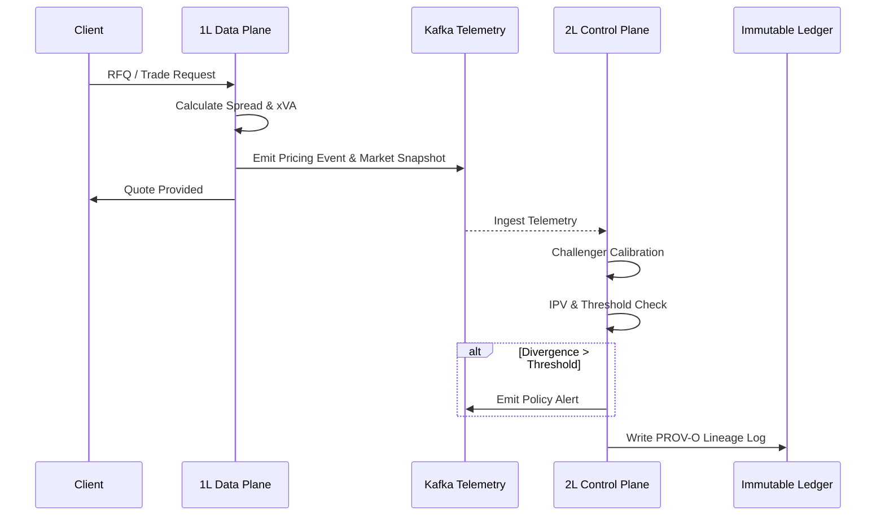

# Dual-Plane Architecture in Credit Derivatives: Harmonizing 1L Front-Office CDS Pricing with 2L Independent Challenger and Control Plane Governance

## 1. Executive Summary & Industry Imperative

The legacy monolithic risk stack that has historically supported credit trading desks is structurally deteriorating under the dual pressures of regulatory scrutiny and computational scale. Historically, Tier-1 investment banks deployed tight coupling between pricing algorithms, execution layers, and risk governance mechanisms. This resulted in an intractable web of interdependencies where deploying new independent governance policies introduced unacceptable latency into the front-office critical path.

Regulatory drivers—notably Basel III/IV, the Fundamental Review of the Trading Book (FRTB), BCBS 239, and SR 11-7 (Supervisory Guidance on Model Risk Management)—now mandate strict segregation of duties. They require reproducible pricing architectures and independent, rigorously validated challenger benchmarks that cannot be bypassed or silently overridden by the first line of defense (1LOD).

The architectural thesis presented in this paper proposes the complete decoupling of 1L execution and 2L governance via a Dual-Plane Architecture. By treating 1L execution (Front Office) as the "Data Plane" and 2L governance (Model Risk Management / Product Control) as the "Control Plane," institutions can connect these domains via high-throughput, event-driven telemetry. This paradigm allows the 1L to maximize execution speed and low-latency pricing while enabling the 2L to enforce continuous, deterministic, out-of-band surveillance, scenario divergence detection, and policy gating without operational friction.

## 2. 1LOD: Front-Office Relationship Management & CDS Pricing Mechanics

### Relationship Management Layer
The 1LOD serves as the immediate execution front for client flow, requiring sub-millisecond response profiles to maintain liquidity provision and competitive dealer-to-client (D2C) franchise strength.

*   **Real-time Counterparty Credit Exposure:** Pre-deal limits must be orchestrated dynamically. The integration of Potential Future Exposure (PFE) approximations and Credit Value Adjustment (CVA) sensitivities directly into the pre-deal pricing loop demands real-time limit utilization checks decoupled from end-of-day batch processing.
*   **Client Tiering & Margin Impact:** Simulating margin implications across heterogeneous collateral agreements (ISDA/CSA) requires dynamic multi-curve setups dependent on counterparty-specific funding spreads.

### CDS Pricing & Analytics Engine
The Front-Office execution relies on highly optimized quantitative libraries designed to bootstrap term structures and emit arbitrage-free quotes.

*   **Technical Calibration:** The core involves hazard rate calibration from market-standard instruments (e.g., benchmark CDS spreads and bond yields). Survival probability, $S(t)$, is derived from a piecewise-constant hazard rate model where the default intensity $\lambda(t)$ is bootstrapped sequentially:

    $$ S(t_i) = S(t_{i-1}) \exp\left(-\int_{t_{i-1}}^{t_i} \lambda(u) du \right) $$

    Recovery rate ($R$) dynamics are explicitly modeled, allowing the fair spread ($s$) to balance the Premium Leg (PL) and Protection Leg (DL):

    $$ \text{PL} = s \sum_{i=1}^n \Delta t_i \cdot DF(t_i) \cdot S(t_i) + \text{accrual} $$
    $$ \text{DL} = (1 - R) \int_{0}^{T} DF(t) \left(-\frac{dS(t)}{dt}\right) dt $$

*   **Instrument Coverage:** 1L engines must support single-name CDS, index products (CDX/iTraxx), and tranche basis pricing, integrating comprehensive xVA metrics (CVA, DVA, FVA).
*   **Latency vs. Throughput:** The 1L engine operates on a streaming tick-data architecture for real-time quotations, whereas intra-day portfolio revaluation utilizes vectorized grid computing to achieve high-throughput Greeks generation.

## 3. 2LOD: The Independent Challenger Architecture

### Champion-Challenger Paradigm
A robust 2L infrastructure requires an isolated computational environment capable of receiving 1L inputs/market data and independently generating competing valuation outputs.

*   **Automated Deployment:** Challenger engines are deployed as microservices using alternate algorithmic assumptions. For instance, challenging a 1L deterministic ISDA standard model with a 2L alternative stochastic hazard rate model or an Arbitrage-Free Nelson-Siegel (AFNS) curve fitter.
*   **Divergence Analytics:** The 2L continuously assesses out-of-sample stress scenarios and parameter sensitivities (CS01, DV01, Gamma, Jump-to-Default). When the disparity between the 1L Champion and 2L Challenger exceeds a defined statistical threshold (e.g., an acceptable Bidirectional Disparity range), an arbitration flag is raised.

### Independent Price Verification (IPV) & Prudent Valuation (PruVal)
*   **Consensus Ingestion:** The 2L IPV pipeline ingests independent consensus feeds (e.g., Markit, ICE) asynchronously, benchmarking front-office marks without relying on 1L-sanitized data sources.
*   **Fair Value Adjustments:** Automated extraction of bid-offer spreads and liquidity metrics enables dynamic calculation of Additional Valuation Adjustments (AVA) and structural reserve allocations, directly adhering to EBA Prudent Valuation standards.

## 4. The 2L Control Plane: Policy, Telemetry, and Enforcement

### Control Plane Mechanics
The shift from End-of-Day (EOD) batch risk to continuous surveillance defines the modern Control Plane.

*   **Continuous Surveillance:** Telemetry from the 1L Data Plane is streamed to the 2L Control Plane. The 2L monitors for model drift, unauthorized parameter overrides (e.g., hardcoded recovery rates), and calibration anomalies.
*   **Automated Circuit Breakers:** Using policy-as-code paradigms (e.g., deterministic rule trees, JSON logic), the 2L can enforce model usage gating. If a 1L model's observed drift breaches SR 11-7 compliance thresholds, the Control Plane can actively degrade the model's status or trigger a circuit breaker halting algorithmic execution.

### Auditability & Data Lineage
*   **Immutable Logs & Lineage:** Leveraging standards such as W3C PROV-O, the Control Plane guarantees unbroken DAG completeness for trade and calibration lineage.
*   **Reproducibility:** Ensuring the capability to reconstruct historical yield and hazard curves exactly as they existed at trade inception is critical to satisfy BCBS 239 risk data aggregation principles.

## 5. Target Operating Model (TOM) & Software Architecture Blueprint

### Separation of Concerns
The architecture physically and logically segregates the Data Plane and the Control Plane.

| Feature / SLA | 1L Data Plane (Execution) | 2L Control Plane (Governance) |
| :--- | :--- | :--- |
| **Primary Goal** | Execution latency, liquidity provision | Compliance, IPV, MRM surveillance |
| **Latency Target** | Sub-millisecond to low single-digit ms | Near real-time to minutes (event-driven) |
| **Model Type** | Optimized Champion (e.g., fast deterministic) | Rigorous Challenger (e.g., stochastic/Monte Carlo) |
| **Authority** | Read/Write to trade capture, limited overrides | Read-only market data, Write to policy gates/flags |

### Systems Architecture
*   **Event Brokerage:** Apache Kafka or similarly robust distributed commit logs serve as the central nervous system, ensuring reliable, low-latency telemetry transport.
*   **Microservices:** Rust or C++ execution kernels handle critical mathematical operations in the 1L, while decoupled Python-based analytics and jsonLogic rule engines orchestrate the 2L policy validation.
*   **Interaction Sequence:**
    1. Pre-trade check (Limit utilization).
    2. Pricing execution (1L).
    3. Event emission (Telemetry payload to Kafka).
    4. Control plane evaluation (2L Challenger and policy rules).
    5. Alerting/Governance logging (Immutable ledger).

## 6. Implementation Roadmap, Pitfalls, and Best Practices

### Friction Points and Telemetry Extraction
The most significant operational pitfall is attempting to force heavy 2L analytics into the 1L synchronous loop. Strategies for sub-millisecond telemetry extraction require adopting zero-copy data buffers (e.g., Apache Arrow) and asynchronous event emission that unblocks the 1L pricing thread instantly.

### Organizational Realignment
Moving to a Dual-Plane architecture requires an evolution in human operating models. Quantitative Front Office (QFO) teams and Model Risk Management (MRM) must collaborate via shared APIs and standardized data ontologies, moving away from adversarial email-based validation cycles to Continuous Integration/Continuous Deployment (CI/CD) pipelines for model code.

### Phased Deployment Strategy
1.  **Shadow Mode:** The 2L Control Plane ingests 1L telemetry and runs IPV and challenger engines silently. Divergence logs are gathered for baseline statistical analysis.
2.  **Passive Challenger:** MRM begins utilizing Control Plane outputs for formal periodic validation reports, replacing legacy batch tools.
3.  **Active Control Plane:** The 2L is granted authority to trigger automated circuit breakers and model degradation flags in production, fully harmonizing the 1L execution speed with uncompromised 2L governance.
