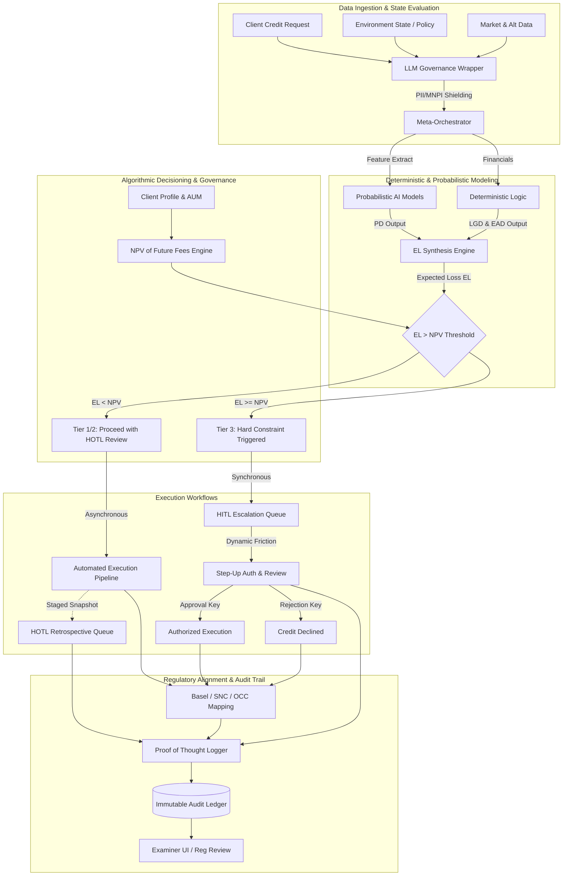

# AI Credit Workflow Orchestration Report

## Executive Summary
This technical research report details the system architecture and operational frameworks for an advanced AI governance harness and LLM wrapper tailored for institutional credit risk. The proposed system orchestrates both synchronous Human-In-The-Loop (HITL) and asynchronous Human-On-The-Loop (HOTL) workflows, ensuring precise alignment with the stringent regulatory and operational requirements of an investment bank managing Ultra-High-Net-Worth (UHNW) individuals, private equity, and financial sponsors. 

---

## 1. System Architecture: AI Governance Harness and LLM Wrapper

The core of the architecture relies on a Context-Aware LLM Wrapper operating within a secure, multi-layered AI governance harness. This framework dynamically transitions between execution modalities based on real-time state evaluation, risk conviction, and Role-Based Access Control (RBAC).

*   **The Orchestration Layer:** Evaluates incoming credit requests and associated artifacts (e.g., K-1s, capital call schedules). It determines the complexity and stakes of the decision to route through standard deterministic pipelines or invoke LLM-based neuro-symbolic reasoning.
*   **Synchronous HITL Workflow:** Activated when immediate human oversight is mandated by policy or threshold breaches. The system halts automated progression, presenting a synthesized decision matrix to an underwriter or credit officer. The human's action acts as a deterministic key to unlock the next state.
*   **Asynchronous HOTL Workflow:** Leveraged for routine processing or low-conviction insights that do not halt immediate execution but require retrospective validation. AI autonomously advances the workflow while staging audit-ready snapshots in a review queue.

---

## 2. Operational Use Cases: UHNW, Private Equity, and Financial Sponsors

The harness is explicitly tailored for the high-complexity credit requirements of institutional and private wealth management.

*   **UHNW Lombard Lending & Margin Financing:** The AI rapidly processes multi-jurisdictional asset portfolios, identifying concentrated positions and parsing bespoke trust structures. It continuously monitors LTV ratios against dynamic market valuations, routing exception overrides to HITL review.
*   **Private Equity & Subscription Lines:** The harness automates the ingestion of LP agreements and capital call notices, analyzing the creditworthiness of underlying partners to assess the risk of capital call defaults.
*   **Financial Sponsors (Leveraged Buyouts):** For acquisition financing, the system generates deep-dive cash flow projections, running Base/Bull/Bear scenarios on target EBITDA against complex debt covenants.

---

## 3. Integration of Probabilistic and Deterministic Risk Models

The orchestration layer acts as a fusion center for diverse model outputs, enforcing logic as data.

*   **Deterministic Models:** Hardcoded financial logic calculating precise current state metrics (e.g., LTV, Debt Service Coverage Ratio, Current Ratio).
*   **Probabilistic AI Models:** Neural networks generating Probability of Default (PD) curves based on alternative data, macro-economic sentiment, and historical cohort performance.
*   **Synthesis (EL Calculation):** The AI Wrapper extracts deterministic LGD (Loss Given Default) parameters from collateral valuation models, multiplying them by the probabilistic PD and Exposure at Default (EAD) to formulate the Expected Loss (EL). `EL = PD × LGD × EAD`.

---

## 4. Algorithmic Decisioning: The EL > NPV Threshold

To gate high-value transaction risk autonomously, the system deploys a comparative valuation engine weighing downside risk against long-term relationship value.

1.  **Expected Loss Formulation:** Continuously calculated via the integrated risk models (Section 3).
2.  **NPV of Future Fees Engine:** Analyzes the client's holistic profile (AUM, anticipated M&A advisory, prime brokerage activity) to discount projected revenues back to Present Value.
3.  **Automated Gating Logic:**
    *   `IF EL < (NPV_Fees * Risk_Appetite_Scalar)`: Proceed with automated underwriting or asynchronous HOTL approval.
    *   `IF EL >= (NPV_Fees * Risk_Appetite_Scalar)`: Trigger hard constraint. Halt automated execution. Demand Step-Up Authentication and force Synchronous HITL review.

---

## 5. Execution Framework for Challenge Controls

The challenge execution framework routes escalations dynamically to optimize throughput without compromising safety.

*   **Dynamic Friction:** Introduces micro-delays or requires additional documentary evidence based on the delta between calculated EL and acceptable thresholds.
*   **Severity Tiers:**
    *   *Tier 1 (Low Severity - Data Anomaly):* Route to HOTL. The system proceeds but flags the underlying data point for future human verification.
    *   *Tier 2 (Medium Severity - Covenant Proximity):* Route to Junior Analyst HITL. Requires basic acknowledgment and comment before proceeding.
    *   *Tier 3 (High Severity - EL > NPV Breach):* Route to Senior Credit Officer HITL. Requires Step-Up Auth (MFA, biometric) and a fully documented rationale submitted to the immutable ledger.

---

## 6. Dynamic Governance Controls within the LLM Wrapper

The LLM Wrapper operates as a sovereign guardrail, ensuring no prompt or generated output violates constraints.

*   **Data Privacy (PII/MNPI Shielding):** Pre-execution parsers redact material non-public information and personal identifiers before payloads hit external or internal LLM endpoints.
*   **Context-Aware Execution:** The wrapper reads the current environment state (e.g., "Trading Restricted", "Earnings Blackout") and immediately nullifies model execution requests that conflict with temporal policies.
*   **Access Limits:** Strictly enforces RBAC. An analyst cannot prompt the system to view un-permissioned syndication details.

---

## 7. Regulatory Alignment: System Schemas and Data Pipelines

The system is structurally aligned to seamlessly generate reports and map data architectures to global regulatory standards.

*   **SNC (Shared National Credit):** Real-time aggregation of syndicated loan exposure. Agent pipelines classify credits accurately (Pass, Special Mention, Substandard) using the same rubric as examiners.
*   **OCC & Federal Reserve:** Ensures SR 11-7 model risk management compliance. Deterministic logic overrides probabilistic whims to satisfy explicit stress-testing requirements.
*   **Basel:** Schemas calculate and tag Risk-Weighted Assets (RWA) appropriately to manage capital adequacy ratios dynamically.
*   **FINMA:** For Swiss banking operations, the system enforces cross-border data residency requirements, utilizing local model execution nodes where necessary.

---

## 8. Comprehensive Logging, Internal Model Challenge, and Immutable Audit Trails

Transparency is foundational. The system guarantees that every inference and human intervention is meticulously recorded.

*   **Immutable Ledger (Proof of Thought):** Every prompt, context payload, returned synthesis, and deterministic calculation is hashed and committed to an append-only time-series database (e.g., TimescaleDB) to form the Golden Record.
*   **Internal Model Challenge Protocols:** Automated "Red Team" agents periodically test production LLMs with adversarial credit scenarios to benchmark drift and ensure conviction scores remain calibrated.
*   **Regulatory Review Mode:** Provides examiners with a specialized UI to traverse the DAG (Directed Acyclic Graph) of any historical credit decision, exposing exactly *why* an AI recommended an action and *who* approved it.

---

## 9. End-to-End AI-Orchestrated System Diagram

The following Mermaid diagram visually maps the end-to-end orchestration process, illustrating the integration of risk models, threshold gates, human loops, and regulatory logging.

