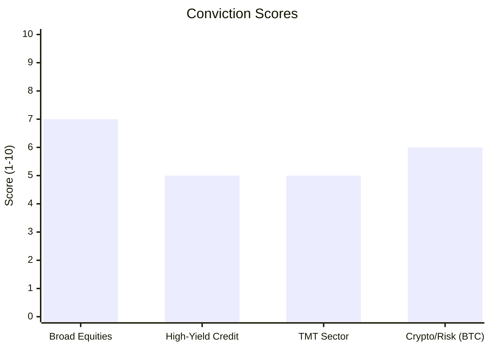

# Market Mayhem: 2026-06-25

### 1. The Daily Briefing
**Macro Overlay:** Broader markets are digesting the latest core PCE figures, showing signs of stubborn inflation that is repricing rate cut expectations. The S&P 500 and Nasdaq are seeing mixed action as yields attempt to find equilibrium, applying varied pressure to rate-sensitive sectors.

**Credit & TMT Desk:** In the leveraged loan markets, credit spreads have widened marginally by 4 bps. High-yield issuance remains fluid as underwriters target optimal entry points. Major TMT players, particularly heavily leveraged telecom firms, are managing debt restructuring operations, with capital expenditure plans being actively revised amid evolving liquidity conditions.

**The Risk Signal:** Bitcoin is holding its ground around $60,760.00, signaling resilient institutional risk appetite despite broader equity oscillations. Its relative volatility against recent equity swings suggests underlying liquidity remains sufficient to support high-beta assets.

### 2. Sentiment & Conviction Chart

| Sector | Conviction Score (1-10) |
|---|---|
| Broad Equities | 7 |
| High-Yield Credit | 5 |
| TMT Sector | 5 |
| Crypto/Risk (BTC) | 6 |

### 3. Historic Pricing & Trading Levels

| Asset | Current Price | 30-Day Avg | 1-Year Avg | % Deviation from 30D Mean | Momentum (Bull/Bear) |
|---|---|---|---|---|---|
| S&P 500 | $5,424.97 | $5,495.34 | $4,887.00 | -1.28% | Bear |
| Nasdaq | $17,630.78 | $17,368.83 | $15,002.50 | +1.51% | Bull |
| Bitcoin (BTC) | $60,760.00 | $60,504.18 | $45,570.00 | +0.42% | Bull |

### 4. Forward Outlook
Over the next 5 days, expect dynamic price action as markets position ahead of impending non-farm payrolls data. This key catalyst will likely drive the next directional move. If employment numbers misalign with consensus, expect further movement in high-yield credit spreads and a potential repricing in the TMT sector. Conversely, a stable labor market could solidify current trajectories, acting as a structural catalyst for both broad equities and BTC.

### Appendix: Human Sources
- Bloomberg Markets Daily Feed
- Financial Times Leveraged Finance Reporting
- WSJ Technology & Telecommunications Updates
