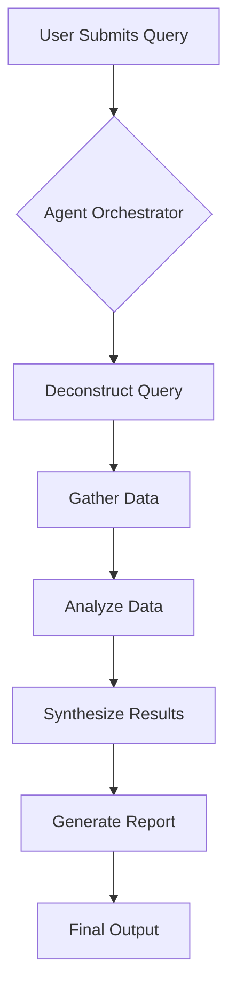
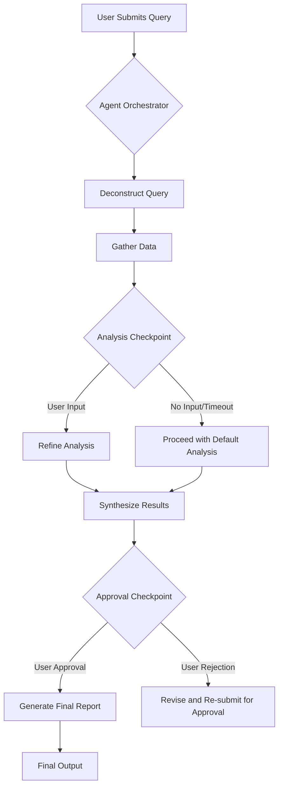

# Agentic Processes and Human-Machine Interaction

## 1. Introduction

This document describes the agentic processes within the ADAM v21.0 platform, focusing on the different modes of operation and the mechanisms for human-in-the-loop interaction. The system is designed to be flexible, allowing for both fully autonomous operation and human-guided decision-making.

## 2. Modes of Operation

The system supports two primary modes of operation, which can be selected by the user when submitting a query via the API:

*   **Autonomous Mode:** The system operates without human intervention. The agents will follow a predefined workflow to process the query, make decisions, and generate a final result.
*   **Prompted Mode (Human-in-the-Loop):** The system actively involves the user in the decision-making process. This mode is designed for complex or ambiguous queries where human expertise is required.

## 3. Autonomous Mode

In autonomous mode, the Agent Orchestrator executes a workflow based on the user's query. The agents will proceed through the workflow steps, making decisions based on their programming and the data available in the Knowledge Base.

### Autonomous Workflow Example

## 4. Prompted Mode (Human-in-the-Loop)

In prompted mode, the system will pause at predefined checkpoints in the workflow and prompt the user for input. This allows the user to:

*   **Clarify Ambiguity:** Provide additional information to help the agents understand the query. For example, if a user asks for an analysis of "Apple", the system might ask for clarification: "Do you mean Apple Inc. (AAPL) or Apple Corps, the record label?".
*   **Provide Feedback:** Offer feedback on the agents' intermediate results. For example, the system might present a preliminary analysis and ask the user if it is on the right track.
*   **Approve Actions:** Authorize the agents to proceed with a specific course of action. For example, before executing a trade, the system will require the user to approve the transaction.

The user will be prompted via the web application, and their input will be used to guide the subsequent steps in the workflow.

### Human-in-the-Loop Workflow Example

## 5. Agent Communication

The agents in the ADAM v21.0 platform communicate with each other through a message bus, which is managed by the Agent Orchestrator. This allows for both direct and broadcast communication between agents.

*   **Direct Communication:** An agent can send a message directly to another agent by specifying the recipient's name.
*   **Broadcast Communication:** An agent can broadcast a message to all other agents.

This flexible communication model allows for complex and dynamic interactions between agents, which is essential for solving complex financial analysis tasks.

## 6. Workflow Orchestration

The Agent Orchestrator is responsible for managing the execution of workflows in both modes. The workflows are defined in YAML files (e.g., `config/workflow21.yaml`), which specify the sequence of steps, the agents involved, and the conditions for prompting the user.

## 7. Auditability and Transparency

All agent actions and user interactions are logged and stored in the Knowledge Base. This provides a complete audit trail of the decision-making process, ensuring transparency and accountability. Users can review the history of a query to understand how the final result was generated. The audit trail will include timestamps, the agent responsible for each action, and any data that was used in the decision-making process.
