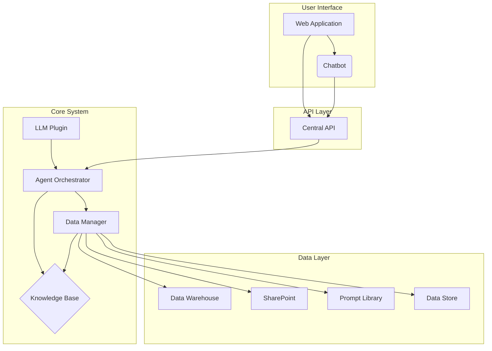
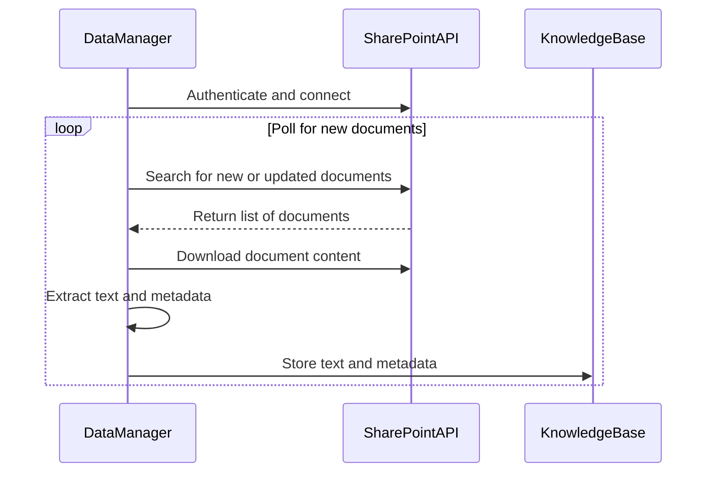
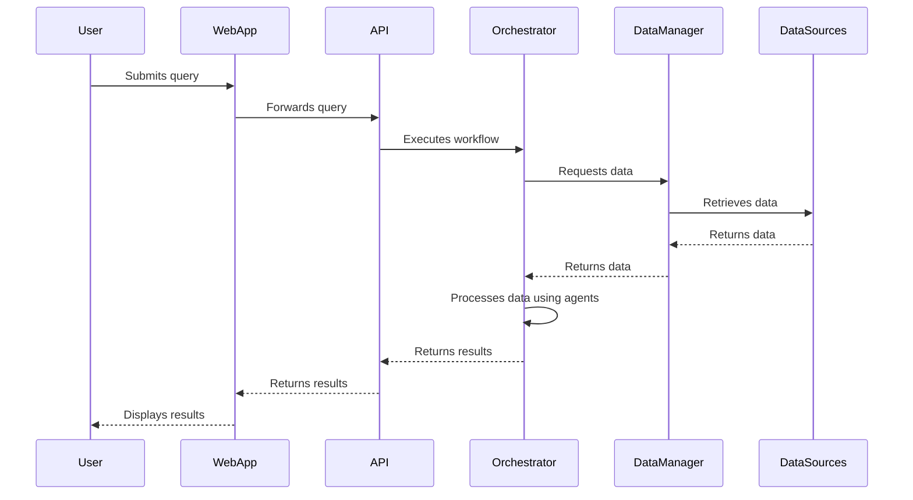
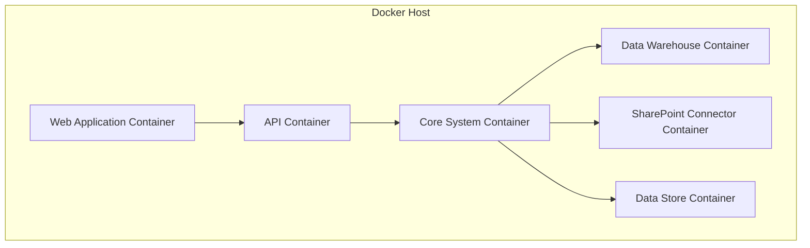

# System Architecture and Design

## 1. Introduction

This document provides a detailed overview of the system architecture for the Production Integration of the Data Store Prompt Library Ingestion SharePoint Labeling Warehouse Repository (the "Project"). It builds upon the existing ADAM v21.0 platform, extending its capabilities to meet the business requirements outlined in the `PROJECT_VISION.md` document.

The architecture is designed to be modular, scalable, and extensible, allowing for the seamless integration of new components and data sources. It also prioritizes transparency and auditability, with clear data flows and well-defined interfaces between components.

## 2. Architectural Principles

The following principles guide the design of the system:

*   **Modularity:** The system is composed of independent, loosely coupled components, each with a specific responsibility. This allows for parallel development, testing, and deployment.
*   **Scalability:** The architecture is designed to handle a growing volume of data and user traffic. Components can be scaled independently to meet demand.
*   **Extensibility:** The system can be easily extended with new features and functionality. New data sources, agents, and UI components can be added without requiring major changes to the existing architecture.
*   **Portability:** The system is designed to be self-contained and easily portable to different environments, including on-premises and cloud platforms.
*   **Security:** The system incorporates robust security measures to protect sensitive data and ensure the integrity of the system.

## 3. High-Level Architecture

The following diagram illustrates the high-level architecture of the system:

## 4. Component Breakdown

### 4.1. User Interface

*   **Web Application:** A single-page application (SPA) that provides the main user interface for the system. It will be built using a modern JavaScript framework (e.g., React, Vue, or Angular). The UI will be based on the mockups in `UI Mockups.md`. Key features include a customizable dashboard, interactive charts and tables, and a rich set of tools for financial analysis.
*   **Chatbot:** An interactive chatbot that allows users to ask questions and perform tasks in natural language. The chatbot will be integrated into the web application and will use the same API as the main application to interact with the backend. It will leverage the `QueryUnderstandingAgent` to interpret user intent.

### 4.2. API Layer

*   **Central API:** A RESTful API that provides a single point of entry for all client applications. The API will be responsible for authentication, authorization, and routing requests to the appropriate backend services. The API will be defined using the OpenAPI standard, and it will be secured using JWT-based authentication.

### 4.3. Core System

*   **Agent Orchestrator:** The core of the ADAM v21.0 platform. It is responsible for managing the lifecycle of the agents, orchestrating their interactions, and executing workflows defined in YAML files. It uses a state machine to manage the execution of workflows and can run tasks in parallel to improve performance.
*   **Knowledge Base:** A centralized repository of knowledge that is used by the agents to perform their tasks. It is implemented as a graph database (Neo4j) to store and retrieve interconnected financial data, concepts, and historical analysis. The schema of the knowledge base is defined in the `financial_digital_twin` directory.
*   **Data Manager:** A component that is responsible for ingesting, processing, and managing data from a variety of sources. It provides a unified interface for accessing data, regardless of the underlying data source. It also includes a labeling mechanism for organizing and categorizing data.
*   **LLM Plugin:** A plugin that provides a standardized interface to different Large Language Models (LLMs). This allows the system to be model-agnostic and easily switch between different LLM providers like OpenAI, Azure, or local models.

### 4.4. Data Layer

*   **Data Warehouse:** A central repository for storing and analyzing large volumes of structured data. It will be used to store historical market data, financial statements, and other structured data sets.
*   **SharePoint:** A collaboration platform that will be used for storing and managing unstructured documents. See the "Integration with SharePoint" section for more details.
*   **Prompt Library:** A curated collection of prompts for various financial analysis and communication tasks. The prompts are stored in JSON files and are loaded by the Agent Orchestrator at startup.
*   **Data Store:** A general-purpose data store (e.g., PostgreSQL) for persisting application data, such as user profiles, session information, and cached data.

## 5. Integration with SharePoint

The system will integrate with SharePoint to ingest and process documents. The integration will be handled by the Data Manager component.

The following diagram illustrates the SharePoint integration workflow:

The Data Manager will periodically poll a designated SharePoint library for new or updated documents. When a new document is found, it will be downloaded, its content will be extracted, and it will be stored in the Knowledge Base along with its metadata. A labeling agent will then be triggered to categorize and tag the document.

## 6. Data Flow

The following diagram illustrates the flow of data through the system:

## 7. Deployment View

The system will be deployed using Docker containers, which will allow for easy portability and scalability. The following diagram illustrates the deployment view:

This containerized approach will allow the system to be deployed on a variety of platforms, including on-premises servers and cloud providers such as AWS, Azure, and Google Cloud. A dedicated container for the SharePoint connector will be used to isolate the dependencies and improve scalability.
