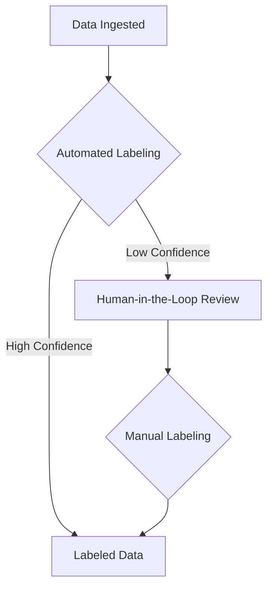

# Data Strategy and Management

## 1. Introduction

This document outlines the data strategy for the Project. It covers data sources, ingestion, labeling, storage, and governance. A sound data strategy is critical for ensuring the quality, consistency, and availability of data, which is the lifeblood of the ADAM v21.0 platform.

## 2. Data Sources

The system will integrate data from the following sources:

*   **Data Warehouse:** A centralized repository for structured data, such as financial statements, market data, and economic indicators.
*   **SharePoint:** A collaboration platform for storing and managing unstructured documents, such as reports, articles, and legal agreements.
*   **Prompt Library:** A curated collection of prompts for various financial analysis and communication tasks.
*   **General Data Store:** A flexible data store for persisting application-specific data, such as user profiles, session information, and cached data.

## 3. Data Ingestion and Labeling

The Data Manager component is responsible for ingesting and processing data from all sources.

### 3.1. Data Warehouse Ingestion

Data from the data warehouse will be ingested using a standard ETL (Extract, Transform, Load) process. A dedicated connector will be developed to extract data from the warehouse, transform it into the appropriate format for the Knowledge Base, and load it into the system. The ETL process will be scheduled to run at regular intervals to ensure that the data in the Knowledge Base is kept up-to-date.

### 3.2. SharePoint Document Ingestion

Documents from SharePoint will be ingested using the SharePoint API. The Data Manager will periodically poll a designated SharePoint library for new or updated documents. When a new document is found, it will be downloaded, its content will be extracted, and it will be stored in the Knowledge Base along with its metadata.

### 3.3. Data Labeling

Once ingested, data will be labeled with metadata to facilitate search, retrieval, and analysis. The labeling process will involve both automated and human-in-the-loop steps.

The following diagram illustrates the data labeling workflow:

*   **Automated Labeling:** The system will use NLP techniques to automatically extract key entities, concepts, and sentiment from the ingested data. A confidence score will be assigned to each automatically generated label.
*   **Human-in-the-Loop Review:** If the confidence score for an automatically generated label is below a predefined threshold, the data will be flagged for human review. A user with the appropriate permissions can then review the automatically generated labels and either approve them or correct them.
*   **Manual Labeling:** Users can also manually add labels to data at any time.

## 4. Financial Digital Twin and Dual-Schema Strategy

The Financial Digital Twin is a core component of the system, providing a rich, semantic representation of financial entities and their relationships. To balance the need for both rapid development and long-term strategic alignment, the project employs a **dual-schema strategy**.

### 4.1. Strategic Schema (FIBO-Aligned)

This is the official, enterprise-grade data model for the Financial Digital Twin. It is based on the **Financial Industry Business Ontology (FIBO)** to ensure semantic interoperability and conceptual soundness. All new, core platform development should adhere to this model.

The FIBO-aligned schema is defined in `schema_fibo.yaml`.

### 4.2. Legacy Schema (Custom)

This schema was developed prior to the adoption of the formal FIBO standard. It remains to support existing applications and to serve as a reference or a basis for rapid prototyping of non-critical features.

The legacy schema is defined in `financial_digital_twin/schema.yaml`.

## 5. Data Governance

A robust data governance framework will be established to ensure the quality, consistency, and security of data. The framework will include:

*   **Data Ownership:** Clearly defined roles and responsibilities for managing data assets.
*   **Data Quality:** Processes for monitoring and improving data quality, including data validation and cleansing.
*   **Data Security:** Policies and procedures for protecting data from unauthorized access and use, including role-based access control and data encryption.
*   **Data Lineage:** The ability to track the origin and transformation of data throughout its lifecycle, from ingestion to analysis and reporting.
*   **Data Retention:** Policies for archiving and deleting data in accordance with legal and regulatory requirements.
