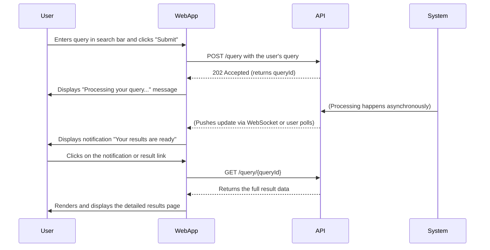
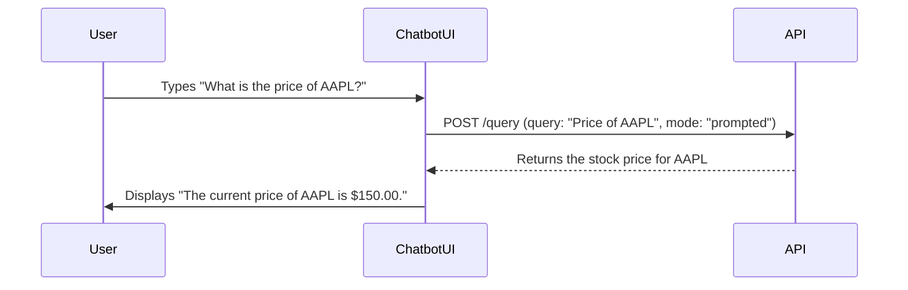

# User Interface and Chatbot

## 1. Introduction

This document describes the user interface (UI) and chatbot for the ADAM v21.0 platform. The UI is designed to be intuitive, user-friendly, and provide a comprehensive set of tools for financial analysis. The chatbot offers a conversational interface for interacting with the system. The design is based on the details provided in the `UI Mockups.md` document.

## 2. User Interface Overview

The main user interface is a web-based application with the following key sections:

*   **Dashboard:** The main landing page, providing a high-level overview of the market, the user's portfolio, investment ideas, alerts, and simulation results. The dashboard is customizable, allowing users to add, remove, and rearrange widgets to suit their needs.
*   **Market Data:** A section for exploring detailed market data for various asset classes, including stocks, bonds, ETFs, and crypto. It features interactive charts with technical indicators, historical data tables, and integrated news and social sentiment analysis.
*   **Analysis Tools:** A suite of tools for performing fundamental analysis, technical analysis, risk assessment, financial modeling, and legal analysis. Users can input their own data and parameters, and the tools will generate detailed reports and visualizations.
*   **Portfolio Management:** A section for managing investment portfolios, including editing holdings, rebalancing, and executing trades. It provides a clear overview of portfolio performance, with benchmark comparisons and risk metrics.
*   **Alerts:** A dashboard for creating and managing alerts based on a variety of criteria, such as price movements, news events, or changes in technical indicators.
*   **News and Insights:** A section for accessing financial news, insights from the ADAM platform (such as generated newsletters and reports), and legal updates.
*   **User Preferences:** A section for managing user profile information and customizing the application settings, including theme, notification preferences, and risk tolerance.
*   **Simulation Tools and Reports:** A dedicated area for running and reviewing various financial simulations, such as credit rating assessments and investment committee simulations.

## 3. Chatbot Functionality

The chatbot provides a conversational interface for interacting with the ADAM platform. It will be accessible from the main web application. Users can interact with the chatbot to:

*   **Ask for information:** Get real-time stock quotes, company information, market news, and more.
*   **Perform tasks:** Initiate a financial analysis, create an alert, or run a simulation.
*   **Get help:** Ask for assistance on how to use the platform's features.

The chatbot will use natural language processing (NLP) to understand user queries and will respond with clear and concise answers.

## 4. Chatbot Interaction Examples

Here are some examples of how a user might interact with the chatbot:

*   **Getting a stock price:**
    *   **User:** "What's the latest price for Apple?"
    *   **Chatbot:** "The current price for AAPL is $175.20."
*   **Requesting a company overview:**
    *   **User:** "Give me an overview of Microsoft."
    *   **Chatbot:** "Microsoft (MSFT) is a technology company that develops and sells computer software, consumer electronics, and personal computers. Here is a summary of their latest financial performance..."
*   **Setting an alert:**
    *   **User:** "Alert me when Google's stock price drops below $2,800."
    *   **Chatbot:** "I've set an alert for you. I will notify you if GOOGL drops below $2,800."
*   **Running an analysis:**
    *   **User:** "Run a SWOT analysis on Tesla."
    *   **Chatbot:** "I'm starting the SWOT analysis for TSLA now. I'll let you know when the report is ready."

## 5. User Flows

The following diagrams illustrate key user flows within the application.

### 5.1. Submitting a Query and Viewing Results

This flow shows a user submitting a query through the main interface and receiving the results.

### 5.2. Using the Chatbot to Get a Stock Price

This flow shows a user interacting with the chatbot to get a stock price.

